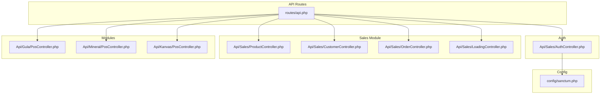
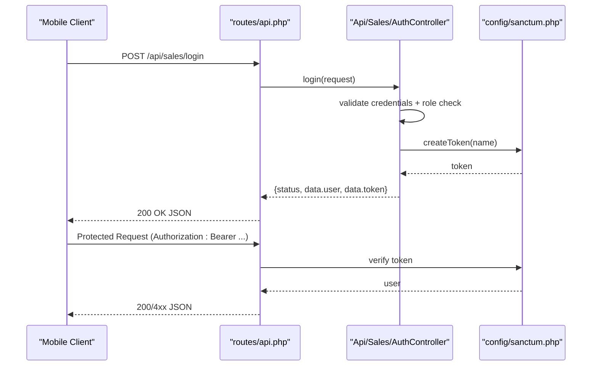
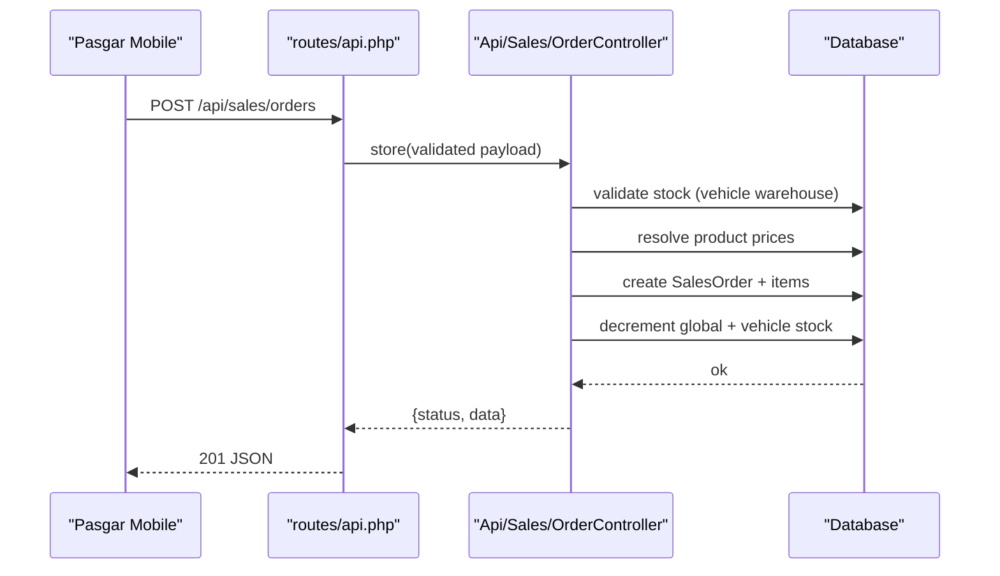
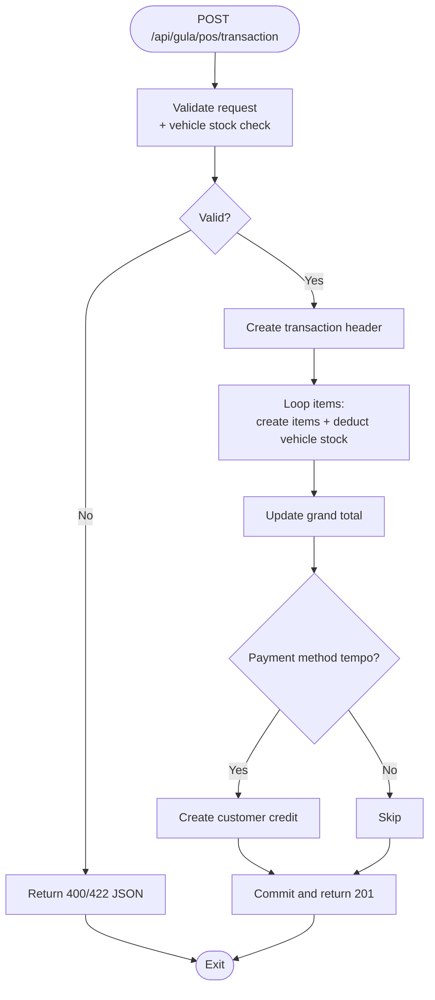
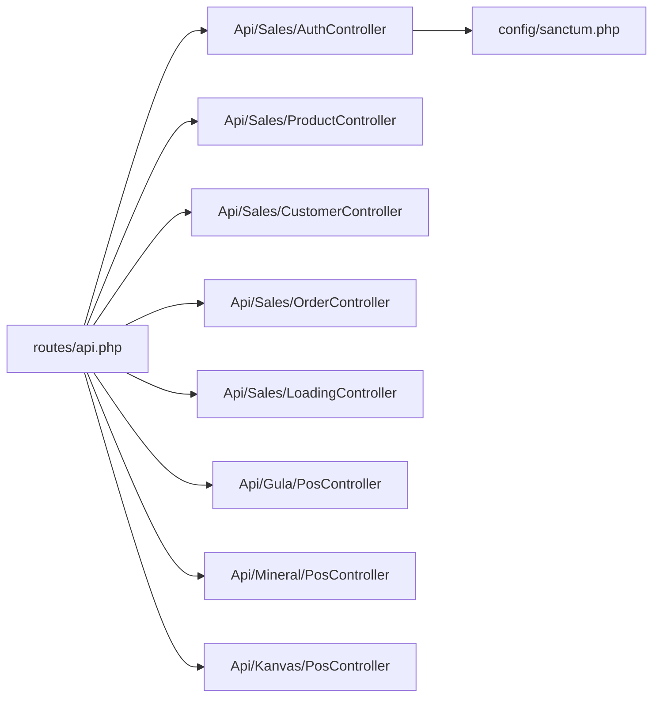

# API Documentation

<cite>
**Referenced Files in This Document**
- [routes/api.php](file://routes/api.php)
- [config/sanctum.php](file://config/sanctum.php)
- [app/Http/Controllers/Api/Sales/AuthController.php](file://app/Http/Controllers/Api/Sales/AuthController.php)
- [app/Http/Controllers/Api/Sales/ProductController.php](file://app/Http/Controllers/Api/Sales/ProductController.php)
- [app/Http/Controllers/Api/Sales/CustomerController.php](file://app/Http/Controllers/Api/Sales/CustomerController.php)
- [app/Http/Controllers/Api/Sales/OrderController.php](file://app/Http/Controllers/Api/Sales/OrderController.php)
- [app/Http/Controllers/Api/Sales/LoadingController.php](file://app/Http/Controllers/Api/Sales/LoadingController.php)
- [app/Http/Controllers/Api/Gula/PosController.php](file://app/Http/Controllers/Api/Gula/PosController.php)
- [app/Http/Controllers/Api/Mineral/PosController.php](file://app/Http/Controllers/Api/Mineral/PosController.php)
- [app/Http/Controllers/Api/Kanvas/PosController.php](file://app/Http/Controllers/Api/Kanvas/PosController.php)
- [app/Http/Controllers/Api/MobileOfflineController.php](file://app/Http/Controllers/Api/MobileOfflineController.php)
</cite>

## Table of Contents
1. [Introduction](#introduction)
2. [Project Structure](#project-structure)
3. [Core Components](#core-components)
4. [Architecture Overview](#architecture-overview)
5. [Detailed Component Analysis](#detailed-component-analysis)
6. [Dependency Analysis](#dependency-analysis)
7. [Performance Considerations](#performance-considerations)
8. [Troubleshooting Guide](#troubleshooting-guide)
9. [Conclusion](#conclusion)
10. [Appendices](#appendices)

## Introduction
This document describes the DODPOS REST API and mobile integration interfaces. It covers HTTP methods, URL patterns, request/response schemas, authentication using Laravel Sanctum tokens, and mobile-specific workflows such as field operations, PWA synchronization, and offline data capture. It also documents sales operations, inventory management, user management, and business unit data endpoints, along with rate limiting, error handling, and integration patterns for external systems.

## Project Structure
The API surface is primarily defined in the routes file grouped by functional areas:
- General API (rate-limited)
- Sales module (Pasgar)
- Minyak (Oil) module
- Gula (Sugar) module
- Mineral module
- Kanvas module

**Diagram sources**
- [routes/api.php:1-199](file://routes/api.php#L1-L199)
- [app/Http/Controllers/Api/Sales/AuthController.php:1-99](file://app/Http/Controllers/Api/Sales/AuthController.php#L1-L99)
- [config/sanctum.php:1-85](file://config/sanctum.php#L1-L85)

**Section sources**
- [routes/api.php:1-199](file://routes/api.php#L1-L199)

## Core Components
- Authentication and Authorization
  - Sanctum guard and token lifecycle
  - Role-based access control for mobile apps
  - Rate limiting and account lockout
- Sales Operations
  - Product catalogs, customers, orders, and loading logistics
  - POS transactions per business unit (Gula, Mineral, Kanvas)
- Inventory Management
  - Vehicle stock visibility and cross-check workflows
  - Stock movement and transfer tracking
- Mobile Offline API
  - Placeholder controller for offline synchronization

**Section sources**
- [config/sanctum.php:1-85](file://config/sanctum.php#L1-L85)
- [app/Http/Controllers/Api/Sales/AuthController.php:1-99](file://app/Http/Controllers/Api/Sales/AuthController.php#L1-L99)
- [app/Http/Controllers/Api/MobileOfflineController.php:1-12](file://app/Http/Controllers/Api/MobileOfflineController.php#L1-L12)

## Architecture Overview
The API uses Laravel Sanctum for stateless token authentication. Routes are grouped by domain/module with middleware enforcing throttling, active status, and role checks. Business unit modules share common authentication while exposing specialized endpoints for POS and reconciliation.

**Diagram sources**
- [routes/api.php:31-68](file://routes/api.php#L31-L68)
- [app/Http/Controllers/Api/Sales/AuthController.php:11-75](file://app/Http/Controllers/Api/Sales/AuthController.php#L11-L75)
- [config/sanctum.php:37-50](file://config/sanctum.php#L37-L50)

## Detailed Component Analysis

### Authentication and Authorization
- Login
  - Method: POST
  - URL: /api/sales/login
  - Throttling: 10 attempts/minute for login
  - Validation: email, password
  - Role check: pasgar or supervisor
  - Response: user info and Sanctum token
- Logout
  - Method: POST
  - URL: /api/sales/logout
  - Middleware: auth:sanctum, active
  - Behavior: delete current token
- Me
  - Method: GET
  - URL: /api/sales/me
  - Response: sanitized user profile

Security and rate limiting:
- Global throttle: 60 RPM for general endpoints
- Login throttle: 10/min for sales login
- Account lockout: 5 attempts/15 minutes per email
- Sanctum expiration: null (session-like), configured guard and stateful domains

**Section sources**
- [routes/api.php:11-26](file://routes/api.php#L11-L26)
- [routes/api.php:31-68](file://routes/api.php#L31-L68)
- [app/Http/Controllers/Api/Sales/AuthController.php:11-99](file://app/Http/Controllers/Api/Sales/AuthController.php#L11-L99)
- [config/sanctum.php:18-50](file://config/sanctum.php#L18-L50)

### Sales Module (Pasgar)
- Products
  - Method: GET
  - URL: /api/sales/products
  - Filters: category_id, search
  - Pagination: default page size
  - Response: ProductResource collection
- Customers
  - Method: GET
  - URL: /api/sales/customers
  - Filters: search
  - Response: CustomerResource collection
- Orders
  - Create: POST /api/sales/orders
    - Validates items, resolves prices, generates SO number
    - Canvas orders require vehicle_id and validate vehicle warehouse stock
    - Deducts stock from vehicle warehouse FIFO
  - List: GET /api/sales/orders
  - Detail: GET /api/sales/orders/{id}
- Vehicles
  - Method: GET
  - URL: /api/sales/vehicles
- Customer Credits
  - Unpaid list: GET /api/sales/credits/unpaid
  - Payment: POST /api/sales/credits/pay
- Loading (Order Barang)
  - List: GET /api/sales/loadings
  - Create: POST /api/sales/loadings
  - Detail: GET /api/sales/loadings/{id}
  - Cross-check: POST /api/sales/loadings/{id}/crosscheck
- Vehicle Stock and Warehouses
  - Vehicle stock: GET /api/sales/vehicle-stock
  - Warehouses: GET /api/sales/warehouses

**Diagram sources**
- [routes/api.php:46-62](file://routes/api.php#L46-L62)
- [app/Http/Controllers/Api/Sales/OrderController.php:33-176](file://app/Http/Controllers/Api/Sales/OrderController.php#L33-L176)

**Section sources**
- [routes/api.php:31-68](file://routes/api.php#L31-L68)
- [app/Http/Controllers/Api/Sales/ProductController.php:17-47](file://app/Http/Controllers/Api/Sales/ProductController.php#L17-L47)
- [app/Http/Controllers/Api/Sales/CustomerController.php:16-34](file://app/Http/Controllers/Api/Sales/CustomerController.php#L16-L34)
- [app/Http/Controllers/Api/Sales/OrderController.php:20-188](file://app/Http/Controllers/Api/Sales/OrderController.php#L20-L188)
- [app/Http/Controllers/Api/Sales/LoadingController.php:21-295](file://app/Http/Controllers/Api/Sales/LoadingController.php#L21-L295)

### Minyak (Oil) Module
- Login: POST /api/minyak/login
- Protected routes (sales_minyak or supervisor):
  - Logout: POST /api/minyak/logout
  - Me: GET /api/minyak/me
  - Transactions: GET/POST/DELETE /api/minyak/transaksi
  - Summary: GET /api/minyak/rekap
  - Customers: GET /api/minyak/customers
  - Routes: GET /api/minyak/rute

**Section sources**
- [routes/api.php:73-94](file://routes/api.php#L73-L94)

### Gula (Sugar) Module
- Login: POST /api/gula/login
- Protected routes (supervisor or sales):
  - Logout: POST /api/gula/logout
  - Me: GET /api/gula/me
  - Vehicle stock: GET /api/gula/vehicle-stock
  - POS transaction: POST /api/gula/pos/transaction
  - POS history: GET /api/gula/pos/history
  - Customers: GET /api/gula/customers
  - Visits: GET /api/gula/kunjungan
  - Returns: POST /api/gula/retur
  - Reconciliation summary: GET /api/gula/rekap/summary
  - Submit reconciliation: POST /api/gula/rekap/submit

POS transaction flow (Gula):
- Validates items and unit type (karung/eceran)
- Deducts vehicle stock per unit type
- Creates transaction and items
- Optionally creates customer credit for tempo payments

**Diagram sources**
- [app/Http/Controllers/Api/Gula/PosController.php:12-107](file://app/Http/Controllers/Api/Gula/PosController.php#L12-L107)

**Section sources**
- [routes/api.php:99-128](file://routes/api.php#L99-L128)
- [app/Http/Controllers/Api/Gula/PosController.php:12-123](file://app/Http/Controllers/Api/Gula/PosController.php#L12-L123)

### Mineral Module
- Login: POST /api/mineral/login
- Protected routes (sales_mineral or supervisor):
  - Logout: POST /api/mineral/logout
  - Me: GET /api/mineral/me
  - Vehicle stock: GET /api/mineral/vehicle-stock
  - Customers: GET /api/mineral/customers
  - POS transaction: POST /api/mineral/pos/transaction
  - POS history: GET /api/mineral/pos/history
  - Reconciliation summary: GET /api/mineral/rekap/summary
  - Submit reconciliation: POST /api/mineral/rekap/submit

POS transaction flow (Mineral):
- Validates items with quantity in dozens (qty_dus)
- Checks vehicle stock availability
- Records transaction items and updates vehicle stock
- Optionally creates customer credit for tempo

**Section sources**
- [routes/api.php:133-158](file://routes/api.php#L133-L158)
- [app/Http/Controllers/Api/Mineral/PosController.php:16-131](file://app/Http/Controllers/Api/Mineral/PosController.php#L16-L131)

### Kanvas Module
- Login: POST /api/kanvas/login
- Protected routes (sales_kanvas or supervisor):
  - Logout: POST /api/kanvas/logout
  - Me: GET /api/kanvas/me
  - Inventory: GET /api/kanvas/inventory
  - Customers: GET /api/kanvas/customers
  - Catalog: GET /api/kanvas/catalog, GET /api/kanvas/catalog/scan
  - POS: POST /api/kanvas/pos
  - Route: GET /api/kanvas/route
  - Check-in: POST /api/kanvas/route/checkin
  - NOO (New Open Outlet): POST /api/kanvas/noo
  - Setoran summary: GET /api/kanvas/setoran/summary
  - Submit setoran: POST /api/kanvas/setoran/submit

POS transaction flow (Kanvas):
- Validates items and computes totals with optional discount
- Checks vehicle stock availability
- Updates leftover and sold quantities
- Creates transaction and items

**Section sources**
- [routes/api.php:163-198](file://routes/api.php#L163-L198)
- [app/Http/Controllers/Api/Kanvas/PosController.php:18-104](file://app/Http/Controllers/Api/Kanvas/PosController.php#L18-L104)

### Mobile Offline API
- Endpoint placeholder exists under the API namespace for future offline synchronization and PWA support.

**Section sources**
- [app/Http/Controllers/Api/MobileOfflineController.php:1-12](file://app/Http/Controllers/Api/MobileOfflineController.php#L1-L12)

## Dependency Analysis
- Route-to-Controller mapping is explicit in routes/api.php
- Controllers depend on models and resources for data shaping
- Sanctum configuration governs token behavior and stateful domains
- Middleware stack includes throttle, auth:sanctum, active, and role checks

**Diagram sources**
- [routes/api.php:1-199](file://routes/api.php#L1-L199)
- [config/sanctum.php:1-85](file://config/sanctum.php#L1-L85)

**Section sources**
- [routes/api.php:1-199](file://routes/api.php#L1-L199)
- [config/sanctum.php:1-85](file://config/sanctum.php#L1-L85)

## Performance Considerations
- Pagination: Use pagination on lists (orders, products, POS histories) to limit payload sizes.
- Eager loading: Controllers load relations to avoid N+1 queries.
- Batch validations: Validate before heavy operations (e.g., POS transactions).
- Stock checks: Validate vehicle stock prior to transaction creation to fail fast.
- Indexes: Database migrations include performance indexes for key tables.

## Troubleshooting Guide
Common error scenarios and handling:
- Authentication failures
  - Invalid credentials or insufficient role: 401/403 with structured message
  - Too many login attempts: 429 with retry timing
- Authorization failures
  - Active flag or role mismatch: 403
- Validation errors
  - Malformed requests or missing fields: 422 with error messages
- Business logic errors
  - Insufficient stock: 422 with product name and quantities
  - Vehicle stock not found: 400 with guidance
- Internal errors
  - Exceptions caught and returned as 500 with generic message

Rate limiting:
- General endpoints: 60 requests/minute
- Sales login: 10 requests/minute
- Account lockout: 5 attempts per 15 minutes per email

**Section sources**
- [app/Http/Controllers/Api/Sales/AuthController.php:18-52](file://app/Http/Controllers/Api/Sales/AuthController.php#L18-L52)
- [app/Http/Controllers/Api/Sales/OrderController.php:64-84](file://app/Http/Controllers/Api/Sales/OrderController.php#L64-L84)
- [app/Http/Controllers/Api/Gula/PosController.php:65-76](file://app/Http/Controllers/Api/Gula/PosController.php#L65-L76)
- [app/Http/Controllers/Api/Mineral/PosController.php:33-45](file://app/Http/Controllers/Api/Mineral/PosController.php#L33-L45)
- [app/Http/Controllers/Api/Kanvas/PosController.php:38-48](file://app/Http/Controllers/Api/Kanvas/PosController.php#L38-L48)

## Conclusion
The DODPOS API provides a modular, role-guarded interface for field sales and mobile operations across multiple business units. Sanctum tokens secure endpoints, while middleware enforces rate limits and access policies. Business logic ensures accurate stock handling and transaction integrity. The documented endpoints and patterns enable robust client integrations for desktop and mobile/PWA environments.

## Appendices

### Authentication Flow (Laravel Sanctum)
- Clients obtain a token via login
- Subsequent requests include Authorization: Bearer <token>
- Tokens are bound to a named token type and scoped by roles

**Section sources**
- [routes/api.php:16-20](file://routes/api.php#L16-L20)
- [app/Http/Controllers/Api/Sales/AuthController.php:57-75](file://app/Http/Controllers/Api/Sales/AuthController.php#L57-L75)
- [config/sanctum.php:37-50](file://config/sanctum.php#L37-L50)

### Versioning Information
- No explicit API versioning scheme is present in the routes or controllers. Clients should treat endpoints as stable within releases and monitor repository changes for breaking modifications.

### Request/Response Examples (Guidance)
- Use JSON bodies for POST/PUT requests
- Include Authorization: Bearer <token> for protected endpoints
- Expect standardized response envelopes with status and data/meta fields
- On errors, expect status and message fields

### Client Implementation Guidelines
- Implement token refresh and persistence
- Cache product/customer lists locally with pagination
- Queue offline submissions and reconcile on connectivity
- Validate inputs against documented constraints before sending
- Respect rate limits and implement exponential backoff