# Business Unit Modules

<cite>
**Referenced Files in This Document**
- [DashboardController.php](file://app/Http/Controllers/Gula/DashboardController.php)
- [DashboardController.php](file://app/Http/Controllers/Kanvas/DashboardController.php)
- [DashboardController.php](file://app/Http/Controllers/Mineral/DashboardController.php)
- [DashboardController.php](file://app/Http/Controllers/Minyak/DashboardController.php)
- [LoadingController.php](file://app/Http/Controllers/Gula/LoadingController.php)
- [SetoranController.php](file://app/Http/Controllers/Gula/SetoranController.php)
- [StokController.php](file://app/Http/Controllers/Gula/StokController.php)
- [RepackingController.php](file://app/Http/Controllers/Gula/RepackingController.php)
- [LoadingController.php](file://app/Http/Controllers/Kanvas/LoadingController.php)
- [RouteController.php](file://app/Http/Controllers/Kanvas/RouteController.php)
- [SetoranController.php](file://app/Http/Controllers/Kanvas/SetoranController.php)
- [LoadingController.php](file://app/Http/Controllers/Mineral/LoadingController.php)
- [StokController.php](file://app/Http/Controllers/Mineral/StokController.php)
- [PelangganController.php](file://app/Http/Controllers/Minyak/PelangganController.php)
- [GulaProduct.php](file://app/Models/GulaProduct.php)
- [GulaWarehouseStock.php](file://app/Models/GulaWarehouseStock.php)
- [KanvasProduct.php](file://app/Models/KanvasProduct.php)
- [KanvasVehicleStock.php](file://app/Models/KanvasVehicleStock.php)
- [MineralProduct.php](file://app/Models/MineralProduct.php)
- [MinyakSetoran.php](file://app/Models/MinyakSetoran.php)
</cite>

## Table of Contents
1. [Introduction](#introduction)
2. [Project Structure](#project-structure)
3. [Core Components](#core-components)
4. [Architecture Overview](#architecture-overview)
5. [Detailed Component Analysis](#detailed-component-analysis)
6. [Dependency Analysis](#dependency-analysis)
7. [Performance Considerations](#performance-considerations)
8. [Troubleshooting Guide](#troubleshooting-guide)
9. [Conclusion](#conclusion)

## Introduction
This document explains DODPOS’s business unit modules that support specialized operations across four segments:
- Gula (sugar production with manufacturing workflows)
- Mineral (mineral processing with industrial inventory)
- Kanvas (van sales with route management)
- Minyak (oil sales with tank monitoring)

It covers unique workflows, inventory management, stock tracking, settlement processes, and the specialized controllers, models, and views for each unit. It also highlights integration points between business units and shared services such as transactions, stock movements, and vehicles.

## Project Structure
Each business unit is organized under dedicated namespaces and folders:
- Controllers: app/Http/Controllers/{Gula, Mineral, Kanvas, Minyak}/
- Models: app/Models/ (business-specific models live here)
- Views: resources/views/{gula, mineral, kanvas, minyak}/

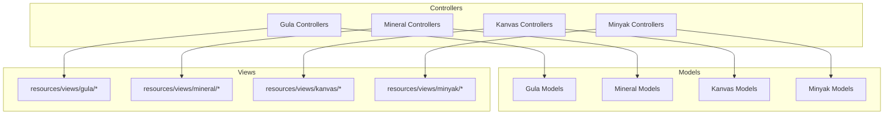

**Section sources**
- [DashboardController.php:1-45](file://app/Http/Controllers/Gula/DashboardController.php#L1-L45)
- [DashboardController.php:1-51](file://app/Http/Controllers/Kanvas/DashboardController.php#L1-L51)
- [DashboardController.php:1-29](file://app/Http/Controllers/Mineral/DashboardController.php#L1-L29)
- [DashboardController.php:1-93](file://app/Http/Controllers/Minyak/DashboardController.php#L1-L93)

## Core Components
- Gula: Loading, Setoran, Stok, Repacking, Dashboard
- Mineral: Loading, Stok, Dashboard
- Kanvas: Loading, Route, Setoran, Dashboard
- Minyak: Dashboard, Customers, Setoran

These components orchestrate manufacturing/loading, route planning, stock visibility, and settlement closures.

**Section sources**
- [LoadingController.php:1-135](file://app/Http/Controllers/Gula/LoadingController.php#L1-L135)
- [SetoranController.php:1-124](file://app/Http/Controllers/Gula/SetoranController.php#L1-L124)
- [StokController.php:1-123](file://app/Http/Controllers/Gula/StokController.php#L1-L123)
- [RepackingController.php:1-114](file://app/Http/Controllers/Gula/RepackingController.php#L1-L114)
- [LoadingController.php:1-91](file://app/Http/Controllers/Mineral/LoadingController.php#L1-L91)
- [StokController.php:1-54](file://app/Http/Controllers/Mineral/StokController.php#L1-L54)
- [LoadingController.php:1-150](file://app/Http/Controllers/Kanvas/LoadingController.php#L1-L150)
- [RouteController.php:1-84](file://app/Http/Controllers/Kanvas/RouteController.php#L1-L84)
- [SetoranController.php:1-98](file://app/Http/Controllers/Kanvas/SetoranController.php#L1-L98)
- [DashboardController.php:1-93](file://app/Http/Controllers/Minyak/DashboardController.php#L1-L93)
- [PelangganController.php:1-87](file://app/Http/Controllers/Minyak/PelangganController.php#L1-L87)

## Architecture Overview
The business units share common infrastructure:
- Shared models for products, stocks, and vehicles
- Shared transaction and movement records for auditability
- Vehicles as the mobile warehouse for on-road inventory
- Settlements that reconcile on-road stock back to central warehouses

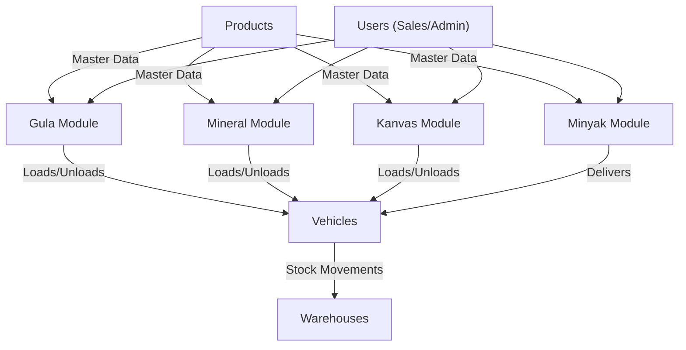

**Diagram sources**
- [LoadingController.php:77-130](file://app/Http/Controllers/Gula/LoadingController.php#L77-L130)
- [LoadingController.php:38-80](file://app/Http/Controllers/Mineral/LoadingController.php#L38-L80)
- [LoadingController.php:100-148](file://app/Http/Controllers/Kanvas/LoadingController.php#L100-L148)
- [DashboardController.php:19-91](file://app/Http/Controllers/Minyak/DashboardController.php#L19-L91)

## Detailed Component Analysis

### Gula (Sugar Production and Manufacturing)
Gula focuses on manufacturing workflows: loading raw materials into vehicles, converting bulk to retail units, and settling daily collections.

- Controllers
  - LoadingController: Creates loading documents, validates warehouse availability, decrements warehouse stock, increments vehicle stock, and sets status transitions.
  - SetoranController: Verifies daily collections, reconciles remaining vehicle stock back to warehouse, marks loading documents as returned, and closes the day.
  - StokController: Manages product master and initial warehouse stock entries.
  - RepackingController: Converts bulk units to smaller units (e.g., unpacking karungs to eceran), tracking expected yields and losses.
  - DashboardController: Aggregates global stock quantities and active vehicles carrying sugar.

- Models
  - GulaProduct: Product master with pricing tiers and conversion factors.
  - GulaWarehouseStock: Central warehouse stock per product variant.
  - KanvasVehicleStock: On-road stock tracked per vehicle and product.

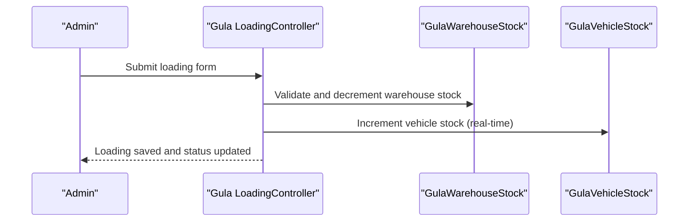

**Diagram sources**
- [LoadingController.php:77-130](file://app/Http/Controllers/Gula/LoadingController.php#L77-L130)

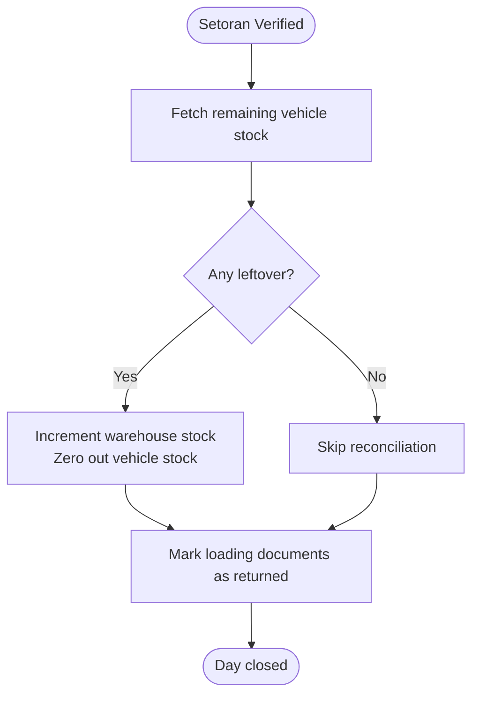

**Diagram sources**
- [SetoranController.php:85-119](file://app/Http/Controllers/Gula/SetoranController.php#L85-L119)

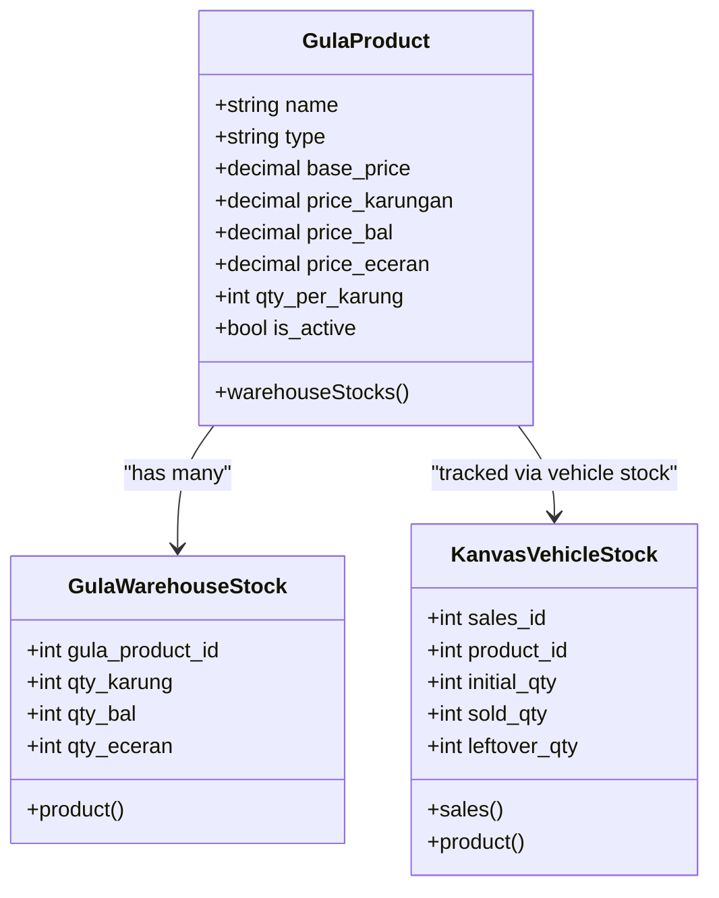

**Diagram sources**
- [GulaProduct.php:1-19](file://app/Models/GulaProduct.php#L1-L19)
- [GulaWarehouseStock.php:1-18](file://app/Models/GulaWarehouseStock.php#L1-L18)
- [KanvasVehicleStock.php:1-24](file://app/Models/KanvasVehicleStock.php#L1-L24)

Practical examples:
- Manufacturing operation: RepackingController converts packed units to smaller units and updates warehouse stock accordingly.
- Settlement process: SetoranController verifies the day’s collection and reconciles vehicle stock back to warehouse.

**Section sources**
- [LoadingController.php:1-135](file://app/Http/Controllers/Gula/LoadingController.php#L1-L135)
- [SetoranController.php:1-124](file://app/Http/Controllers/Gula/SetoranController.php#L1-L124)
- [StokController.php:1-123](file://app/Http/Controllers/Gula/StokController.php#L1-L123)
- [RepackingController.php:1-114](file://app/Http/Controllers/Gula/RepackingController.php#L1-L114)
- [DashboardController.php:1-45](file://app/Http/Controllers/Gula/DashboardController.php#L1-L45)
- [GulaProduct.php:1-19](file://app/Models/GulaProduct.php#L1-L19)
- [GulaWarehouseStock.php:1-18](file://app/Models/GulaWarehouseStock.php#L1-L18)
- [KanvasVehicleStock.php:1-24](file://app/Models/KanvasVehicleStock.php#L1-L24)

### Mineral (Industrial Inventory)
Mineral handles industrial-grade material handling with strict warehouse tracking and vehicle loading.

- Controllers
  - LoadingController: Creates loading documents, deducts warehouse stock, initializes vehicle stock, and logs mutations.
  - StokController: Records stock adjustments (in/out) and updates warehouse balances.
  - DashboardController: Provides product list, warehouse stock snapshot, and daily sales volume.

- Models
  - MineralProduct: Industrial product master with cash/tempo prices.
  - MineralWarehouseStock: Central warehouse stock per product.
  - MineralVehicleStock: On-road stock per product and salesperson.

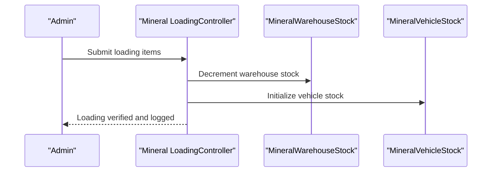

**Diagram sources**
- [LoadingController.php:38-80](file://app/Http/Controllers/Mineral/LoadingController.php#L38-L80)

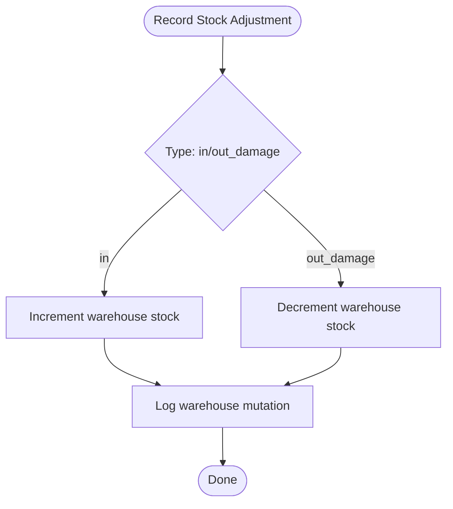

**Diagram sources**
- [StokController.php:30-49](file://app/Http/Controllers/Mineral/StokController.php#L30-L49)

Practical examples:
- Industrial inventory tracking: StokController records stock movements and updates warehouse balances.
- Loading operations: LoadingController manages loading documents and vehicle stock initialization.

**Section sources**
- [LoadingController.php:1-91](file://app/Http/Controllers/Mineral/LoadingController.php#L1-L91)
- [StokController.php:1-54](file://app/Http/Controllers/Mineral/StokController.php#L1-L54)
- [DashboardController.php:1-29](file://app/Http/Controllers/Mineral/DashboardController.php#L1-L29)
- [MineralProduct.php:1-35](file://app/Models/MineralProduct.php#L1-L35)

### Kanvas (Van Sales with Route Management)
Kanvas emphasizes route-based sales, vehicle stock control, and daily settlements.

- Controllers
  - LoadingController: Creates loading documents, validates warehouse availability, decrements warehouse stock, and updates vehicle stock.
  - RouteController: Designs delivery routes by assigning customers to sequences on specific days of the week.
  - SetoranController: Verifies daily collections, returns remaining vehicle stock to warehouse, and resets vehicle stock counters.

- Models
  - KanvasProduct: Product master with cash/tempo pricing.
  - KanvasVehicleStock: Tracks initial/sold/leftover quantities per product and salesperson.
  - KanvasRoute and KanvasRouteStore: Route definition and customer sequence mapping.

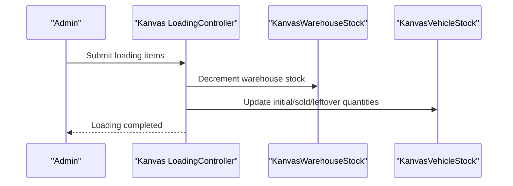

**Diagram sources**
- [LoadingController.php:100-148](file://app/Http/Controllers/Kanvas/LoadingController.php#L100-L148)

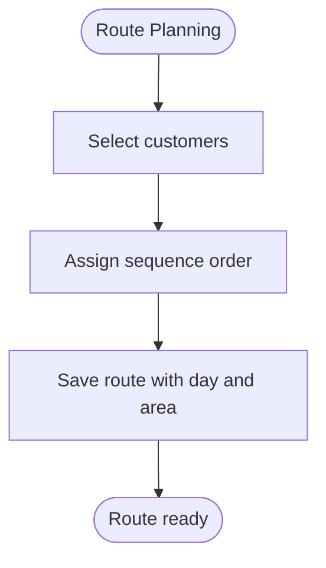

**Diagram sources**
- [RouteController.php:59-82](file://app/Http/Controllers/Kanvas/RouteController.php#L59-L82)

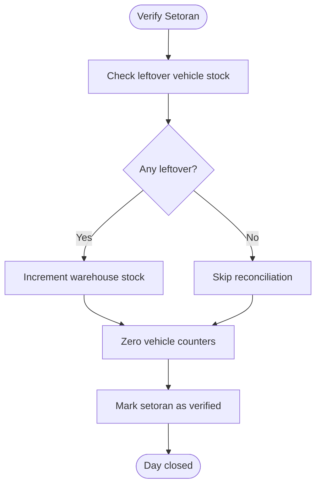

**Diagram sources**
- [SetoranController.php:70-96](file://app/Http/Controllers/Kanvas/SetoranController.php#L70-L96)

Practical examples:
- Route-based sales: RouteController designs optimized routes with customer sequences.
- Settlement process: SetoranController reconciles vehicle stock back to warehouse upon verification.

**Section sources**
- [LoadingController.php:1-150](file://app/Http/Controllers/Kanvas/LoadingController.php#L1-L150)
- [RouteController.php:1-84](file://app/Http/Controllers/Kanvas/RouteController.php#L1-L84)
- [SetoranController.php:1-98](file://app/Http/Controllers/Kanvas/SetoranController.php#L1-L98)
- [KanvasProduct.php:1-34](file://app/Models/KanvasProduct.php#L1-L34)
- [KanvasVehicleStock.php:1-24](file://app/Models/KanvasVehicleStock.php#L1-L24)

### Minyak (Oil Sales with Tank Monitoring)
Minyak focuses on oil distribution with real-time tank monitoring and customer management.

- Controllers
  - DashboardController: Summarizes daily sales by product across all vehicles, current vehicle stock, per-vehicle summaries, and totals.
  - PelangganController: Manages oil customers (category=minyak), including creation, updates, and deletion with debt checks.

- Models
  - MinyakSetoran: Settlement records linked to users and vehicles.

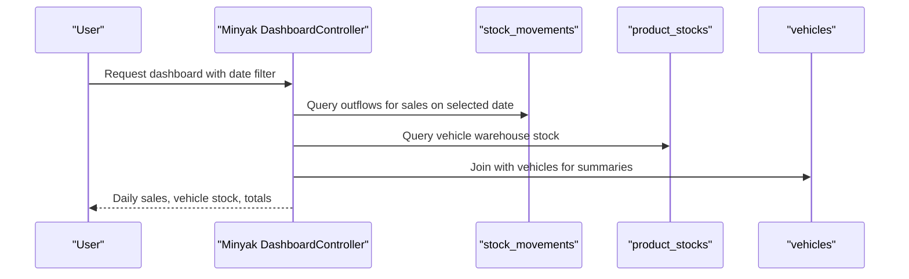

**Diagram sources**
- [DashboardController.php:19-91](file://app/Http/Controllers/Minyak/DashboardController.php#L19-L91)

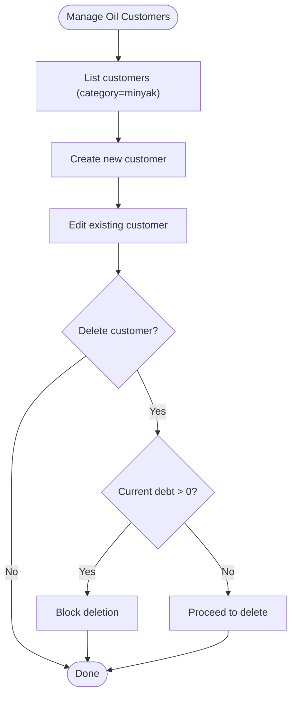

**Diagram sources**
- [PelangganController.php:11-86](file://app/Http/Controllers/Minyak/PelangganController.php#L11-L86)

Practical examples:
- Oil distribution management: DashboardController aggregates sales and stock across vehicles for daily monitoring.
- Customer lifecycle: PelangganController ensures proper handling of customer records with financial constraints.

**Section sources**
- [DashboardController.php:1-93](file://app/Http/Controllers/Minyak/DashboardController.php#L1-L93)
- [PelangganController.php:1-87](file://app/Http/Controllers/Minyak/PelangganController.php#L1-L87)
- [MinyakSetoran.php:1-31](file://app/Models/MinyakSetoran.php#L1-L31)

## Dependency Analysis
Key dependencies and integration points:
- Vehicles act as mobile warehouses for Gula, Mineral, and Kanvas stock.
- Settlements trigger reconciliation between vehicle and warehouse stock.
- Dashboards rely on aggregated queries across stock_movements and product_stocks.
- Shared models (Product, Vehicle, Warehouse) unify product and stock semantics across units.

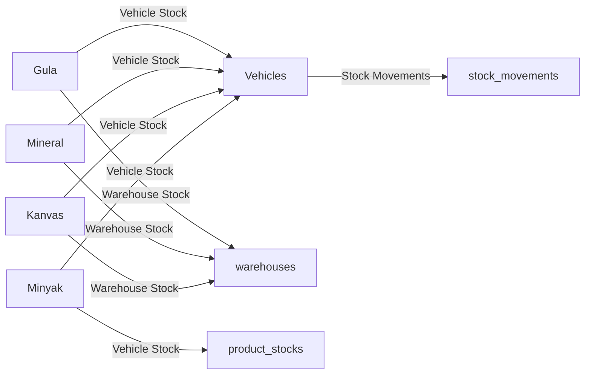

**Diagram sources**
- [LoadingController.php:114-129](file://app/Http/Controllers/Gula/LoadingController.php#L114-L129)
- [LoadingController.php:56-69](file://app/Http/Controllers/Mineral/LoadingController.php#L56-L69)
- [LoadingController.php:110-139](file://app/Http/Controllers/Kanvas/LoadingController.php#L110-L139)
- [DashboardController.php:25-82](file://app/Http/Controllers/Minyak/DashboardController.php#L25-L82)

**Section sources**
- [LoadingController.php:1-135](file://app/Http/Controllers/Gula/LoadingController.php#L1-L135)
- [LoadingController.php:1-91](file://app/Http/Controllers/Mineral/LoadingController.php#L1-L91)
- [LoadingController.php:1-150](file://app/Http/Controllers/Kanvas/LoadingController.php#L1-L150)
- [DashboardController.php:1-93](file://app/Http/Controllers/Minyak/DashboardController.php#L1-L93)

## Performance Considerations
- Use pagination for loading and settlement lists to avoid heavy page loads.
- Apply database indexing on frequently filtered fields (date, status, sales_id).
- Batch reconciliation during settlement to minimize repeated queries.
- Cache dashboard aggregations periodically to reduce DB load.

## Troubleshooting Guide
Common issues and resolutions:
- Insufficient warehouse stock during loading: Ensure warehouse quantities are sufficient before creating loading documents.
- Settlement not closing: Verify that all vehicle leftovers are zeroed out and loading documents are marked as returned.
- Route planning conflicts: Confirm customer sequences and days of the week do not overlap unexpectedly.
- Customer deletion blocked: Resolve outstanding debts before deleting customers.

**Section sources**
- [LoadingController.php:100-105](file://app/Http/Controllers/Gula/LoadingController.php#L100-L105)
- [SetoranController.php:92-112](file://app/Http/Controllers/Gula/SetoranController.php#L92-L112)
- [RouteController.php:61-65](file://app/Http/Controllers/Kanvas/RouteController.php#L61-L65)
- [PelangganController.php:75-85](file://app/Http/Controllers/Minyak/PelangganController.php#L75-L85)

## Conclusion
DODPOS’s business unit modules provide robust, specialized workflows tailored to each segment while sharing common infrastructure for vehicles, stock, and settlements. Gula emphasizes manufacturing and repacking, Mineral focuses on industrial inventory, Kanvas integrates route planning with daily settlements, and Minyak monitors oil distribution with tank-level visibility. Together, they enable accurate stock tracking, efficient operations, and reliable reporting across the enterprise.