# Gula (Sugar Production)

<cite>
**Referenced Files in This Document**
- [DashboardController.php](file://app/Http/Controllers/Gula/DashboardController.php)
- [LoadingController.php](file://app/Http/Controllers/Gula/LoadingController.php)
- [RepackingController.php](file://app/Http/Controllers/Gula/RepackingController.php)
- [SetoranController.php](file://app/Http/Controllers/Gula/SetoranController.php)
- [StokController.php](file://app/Http/Controllers/Gula/StokController.php)
- [GulaProduct.php](file://app/Models/GulaProduct.php)
- [GulaLoading.php](file://app/Models/GulaLoading.php)
- [GulaRepacking.php](file://app/Models/GulaRepacking.php)
- [GulaSetoran.php](file://app/Models/GulaSetoran.php)
- [GulaWarehouseStock.php](file://app/Models/GulaWarehouseStock.php)
- [GulaVehicleStock.php](file://app/Models/GulaVehicleStock.php)
- [GulaTransaction.php](file://app/Models/GulaTransaction.php)
- [GulaTransactionItem.php](file://app/Models/GulaTransactionItem.php)
- [GulaLoadingItem.php](file://app/Models/GulaLoadingItem.php)
- [GulaReturn.php](file://app/Models/GulaReturn.php)
- [GulaRepacking.php](file://app/Models/GulaRepacking.php)
- [web.php](file://routes/web.php)
- [api.php](file://routes/api.php)
- [MobilePosController.php](file://app/Http/Controllers/MobilePosController.php)
- [MobileOfflineController.php](file://app/Http/Controllers/MobileOfflineController.php)
- [AuthController.php](file://app/Http/Controllers/Api/AuthController.php)
- [ProductController.php](file://app/Http/Controllers/ProductController.php)
- [TransactionController.php](file://app/Http/Controllers/TransactionController.php)
- [VehicleController.php](file://app/Http/Controllers/VehicleController.php)
- [WarehouseController.php](file://app/Http/Controllers/WarehouseController.php)
- [KasirController.php](file://app/Http/Controllers/KasirController.php)
- [KasirEceranController.php](file://app/Http/Controllers/KasirEceranController.php)
- [KasirGrosirController.php](file://app/Http/Controllers/KasirGrosirController.php)
- [PosReturnController.php](file://app/Http/Controllers/PosReturnController.php)
- [PosCashMovement.php](file://app/Models/PosCashMovement.php)
- [PosSession.php](file://app/Models/PosSession.php)
- [PosReturn.php](file://app/Models/PosReturn.php)
- [PosReturnItem.php](file://app/Models/PosReturnItem.php)
</cite>

## Table of Contents
1. [Introduction](#introduction)
2. [Project Structure](#project-structure)
3. [Core Components](#core-components)
4. [Architecture Overview](#architecture-overview)
5. [Detailed Component Analysis](#detailed-component-analysis)
6. [Dependency Analysis](#dependency-analysis)
7. [Performance Considerations](#performance-considerations)
8. [Troubleshooting Guide](#troubleshooting-guide)
9. [Conclusion](#conclusion)
10. [Appendices](#appendices)

## Introduction
This document explains the Gula (sugar production) business unit within DODPOS, focusing on the end-to-end sugar manufacturing and distribution workflow. It covers raw material loading, manufacturing processes, repacking operations, settlement processing, and stock tracking. It also documents specialized controllers for dashboards, loading, repacking, settlement, and stock, along with inventory management for sugar products, warehouse stocks, vehicle stocks, and transaction processing. Practical examples illustrate manufacturing operations, quality control, waste/susut management, and production reporting. Finally, it outlines POS integration, vehicle tracking, settlement validation, and API endpoints for mobile operations and real-time data synchronization.

## Project Structure
The Gula module is organized under the HTTP Controllers and Models namespaces, with dedicated controllers for dashboard analytics, loading, repacking, settlement, and stock. Models encapsulate the domain entities for products, loading, repacking, settlements, and warehouse/vehicle stocks. Routes define both web and API endpoints for internal operations and mobile integrations.

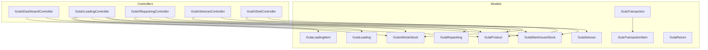

**Diagram sources**
- [DashboardController.php:1-45](file://app/Http/Controllers/Gula/DashboardController.php#L1-L45)
- [LoadingController.php:1-135](file://app/Http/Controllers/Gula/LoadingController.php#L1-L135)
- [RepackingController.php:1-114](file://app/Http/Controllers/Gula/RepackingController.php#L1-L114)
- [SetoranController.php:1-124](file://app/Http/Controllers/Gula/SetoranController.php#L1-L124)
- [StokController.php:1-123](file://app/Http/Controllers/Gula/StokController.php#L1-L123)
- [GulaProduct.php:1-19](file://app/Models/GulaProduct.php#L1-L19)
- [GulaLoading.php:1-18](file://app/Models/GulaLoading.php#L1-L18)
- [GulaLoadingItem.php](file://app/Models/GulaLoadingItem.php)
- [GulaRepacking.php:1-24](file://app/Models/GulaRepacking.php#L1-L24)
- [GulaSetoran.php:1-16](file://app/Models/GulaSetoran.php#L1-L16)
- [GulaWarehouseStock.php:1-18](file://app/Models/GulaWarehouseStock.php#L1-L18)
- [GulaVehicleStock.php](file://app/Models/GulaVehicleStock.php)
- [GulaTransaction.php](file://app/Models/GulaTransaction.php)
- [GulaTransactionItem.php](file://app/Models/GulaTransactionItem.php)
- [GulaReturn.php](file://app/Models/GulaReturn.php)

**Section sources**
- [DashboardController.php:1-45](file://app/Http/Controllers/Gula/DashboardController.php#L1-L45)
- [LoadingController.php:1-135](file://app/Http/Controllers/Gula/LoadingController.php#L1-L135)
- [RepackingController.php:1-114](file://app/Http/Controllers/Gula/RepackingController.php#L1-L114)
- [SetoranController.php:1-124](file://app/Http/Controllers/Gula/SetoranController.php#L1-L124)
- [StokController.php:1-123](file://app/Http/Controllers/Gula/StokController.php#L1-L123)

## Core Components
- DashboardController: Aggregates sugar inventory across products and active vehicles for executive visibility.
- LoadingController: Manages loading operations from warehouse to vehicles, updates warehouse and vehicle stocks, and generates loading numbers.
- RepackingController: Handles unpacking karung to eceran units, calculates expected vs actual quantities, and records losses.
- SetoranController: Manages daily settlement submissions, verification, and reconciliation of remaining vehicle stocks back to warehouse.
- StokController: Maintains product master data, initial stock entries, and product updates.

These controllers coordinate with models representing products, loading records, repacking logs, settlements, warehouse stocks, and vehicle stocks.

**Section sources**
- [DashboardController.php:10-43](file://app/Http/Controllers/Gula/DashboardController.php#L10-L43)
- [LoadingController.php:13-133](file://app/Http/Controllers/Gula/LoadingController.php#L13-L133)
- [RepackingController.php:12-112](file://app/Http/Controllers/Gula/RepackingController.php#L12-L112)
- [SetoranController.php:12-122](file://app/Http/Controllers/Gula/SetoranController.php#L12-L122)
- [StokController.php:11-94](file://app/Http/Controllers/Gula/StokController.php#L11-L94)

## Architecture Overview
The Gula module follows a layered MVC pattern:
- Controllers orchestrate requests, apply filters, and manage transactions.
- Models define domain entities and relationships.
- Views render dashboards and forms for loading, repacking, settlement, and stock.
- Routes expose both web and API endpoints for internal and mobile operations.

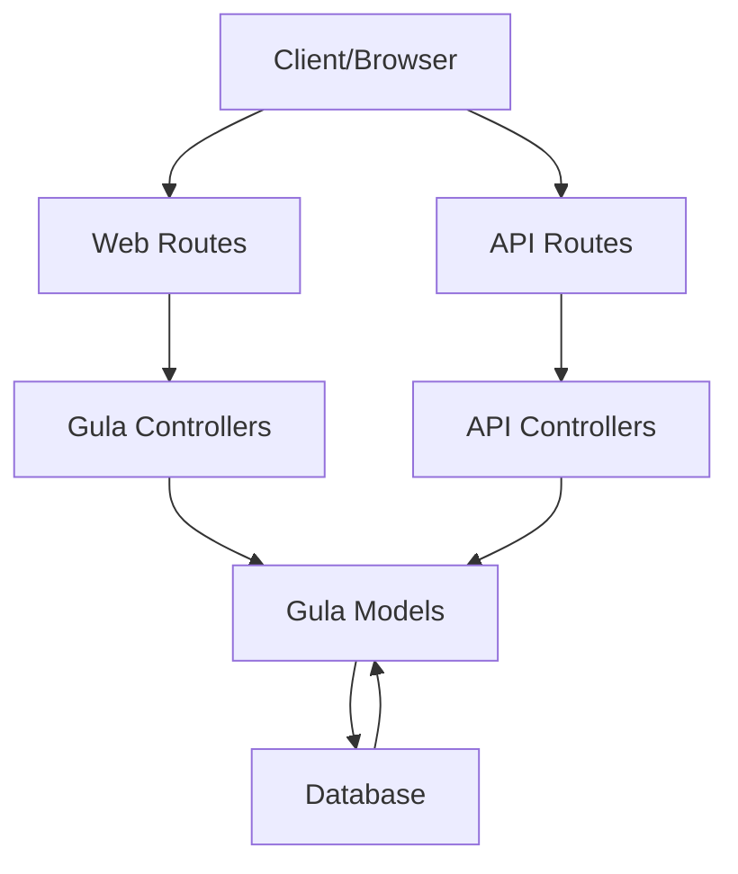

[No sources needed since this diagram shows conceptual workflow, not actual code structure]

## Detailed Component Analysis

### Dashboard Analytics
The dashboard controller aggregates:
- Global inventory across karung, bal, and eceran units per product.
- Active vehicles currently carrying sugar loads.
- Counts of active vehicles and total inventory metrics.

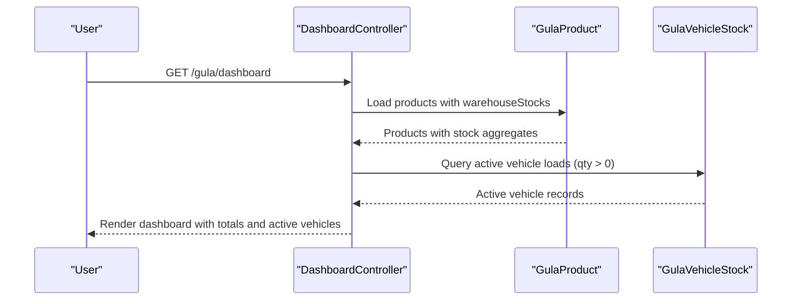

**Diagram sources**
- [DashboardController.php:10-43](file://app/Http/Controllers/Gula/DashboardController.php#L10-L43)

**Section sources**
- [DashboardController.php:10-43](file://app/Http/Controllers/Gula/DashboardController.php#L10-L43)

### Raw Material Loading Workflow
The loading process moves sugar from warehouse to vehicles:
- Validates product availability against warehouse stocks.
- Creates loading records with auto-generated loading numbers.
- Updates warehouse stocks and increments vehicle stock records.
- Supports filtering by date, status, and search terms.

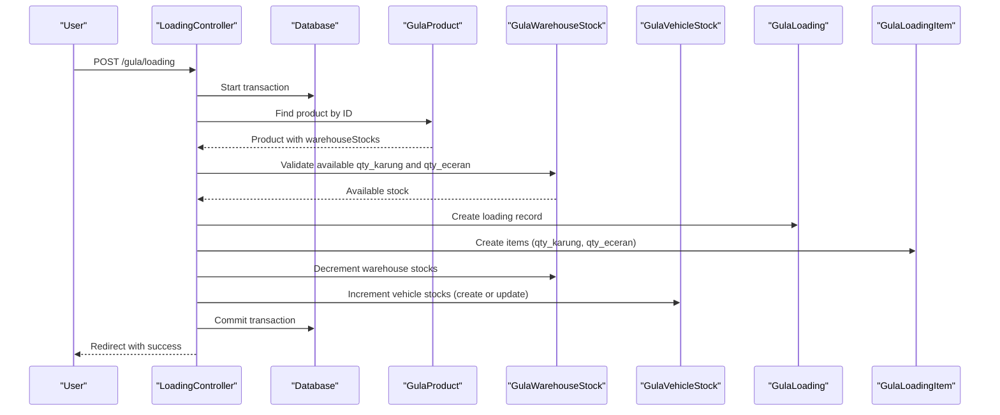

**Diagram sources**
- [LoadingController.php:64-133](file://app/Http/Controllers/Gula/LoadingController.php#L64-L133)
- [GulaLoading.php:7-17](file://app/Models/GulaLoading.php#L7-L17)
- [GulaLoadingItem.php](file://app/Models/GulaLoadingItem.php)
- [GulaWarehouseStock.php:7-17](file://app/Models/GulaWarehouseStock.php#L7-L17)
- [GulaVehicleStock.php](file://app/Models/GulaVehicleStock.php)

**Section sources**
- [LoadingController.php:13-133](file://app/Http/Controllers/Gula/LoadingController.php#L13-L133)

### Manufacturing and Repacking Operations
Repacking converts packed units (karung) into smaller units (eceran):
- Validates sufficient karung stock.
- Computes expected eceran from master conversion rate (qty_per_karung).
- Records actual eceran after subtracting loss (susut).
- Updates warehouse stocks accordingly.

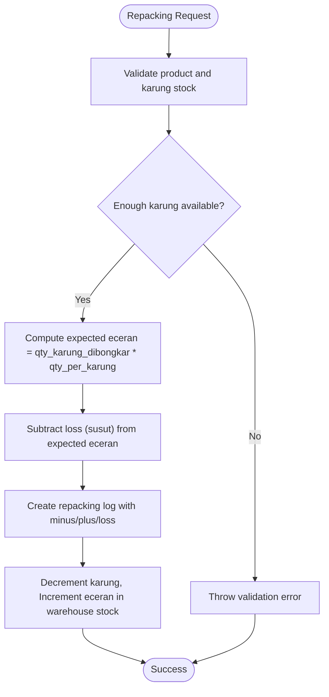

**Diagram sources**
- [RepackingController.php:68-112](file://app/Http/Controllers/Gula/RepackingController.php#L68-L112)
- [GulaRepacking.php:7-23](file://app/Models/GulaRepacking.php#L7-L23)
- [GulaWarehouseStock.php:7-17](file://app/Models/GulaWarehouseStock.php#L7-L17)

**Section sources**
- [RepackingController.php:12-112](file://app/Http/Controllers/Gula/RepackingController.php#L12-L112)

### Settlement Management and Reconciliation
Settlement processing validates daily sales and reconciles remaining vehicle stocks:
- Filters and paginates settlement records by status and date.
- Verifies settlement, returning remaining vehicle stock to warehouse and marking loading records as returned.
- Provides detailed view of vehicle stocks and transactions for a given day.

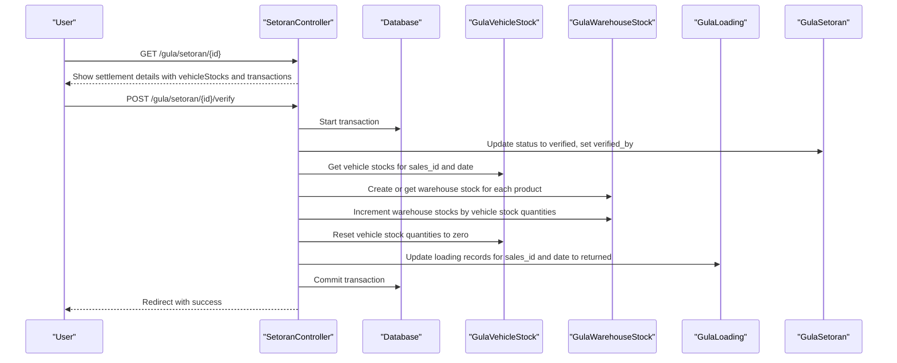

**Diagram sources**
- [SetoranController.php:61-122](file://app/Http/Controllers/Gula/SetoranController.php#L61-L122)
- [GulaSetoran.php:7-15](file://app/Models/GulaSetoran.php#L7-L15)
- [GulaVehicleStock.php](file://app/Models/GulaVehicleStock.php)
- [GulaWarehouseStock.php:7-17](file://app/Models/GulaWarehouseStock.php#L7-L17)
- [GulaLoading.php:7-17](file://app/Models/GulaLoading.php#L7-L17)

**Section sources**
- [SetoranController.php:12-122](file://app/Http/Controllers/Gula/SetoranController.php#L12-L122)

### Inventory Management for Sugar Products
The stock controller manages product master data and initial warehouse entries:
- Creates new products with pricing and conversion factors.
- Initializes warehouse stock entries for karung and eceran.
- Updates product attributes and soft-deletes products when necessary.

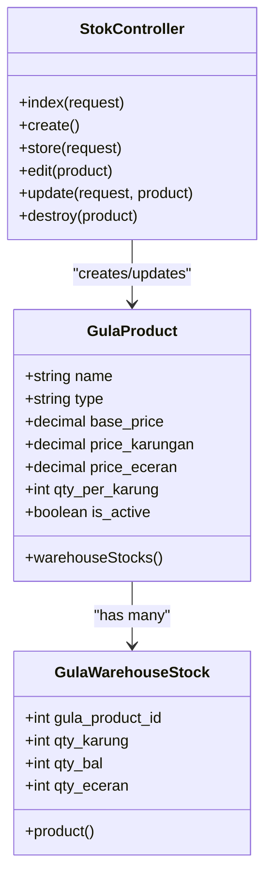

**Diagram sources**
- [StokController.php:11-121](file://app/Http/Controllers/Gula/StokController.php#L11-L121)
- [GulaProduct.php:7-18](file://app/Models/GulaProduct.php#L7-L18)
- [GulaWarehouseStock.php:7-17](file://app/Models/GulaWarehouseStock.php#L7-L17)

**Section sources**
- [StokController.php:11-121](file://app/Http/Controllers/Gula/StokController.php#L11-L121)

### Quality Control, Waste Management, and Reporting
Quality control and waste management are embedded in the repacking workflow:
- Expected eceran computed from karung count and conversion factor.
- Actual eceran adjusted by recorded loss (susut) to reflect real-world waste.
- Reporting aggregates totals for minus karung, plus eceran, and loss across repacking logs.

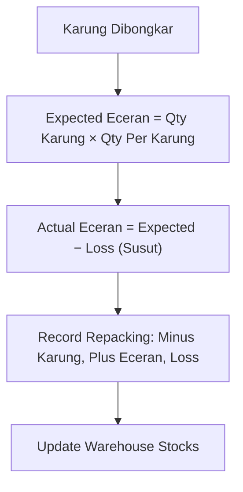

**Diagram sources**
- [RepackingController.php:88-108](file://app/Http/Controllers/Gula/RepackingController.php#L88-L108)

**Section sources**
- [RepackingController.php:68-112](file://app/Http/Controllers/Gula/RepackingController.php#L68-L112)

### POS Integration, Vehicle Tracking, and Settlement Validation
- POS integration supports cash and credit transactions, with return processing and cash movement tracking.
- Vehicle tracking integrates with loading and settlement to monitor active vehicles and remaining loads.
- Settlement validation ties loading records and vehicle stocks to ensure accurate reconciliation.

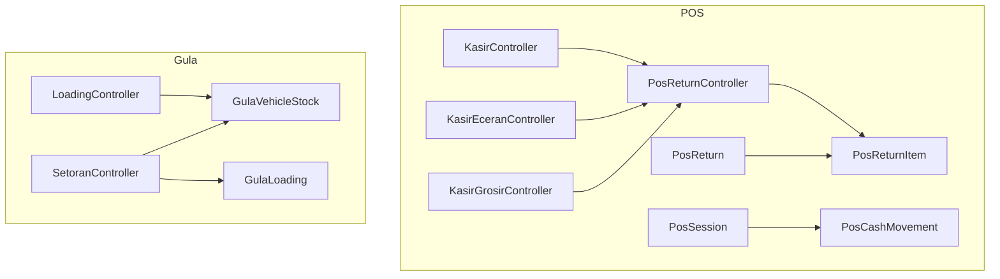

**Diagram sources**
- [KasirController.php](file://app/Http/Controllers/KasirController.php)
- [KasirEceranController.php](file://app/Http/Controllers/KasirEceranController.php)
- [KasirGrosirController.php](file://app/Http/Controllers/KasirGrosirController.php)
- [PosReturnController.php](file://app/Http/Controllers/PosReturnController.php)
- [PosSession.php](file://app/Models/PosSession.php)
- [PosCashMovement.php](file://app/Models/PosCashMovement.php)
- [PosReturn.php](file://app/Models/PosReturn.php)
- [PosReturnItem.php](file://app/Models/PosReturnItem.php)
- [LoadingController.php:1-135](file://app/Http/Controllers/Gula/LoadingController.php#L1-L135)
- [SetoranController.php:1-124](file://app/Http/Controllers/Gula/SetoranController.php#L1-L124)
- [GulaVehicleStock.php](file://app/Models/GulaVehicleStock.php)
- [GulaLoading.php:1-18](file://app/Models/GulaLoading.php#L1-L18)

**Section sources**
- [KasirController.php](file://app/Http/Controllers/KasirController.php)
- [PosReturnController.php](file://app/Http/Controllers/PosReturnController.php)
- [PosSession.php](file://app/Models/PosSession.php)
- [PosCashMovement.php](file://app/Models/PosCashMovement.php)
- [PosReturn.php](file://app/Models/PosReturn.php)
- [PosReturnItem.php](file://app/Models/PosReturnItem.php)

### API Endpoints for Mobile Operations and Real-Time Synchronization
Mobile operations integrate via API controllers and routes:
- Authentication endpoints for secure access.
- Product and transaction endpoints for inventory and sales data.
- Offline sync support for mobile clients.

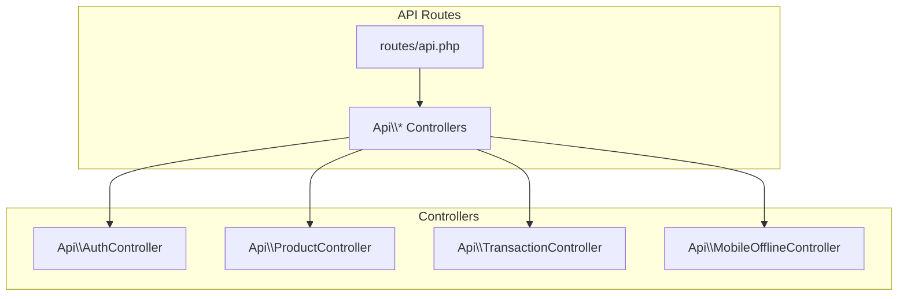

**Diagram sources**
- [api.php](file://routes/api.php)
- [AuthController.php](file://app/Http/Controllers/Api/AuthController.php)
- [ProductController.php](file://app/Http/Controllers/ProductController.php)
- [TransactionController.php](file://app/Http/Controllers/TransactionController.php)
- [MobileOfflineController.php](file://app/Http/Controllers/MobileOfflineController.php)

**Section sources**
- [api.php](file://routes/api.php)
- [AuthController.php](file://app/Http/Controllers/Api/AuthController.php)
- [ProductController.php](file://app/Http/Controllers/ProductController.php)
- [TransactionController.php](file://app/Http/Controllers/TransactionController.php)
- [MobileOfflineController.php](file://app/Http/Controllers/MobileOfflineController.php)

## Dependency Analysis
The Gula module exhibits clear separation of concerns:
- Controllers depend on models for data access and business logic.
- Models define relationships and constraints for products, stocks, and transactions.
- Routes connect controllers to endpoints for web and API consumption.

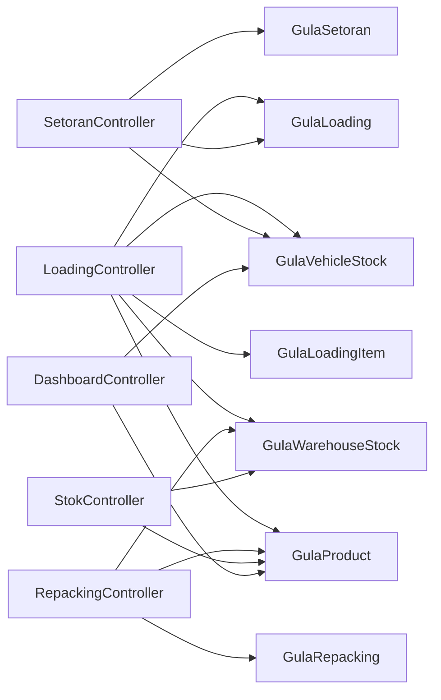

**Diagram sources**
- [LoadingController.php:1-135](file://app/Http/Controllers/Gula/LoadingController.php#L1-L135)
- [RepackingController.php:1-114](file://app/Http/Controllers/Gula/RepackingController.php#L1-L114)
- [SetoranController.php:1-124](file://app/Http/Controllers/Gula/SetoranController.php#L1-L124)
- [StokController.php:1-123](file://app/Http/Controllers/Gula/StokController.php#L1-L123)
- [DashboardController.php:1-45](file://app/Http/Controllers/Gula/DashboardController.php#L1-L45)
- [GulaLoading.php:1-18](file://app/Models/GulaLoading.php#L1-L18)
- [GulaLoadingItem.php](file://app/Models/GulaLoadingItem.php)
- [GulaRepacking.php:1-24](file://app/Models/GulaRepacking.php#L1-L24)
- [GulaSetoran.php:1-16](file://app/Models/GulaSetoran.php#L1-L16)
- [GulaWarehouseStock.php:1-18](file://app/Models/GulaWarehouseStock.php#L1-L18)
- [GulaVehicleStock.php](file://app/Models/GulaVehicleStock.php)
- [GulaProduct.php:1-19](file://app/Models/GulaProduct.php#L1-L19)

**Section sources**
- [LoadingController.php:1-135](file://app/Http/Controllers/Gula/LoadingController.php#L1-L135)
- [RepackingController.php:1-114](file://app/Http/Controllers/Gula/RepackingController.php#L1-L114)
- [SetoranController.php:1-124](file://app/Http/Controllers/Gula/SetoranController.php#L1-L124)
- [StokController.php:1-123](file://app/Http/Controllers/Gula/StokController.php#L1-L123)
- [DashboardController.php:1-45](file://app/Http/Controllers/Gula/DashboardController.php#L1-L45)

## Performance Considerations
- Use pagination for large datasets in controllers to limit memory usage.
- Apply database indexes on frequently filtered columns (date, status, product_id).
- Batch updates for vehicle stock reconciliation during settlement verification.
- Cache aggregated dashboard metrics periodically to reduce repeated calculations.

[No sources needed since this section provides general guidance]

## Troubleshooting Guide
Common issues and resolutions:
- Insufficient stock during loading: Ensure warehouse stock meets requested quantities before creating loading records.
- Repacking discrepancies: Verify conversion factor (qty_per_karung) and recorded loss (susut) align with actual yields.
- Settlement not closing: Confirm vehicle stock quantities are zeroed and loading records updated to returned after verification.
- Mobile sync failures: Validate authentication tokens and endpoint reachability; check offline mode fallbacks.

**Section sources**
- [LoadingController.php:100-105](file://app/Http/Controllers/Gula/LoadingController.php#L100-L105)
- [RepackingController.php:82-86](file://app/Http/Controllers/Gula/RepackingController.php#L82-L86)
- [SetoranController.php:81-83](file://app/Http/Controllers/Gula/SetoranController.php#L81-L83)

## Conclusion
The Gula module provides a robust framework for managing the complete sugar production lifecycle—from raw material loading and repacking to settlement and stock reconciliation. Its controller-model design ensures clear separation of concerns, while integrated POS and vehicle tracking capabilities support real-time operations. By following the documented workflows and best practices, stakeholders can maintain accurate inventory, enforce quality controls, and streamline daily operations.

[No sources needed since this section summarizes without analyzing specific files]

## Appendices

### Practical Examples
- Manufacturing operations: Convert 10 karung of product A (conversion factor 100 eceran per karung) to 1000 eceran, record 10 eceran as loss (susut), resulting in 990 eceran credited to warehouse.
- Quality control: Compare expected vs actual eceran to identify packing inefficiencies and adjust conversion factors or training.
- Waste management: Track loss (susut) in repacking logs to quantify and minimize waste over time.
- Production reporting: Aggregate repacking totals (minus karung, plus eceran, loss) to generate daily reports for management review.

[No sources needed since this section provides general guidance]