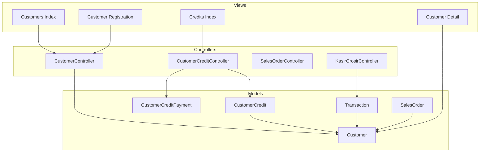
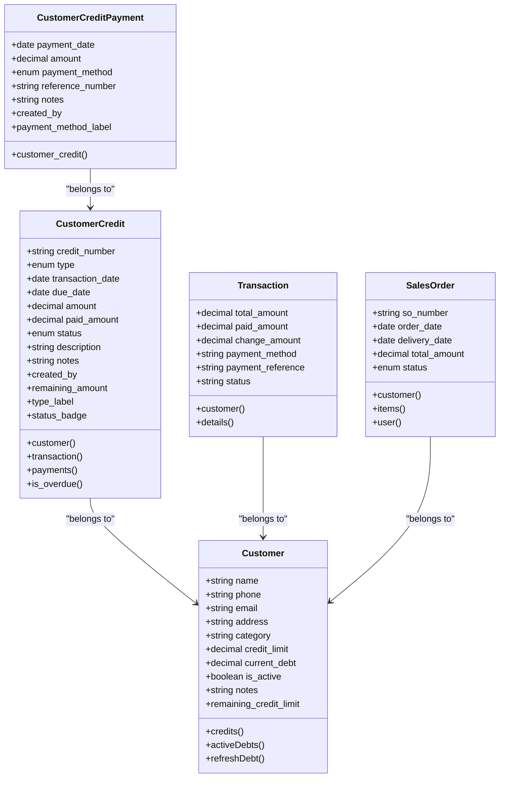
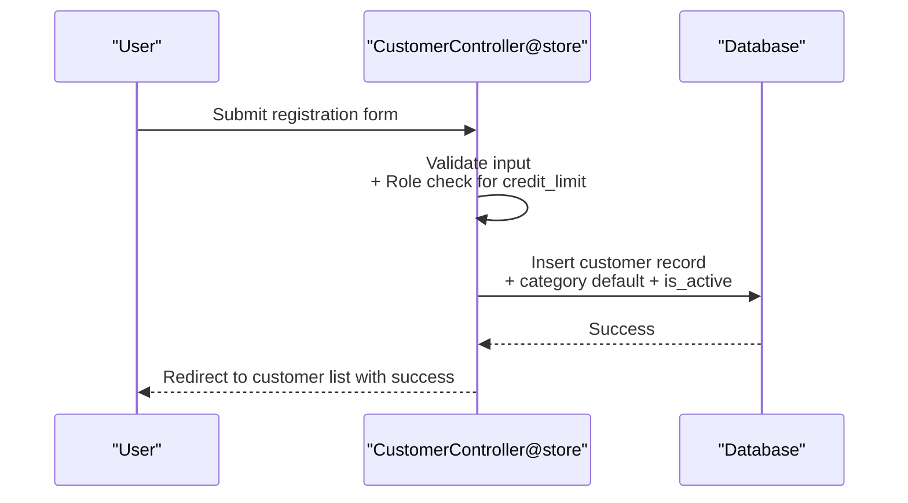
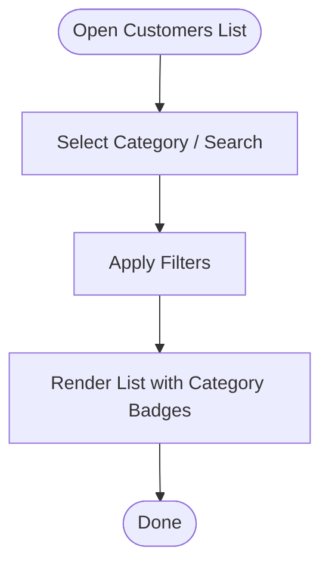
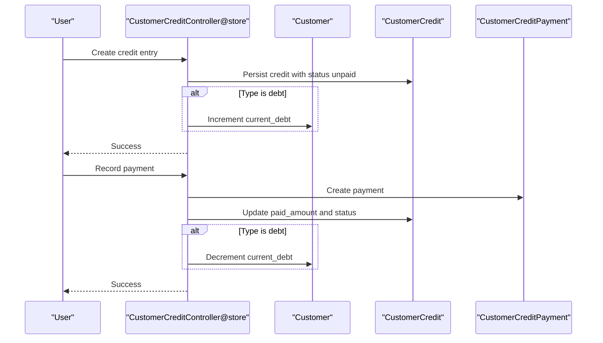
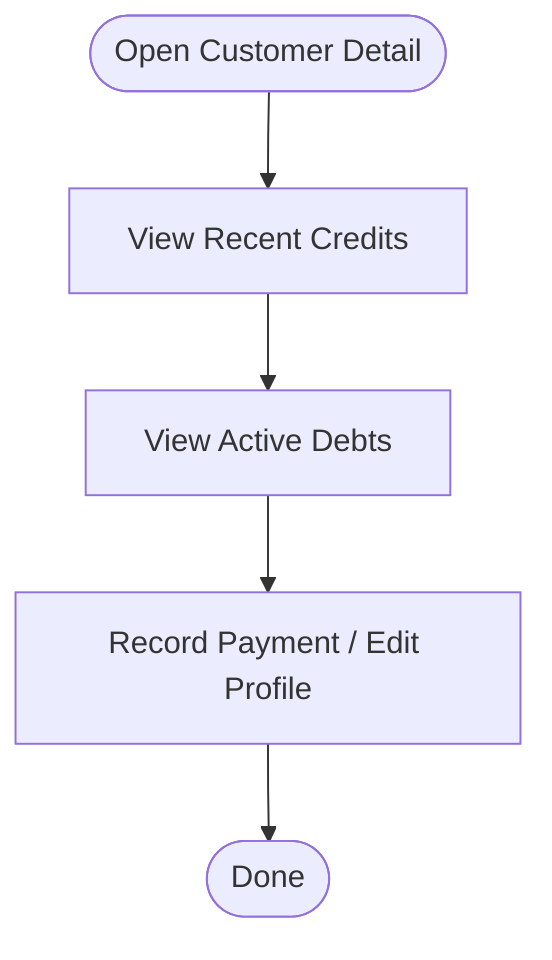
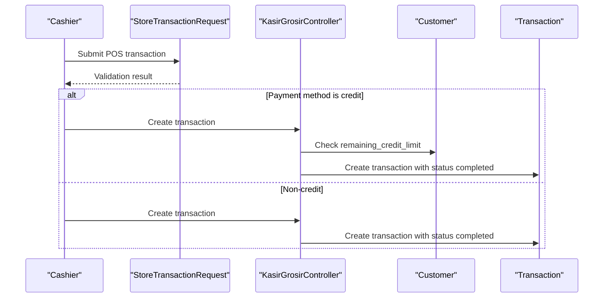
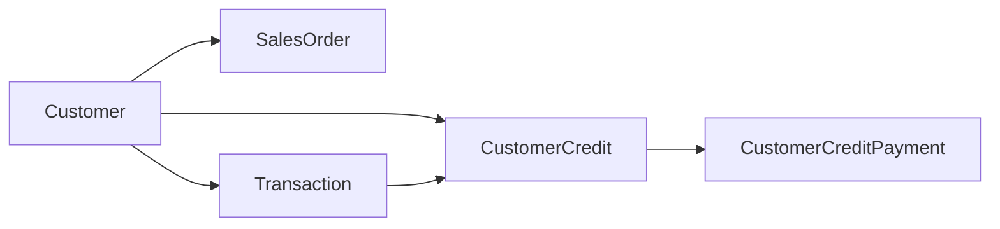
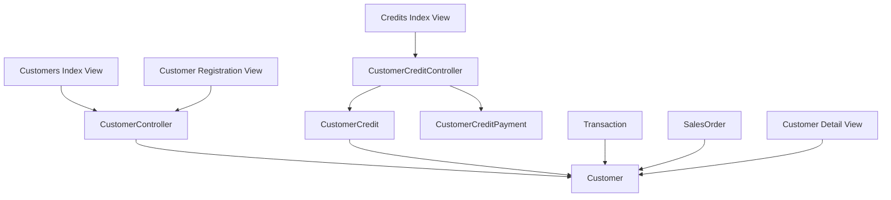

# Customer Management

<cite>
**Referenced Files in This Document**
- [CustomerController.php](file://app/Http/Controllers/CustomerController.php)
- [CustomerCreditController.php](file://app/Http/Controllers/CustomerCreditController.php)
- [Customer.php](file://app/Models/Customer.php)
- [CustomerCredit.php](file://app/Models/CustomerCredit.php)
- [CustomerCreditPayment.php](file://app/Models/CustomerCreditPayment.php)
- [StoreTransactionRequest.php](file://app/Http/Requests/StoreTransactionRequest.php)
- [2026_02_27_080001_create_customers_table.php](file://database/migrations/2026_02_27_080001_create_customers_table.php)
- [2026_02_27_080002_create_customer_credits_table.php](file://database/migrations/2026_02_27_080002_create_customer_credits_table.php)
- [index.blade.php (Customers)](file://resources/views/pelanggan/index.blade.php)
- [show.blade.php (Customer Detail)](file://resources/views/pelanggan/show.blade.php)
- [create.blade.php (Customer Registration)](file://resources/views/pelanggan/create.blade.php)
- [index.blade.php (Customer Credits)](file://resources/views/pelanggan/kredit/index.blade.php)
- [SalesOrderController.php](file://app/Http/Controllers/SalesOrderController.php)
- [SalesOrder.php](file://app/Models/SalesOrder.php)
- [Transaction.php](file://app/Models/Transaction.php)
- [KasirGrosirController.php](file://app/Http/Controllers/KasirGrosirController.php)
</cite>

## Table of Contents
1. [Introduction](#introduction)
2. [Project Structure](#project-structure)
3. [Core Components](#core-components)
4. [Architecture Overview](#architecture-overview)
5. [Detailed Component Analysis](#detailed-component-analysis)
6. [Dependency Analysis](#dependency-analysis)
7. [Performance Considerations](#performance-considerations)
8. [Troubleshooting Guide](#troubleshooting-guide)
9. [Conclusion](#conclusion)

## Introduction
This document explains the customer management system with a focus on customer database, segmentation, and credit management. It covers the customer registration process, profile management, category assignment, credit limits, payment terms, receivable tracking, communication features, order history, and preference management. It also documents practical workflows such as customer onboarding, credit approval, payment processing, and customer service interactions, and describes integrations with sales orders, invoicing, and collections.

## Project Structure
The customer management system spans controllers, models, requests, migrations, and Blade views under the application’s MVC layers. Key areas include:
- Customer CRUD and segmentation via dedicated controller and views
- Credit lifecycle (creation, payment, aging) via credit controller and related models
- Transaction and POS integration validating payment methods and credit limits
- Sales order integration linking customers to orders and invoices
- Database schema ensuring referential integrity and financial precision

**Diagram sources**
- [CustomerController.php:12-119](file://app/Http/Controllers/CustomerController.php#L12-L119)
- [CustomerCreditController.php:12-152](file://app/Http/Controllers/CustomerCreditController.php#L12-L152)
- [Customer.php:10-59](file://app/Models/Customer.php#L10-L59)
- [CustomerCredit.php:7-74](file://app/Models/CustomerCredit.php#L7-L74)
- [CustomerCreditPayment.php:7-39](file://app/Models/CustomerCreditPayment.php#L7-L39)
- [Transaction.php:9-47](file://app/Models/Transaction.php#L9-L47)
- [SalesOrder.php:7-41](file://app/Models/SalesOrder.php#L7-L41)
- [index.blade.php (Customers):1-287](file://resources/views/pelanggan/index.blade.php#L1-L287)
- [show.blade.php (Customer Detail):1-116](file://resources/views/pelanggan/show.blade.php#L1-L116)
- [create.blade.php (Customer Registration):1-283](file://resources/views/pelanggan/create.blade.php#L1-L283)
- [index.blade.php (Customer Credits):1-121](file://resources/views/pelanggan/kredit/index.blade.php#L1-L121)

**Section sources**
- [CustomerController.php:12-119](file://app/Http/Controllers/CustomerController.php#L12-L119)
- [CustomerCreditController.php:12-152](file://app/Http/Controllers/CustomerCreditController.php#L12-L152)
- [Customer.php:10-59](file://app/Models/Customer.php#L10-L59)
- [CustomerCredit.php:7-74](file://app/Models/CustomerCredit.php#L7-L74)
- [CustomerCreditPayment.php:7-39](file://app/Models/CustomerCreditPayment.php#L7-L39)
- [index.blade.php (Customers):1-287](file://resources/views/pelanggan/index.blade.php#L1-L287)
- [show.blade.php (Customer Detail):1-116](file://resources/views/pelanggan/show.blade.php#L1-L116)
- [create.blade.php (Customer Registration):1-283](file://resources/views/pelanggan/create.blade.php#L1-L283)
- [index.blade.php (Customer Credits):1-121](file://resources/views/pelanggan/kredit/index.blade.php#L1-L121)

## Core Components
- Customer model encapsulates profile, segmentation, credit limit, current debt, and remaining credit computation. It defines relationships to customer credits and active debts, and exposes computed attributes for UI rendering.
- CustomerCredit model stores credit entries (debts and credits), supports payment linkage, due dates, status tracking, and overdue detection.
- CustomerCreditPayment records cash, transfer, QRIS, and other payment methods against credits with audit linkage.
- Controllers orchestrate creation, updates, payments, and deletions while enforcing role-based access for credit limit changes.
- Views present customer lists, details, registration forms, and credit listings with filters and summaries.
- Requests validate transaction payloads and enforce payment method rules, including credit-specific constraints.

**Section sources**
- [Customer.php:10-59](file://app/Models/Customer.php#L10-L59)
- [CustomerCredit.php:7-74](file://app/Models/CustomerCredit.php#L7-L74)
- [CustomerCreditPayment.php:7-39](file://app/Models/CustomerCreditPayment.php#L7-L39)
- [CustomerController.php:12-119](file://app/Http/Controllers/CustomerController.php#L12-L119)
- [CustomerCreditController.php:12-152](file://app/Http/Controllers/CustomerCreditController.php#L12-L152)
- [StoreTransactionRequest.php:11-80](file://app/Http/Requests/StoreTransactionRequest.php#L11-L80)
- [index.blade.php (Customers):1-287](file://resources/views/pelanggan/index.blade.php#L1-L287)
- [show.blade.php (Customer Detail):1-116](file://resources/views/pelanggan/show.blade.php#L1-L116)
- [create.blade.php (Customer Registration):1-283](file://resources/views/pelanggan/create.blade.php#L1-L283)
- [index.blade.php (Customer Credits):1-121](file://resources/views/pelanggan/kredit/index.blade.php#L1-L121)

## Architecture Overview
The system follows a layered MVC pattern with explicit separation of concerns:
- Presentation: Blade templates render customer and credit data with filtering and pagination.
- Application: Controllers coordinate domain actions and enforce authorization and validation.
- Domain: Models define relationships, computed attributes, and business rules.
- Persistence: Migrations define schema with decimal precision for monetary fields and foreign keys for referential integrity.

**Diagram sources**
- [Customer.php:10-59](file://app/Models/Customer.php#L10-L59)
- [CustomerCredit.php:7-74](file://app/Models/CustomerCredit.php#L7-L74)
- [CustomerCreditPayment.php:7-39](file://app/Models/CustomerCreditPayment.php#L7-L39)
- [Transaction.php:9-47](file://app/Models/Transaction.php#L9-L47)
- [SalesOrder.php:7-41](file://app/Models/SalesOrder.php#L7-L41)

## Detailed Component Analysis

### Customer Registration and Profile Management
- Registration form collects identity, contact, address, optional notes, and credit limit (supervisor-only).
- On submit, validation ensures required fields and numeric credit limit; supervisor can set credit limit; otherwise defaults to zero.
- After creation, the customer is assigned a default category and activated by default.

**Diagram sources**
- [CustomerController.php:42-74](file://app/Http/Controllers/CustomerController.php#L42-L74)
- [create.blade.php (Customer Registration):47-158](file://resources/views/pelanggan/create.blade.php#L47-L158)

**Section sources**
- [CustomerController.php:42-74](file://app/Http/Controllers/CustomerController.php#L42-L74)
- [create.blade.php (Customer Registration):108-131](file://resources/views/pelanggan/create.blade.php#L108-L131)
- [2026_02_27_080001_create_customers_table.php:11-22](file://database/migrations/2026_02_27_080001_create_customers_table.php#L11-L22)

### Customer Segmentation and Category Assignment
- Customers carry a category field supporting multiple segments (e.g., POS, Pasukan Garuda, Minyak).
- The customer list view supports filtering by category and search by name or phone.
- Category badges are rendered in the customer list and detail views.

**Diagram sources**
- [index.blade.php (Customers):35-60](file://resources/views/pelanggan/index.blade.php#L35-L60)
- [show.blade.php (Customer Detail):88-95](file://resources/views/pelanggan/show.blade.php#L88-L95)

**Section sources**
- [2026_03_01_135953_add_category_to_customers_table.php:12-16](file://database/migrations/2026_03_01_135953_add_category_to_customers_table.php#L12-L16)
- [index.blade.php (Customers):38-42](file://resources/views/pelanggan/index.blade.php#L38-L42)
- [show.blade.php (Customer Detail):88-95](file://resources/views/pelanggan/show.blade.php#L88-L95)

### Credit Limits, Payment Terms, and Receivable Tracking
- Credit entries are categorized as “debt” (customer buys on credit) or “credit” (excess payments/returns to customer).
- Each entry tracks amount, paid amount, status, due date, and generated credit number.
- Payments against credits increment paid amount and update status to partial or paid.
- Customer current debt is updated on creation and payment of credit entries.

**Diagram sources**
- [CustomerCreditController.php:47-88](file://app/Http/Controllers/CustomerCreditController.php#L47-L88)
- [CustomerCreditController.php:96-139](file://app/Http/Controllers/CustomerCreditController.php#L96-L139)
- [Customer.php:51-58](file://app/Models/Customer.php#L51-L58)
- [CustomerCredit.php:67-73](file://app/Models/CustomerCredit.php#L67-L73)
- [CustomerCreditPayment.php:19-27](file://app/Models/CustomerCreditPayment.php#L19-L27)

**Section sources**
- [CustomerCreditController.php:14-38](file://app/Http/Controllers/CustomerCreditController.php#L14-L38)
- [CustomerCreditController.php:47-88](file://app/Http/Controllers/CustomerCreditController.php#L47-L88)
- [CustomerCreditController.php:96-139](file://app/Http/Controllers/CustomerCreditController.php#L96-L139)
- [CustomerCredit.php:42-65](file://app/Models/CustomerCredit.php#L42-L65)
- [CustomerCreditPayment.php:29-38](file://app/Models/CustomerCreditPayment.php#L29-L38)
- [2026_02_27_080002_create_customer_credits_table.php:11-40](file://database/migrations/2026_02_27_080002_create_customer_credits_table.php#L11-L40)

### Customer Communication Features, Order History, and Preferences
- Customer detail view displays recent credit history and active debts, enabling quick payment actions.
- Notes are stored per customer for internal memo and preferences.
- The list view shows status (active/inactive) and category badges for quick identification.

**Diagram sources**
- [show.blade.php (Customer Detail):67-94](file://resources/views/pelanggan/show.blade.php#L67-L94)
- [CustomerController.php:76-82](file://app/Http/Controllers/CustomerController.php#L76-L82)

**Section sources**
- [show.blade.php (Customer Detail):10-41](file://resources/views/pelanggan/show.blade.php#L10-L41)
- [show.blade.php (Customer Detail):67-94](file://resources/views/pelanggan/show.blade.php#L67-L94)
- [CustomerController.php:76-82](file://app/Http/Controllers/CustomerController.php#L76-L82)

### Practical Workflows

#### Customer Onboarding
- Supervisor sets credit limit during registration; otherwise defaults to zero.
- Customer is created with category and active status.

**Section sources**
- [CustomerController.php:42-74](file://app/Http/Controllers/CustomerController.php#L42-L74)
- [create.blade.php (Customer Registration):108-131](file://resources/views/pelanggan/create.blade.php#L108-L131)

#### Credit Approval Workflow
- Supervisor can adjust credit limits; role-based restriction prevents unauthorized changes.
- Credit entries are created with due dates and statuses; overdue detection is supported.

**Section sources**
- [CustomerController.php:51-53](file://app/Http/Controllers/CustomerController.php#L51-L53)
- [CustomerCredit.php:47-50](file://app/Models/CustomerCredit.php#L47-L50)

#### Payment Processing
- POS transactions validate payment method and amounts; for credit payments, customer selection is mandatory.
- Cashier validates remaining credit limit before finalizing credit transactions.

**Diagram sources**
- [StoreTransactionRequest.php:52-79](file://app/Http/Requests/StoreTransactionRequest.php#L52-L79)
- [KasirGrosirController.php:245-267](file://app/Http/Controllers/KasirGrosirController.php#L245-L267)
- [Transaction.php:22-31](file://app/Models/Transaction.php#L22-L31)

**Section sources**
- [StoreTransactionRequest.php:18-31](file://app/Http/Requests/StoreTransactionRequest.php#L18-L31)
- [StoreTransactionRequest.php:52-79](file://app/Http/Requests/StoreTransactionRequest.php#L52-L79)
- [KasirGrosirController.php:245-267](file://app/Http/Controllers/KasirGrosirController.php#L245-L267)

#### Customer Service Interactions
- Agents can view customer details, active debts, and recent credit history.
- Quick actions allow recording payments or editing profiles.

**Section sources**
- [show.blade.php (Customer Detail):98-112](file://resources/views/pelanggan/show.blade.php#L98-L112)
- [CustomerCreditController.php:96-139](file://app/Http/Controllers/CustomerCreditController.php#L96-L139)

### Integration with Sales Orders, Invoicing, and Collections
- Sales orders link to customers and accumulate totals; they integrate with the customer base for reporting.
- Transactions capture payment methods and references; credit-type transactions create receivables tracked via customer credits.
- Collections are managed through credit entries and payments; overdue detection helps collections reminders.

**Diagram sources**
- [SalesOrder.php:32-35](file://app/Models/SalesOrder.php#L32-L35)
- [Transaction.php:38-41](file://app/Models/Transaction.php#L38-L41)
- [CustomerCredit.php:22-30](file://app/Models/CustomerCredit.php#L22-L30)
- [CustomerCreditPayment.php:19-22](file://app/Models/CustomerCreditPayment.php#L19-L22)

**Section sources**
- [SalesOrderController.php:181-187](file://app/Http/Controllers/SalesOrderController.php#L181-L187)
- [SalesOrder.php:32-35](file://app/Models/SalesOrder.php#L32-L35)
- [Transaction.php:22-46](file://app/Models/Transaction.php#L22-L46)
- [CustomerCredit.php:22-35](file://app/Models/CustomerCredit.php#L22-L35)

## Dependency Analysis
- Controllers depend on models for persistence and on requests for validation.
- Models define relationships and computed attributes; migrations define schema and constraints.
- Views depend on controllers for data and on models for computed attributes.

**Diagram sources**
- [CustomerController.php:5-10](file://app/Http/Controllers/CustomerController.php#L5-L10)
- [CustomerCreditController.php:5-10](file://app/Http/Controllers/CustomerCreditController.php#L5-L10)
- [Customer.php:34-37](file://app/Models/Customer.php#L34-L37)
- [CustomerCredit.php:22-35](file://app/Models/CustomerCredit.php#L22-L35)
- [CustomerCreditPayment.php:19-22](file://app/Models/CustomerCreditPayment.php#L19-L22)
- [Transaction.php:38-41](file://app/Models/Transaction.php#L38-L41)
- [SalesOrder.php:32-35](file://app/Models/SalesOrder.php#L32-L35)
- [index.blade.php (Customers):1-287](file://resources/views/pelanggan/index.blade.php#L1-L287)
- [show.blade.php (Customer Detail):1-116](file://resources/views/pelanggan/show.blade.php#L1-L116)
- [create.blade.php (Customer Registration):1-283](file://resources/views/pelanggan/create.blade.php#L1-L283)
- [index.blade.php (Customer Credits):1-121](file://resources/views/pelanggan/kredit/index.blade.php#L1-L121)

**Section sources**
- [CustomerController.php:5-10](file://app/Http/Controllers/CustomerController.php#L5-L10)
- [CustomerCreditController.php:5-10](file://app/Http/Controllers/CustomerCreditController.php#L5-L10)
- [index.blade.php (Customers):1-287](file://resources/views/pelanggan/index.blade.php#L1-L287)
- [show.blade.php (Customer Detail):1-116](file://resources/views/pelanggan/show.blade.php#L1-L116)
- [create.blade.php (Customer Registration):1-283](file://resources/views/pelanggan/create.blade.php#L1-L283)
- [index.blade.php (Customer Credits):1-121](file://resources/views/pelanggan/kredit/index.blade.php#L1-L121)

## Performance Considerations
- Use pagination for customer and credit listings to avoid large result sets.
- Apply database indexes on frequently filtered columns (e.g., category, name, phone) to improve search performance.
- Prefer eager-loading relationships (as seen in controllers) to reduce N+1 queries.
- Keep computed attributes lightweight; avoid heavy computations in views.

## Troubleshooting Guide
- Cannot delete customer with outstanding debt: The controller checks current debt and blocks deletion until settled.
- Cannot delete credit with payments: The controller prevents deletion of credits that have associated payments.
- Payment exceeds remaining amount: Payment validation enforces maximum equal to remaining amount.
- Credit limit insufficient: POS validation throws an error when remaining credit is insufficient for the selected payment method.

**Section sources**
- [CustomerController.php:111-118](file://app/Http/Controllers/CustomerController.php#L111-L118)
- [CustomerCreditController.php:141-151](file://app/Http/Controllers/CustomerCreditController.php#L141-L151)
- [CustomerCreditController.php:102-108](file://app/Http/Controllers/CustomerCreditController.php#L102-L108)
- [KasirGrosirController.php:245-250](file://app/Http/Controllers/KasirGrosirController.php#L245-L250)

## Conclusion
The customer management system provides a robust foundation for customer onboarding, segmentation, and credit administration. It integrates seamlessly with POS transactions, sales orders, and collections, ensuring accurate receivable tracking and informed credit decisions. The modular design, validated by controllers and requests, along with clear views and models, supports scalable enhancements and reliable operations.