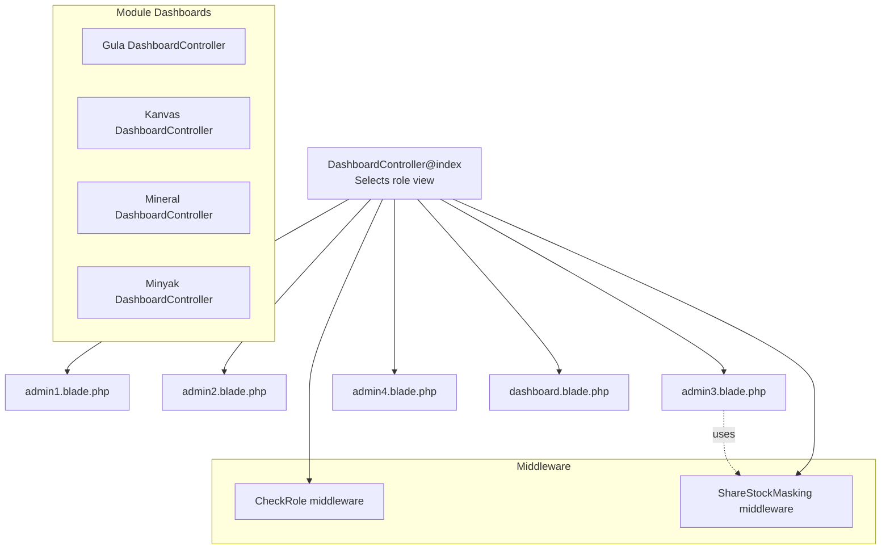
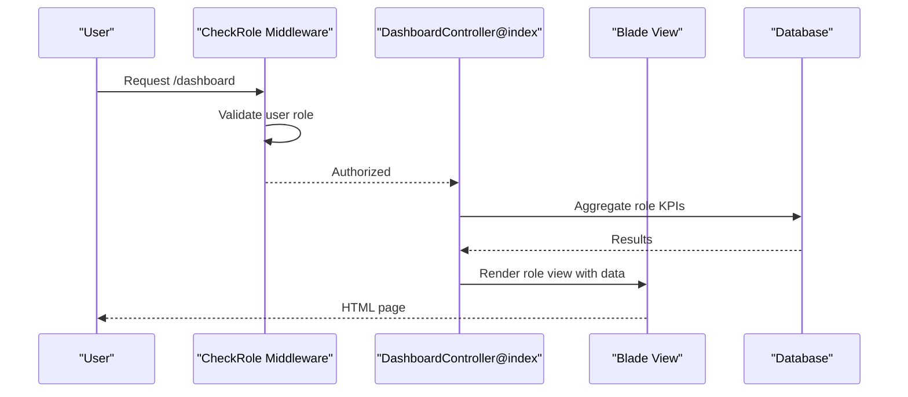
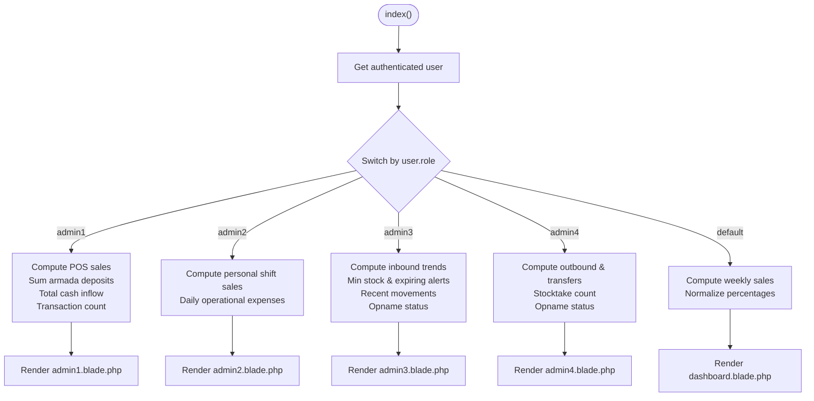
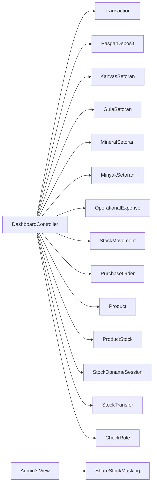

# Dashboard System

<cite>
**Referenced Files in This Document**
- [DashboardController.php](file://app/Http/Controllers/DashboardController.php)
- [admin1.blade.php](file://resources/views/dashboard/admin1.blade.php)
- [admin2.blade.php](file://resources/views/dashboard/admin2.blade.php)
- [admin3.blade.php](file://resources/views/dashboard/admin3.blade.php)
- [admin4.blade.php](file://resources/views/dashboard/admin4.blade.php)
- [dashboard.blade.php](file://resources/views/dashboard.blade.php)
- [app-layout.blade.php](file://resources/views/components/app-layout.blade.php)
- [CheckRole.php](file://app/Http/Middleware/CheckRole.php)
- [ShareStockMasking.php](file://app/Http/Middleware/ShareStockMasking.php)
- [User.php](file://app/Models/User.php)
- [Gula DashboardController.php](file://app/Http/Controllers/Gula/DashboardController.php)
- [Kanvas DashboardController.php](file://app/Http/Controllers/Kanvas/DashboardController.php)
- [Mineral DashboardController.php](file://app/Http/Controllers/Mineral/DashboardController.php)
- [Minyak DashboardController.php](file://app/Http/Controllers/Minyak/DashboardController.php)
- [swap_roles.php](file://swap_roles.php)
- [app.php](file://bootstrap/app.php)
- [web.php](file://routes/web.php)
- [api.php](file://routes/api.php)
- [RoleAbilities.php](file://app/Support/RoleAbilities.php)
</cite>

## Table of Contents
1. [Introduction](#introduction)
2. [Project Structure](#project-structure)
3. [Core Components](#core-components)
4. [Architecture Overview](#architecture-overview)
5. [Detailed Component Analysis](#detailed-component-analysis)
6. [Dependency Analysis](#dependency-analysis)
7. [Performance Considerations](#performance-considerations)
8. [Troubleshooting Guide](#troubleshooting-guide)
9. [Conclusion](#conclusion)
10. [Appendices](#appendices)

## Introduction
This document explains the unified dashboard system that serves role-specific analytics and real-time operational insights across multiple business modules. It covers:
- Unified dashboard controller routing and role-based rendering
- Admin1 (super admin), Admin2 (cashier), Admin3 (warehouse inbound), and Admin4 (warehouse outbound) dashboards
- Analytics widgets, real-time displays, and performance metrics
- Data aggregation logic, chart implementations, and KPI tracking
- Practical customization and role-based content filtering
- Integration with business modules and real-time operational status reflection

## Project Structure
The dashboard system centers around a single controller that selects the appropriate view per role, with supporting middleware for role checks and stock masking during opname sessions. Module-specific dashboards aggregate data from their respective models and present KPIs and charts.

**Diagram sources**
- [DashboardController.php:10-318](file://app/Http/Controllers/DashboardController.php#L10-L318)
- [admin1.blade.php:1-92](file://resources/views/dashboard/admin1.blade.php#L1-L92)
- [admin2.blade.php:1-58](file://resources/views/dashboard/admin2.blade.php#L1-L58)
- [admin3.blade.php:1-435](file://resources/views/dashboard/admin3.blade.php#L1-L435)
- [admin4.blade.php:1-70](file://resources/views/dashboard/admin4.blade.php#L1-L70)
- [dashboard.blade.php:1-385](file://resources/views/dashboard.blade.php#L1-L385)
- [CheckRole.php:17-72](file://app/Http/Middleware/CheckRole.php#L17-L72)
- [ShareStockMasking.php:14-42](file://app/Http/Middleware/ShareStockMasking.php#L14-L42)
- [Gula DashboardController.php:10-43](file://app/Http/Controllers/Gula/DashboardController.php#L10-L43)
- [Kanvas DashboardController.php:13-48](file://app/Http/Controllers/Kanvas/DashboardController.php#L13-L48)
- [Mineral DashboardController.php:14-26](file://app/Http/Controllers/Mineral/DashboardController.php#L14-L26)
- [Minyak DashboardController.php:19-90](file://app/Http/Controllers/Minyak/DashboardController.php#L19-L90)

**Section sources**
- [DashboardController.php:10-318](file://app/Http/Controllers/DashboardController.php#L10-L318)
- [app-layout.blade.php:349-647](file://resources/views/components/app-layout.blade.php#L349-L647)

## Core Components
- Unified Dashboard Controller: Selects role-specific view and computes KPIs/analytics for Admin1–Admin4 and generic weekly sales for others.
- Role Views: Tailored Blade templates for Admin1–Admin4 with dedicated widgets and charts.
- Middleware:
  - Role-based access enforcement for routes and views
  - Stock masking during opname sessions for Admin3/Admin4
- Module Dashboards: Per-module controllers aggregating product, vehicle, and transaction data for their domains.

Key responsibilities:
- Admin1: Daily POS sales, verified armada deposits, total cash inflow, and transaction counts
- Admin2: Personal shift sales and daily operational expenses
- Admin3: Inbound trends, min stock alerts, expiring items, recent warehouse movements, and opname status
- Admin4: Outbound counts, inter-warehouse transfers, stocktake activities, and opname status
- Generic: Weekly sales bar chart and quick actions

**Section sources**
- [DashboardController.php:10-318](file://app/Http/Controllers/DashboardController.php#L10-L318)
- [admin1.blade.php:23-50](file://resources/views/dashboard/admin1.blade.php#L23-L50)
- [admin2.blade.php:18-37](file://resources/views/dashboard/admin2.blade.php#L18-L37)
- [admin3.blade.php:46-84](file://resources/views/dashboard/admin3.blade.php#L46-L84)
- [admin4.blade.php:29-53](file://resources/views/dashboard/admin4.blade.php#L29-L53)
- [dashboard.blade.php:227-261](file://resources/views/dashboard.blade.php#L227-L261)

## Architecture Overview
The system follows a centralized controller pattern with role-based view selection and middleware-driven access control. Module dashboards integrate with the main layout and leverage shared components.

**Diagram sources**
- [DashboardController.php:10-318](file://app/Http/Controllers/DashboardController.php#L10-L318)
- [CheckRole.php:17-72](file://app/Http/Middleware/CheckRole.php#L17-L72)

**Section sources**
- [app.php:16-28](file://bootstrap/app.php#L16-L28)
- [web.php:39-59](file://routes/web.php#L39-L59)

## Detailed Component Analysis

### Unified Dashboard Controller
Responsibilities:
- Authenticate user and route to role-specific dashboard
- Compute KPIs and analytics per role
- Prepare data arrays for charts and widgets
- Redirect non-admin roles to specialized dashboards

Processing logic highlights:
- Admin1: Sum of POS sales, aggregated armada deposits, total cash inflow, and transaction counts
- Admin2: POS sales for current user’s sessions and daily operational expenses
- Admin3: Inbound trends over 14 days, min stock and expiring alerts, recent movements, and opname status
- Admin4: Outbound counts, inter-warehouse transfers, stocktakes, and opname status
- Others: Weekly sales trend with percentage normalization

**Diagram sources**
- [DashboardController.php:10-318](file://app/Http/Controllers/DashboardController.php#L10-L318)

**Section sources**
- [DashboardController.php:10-318](file://app/Http/Controllers/DashboardController.php#L10-L318)

### Admin1 Dashboard (Super Admin/Cashier Operations)
Widgets and metrics:
- Omzet POS (total sales)
- Setoran Armada (verified deposits from all armadas)
- Total Uang Masuk (sum of POS and verified deposits)
- Transaction count

Real-time display:
- Live currency formatting and quick-access shortcuts

Customization tips:
- Add module-specific shortcuts (e.g., Pasgar, Kanvas, Gula, Mineral, Minyak)
- Integrate recent transactions and void history

**Section sources**
- [admin1.blade.php:23-50](file://resources/views/dashboard/admin1.blade.php#L23-L50)
- [admin1.blade.php:52-89](file://resources/views/dashboard/admin1.blade.php#L52-L89)

### Admin2 Dashboard (Cashier/Operational)
Widgets and metrics:
- Omzet POS (shift-specific)
- Total Operational Expenses (today)

Real-time display:
- Shift-aware sales aggregation
- Daily expense totals

Customization tips:
- Link to open/close operational session
- Add quick links to POS and expense creation

**Section sources**
- [admin2.blade.php:18-37](file://resources/views/dashboard/admin2.blade.php#L18-L37)
- [admin2.blade.php:39-56](file://resources/views/dashboard/admin2.blade.php#L39-L56)

### Admin3 Dashboard (Warehouse Inbound/Master Data)
Widgets and metrics:
- Penerimaan Non-PO (today)
- PO Masuk (today)
- Alert Min. Stok
- Alert Expired (≤ 30 days)

Charts:
- 14-day inbound trend (Non-PO vs PO Receipt)
- Percentage bars normalized to max

Tables:
- Top min stock products (ordered by shortage)
- Expiring soon items

Recent activity:
- Latest warehouse movements with type badges and quantities

Opname status:
- Today’s approval/submission status with timestamp

**Section sources**
- [admin3.blade.php:46-84](file://resources/views/dashboard/admin3.blade.php#L46-L84)
- [admin3.blade.php:92-121](file://resources/views/dashboard/admin3.blade.php#L92-L121)
- [admin3.blade.php:123-201](file://resources/views/dashboard/admin3.blade.php#L123-L201)
- [admin3.blade.php:204-251](file://resources/views/dashboard/admin3.blade.php#L204-L251)

### Admin4 Dashboard (Warehouse Outbound/Distribution)
Widgets and metrics:
- Pengeluaran Gudang (today)
- Transfer Gudang (today)
- Opname Stok (today)

Opname status:
- Today’s approval/submission badge with color-coded label

Quick actions:
- Check warehouse stock
- Record manual out/in
- Initiate inter-branch transfers

**Section sources**
- [admin4.blade.php:29-53](file://resources/views/dashboard/admin4.blade.php#L29-L53)
- [admin4.blade.php:13-27](file://resources/views/dashboard/admin4.blade.php#L13-L27)
- [admin4.blade.php:55-68](file://resources/views/dashboard/admin4.blade.php#L55-L68)

### Generic Dashboard (Weekly Sales)
Widgets and metrics:
- Total products, transactions, today’s income, active customers
- Weekly sales bar chart with hover tooltips
- Quick actions and system info

**Section sources**
- [dashboard.blade.php:227-261](file://resources/views/dashboard.blade.php#L227-L261)
- [dashboard.blade.php:267-293](file://resources/views/dashboard.blade.php#L267-L293)
- [dashboard.blade.php:324-383](file://resources/views/dashboard.blade.php#L324-L383)

### Module Dashboards Integration
- Gula: Global on-hand quantities (bags/bales/loose), active vehicles, and armada count
- Kanvas: On-hand value in vehicles, verified setorans, active sales, SKUs, and target percent
- Mineral: Sold today by SKU
- Minyak: Daily sales by product, vehicle stock, and per-vehicle summaries

These dashboards complement the unified dashboard by providing domain-specific KPIs and charts.

**Section sources**
- [Gula DashboardController.php:10-43](file://app/Http/Controllers/Gula/DashboardController.php#L10-L43)
- [Kanvas DashboardController.php:13-48](file://app/Http/Controllers/Kanvas/DashboardController.php#L13-L48)
- [Mineral DashboardController.php:14-26](file://app/Http/Controllers/Mineral/DashboardController.php#L14-L26)
- [Minyak DashboardController.php:19-90](file://app/Http/Controllers/Minyak/DashboardController.php#L19-L90)

## Dependency Analysis
- Controller depends on Eloquent models for KPI computation
- Views depend on Blade components and shared styles
- Middleware enforces role-based access and stock masking
- Module dashboards depend on their domain models and relationships

**Diagram sources**
- [DashboardController.php:44-294](file://app/Http/Controllers/DashboardController.php#L44-L294)
- [ShareStockMasking.php:14-42](file://app/Http/Middleware/ShareStockMasking.php#L14-L42)
- [CheckRole.php:17-72](file://app/Http/Middleware/CheckRole.php#L17-L72)

**Section sources**
- [DashboardController.php:44-294](file://app/Http/Controllers/DashboardController.php#L44-L294)
- [ShareStockMasking.php:14-42](file://app/Http/Middleware/ShareStockMasking.php#L14-L42)
- [CheckRole.php:17-72](file://app/Http/Middleware/CheckRole.php#L17-L72)

## Performance Considerations
- Prefer indexed date filters on timestamps (e.g., created_at, approved_at) to optimize daily queries
- Use limit clauses for recent activity lists to avoid large result sets
- Cache infrequent heavy computations (e.g., expiring/expired counts) with appropriate invalidation
- Normalize percentages client-side to reduce repeated calculations
- Avoid N+1 queries by eager-loading related models (e.g., product and user on stock movements)

## Troubleshooting Guide
Common issues and resolutions:
- Unauthorized access: Middleware denies access if user role is not permitted; verify role assignment and middleware usage
- Missing data in Admin3/Admin4: Stock masking may hide values during opname sessions; check opname status and session timing
- Empty charts: Ensure date range queries and table existence checks are in place; fallback to zero values
- Role swapping: A script exists to swap Admin3/Admin4 views; review its logic and adjust filenames accordingly

**Section sources**
- [CheckRole.php:17-72](file://app/Http/Middleware/CheckRole.php#L17-L72)
- [ShareStockMasking.php:14-42](file://app/Http/Middleware/ShareStockMasking.php#L14-L42)
- [swap_roles.php:50-87](file://swap_roles.php#L50-L87)

## Conclusion
The dashboard system provides a unified, role-aware interface that aggregates real-time operational data across modules. Admin1 focuses on cash inflows and POS performance; Admin2 tracks personal shift sales and expenses; Admin3 monitors inbound trends and stock health; Admin4 oversees outbound and transfers. Middleware ensures secure access and masked visibility during opname sessions. Module dashboards enrich the ecosystem with domain-specific KPIs and charts.

## Appendices

### Role-Based Access Control
- Middleware supports pipe-separated or multiple role arguments
- Role constants and validation are defined in the User model
- Ability matrix governs granular permissions for each role

**Section sources**
- [CheckRole.php:17-72](file://app/Http/Middleware/CheckRole.php#L17-L72)
- [User.php:76-123](file://app/Models/User.php#L76-L123)
- [RoleAbilities.php:7-77](file://app/Support/RoleAbilities.php#L7-L77)

### Middleware Registration
- Role middleware registered globally for web group
- Stock masking applied to web group for warehouse visibility control

**Section sources**
- [app.php:16-28](file://bootstrap/app.php#L16-L28)

### Routes and Permissions
- Role-based route groups for settings and module dashboards
- API route protection for product management

**Section sources**
- [web.php:39-59](file://routes/web.php#L39-L59)
- [api.php:22-26](file://routes/api.php#L22-L26)