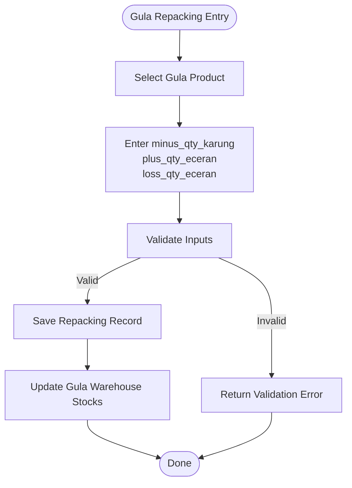
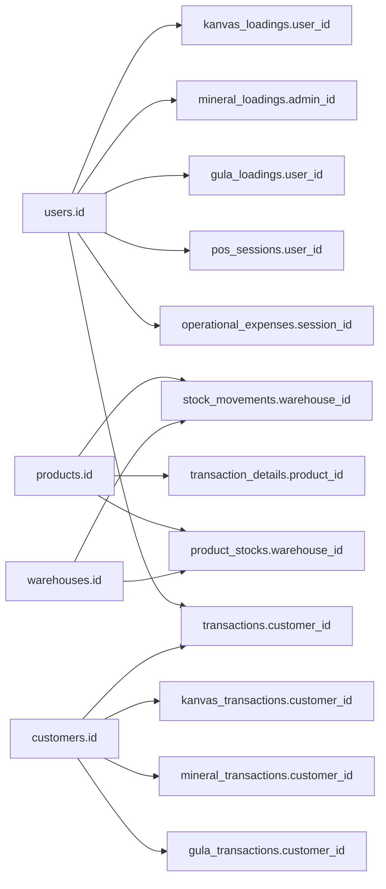

# Database Schema Design

<cite>
**Referenced Files in This Document**
- [0001_01_01_000000_create_users_table.php](file://database/migrations/0001_01_01_000000_create_users_table.php)
- [2026_02_26_162555_create_products_table.php](file://database/migrations/2026_02_26_162555_create_products_table.php)
- [2026_02_26_162605_create_transactions_table.php](file://database/migrations/2026_02_26_162605_create_transactions_table.php)
- [2026_02_26_162614_create_transaction_details_table.php](file://database/migrations/2026_02_26_162614_create_transaction_details_table.php)
- [2026_02_26_191003_create_product_stocks_table.php](file://database/migrations/2026_02_26_191003_create_product_stocks_table.php)
- [2026_02_26_191004_create_stock_movements_table.php](file://database/migrations/2026_02_26_191004_create_stock_movements_table.php)
- [2026_02_27_000001_create_units_table.php](file://database/migrations/2026_02_27_000001_create_units_table.php)
- [2026_02_27_000002_create_brands_table.php](file://database/migrations/2026_02_27_000002_create_brands_table.php)
- [2026_02_27_000003_create_suppliers_table.php](file://database/migrations/2026_02_27_000003_create_suppliers_table.php)
- [2026_02_27_080001_create_customers_table.php](file://database/migrations/2026_02_27_080001_create_customers_table.php)
- [2026_02_27_122300_create_sales_orders_table.php](file://database/migrations/2026_02_27_122300_create_sales_orders_table.php)
- [2026_02_27_122306_create_sales_order_items_table.php](file://database/migrations/2026_02_27_122306_create_sales_order_items_table.php)
- [2026_02_27_142138_create_operational_categories_table.php](file://database/migrations/2026_02_27_142138_create_operational_categories_table.php)
- [2026_02_27_142139_create_vehicles_table.php](file://database/migrations/2026_02_27_142139_create_vehicles_table.php)
- [2026_02_27_142200_create_operational_expenses_table.php](file://database/migrations/2026_02_27_142200_create_operational_expenses_table.php)
- [2026_02_28_071227_create_pos_sessions_table.php](file://database/migrations/2026_02_28_071227_create_pos_sessions_table.php)
- [2026_02_28_134845_create_stock_transfers_table.php](file://database/migrations/2026_02_28_134845_create_stock_transfers_table.php)
- [2026_02_28_134847_create_stock_transfer_items_table.php](file://database/migrations/2026_02_28_134847_create_stock_transfer_items_table.php)
- [2026_03_01_131242_create_minyak_setorans_table.php](file://database/migrations/2026_03_01_131242_create_minyak_setorans_table.php)
- [2026_03_01_132058_create_minyak_transaksis_table.php](file://database/migrations/2026_03_01_132058_create_minyak_transaksis_table.php)
- [2026_03_01_151552_create_gula_products_table.php](file://database/migrations/2026_03_01_151552_create_gula_products_table.php)
- [2026_03_01_151554_create_gula_warehouse_stocks_table.php](file://database/migrations/2026_03_01_151554_create_gula_warehouse_stocks_table.php)
- [2026_03_01_151556_create_gula_repackings_table.php](file://database/migrations/2026_03_01_151556_create_gula_repackings_table.php)
- [2026_03_01_151557_create_gula_loadings_table.php](file://database/migrations/2026_03_01_151557_create_gula_loadings_table.php)
- [2026_03_01_151604_create_gula_transactions_table.php](file://database/migrations/2026_03_01_151604_create_gula_transactions_table.php)
- [2026_03_01_151609_create_gula_setorans_table.php](file://database/migrations/2026_03_01_151609_create_gula_setorans_table.php)
- [2026_03_01_170242_create_mineral_products_table.php](file://database/migrations/2026_03_01_170242_create_mineral_products_table.php)
- [2026_03_01_170243_create_mineral_warehouse_stocks_table.php](file://database/migrations/2026_03_01_170243_create_mineral_warehouse_stocks_table.php)
- [2026_03_01_170246_create_mineral_loadings_table.php](file://database/migrations/2026_03_01_170246_create_mineral_loadings_table.php)
- [2026_03_01_170252_create_mineral_transactions_table.php](file://database/migrations/2026_03_01_170252_create_mineral_transactions_table.php)
- [2026_03_01_170255_create_mineral_setorans_table.php](file://database/migrations/2026_03_01_170255_create_mineral_setorans_table.php)
- [2026_03_01_180636_create_kanvas_products_table.php](file://database/migrations/2026_03_01_180636_create_kanvas_products_table.php)
- [2026_03_01_180638_create_kanvas_warehouse_stocks_table.php](file://database/migrations/2026_03_01_180638_create_kanvas_warehouse_stocks_table.php)
- [2026_03_01_180641_create_kanvas_routes_table.php](file://database/migrations/2026_03_01_180641_create_kanvas_routes_table.php)
- [2026_03_01_180642_create_kanvas_route_stores_table.php](file://database/migrations/2026_03_01_180642_create_kanvas_route_stores_table.php)
- [2026_03_01_180644_create_kanvas_loadings_table.php](file://database/migrations/2026_03_01_180644_create_kanvas_loadings_table.php)
- [2026_03_01_180646_create_kanvas_loading_items_table.php](file://database/migrations/2026_03_01_180646_create_kanvas_loading_items_table.php)
- [2026_03_01_180648_create_kanvas_transactions_table.php](file://database/migrations/2026_03_01_180648_create_kanvas_transactions_table.php)
- [2026_03_01_180650_create_kanvas_transaction_items_table.php](file://database/migrations/2026_03_01_180650_create_kanvas_transaction_items_table.php)
- [2026_03_01_180651_create_kanvas_setorans_table.php](file://database/migrations/2026_03_01_180651_create_kanvas_setorans_table.php)
- [2026_02_28_131117_add_session_id_to_operational_expenses_table.php](file://database/migrations/2026_02_28_131117_add_session_id_to_operational_expenses_table.php)
- [2026_02_28_134834_add_warehouse_id_to_vehicles_table.php](file://database/migrations/2026_02_28_134834_add_warehouse_id_to_vehicles_table.php)
- [2026_02_28_134845_add_source_type_to_stock_movements.php](file://database/migrations/2026_02_28_134845_add_source_type_to_stock_movements.php)
- [2026_02_28_185411_add_performance_indexes_to_tables.php](file://database/migrations/2026_02_28_185411_add_performance_indexes_to_tables.php)
- [2026_03_08_005450_add_unit_fields_to_transaction_details_table.php](file://database/migrations/2026_03_08_005450_add_unit_fields_to_transaction_details_table.php)
- [2026_03_08_012032_remove_brand_id_from_products_table.php](file://database/migrations/2026_03_08_012032_remove_brand_id_from_products_table.php)
- [2026_03_08_022151_add_fingerprint_id_to_users_table.php](file://database/migrations/2026_03_08_022151_add_fingerprint_id_to_users_table.php)
- [2026_03_08_224634_add_salary_fields_to_sdm_employees_table.php](file://database/migrations/2026_03_08_224634_add_salary_fields_to_sdm_employees_table.php)
- [2026_03_08_224638_create_sdm_deductions_table.php](file://database/migrations/2026_03_08_224638_create_sdm_deductions_table.php)
- [2026_03_08_224647_create_sdm_payrolls_table.php](file://database/migrations/2026_03_08_224647_create_sdm_payrolls_table.php)
- [2026_03_09_120000_add_payment_term_to_purchase_orders.php](file://database/migrations/2026_03_09_120000_add_payment_term_to_purchase_orders.php)
- [2026_03_09_130000_add_due_date_to_purchase_orders.php](file://database/migrations/2026_03_09_130000_add_due_date_to_purchase_orders.php)
- [2026_03_11_000001_add_lock_fields_to_sdm_payrolls_table.php](file://database/migrations/2026_03_11_000001_add_lock_fields_to_sdm_payrolls_table.php)
- [2026_03_11_000002_add_unique_user_id_to_sdm_employees_table.php](file://database/migrations/2026_03_11_000002_add_unique_user_id_to_sdm_employees_table.php)
- [2026_03_11_000003_add_sdm_policy_fields_to_store_settings_table.php](file://database/migrations/2026_03_11_000003_add_sdm_policy_fields_to_store_settings_table.php)
- [2026_03_11_000004_create_sdm_leave_requests_table.php](file://database/migrations/2026_03_11_000004_create_sdm_leave_requests_table.php)
- [2026_03_11_000005_add_minutes_fields_to_attendances_table.php](file://database/migrations/2026_03_11_000005_add_minutes_fields_to_attendances_table.php)
- [2026_03_11_000006_add_payroll_components_to_sdm_payrolls_table.php](file://database/migrations/2026_03_11_000006_add_payroll_components_to_sdm_payrolls_table.php)
- [2026_03_11_000007_create_sdm_holidays_table.php](file://database/migrations/2026_03_11_000007_create_sdm_holidays_table.php)
- [2026_03_11_000008_add_sdm_calendar_mode_to_store_settings_table.php](file://database/migrations/2026_03_11_000008_add_sdm_calendar_mode_to_store_settings_table.php)
- [2026_03_12_100000_add_warehouse_id_to_purchase_returns_table.php](file://database/migrations/2026_03_12_100000_add_warehouse_id_to_purchase_returns_table.php)
- [2026_03_12_100000_add_warehouse_id_to_transaction_details_table.php](file://database/migrations/2026_03_12_100000_add_warehouse_id_to_transaction_details_table.php)
- [2026_03_12_110000_add_cash_count_fields_to_pos_sessions_table.php](file://database/migrations/2026_03_12_110000_add_cash_count_fields_to_pos_sessions_table.php)
- [2026_03_12_110100_create_pos_cash_movements_table.php](file://database/migrations/2026_03_12_110100_create_pos_cash_movements_table.php)
- [2026_03_12_130000_add_registration_approval_fields_to_users_table.php](file://database/migrations/2026_03_12_130000_add_registration_approval_fields_to_users_table.php)
- [2026_03_12_150000_create_app_roles_table.php](file://database/migrations/2026_03_12_150000_create_app_roles_table.php)
- [2026_03_13_000001_create_purchase_order_shortage_reports_table.php](file://database/migrations/2026_03_13_000001_create_purchase_order_shortage_reports_table.php)
- [2026_03_13_120000_add_nik_and_profile_photo_to_users_table.php](file://database/migrations/2026_03_13_120000_add_nik_and_profile_photo_to_users_table.php)
- [2026_03_13_130000_add_selfie_paths_to_attendances_table.php](file://database/migrations/2026_03_13_130000_add_selfie_paths_to_attendances_table.php)
- [2026_03_13_140000_add_sdm_work_end_time_to_store_settings_table.php](file://database/migrations/2026_03_13_140000_add_sdm_work_end_time_to_store_settings_table.php)
- [2026_03_13_160000_add_override_fields_to_sdm_payrolls_table.php](file://database/migrations/2026_03_13_160000_add_override_fields_to_sdm_payrolls_table.php)
- [2026_03_13_180000_convert_money_integer_columns_to_decimal.php](file://database/migrations/2026_03_13_180000_convert_money_integer_columns_to_decimal.php)
- [2026_03_13_181000_convert_kanvas_setorans_money_to_decimal.php](file://database/migrations/2026_03_13_181000_convert_kanvas_setorans_money_to_decimal.php)
- [2026_03_14_025417_create_sdm_bonuses_table.php](file://database/migrations/2026_03_14_025417_create_sdm_bonuses_table.php)
- [2026_03_14_105302_create_product_requests_table.php](file://database/migrations/2026_03_14_105302_create_product_requests_table.php)
- [2026_03_14_115609_add_status_to_stock_movements_table.php](file://database/migrations/2026_03_14_115609_add_status_to_stock_movements_table.php)
- [2026_03_14_160000_add_warehouse_fields_to_product_requests_table.php](file://database/migrations/2026_03_14_160000_add_warehouse_fields_to_product_requests_table.php)
- [2026_03_14_170000_create_stock_opname_sessions_table.php](file://database/migrations/2026_03_14_170000_create_stock_opname_sessions_table.php)
- [2026_03_14_170100_create_stock_opname_items_table.php](file://database/migrations/2026_03_14_170100_create_stock_opname_items_table.php)
- [2026_03_14_180000_create_transfer_receipts_table.php](file://database/migrations/2026_03_14_180000_create_transfer_receipts_table.php)
- [2026_03_14_180100_create_transfer_receipt_items_table.php](file://database/migrations/2026_03_14_180100_create_transfer_receipt_items_table.php)
- [2026_03_14_190000_create_purchase_order_receipts_table.php](file://database/migrations/2026_03_14_190000_create_purchase_order_receipts_table.php)
- [2026_03_14_190100_create_purchase_order_receipt_items_table.php](file://database/migrations/2026_03_14_190100_create_purchase_order_receipt_items_table.php)
- [2026_03_14_200000_add_followup_fields_to_purchase_order_receipts_table.php](file://database/migrations/2026_03_14_200000_add_followup_fields_to_purchase_order_receipts_table.php)
- [2026_03_14_201000_add_purchase_return_id_to_purchase_order_receipts_table.php](file://database/migrations/2026_03_14_201000_add_purchase_return_id_to_purchase_order_receipts_table.php)
- [2026_03_14_202000_add_reorder_purchase_order_id_to_purchase_order_receipts_table.php](file://database/migrations/2026_03_14_202000_add_reorder_purchase_order_id_to_purchase_order_receipts_table.php)
- [2026_03_14_210000_add_indexes_for_hr_payroll_performance.php](file://database/migrations/2026_03_14_210000_add_indexes_for_hr_payroll_performance.php)
- [2026_03_08_022151_create_attendances_table.php](file://database/migrations/2026_03_08_022151_create_attendances_table.php)
- [2026_03_08_224638_create_sdm_deductions_table.php](file://database/migrations/2026_03_08_224638_create_sdm_deductions_table.php)
- [2026_03_08_224647_create_sdm_payrolls_table.php](file://database/migrations/2026_03_08_224647_create_sdm_payrolls_table.php)
- [2026_03_11_000001_add_lock_fields_to_sdm_payrolls_table.php](file://database/migrations/2026_03_11_000001_add_lock_fields_to_sdm_payrolls_table.php)
- [2026_03_11_000006_add_payroll_components_to_sdm_payrolls_table.php](file://database/migrations/2026_03_11_000006_add_payroll_components_to_sdm_payrolls_table.php)
- [2026_03_13_160000_add_override_fields_to_sdm_payrolls_table.php](file://database/migrations/2026_03_13_160000_add_override_fields_to_sdm_payrolls_table.php)
- [2026_03_14_025417_create_sdm_bonuses_table.php](file://database/migrations/2026_03_14_025417_create_sdm_bonuses_table.php)
- [2026_03_14_105302_create_product_requests_table.php](file://database/migrations/2026_03_14_105302_create_product_requests_table.php)
- [2026_03_14_115609_add_status_to_stock_movements_table.php](file://database/migrations/2026_03_14_115609_add_status_to_stock_movements_table.php)
- [2026_03_14_160000_add_warehouse_fields_to_product_requests_table.php](file://database/migrations/2026_03_14_160000_add_warehouse_fields_to_product_requests_table.php)
- [2026_03_14_170000_create_stock_opname_sessions_table.php](file://database/migrations/2026_03_14_170000_create_stock_opname_sessions_table.php)
- [2026_03_14_170100_create_stock_opname_items_table.php](file://database/migrations/2026_03_14_170100_create_stock_opname_items_table.php)
- [2026_03_14_180000_create_transfer_receipts_table.php](file://database/migrations/2026_03_14_180000_create_transfer_receipts_table.php)
- [2026_03_14_180100_create_transfer_receipt_items_table.php](file://database/migrations/2026_03_14_180100_create_transfer_receipt_items_table.php)
- [2026_03_14_190000_create_purchase_order_receipts_table.php](file://database/migrations/2026_03_14_190000_create_purchase_order_receipts_table.php)
- [2026_03_14_190100_create_purchase_order_receipt_items_table.php](file://database/migrations/2026_03_14_190100_create_purchase_order_receipt_items_table.php)
- [2026_03_14_200000_add_followup_fields_to_purchase_order_receipts_table.php](file://database/migrations/2026_03_14_200000_add_followup_fields_to_purchase_order_receipts_table.php)
- [2026_03_14_201000_add_purchase_return_id_to_purchase_order_receipts_table.php](file://database/migrations/2026_03_14_201000_add_purchase_return_id_to_purchase_order_receipts_table.php)
- [2026_03_14_202000_add_reorder_purchase_order_id_to_purchase_order_receipts_table.php](file://database/migrations/2026_03_14_202000_add_reorder_purchase_order_id_to_purchase_order_receipts_table.php)
- [2026_03_14_210000_add_indexes_for_hr_payroll_performance.php](file://database/migrations/2026_03_14_210000_add_indexes_for_hr_payroll_performance.php)
</cite>

## Table of Contents
1. [Introduction](#introduction)
2. [Project Structure](#project-structure)
3. [Core Components](#core-components)
4. [Architecture Overview](#architecture-overview)
5. [Detailed Component Analysis](#detailed-component-analysis)
6. [Dependency Analysis](#dependency-analysis)
7. [Performance Considerations](#performance-considerations)
8. [Troubleshooting Guide](#troubleshooting-guide)
9. [Conclusion](#conclusion)
10. [Appendices](#appendices)

## Introduction
This document describes the DODPOS database schema with emphasis on entity relationships, business logic, and operational domains. It covers foundational tables (users, products, inventory, transactions) and business-unit-specific tables for Gula, Mineral, Kanvas, and Minyak. It also documents migration-driven schema evolution, indexing strategies, and practical guidance for data lifecycle and scalability.

## Project Structure
The schema is primarily defined via Laravel migrations under database/migrations. Business logic is enforced through foreign keys, enums, defaults, and application-layer validations. The database supports:
- General retail/POS operations (transactions, customers, suppliers)
- Inventory tracking (stock movements, stock transfers, stock opname)
- Operational expenses and POS sessions
- Domain-specific modules (Gula, Mineral, Kanvas, Minyak)

```mermaid
graph TB
subgraph "Core Entities"
users["users"]
categories["categories"]
units["units"]
brands["brands"]
suppliers["suppliers"]
customers["customers"]
products["products"]
warehouses["warehouses"]
locations["locations"]
end
subgraph "Transactions"
transactions["transactions"]
transaction_details["transaction_details"]
sales_orders["sales_orders"]
sales_order_items["sales_order_items"]
end
subgraph "Inventory"
product_stocks["product_stocks"]
stock_movements["stock_movements"]
stock_transfers["stock_transfers"]
stock_transfer_items["stock_transfer_items"]
stock_opname_sessions["stock_opname_sessions"]
stock_opname_items["stock_opname_items"]
end
subgraph "Operational"
vehicles["vehicles"]
operational_categories["operational_categories"]
operational_expenses["operational_expenses"]
pos_sessions["pos_sessions"]
pos_cash_movements["pos_cash_movements"]
end
subgraph "Domain: Gula"
gula_products["gula_products"]
gula_warehouse_stocks["gula_warehouse_stocks"]
gula_repackings["gula_repackings"]
gula_loadings["gula_loadings"]
gula_transactions["gula_transactions"]
gula_setorans["gula_setorans"]
end
subgraph "Domain: Mineral"
mineral_products["mineral_products"]
mineral_warehouse_stocks["mineral_warehouse_stocks"]
mineral_loadings["mineral_loadings"]
mineral_transactions["mineral_transactions"]
mineral_setorans["mineral_setorans"]
end
subgraph "Domain: Kanvas"
kanvas_products["kanvas_products"]
kanvas_warehouse_stocks["kanvas_warehouse_stocks"]
kanvas_routes["kanvas_routes"]
kanvas_route_stores["kanvas_route_stores"]
kanvas_loadings["kanvas_loadings"]
kanvas_loading_items["kanvas_loading_items"]
kanvas_transactions["kanvas_transactions"]
kanvas_transaction_items["kanvas_transaction_items"]
kanvas_setorans["kanvas_setorans"]
end
subgraph "Domain: Minyak"
minyak_transactions["minyak_transaksis"]
minyak_setorans["minyak_setorans"]
end
users --> transactions
users --> operational_expenses
users --> pos_sessions
users --> gula_loadings
users --> mineral_loadings
users --> kanvas_loadings
users --> gula_setorans
users --> mineral_setorans
users --> kanvas_setorans
categories --> products
units --> products
brands --> products
suppliers --> products
customers --> transactions
customers --> gula_transactions
customers --> mineral_transactions
customers --> kanvas_transactions
products --> product_stocks
warehouses --> product_stocks
locations --> product_stocks
products --> stock_movements
warehouses --> stock_movements
locations --> stock_movements
transactions --> transaction_details
products --> transaction_details
sales_orders --> sales_order_items
sales_order_items --> products
stock_transfers --> stock_transfer_items
stock_transfer_items --> products
vehicles --> gula_loadings
vehicles --> mineral_loadings
vehicles --> kanvas_loadings
gula_products --> gula_warehouse_stocks
gula_products --> gula_repackings
gula_products --> gula_transactions
gula_products --> gula_setorans
mineral_products --> mineral_warehouse_stocks
mineral_products --> mineral_transactions
mineral_products --> mineral_setorans
kanvas_products --> kanvas_warehouse_stocks
kanvas_products --> kanvas_routes
kanvas_routes --> kanvas_route_stores
kanvas_products --> kanvas_loadings
kanvas_products --> kanvas_transactions
kanvas_products --> kanvas_setorans
customers --> minyak_transactions
users --> minyak_setorans
```



**Diagram sources**
- [0001_01_01_000000_create_users_table.php](file://database/migrations/0001_01_01_000000_create_users_table.php)
- [2026_02_26_162555_create_products_table.php](file://database/migrations/2026_02_26_162555_create_products_table.php)
- [2026_02_26_162605_create_transactions_table.php](file://database/migrations/2026_02_26_162605_create_transactions_table.php)
- [2026_02_26_162614_create_transaction_details_table.php](file://database/migrations/2026_02_26_162614_create_transaction_details_table.php)
- [2026_02_26_191003_create_product_stocks_table.php](file://database/migrations/2026_02_26_191003_create_product_stocks_table.php)
- [2026_02_26_191004_create_stock_movements_table.php](file://database/migrations/2026_02_26_191004_create_stock_movements_table.php)
- [2026_02_28_134845_create_stock_transfers_table.php](file://database/migrations/2026_02_28_134845_create_stock_transfers_table.php)
- [2026_02_28_134847_create_stock_transfer_items_table.php](file://database/migrations/2026_02_28_134847_create_stock_transfer_items_table.php)
- [2026_03_01_151552_create_gula_products_table.php](file://database/migrations/2026_03_01_151552_create_gula_products_table.php)
- [2026_03_01_151554_create_gula_warehouse_stocks_table.php](file://database/migrations/2026_03_01_151554_create_gula_warehouse_stocks_table.php)
- [2026_03_01_151556_create_gula_repackings_table.php](file://database/migrations/2026_03_01_151556_create_gula_repackings_table.php)
- [2026_03_01_151557_create_gula_loadings_table.php](file://database/migrations/2026_03_01_151557_create_gula_loadings_table.php)
- [2026_03_01_151604_create_gula_transactions_table.php](file://database/migrations/2026_03_01_151604_create_gula_transactions_table.php)
- [2026_03_01_151609_create_gula_setorans_table.php](file://database/migrations/2026_03_01_151609_create_gula_setorans_table.php)
- [2026_03_01_170242_create_mineral_products_table.php](file://database/migrations/2026_03_01_170242_create_mineral_products_table.php)
- [2026_03_01_170243_create_mineral_warehouse_stocks_table.php](file://database/migrations/2026_03_01_170243_create_mineral_warehouse_stocks_table.php)
- [2026_03_01_170246_create_mineral_loadings_table.php](file://database/migrations/2026_03_01_170246_create_mineral_loadings_table.php)
- [2026_03_01_170252_create_mineral_transactions_table.php](file://database/migrations/2026_03_01_170252_create_mineral_transactions_table.php)
- [2026_03_01_170255_create_mineral_setorans_table.php](file://database/migrations/2026_03_01_170255_create_mineral_setorans_table.php)
- [2026_03_01_180636_create_kanvas_products_table.php](file://database/migrations/2026_03_01_180636_create_kanvas_products_table.php)
- [2026_03_01_180638_create_kanvas_warehouse_stocks_table.php](file://database/migrations/2026_03_01_180638_create_kanvas_warehouse_stocks_table.php)
- [2026_03_01_180641_create_kanvas_routes_table.php](file://database/migrations/2026_03_01_180641_create_kanvas_routes_table.php)
- [2026_03_01_180642_create_kanvas_route_stores_table.php](file://database/migrations/2026_03_01_180642_create_kanvas_route_stores_table.php)
- [2026_03_01_180644_create_kanvas_loadings_table.php](file://database/migrations/2026_03_01_180644_create_kanvas_loadings_table.php)
- [2026_03_01_180646_create_kanvas_loading_items_table.php](file://database/migrations/2026_03_01_180646_create_kanvas_loading_items_table.php)
- [2026_03_01_180648_create_kanvas_transactions_table.php](file://database/migrations/2026_03_01_180648_create_kanvas_transactions_table.php)
- [2026_03_01_180650_create_kanvas_transaction_items_table.php](file://database/migrations/2026_03_01_180650_create_kanvas_transaction_items_table.php)
- [2026_03_01_180651_create_kanvas_setorans_table.php](file://database/migrations/2026_03_01_180651_create_kanvas_setorans_table.php)
- [2026_03_01_131242_create_minyak_setorans_table.php](file://database/migrations/2026_03_01_131242_create_minyak_setorans_table.php)
- [2026_03_01_132058_create_minyak_transaksis_table.php](file://database/migrations/2026_03_01_132058_create_minyak_transaksis_table.php)

**Section sources**
- [0001_01_01_000000_create_users_table.php](file://database/migrations/0001_01_01_000000_create_users_table.php)
- [2026_02_26_162555_create_products_table.php](file://database/migrations/2026_02_26_162555_create_products_table.php)
- [2026_02_26_162605_create_transactions_table.php](file://database/migrations/2026_02_26_162605_create_transactions_table.php)
- [2026_02_26_162614_create_transaction_details_table.php](file://database/migrations/2026_02_26_162614_create_transaction_details_table.php)
- [2026_02_26_191003_create_product_stocks_table.php](file://database/migrations/2026_02_26_191003_create_product_stocks_table.php)
- [2026_02_26_191004_create_stock_movements_table.php](file://database/migrations/2026_02_26_191004_create_stock_movements_table.php)
- [2026_02_28_134845_create_stock_transfers_table.php](file://database/migrations/2026_02_28_134845_create_stock_transfers_table.php)
- [2026_02_28_134847_create_stock_transfer_items_table.php](file://database/migrations/2026_02_28_134847_create_stock_transfer_items_table.php)
- [2026_03_01_151552_create_gula_products_table.php](file://database/migrations/2026_03_01_151552_create_gula_products_table.php)
- [2026_03_01_151554_create_gula_warehouse_stocks_table.php](file://database/migrations/2026_03_01_151554_create_gula_warehouse_stocks_table.php)
- [2026_03_01_151556_create_gula_repackings_table.php](file://database/migrations/2026_03_01_151556_create_gula_repackings_table.php)
- [2026_03_01_151557_create_gula_loadings_table.php](file://database/migrations/2026_03_01_151557_create_gula_loadings_table.php)
- [2026_03_01_151604_create_gula_transactions_table.php](file://database/migrations/2026_03_01_151604_create_gula_transactions_table.php)
- [2026_03_01_151609_create_gula_setorans_table.php](file://database/migrations/2026_03_01_151609_create_gula_setorans_table.php)
- [2026_03_01_170242_create_mineral_products_table.php](file://database/migrations/2026_03_01_170242_create_mineral_products_table.php)
- [2026_03_01_170243_create_mineral_warehouse_stocks_table.php](file://database/migrations/2026_03_01_170243_create_mineral_warehouse_stocks_table.php)
- [2026_03_01_170246_create_mineral_loadings_table.php](file://database/migrations/2026_03_01_170246_create_mineral_loadings_table.php)
- [2026_03_01_170252_create_mineral_transactions_table.php](file://database/migrations/2026_03_01_170252_create_mineral_transactions_table.php)
- [2026_03_01_170255_create_mineral_setorans_table.php](file://database/migrations/2026_03_01_170255_create_mineral_setorans_table.php)
- [2026_03_01_180636_create_kanvas_products_table.php](file://database/migrations/2026_03_01_180636_create_kanvas_products_table.php)
- [2026_03_01_180638_create_kanvas_warehouse_stocks_table.php](file://database/migrations/2026_03_01_180638_create_kanvas_warehouse_stocks_table.php)
- [2026_03_01_180641_create_kanvas_routes_table.php](file://database/migrations/2026_03_01_180641_create_kanvas_routes_table.php)
- [2026_03_01_180642_create_kanvas_route_stores_table.php](file://database/migrations/2026_03_01_180642_create_kanvas_route_stores_table.php)
- [2026_03_01_180644_create_kanvas_loadings_table.php](file://database/migrations/2026_03_01_180644_create_kanvas_loadings_table.php)
- [2026_03_01_180646_create_kanvas_loading_items_table.php](file://database/migrations/2026_03_01_180646_create_kanvas_loading_items_table.php)
- [2026_03_01_180648_create_kanvas_transactions_table.php](file://database/migrations/2026_03_01_180648_create_kanvas_transactions_table.php)
- [2026_03_01_180650_create_kanvas_transaction_items_table.php](file://database/migrations/2026_03_01_180650_create_kanvas_transaction_items_table.php)
- [2026_03_01_180651_create_kanvas_setorans_table.php](file://database/migrations/2026_03_01_180651_create_kanvas_setorans_table.php)
- [2026_03_01_131242_create_minyak_setorans_table.php](file://database/migrations/2026_03_01_131242_create_minyak_setorans_table.php)
- [2026_03_01_132058_create_minyak_transaksis_table.php](file://database/migrations/2026_03_01_132058_create_minyak_transaksis_table.php)

## Core Components
This section documents the foundational entities and their relationships.

- Users
  - Purpose: Authentication and authorization for operators, salespeople, and administrators.
  - Key fields: id, name, email (unique), password, timestamps.
  - Related tables: transactions, operational_expenses, pos_sessions, loading tables, setoran tables.

- Products
  - Purpose: Base product catalog with pricing and SKU.
  - Key fields: id, category_id (FK), name, description, price, stock, sku (unique), image, timestamps.
  - Related tables: product_stocks, stock_movements, transaction_details, sales orders.

- Transactions and Transaction Details
  - Transactions: Header-level sale record with totals, payments, and status.
  - Transaction Details: Line items linking products to transactions with quantities and amounts.

- Inventory and Stock
  - Product Stocks: Per-product, per-warehouse, per-location stock with optional batch/expiry.
  - Stock Movements: In/out/transfer/adjustment records with balance tracking.
  - Stock Transfers: Transfer requests and items with warehouse source/destination.
  - Stock Opname: Sessions and items for cycle counting.

- Master Data
  - Categories, Units, Brands, Suppliers, Customers, Vehicles, Warehouses, Locations.

- Operational and POS
  - Vehicles, Operational Categories, Operational Expenses, POS Sessions, POS Cash Movements.

**Section sources**
- [0001_01_01_000000_create_users_table.php](file://database/migrations/0001_01_01_000000_create_users_table.php)
- [2026_02_26_162555_create_products_table.php](file://database/migrations/2026_02_26_162555_create_products_table.php)
- [2026_02_26_162605_create_transactions_table.php](file://database/migrations/2026_02_26_162605_create_transactions_table.php)
- [2026_02_26_162614_create_transaction_details_table.php](file://database/migrations/2026_02_26_162614_create_transaction_details_table.php)
- [2026_02_26_191003_create_product_stocks_table.php](file://database/migrations/2026_02_26_191003_create_product_stocks_table.php)
- [2026_02_26_191004_create_stock_movements_table.php](file://database/migrations/2026_02_26_191004_create_stock_movements_table.php)
- [2026_02_28_134845_create_stock_transfers_table.php](file://database/migrations/2026_02_28_134845_create_stock_transfers_table.php)
- [2026_02_28_134847_create_stock_transfer_items_table.php](file://database/migrations/2026_02_28_134847_create_stock_transfer_items_table.php)
- [2026_03_14_170000_create_stock_opname_sessions_table.php](file://database/migrations/2026_03_14_170000_create_stock_opname_sessions_table.php)
- [2026_03_14_170100_create_stock_opname_items_table.php](file://database/migrations/2026_03_14_170100_create_stock_opname_items_table.php)

## Architecture Overview
The schema follows a normalized relational design with explicit foreign keys and enums to encode business rules. Domain-specific modules extend the core with specialized entities while maintaining shared inventory and transaction semantics.

```mermaid
erDiagram
USERS {
bigint id PK
string name
string email UK
timestamp email_verified_at
string password
remember_token
timestamps
}
PRODUCTS {
bigint id PK
bigint category_id FK
string name
text description
decimal price
integer stock
string sku UK
string image
timestamps
}
CATEGORIES {
bigint id PK
string name
timestamps
}
UNITS {
bigint id PK
string name
timestamps
}
BRANDS {
bigint id PK
string name
timestamps
}
SUPPLIERS {
bigint id PK
string name
timestamps
}
CUSTOMERS {
bigint id PK
string name
timestamps
}
WAREHOUSES {
bigint id PK
string name
timestamps
}
LOCATIONS {
bigint id PK
string name
timestamps
}
TRANSACTIONS {
bigint id PK
bigint user_id FK
decimal total_amount
decimal paid_amount
decimal change_amount
string payment_method
string status
timestamps
}
TRANSACTION_DETAILS {
bigint id PK
bigint transaction_id FK
bigint product_id FK
integer quantity
decimal price
decimal subtotal
timestamps
}
PRODUCT_STOCKS {
bigint id PK
bigint product_id FK
bigint warehouse_id FK
bigint location_id FK
string batch_number
date expired_date
integer stock
timestamps
}
STOCK_MOVEMENTS {
bigint id PK
bigint product_id FK
bigint warehouse_id FK
bigint location_id FK
enum type
string reference_number
string batch_number
date expired_date
integer quantity
integer balance
text notes
bigint user_id FK
timestamps
}
STOCK_TRANSFERS {
bigint id PK
timestamps
}
STOCK_TRANSFER_ITEMS {
bigint id PK
bigint transfer_id FK
bigint product_id FK
integer quantity
timestamps
}
STOCK_OPNAME_SESSIONS {
bigint id PK
timestamps
}
STOCK_OPNAME_ITEMS {
bigint id PK
bigint session_id FK
bigint product_id FK
integer counted_quantity
timestamps
}
VEHICLES {
bigint id PK
bigint warehouse_id FK
string plate_number
timestamps
}
OPERATIONAL_CATEGORIES {
bigint id PK
string name
timestamps
}
OPERATIONAL_EXPENSES {
bigint id PK
bigint category_id FK
bigint session_id FK
decimal amount
text notes
timestamps
}
POS_SESSIONS {
bigint id PK
bigint user_id FK
string cashier_name
decimal opening_cash
decimal cash_sales
decimal card_sales
decimal other_payments
decimal closing_cash
timestamps
}
POS_CASH_MOVEMENTS {
bigint id PK
bigint session_id FK
enum type
decimal amount
text notes
timestamps
}
GULA_PRODUCTS {
bigint id PK
string name
enum type
decimal base_price
decimal price_karungan
decimal price_bal
decimal price_eceran
integer qty_per_karung
integer qty_per_bal
boolean is_active
timestamps
}
GULA_WAREHOUSE_STOCKS {
bigint id PK
bigint gula_product_id FK
decimal qty_karung
decimal qty_bal
decimal qty_eceran
timestamps
}
GULA_REPACKINGS {
bigint id PK
bigint gula_product_id FK
bigint user_id FK
date date
decimal minus_qty_karung
decimal plus_qty_eceran
decimal loss_qty_eceran
text notes
timestamps
}
GULA_LOADINGS {
bigint id PK
string loading_number
date date
bigint user_id FK
bigint sales_id FK
bigint vehicle_id FK
enum status
text notes
timestamps
}
GULA_TRANSACTIONS {
bigint id PK
string invoice_number
date date
bigint sales_id FK
bigint customer_id FK
decimal subtotal
decimal discount
decimal total
enum payment_method
date due_date
decimal paid_amount
enum payment_status
text notes
timestamps
}
GULA_SETORANS {
bigint id PK
date date
bigint sales_id FK
decimal total_cash
decimal total_piutang
text notes
enum status
bigint verified_by FK
timestamps
}
MINERAL_PRODUCTS {
bigint id PK
string name
decimal price_cash
decimal price_tempo
boolean is_active
timestamps
}
MINERAL_WAREHOUSE_STOCKS {
bigint id PK
bigint product_id FK
integer qty_dus
timestamps
}
MINERAL_LOADINGS {
bigint id PK
bigint admin_id FK
bigint sales_id FK
date date
enum status
timestamps
}
MINERAL_TRANSACTIONS {
bigint id PK
bigint sales_id FK
bigint customer_id FK
string receipt_number
enum payment_method
date due_date
decimal total_amount
enum status
text notes
timestamps
}
MINERAL_SETORANS {
bigint id PK
bigint sales_id FK
date date
decimal total_cash_expected
decimal actual_cash
decimal total_piutang_expected
enum status
bigint verified_by FK
text notes
timestamps
}
KANVAS_PRODUCTS {
bigint id PK
string name
string barcode
string unit
decimal price_cash
decimal price_tempo
integer qty_per_carton
enum status
timestamps
}
KANVAS_WAREHOUSE_STOCKS {
bigint id PK
bigint product_id FK
integer qty_dus
timestamps
}
KANVAS_ROUTES {
bigint id PK
timestamps
}
KANVAS_ROUTE_STORES {
bigint id PK
bigint route_id FK
bigint customer_id FK
timestamps
}
KANVAS_LOADINGS {
bigint id PK
bigint user_id FK
bigint driver_id FK
date date
timestamps
}
KANVAS_LOADING_ITEMS {
bigint id PK
bigint loading_id FK
bigint product_id FK
integer quantity
timestamps
}
KANVAS_TRANSACTIONS {
bigint id PK
bigint sales_id FK
bigint customer_id FK
string receipt_number
enum payment_method
date due_date
decimal total_amount
enum status
text notes
timestamps
}
KANVAS_TRANSACTION_ITEMS {
bigint id PK
bigint transaction_id FK
bigint product_id FK
integer quantity
decimal price
decimal subtotal
timestamps
}
KANVAS_SETORANS {
bigint id PK
bigint sales_id FK
date date
decimal total_cash_expected
decimal actual_cash
decimal total_piutang_expected
enum status
bigint verified_by FK
text notes
timestamps
}
MINYAK_TRANSAKSI {
bigint id PK
bigint sales_id FK
bigint customer_id FK
string receipt_number
enum payment_method
date due_date
decimal total_amount
enum status
text notes
timestamps
}
MINYAK_SETORAN {
bigint id PK
bigint sales_id FK
date date
decimal total_cash
decimal total_piutang
text notes
enum status
bigint verified_by FK
timestamps
}
PRODUCTS }o--|| CATEGORIES : "has category"
PRODUCTS }o--o| UNITS : "has unit"
PRODUCTS }o--o| BRANDS : "has brand"
PRODUCTS }o--o| SUPPLIERS : "has supplier"
USERS ||--o{ TRANSACTIONS : "creates"
CUSTOMERS ||--o{ TRANSACTIONS : "buys"
PRODUCTS ||--o{ TRANSACTION_DETAILS : "sold in"
TRANSACTIONS ||--o{ TRANSACTION_DETAILS : "contains"
PRODUCTS ||--o{ PRODUCT_STOCKS : "tracked in"
WAREHOUSES ||--o{ PRODUCT_STOCKS : "stocks at"
LOCATIONS ||--o{ PRODUCT_STOCKS : "located in"
PRODUCTS ||--o{ STOCK_MOVEMENTS : "moved in"
WAREHOUSES ||--o{ STOCK_MOVEMENTS : "moved at"
LOCATIONS ||--o{ STOCK_MOVEMENTS : "moved in"
STOCK_TRANSFERS ||--o{ STOCK_TRANSFER_ITEMS : "contains"
STOCK_TRANSFER_ITEMS ||--|| PRODUCTS : "includes"
STOCK_OPNAME_SESSIONS ||--o{ STOCK_OPNAME_ITEMS : "contains"
STOCK_OPNAME_ITEMS ||--|| PRODUCTS : "counts"
VEHICLES ||--o{ GULA_LOADINGS : "used in"
VEHICLES ||--o{ MINERAL_LOADINGS : "used in"
VEHICLES ||--o{ KANVAS_LOADINGS : "used in"
USERS ||--o{ GULA_LOADINGS : "creates"
USERS ||--o{ MINERAL_LOADINGS : "creates"
USERS ||--o{ KANVAS_LOADINGS : "creates"
GULA_PRODUCTS ||--o{ GULA_WAREHOUSE_STOCKS : "tracked in"
GULA_PRODUCTS ||--o{ GULA_REPACKINGS : "repacked"
GULA_PRODUCTS ||--o{ GULA_TRANSACTIONS : "sold in"
GULA_PRODUCTS ||--o{ GULA_SETORANS : "settled in"
MINERAL_PRODUCTS ||--o{ MINERAL_WAREHOUSE_STOCKS : "tracked in"
MINERAL_PRODUCTS ||--o{ MINERAL_TRANSACTIONS : "sold in"
MINERAL_PRODUCTS ||--o{ MINERAL_SETORANS : "settled in"
KANVAS_PRODUCTS ||--o{ KANVAS_WAREHOUSE_STOCKS : "tracked in"
KANVAS_PRODUCTS ||--o{ KANVAS_ROUTE_STORES : "served on"
KANVAS_PRODUCTS ||--o{ KANVAS_LOADINGS : "loaded in"
KANVAS_PRODUCTS ||--o{ KANVAS_TRANSACTIONS : "sold in"
KANVAS_PRODUCTS ||--o{ KANVAS_SETORANS : "settled in"
CUSTOMERS ||--o{ MINYAK_TRANSAKSI : "buys"
USERS ||--o{ MINYAK_SETORAN : "settles"
```

**Diagram sources**
- [0001_01_01_000000_create_users_table.php](file://database/migrations/0001_01_01_000000_create_users_table.php)
- [2026_02_26_162555_create_products_table.php](file://database/migrations/2026_02_26_162555_create_products_table.php)
- [2026_02_26_162605_create_transactions_table.php](file://database/migrations/2026_02_26_162605_create_transactions_table.php)
- [2026_02_26_162614_create_transaction_details_table.php](file://database/migrations/2026_02_26_162614_create_transaction_details_table.php)
- [2026_02_26_191003_create_product_stocks_table.php](file://database/migrations/2026_02_26_191003_create_product_stocks_table.php)
- [2026_02_26_191004_create_stock_movements_table.php](file://database/migrations/2026_02_26_191004_create_stock_movements_table.php)
- [2026_02_28_134845_create_stock_transfers_table.php](file://database/migrations/2026_02_28_134845_create_stock_transfers_table.php)
- [2026_02_28_134847_create_stock_transfer_items_table.php](file://database/migrations/2026_02_28_134847_create_stock_transfer_items_table.php)
- [2026_03_14_170000_create_stock_opname_sessions_table.php](file://database/migrations/2026_03_14_170000_create_stock_opname_sessions_table.php)
- [2026_03_14_170100_create_stock_opname_items_table.php](file://database/migrations/2026_03_14_170100_create_stock_opname_items_table.php)
- [2026_03_01_151552_create_gula_products_table.php](file://database/migrations/2026_03_01_151552_create_gula_products_table.php)
- [2026_03_01_151554_create_gula_warehouse_stocks_table.php](file://database/migrations/2026_03_01_151554_create_gula_warehouse_stocks_table.php)
- [2026_03_01_151556_create_gula_repackings_table.php](file://database/migrations/2026_03_01_151556_create_gula_repackings_table.php)
- [2026_03_01_151557_create_gula_loadings_table.php](file://database/migrations/2026_03_01_151557_create_gula_loadings_table.php)
- [2026_03_01_151604_create_gula_transactions_table.php](file://database/migrations/2026_03_01_151604_create_gula_transactions_table.php)
- [2026_03_01_151609_create_gula_setorans_table.php](file://database/migrations/2026_03_01_151609_create_gula_setorans_table.php)
- [2026_03_01_170242_create_mineral_products_table.php](file://database/migrations/2026_03_01_170242_create_mineral_products_table.php)
- [2026_03_01_170243_create_mineral_warehouse_stocks_table.php](file://database/migrations/2026_03_01_170243_create_mineral_warehouse_stocks_table.php)
- [2026_03_01_170246_create_mineral_loadings_table.php](file://database/migrations/2026_03_01_170246_create_mineral_loadings_table.php)
- [2026_03_01_170252_create_mineral_transactions_table.php](file://database/migrations/2026_03_01_170252_create_mineral_transactions_table.php)
- [2026_03_01_170255_create_mineral_setorans_table.php](file://database/migrations/2026_03_01_170255_create_mineral_setorans_table.php)
- [2026_03_01_180636_create_kanvas_products_table.php](file://database/migrations/2026_03_01_180636_create_kanvas_products_table.php)
- [2026_03_01_180638_create_kanvas_warehouse_stocks_table.php](file://database/migrations/2026_03_01_180638_create_kanvas_warehouse_stocks_table.php)
- [2026_03_01_180641_create_kanvas_routes_table.php](file://database/migrations/2026_03_01_180641_create_kanvas_routes_table.php)
- [2026_03_01_180642_create_kanvas_route_stores_table.php](file://database/migrations/2026_03_01_180642_create_kanvas_route_stores_table.php)
- [2026_03_01_180644_create_kanvas_loadings_table.php](file://database/migrations/2026_03_01_180644_create_kanvas_loadings_table.php)
- [2026_03_01_180646_create_kanvas_loading_items_table.php](file://database/migrations/2026_03_01_180646_create_kanvas_loading_items_table.php)
- [2026_03_01_180648_create_kanvas_transactions_table.php](file://database/migrations/2026_03_01_180648_create_kanvas_transactions_table.php)
- [2026_03_01_180650_create_kanvas_transaction_items_table.php](file://database/migrations/2026_03_01_180650_create_kanvas_transaction_items_table.php)
- [2026_03_01_180651_create_kanvas_setorans_table.php](file://database/migrations/2026_03_01_180651_create_kanvas_setorans_table.php)
- [2026_03_01_132058_create_minyak_transaksis_table.php](file://database/migrations/2026_03_01_132058_create_minyak_transaksis_table.php)
- [2026_03_01_131242_create_minyak_setorans_table.php](file://database/migrations/2026_03_01_131242_create_minyak_setorans_table.php)

## Detailed Component Analysis

### Users
- Purpose: Identity and access control.
- Constraints: Unique email; optional remember token; timestamps.
- Business logic: Roles and activity logging are supported via related tables and middleware.

**Section sources**
- [0001_01_01_000000_create_users_table.php](file://database/migrations/0001_01_01_000000_create_users_table.php)

### Products
- Purpose: Central product definition with pricing and stock.
- Constraints: SKU uniqueness; default stock zero; price stored as decimal.
- Business logic: Linked to categories, units, brands, suppliers; used in transactions and inventory.

**Section sources**
- [2026_02_26_162555_create_products_table.php](file://database/migrations/2026_02_26_162555_create_products_table.php)

### Transactions and Transaction Details
- Purpose: Record sales events and line items.
- Constraints: Amounts as decimals; payment method and status enums; nullable user_id allows orphaned records if needed.
- Business logic: Subtotal computed from quantity × price; totals derived at header level.

**Section sources**
- [2026_02_26_162605_create_transactions_table.php](file://database/migrations/2026_02_26_162605_create_transactions_table.php)
- [2026_02_26_162614_create_transaction_details_table.php](file://database/migrations/2026_02_26_162614_create_transaction_details_table.php)

### Inventory: Product Stocks, Stock Movements, Stock Transfers, Stock Opname
- Product Stocks: Unique combination of product, warehouse, location, batch, and expiry; ensures accurate FIFO/LIFO accounting.
- Stock Movements: Enumerated movement types; balance tracking; optional user attribution.
- Stock Transfers: Request and itemization with warehouse source/destination.
- Stock Opname: Sessions and items for physical counts.

**Section sources**
- [2026_02_26_191003_create_product_stocks_table.php](file://database/migrations/2026_02_26_191003_create_product_stocks_table.php)
- [2026_02_26_191004_create_stock_movements_table.php](file://database/migrations/2026_02_26_191004_create_stock_movements_table.php)
- [2026_02_28_134845_create_stock_transfers_table.php](file://database/migrations/2026_02_28_134845_create_stock_transfers_table.php)
- [2026_02_28_134847_create_stock_transfer_items_table.php](file://database/migrations/2026_02_28_134847_create_stock_transfer_items_table.php)
- [2026_03_14_170000_create_stock_opname_sessions_table.php](file://database/migrations/2026_03_14_170000_create_stock_opname_sessions_table.php)
- [2026_03_14_170100_create_stock_opname_items_table.php](file://database/migrations/2026_03_14_170100_create_stock_opname_items_table.php)

### Operational and POS
- Vehicles: Optional warehouse assignment; used by loading tables.
- Operational Expenses: Linked to sessions and categories.
- POS Sessions: Opening/closing cash and sales tallies; cash movements track cash-in/cash-out.

**Section sources**
- [2026_02_27_142139_create_vehicles_table.php](file://database/migrations/2026_02_27_142139_create_vehicles_table.php)
- [2026_02_27_142200_create_operational_expenses_table.php](file://database/migrations/2026_02_27_142200_create_operational_expenses_table.php)
- [2026_02_28_071227_create_pos_sessions_table.php](file://database/migrations/2026_02_28_071227_create_pos_sessions_table.php)
- [2026_03_12_110100_create_pos_cash_movements_table.php](file://database/migrations/2026_03_12_110100_create_pos_cash_movements_table.php)

### Domain: Gula
- Gula Products: Multi-tier pricing (karung, bal, eceran) with conversion factors; active flag.
- Gula Warehouse Stocks: Separate quantities per unit type.
- Gula Repackings: Admin-initiated conversions with loss tracking.
- Gula Loadings: Delivery with driver/truck and status tracking.
- Gula Transactions: Invoice numbering, due dates, payment methods, and settlement statuses.
- Gula Setorans: Cash/piutang settlement with verification.



**Diagram sources**
- [2026_03_01_151556_create_gula_repackings_table.php](file://database/migrations/2026_03_01_151556_create_gula_repackings_table.php)
- [2026_03_01_151554_create_gula_warehouse_stocks_table.php](file://database/migrations/2026_03_01_151554_create_gula_warehouse_stocks_table.php)

**Section sources**
- [2026_03_01_151552_create_gula_products_table.php](file://database/migrations/2026_03_01_151552_create_gula_products_table.php)
- [2026_03_01_151554_create_gula_warehouse_stocks_table.php](file://database/migrations/2026_03_01_151554_create_gula_warehouse_stocks_table.php)
- [2026_03_01_151556_create_gula_repackings_table.php](file://database/migrations/2026_03_01_151556_create_gula_repackings_table.php)
- [2026_03_01_151557_create_gula_loadings_table.php](file://database/migrations/2026_03_01_151557_create_gula_loadings_table.php)
- [2026_03_01_151604_create_gula_transactions_table.php](file://database/migrations/2026_03_01_151604_create_gula_transactions_table.php)
- [2026_03_01_151609_create_gula_setorans_table.php](file://database/migrations/2026_03_01_151609_create_gula_setorans_table.php)

### Domain: Mineral
- Mineral Products: Cash/tempo pricing with active flag.
- Mineral Warehouse Stocks: Dus-based quantities.
- Mineral Loadings: Admin and sales involvement with status.
- Mineral Transactions: Receipt numbering, due dates, and payment/status tracking.
- Mineral Setorans: Expected vs actual cash settlement with verification.

**Section sources**
- [2026_03_01_170242_create_mineral_products_table.php](file://database/migrations/2026_03_01_170242_create_mineral_products_table.php)
- [2026_03_01_170243_create_mineral_warehouse_stocks_table.php](file://database/migrations/2026_03_01_170243_create_mineral_warehouse_stocks_table.php)
- [2026_03_01_170246_create_mineral_loadings_table.php](file://database/migrations/2026_03_01_170246_create_mineral_loadings_table.php)
- [2026_03_01_170252_create_mineral_transactions_table.php](file://database/migrations/2026_03_01_170252_create_mineral_transactions_table.php)
- [2026_03_01_170255_create_mineral_setorans_table.php](file://database/migrations/2026_03_01_170255_create_mineral_setorans_table.php)

### Domain: Kanvas
- Kanvas Products: Barcode, unit, pricing tiers, conversion factor.
- Kanvas Warehouse Stocks: Dus-based quantities.
- Kanvas Routes and Route Stores: Delivery route planning and customer stops.
- Kanvas Loadings and Loading Items: Driver assignments and loaded product quantities.
- Kanvas Transactions and Transaction Items: Receipt numbering, due dates, and line items.
- Kanvas Setorans: Expected vs actual cash settlement with verification.

**Section sources**
- [2026_03_01_180636_create_kanvas_products_table.php](file://database/migrations/2026_03_01_180636_create_kanvas_products_table.php)
- [2026_03_01_180638_create_kanvas_warehouse_stocks_table.php](file://database/migrations/2026_03_01_180638_create_kanvas_warehouse_stocks_table.php)
- [2026_03_01_180641_create_kanvas_routes_table.php](file://database/migrations/2026_03_01_180641_create_kanvas_routes_table.php)
- [2026_03_01_180642_create_kanvas_route_stores_table.php](file://database/migrations/2026_03_01_180642_create_kanvas_route_stores_table.php)
- [2026_03_01_180644_create_kanvas_loadings_table.php](file://database/migrations/2026_03_01_180644_create_kanvas_loadings_table.php)
- [2026_03_01_180646_create_kanvas_loading_items_table.php](file://database/migrations/2026_03_01_180646_create_kanvas_loading_items_table.php)
- [2026_03_01_180648_create_kanvas_transactions_table.php](file://database/migrations/2026_03_01_180648_create_kanvas_transactions_table.php)
- [2026_03_01_180650_create_kanvas_transaction_items_table.php](file://database/migrations/2026_03_01_180650_create_kanvas_transaction_items_table.php)
- [2026_03_01_180651_create_kanvas_setorans_table.php](file://database/migrations/2026_03_01_180651_create_kanvas_setorans_table.php)

### Domain: Minyak
- Minyak Transactions: Receipt numbering, due dates, and payment/status tracking.
- Minyak Setorans: Cash/piutang settlement with verification.

**Section sources**
- [2026_03_01_132058_create_minyak_transaksis_table.php](file://database/migrations/2026_03_01_132058_create_minyak_transaksis_table.php)
- [2026_03_01_131242_create_minyak_setorans_table.php](file://database/migrations/2026_03_01_131242_create_minyak_setorans_table.php)

## Dependency Analysis
- Foreign Keys: Strong referential integrity across transactions, inventory, and domain tables.
- Enums: Encapsulate business states (statuses, types) at the database level.
- Indexes: Performance indexes added to improve query performance on frequently filtered/sorted columns.



**Diagram sources**
- [0001_01_01_000000_create_users_table.php](file://database/migrations/0001_01_01_000000_create_users_table.php)
- [2026_02_26_162555_create_products_table.php](file://database/migrations/2026_02_26_162555_create_products_table.php)
- [2026_02_26_162605_create_transactions_table.php](file://database/migrations/2026_02_26_162605_create_transactions_table.php)
- [2026_02_26_191003_create_product_stocks_table.php](file://database/migrations/2026_02_26_191003_create_product_stocks_table.php)
- [2026_02_26_191004_create_stock_movements_table.php](file://database/migrations/2026_02_26_191004_create_stock_movements_table.php)
- [2026_03_01_151557_create_gula_loadings_table.php](file://database/migrations/2026_03_01_151557_create_gula_loadings_table.php)
- [2026_03_01_170246_create_mineral_loadings_table.php](file://database/migrations/2026_03_01_170246_create_mineral_loadings_table.php)
- [2026_03_01_180644_create_kanvas_loadings_table.php](file://database/migrations/2026_03_01_180644_create_kanvas_loadings_table.php)

**Section sources**
- [2026_02_28_185411_add_performance_indexes_to_tables.php](file://database/migrations/2026_02_28_185411_add_performance_indexes_to_tables.php)

## Performance Considerations
- Indexing: Performance indexes were added to frequently queried columns to reduce scan costs.
- Decimal Precision: Monetary columns standardized to decimal to avoid floating-point precision pitfalls.
- Partitioning/Archival: Consider partitioning large transaction tables by date and archiving old records to maintain query performance.
- Denormalization: For reporting, consider summary tables or materialized views for common aggregates (daily sales, stock valuations).
- Concurrency: Use optimistic locking or row-level locks for sensitive operations like stock adjustments and settlement verifications.

[No sources needed since this section provides general guidance]

## Troubleshooting Guide
- Constraint Violations: Foreign key constraint failures indicate missing parent records (e.g., product or warehouse not found).
- Duplicate Entries: Unique constraints (SKU, loading number, receipt number, invoice number) prevent duplicates; handle gracefully in application logic.
- Stock Integrity: Discrepancies in stock_movements.balance suggest missing adjustments or incorrect movement types.
- Settlement Approvals: Setoran statuses require verification; ensure approval workflows are enforced before closing sessions.

[No sources needed since this section doesn't analyze specific files]

## Conclusion
The DODPOS schema provides a robust foundation for retail and domain-specific operations with strong referential integrity, enumerated business states, and dedicated inventory tracking. The migration-driven approach enables controlled evolution, while indexing and monetary standardization support performance and accuracy. Extending the schema for additional domains or reporting needs should preserve these constraints and relationships.

[No sources needed since this section summarizes without analyzing specific files]

## Appendices

### Migration System Overview
- Migrations define schema evolution and are applied in chronological order.
- Business logic is encoded via foreign keys, enums, defaults, and unique constraints.
- Money columns were converted to decimal to ensure consistent financial calculations.

**Section sources**
- [2026_03_13_180000_convert_money_integer_columns_to_decimal.php](file://database/migrations/2026_03_13_180000_convert_money_integer_columns_to_decimal.php)
- [2026_03_13_181000_convert_kanvas_setorans_money_to_decimal.php](file://database/migrations/2026_03_13_181000_convert_kanvas_setorans_money_to_decimal.php)

### Data Lifecycle and Scalability Planning
- Data Lifecycle: Track creation/update timestamps; soft deletes for master data; audit trails via activity logs.
- Scalability: Normalize to reduce redundancy; add composite indexes for frequent filters; consider sharding by warehouse or domain for very large deployments.

[No sources needed since this section provides general guidance]