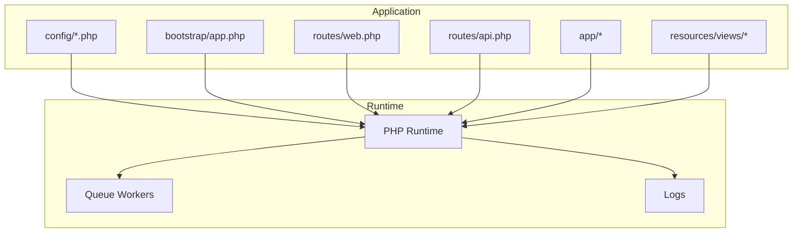
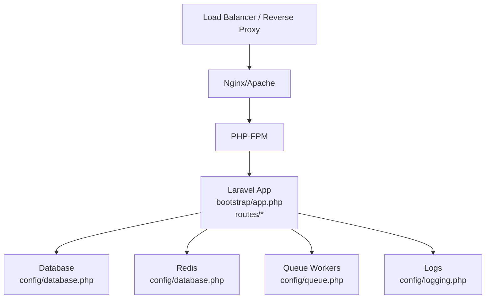
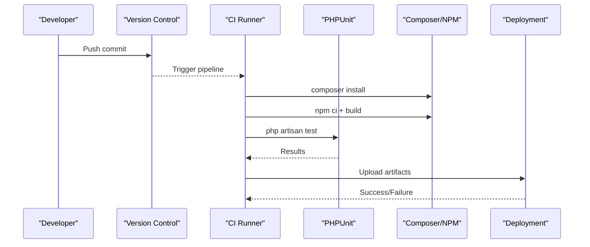
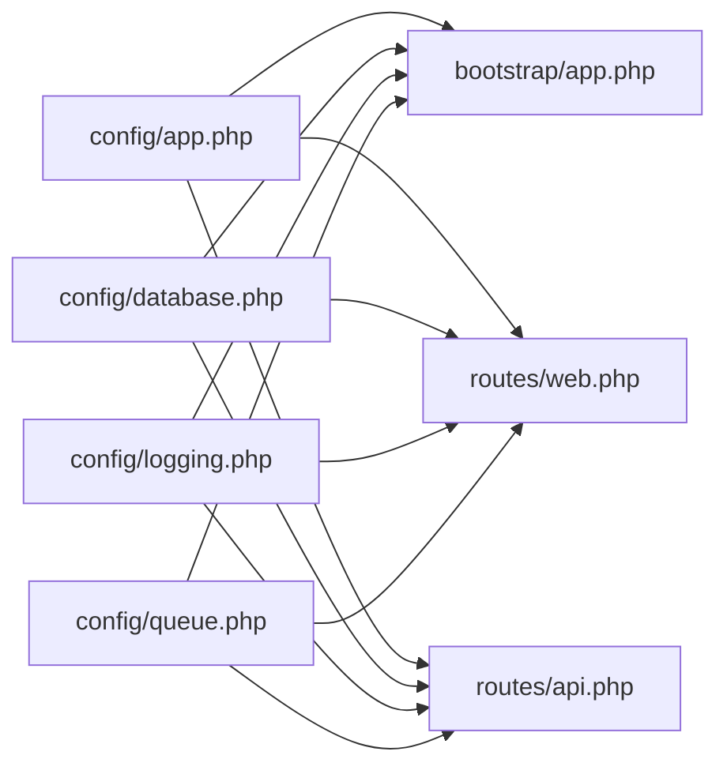

# Deployment & DevOps

<cite>
**Referenced Files in This Document**
- [composer.json](file://composer.json)
- [package.json](file://package.json)
- [phpunit.xml](file://phpunit.xml)
- [README.md](file://README.md)
- [config/app.php](file://config/app.php)
- [config/database.php](file://config/database.php)
- [config/logging.php](file://config/logging.php)
- [config/queue.php](file://config/queue.php)
- [config/services.php](file://config/services.php)
- [bootstrap/app.php](file://bootstrap/app.php)
- [routes/web.php](file://routes/web.php)
- [routes/api.php](file://routes/api.php)
- [resources/views/welcome.blade.php](file://resources/views/welcome.blade.php)
</cite>

## Table of Contents
1. [Introduction](#introduction)
2. [Project Structure](#project-structure)
3. [Core Components](#core-components)
4. [Architecture Overview](#architecture-overview)
5. [Detailed Component Analysis](#detailed-component-analysis)
6. [Dependency Analysis](#dependency-analysis)
7. [Performance Considerations](#performance-considerations)
8. [Troubleshooting Guide](#troubleshooting-guide)
9. [Conclusion](#conclusion)
10. [Appendices](#appendices)

## Introduction
This document provides comprehensive deployment and DevOps guidance for DODPOS production environments. It covers environment configuration management, production setup procedures, security hardening, CI/CD pipeline setup, automated testing integration, deployment automation, server requirements, load balancing, monitoring, practical deployment scripts, rollback procedures, maintenance workflows, cloud platform integration, containerization options, and backup strategies.

## Project Structure
DODPOS is a Laravel 12 application with a modular MVC structure, Blade views, and a rich set of routes. Configuration is centralized under config/, with Composer and NPM scripts supporting local development and production builds. The application exposes both web and API routes with role-based access control and rate limiting.

**Diagram sources**
- [bootstrap/app.php:1-57](file://bootstrap/app.php#L1-L57)
- [routes/web.php:1-800](file://routes/web.php#L1-L800)
- [routes/api.php:1-199](file://routes/api.php#L1-L199)
- [config/app.php:1-127](file://config/app.php#L1-L127)

**Section sources**
- [README.md:1-60](file://README.md#L1-L60)
- [composer.json:1-91](file://composer.json#L1-L91)
- [package.json:1-22](file://package.json#L1-L22)

## Core Components
- Configuration Management
  - Application environment, debug mode, URL, timezone, locales, encryption key, and maintenance driver are managed via config/app.php and environment variables.
  - Database connections (sqlite, mysql, mariadb, pgsql, sqlsrv), migration table, and Redis options are defined in config/database.php.
  - Logging channels (single, daily, slack, syslog, stderr) and deprecation logging are configured in config/logging.php.
  - Queue backends (sync, database, beanstalkd, sqs, redis), batching, and failed jobs are configured in config/queue.php.
  - Third-party services (Postmark, Resend, SES, Slack) credentials are defined in config/services.php.
- Routing and Middleware
  - Web routes enforce authentication, activity logging, stock masking, and role checks.
  - API routes include throttling, Sanctum authentication, and role-based access for multiple business modules.
- Testing and Scripts
  - Composer scripts provide setup, dev, and test orchestration.
  - PHPUnit configuration sets up a testing environment with SQLite and disables telemetry integrations.

**Section sources**
- [config/app.php:1-127](file://config/app.php#L1-L127)
- [config/database.php:1-184](file://config/database.php#L1-L184)
- [config/logging.php:1-133](file://config/logging.php#L1-L133)
- [config/queue.php:1-130](file://config/queue.php#L1-L130)
- [config/services.php:1-38](file://config/services.php#L1-L38)
- [bootstrap/app.php:1-57](file://bootstrap/app.php#L1-L57)
- [routes/web.php:1-800](file://routes/web.php#L1-L800)
- [routes/api.php:1-199](file://routes/api.php#L1-L199)
- [composer.json:38-72](file://composer.json#L38-L72)
- [phpunit.xml:1-37](file://phpunit.xml#L1-L37)

## Architecture Overview
The production runtime comprises:
- Web server (Apache/Nginx) serving static assets and proxying to PHP-FPM.
- PHP-FPM running the Laravel application with configured middleware and routing.
- Database (MySQL/MariaDB recommended for production) and optional Redis for caching and queues.
- Optional external services for email/SMS via AWS SES, Postmark, or Resend, and Slack notifications.
- Queue workers for asynchronous job processing.
- Centralized logging and optional remote log aggregation.

**Diagram sources**
- [config/database.php:19-184](file://config/database.php#L19-L184)
- [config/queue.php:16-130](file://config/queue.php#L16-L130)
- [config/logging.php:21-133](file://config/logging.php#L21-L133)
- [bootstrap/app.php:9-28](file://bootstrap/app.php#L9-L28)

## Detailed Component Analysis

### Environment Configuration Management
- Application Environment
  - APP_ENV controls environment-specific behavior; APP_DEBUG toggles verbose error reporting.
  - APP_URL defines base URL for CLI and URLs generation.
  - APP_TIMEZONE sets timezone; locales and fallback locales are configurable.
  - APP_KEY is required for encryption; previous keys support key rotation.
  - Maintenance driver and store are configurable for coordinated maintenance.
- Database Connections
  - DB_CONNECTION selects sqlite/mysql/mariadb/pgsql/sqlsrv; defaults to sqlite locally.
  - SSL/TLS options for MySQL/MariaDB and PGSQL are supported via environment variables.
  - Redis client, clustering, prefix, persistence, and retry/backoff options are tunable.
- Logging
  - LOG_CHANNEL selects default channel; LOG_STACK composes channels.
  - LOG_LEVEL sets verbosity; LOG_DAILY_DAYS controls retention for daily logs.
  - Slack and Papertrail integrations are available via environment variables.
- Queues
  - QUEUE_CONNECTION selects backend; database, redis, sqs, beanstalkd supported.
  - DB_QUEUE_RETRY_AFTER and REDIS_QUEUE_RETRY_AFTER tune failure handling.
  - Failed jobs driver and table are configurable.
- Services
  - Postmark, Resend, SES, and Slack credentials are read from environment variables.

**Section sources**
- [config/app.php:29-124](file://config/app.php#L29-L124)
- [config/database.php:19-184](file://config/database.php#L19-L184)
- [config/logging.php:21-133](file://config(logging.php#L21-L133)
- [config/queue.php:16-130](file://config/queue.php#L16-L130)
- [config/services.php:17-38](file://config/services.php#L17-L38)

### Production Setup Procedures
- Prerequisites
  - PHP 8.2+ with extensions required by Laravel and database drivers.
  - Web server (Apache/Nginx) and PHP-FPM.
  - Database (MySQL/MariaDB recommended) and Redis (optional).
  - Composer and Node/NPM for asset compilation.
- Initial Setup
  - Copy environment template to .env and set APP_ENV=production, APP_DEBUG=false, APP_KEY, APP_URL.
  - Configure DB_CONNECTION=mysql and credentials; set DB_QUEUE_CONNECTION if using database queues.
  - Choose LOG_CHANNEL appropriate for production (e.g., daily or syslog).
  - Configure QUEUE_CONNECTION (redis preferred for production) and REDIS_* variables.
  - Set LOG_LEVEL=notice or higher for production.
- Build and Bootstrap
  - Run Composer setup script to install dependencies, generate keys, run migrations, install npm dependencies, and build assets.
  - Clear configuration caches after environment changes.
- Permissions
  - Ensure storage/ and bootstrap/cache are writable by the web server user.
  - Public assets are served from public/.

**Section sources**
- [composer.json:39-46](file://composer.json#L39-L46)
- [config/app.php:29-124](file://config/app.php#L29-L124)
- [config/database.php:19-184](file://config/database.php#L19-L184)
- [config/queue.php:16-130](file://config/queue.php#L16-L130)
- [config/logging.php:21-133](file://config/logging.php#L21-L133)

### Security Hardening
- Authentication and Authorization
  - Sanctum guards protected routes; throttle middleware limits API attempts.
  - Role middleware enforces granular permissions across modules.
- Network and Transport
  - Use HTTPS termination at the load balancer; enforce TLS for database connections (SSL/TLS options in database config).
  - Restrict outbound SMTP to trusted providers (SES, Postmark, Resend).
- Secrets and Keys
  - Rotate APP_KEY and previous keys periodically; store secrets outside the repository.
- Logging and Auditing
  - Enable structured logging and consider remote log aggregation.
  - Activity logging is integrated; ensure sensitive data is masked or excluded from logs.

**Section sources**
- [routes/api.php:11-26](file://routes/api.php#L11-L26)
- [routes/api.php:31-68](file://routes/api.php#L31-L68)
- [bootstrap/app.php:16-28](file://bootstrap/app.php#L16-L28)
- [config/database.php:61-83](file://config/database.php#L61-L83)
- [config/services.php:17-38](file://config/services.php#L17-L38)
- [config/logging.php:21-133](file://config/logging.php#L21-L133)

### CI/CD Pipeline Setup
- Build Phase
  - Install PHP dependencies via Composer.
  - Install Node dependencies and build frontend assets.
  - Run database migrations in a safe manner (non-blocking).
- Test Phase
  - Execute PHPUnit suites with configured environment (SQLite memory).
  - Optionally run Pest tests if configured.
- Artifact and Deployment
  - Package application and assets for deployment.
  - Deploy to target servers or container images to registry.
- Rollback
  - Keep previous artifact/version available for quick rollback.
  - Maintain database migration history for downgrading if necessary.

**Diagram sources**
- [composer.json:38-72](file://composer.json#L38-L72)
- [phpunit.xml:1-37](file://phpunit.xml#L1-L37)

**Section sources**
- [composer.json:38-72](file://composer.json#L38-L72)
- [phpunit.xml:1-37](file://phpunit.xml#L1-L37)

### Automated Testing Integration
- Test Configuration
  - PHPUnit runs with APP_ENV=testing, SQLite in-memory database, and minimal services enabled.
  - Cache, session, and queue drivers are optimized for tests.
- Running Tests
  - Use Composer script to clear config and run tests.
  - Integrate coverage reporting and static analysis in CI.

**Section sources**
- [phpunit.xml:20-35](file://phpunit.xml#L20-L35)
- [composer.json:51-54](file://composer.json#L51-L54)

### Deployment Automation
- Local Development vs Production
  - Development uses concurrent processes for server, queue, logs, and Vite.
  - Production uses queue workers and reverse proxy to PHP-FPM.
- Deployment Scripts
  - Composer scripts automate setup, dev, and test workflows.
  - Use deployment automation tools (e.g., Capistrano, Ansible, or CI-native deployment) to orchestrate:
    - Environment synchronization (.env).
    - Vendor and asset installation.
    - Database migrations.
    - Cache warm-up.
    - Restart services (PHP-FPM, queue workers).
- Health Checks
  - Use Laravel’s /up endpoint for readiness probes behind the load balancer.

**Section sources**
- [composer.json:47-50](file://composer.json#L47-L50)
- [bootstrap/app.php:14](file://bootstrap/app.php#L14)

### Server Requirements
- Hardware
  - CPU: Minimum dual-core; scale based on traffic and queue workloads.
  - RAM: Minimum 2 GB; scale for concurrency and caching.
  - Disk: SSD recommended; ensure space for logs, cache, and backups.
- Software Stack
  - OS: Linux distribution with long-term support.
  - PHP: 8.2+ with required extensions.
  - Web Server: Nginx/Apache with PHP-FPM.
  - Database: MySQL/MariaDB recommended; PostgreSQL supported.
  - Optional: Redis for caching and queues.
- Networking
  - Load balancer for horizontal scaling and HTTPS termination.
  - Firewall rules restrict inbound ports to necessary services.

[No sources needed since this section provides general guidance]

### Load Balancing
- Horizontal Scaling
  - Stateless application pods behind a load balancer.
  - Sticky sessions only if required; otherwise distribute across instances.
- Health Checks
  - Use /up endpoint for health checks.
- Session and Cache
  - Use Redis-backed sessions and cache to enable scaling.

[No sources needed since this section provides general guidance]

### Monitoring Setup
- Logs
  - Daily or syslog channels; export logs to SIEM or log aggregation systems.
- Metrics
  - Track response times, error rates, queue backlog, and database latency.
- Alerts
  - Alert on high error rates, slow endpoints, queue backlog growth, and disk usage.

**Section sources**
- [config/logging.php:21-133](file://config/logging.php#L21-L133)

### Practical Examples

#### Environment Variables Reference
- Application
  - APP_ENV, APP_DEBUG, APP_KEY, APP_URL, APP_TIMEZONE, APP_LOCALE, APP_FALLBACK_LOCALE, APP_MAINTENANCE_DRIVER, APP_MAINTENANCE_STORE
- Database
  - DB_CONNECTION, DB_HOST, DB_PORT, DB_DATABASE, DB_USERNAME, DB_PASSWORD, DB_URL, DB_CHARSET, DB_COLLATION, MYSQL_ATTR_SSL_CA, DB_SSLMODE
- Redis
  - REDIS_CLIENT, REDIS_HOST, REDIS_PORT, REDIS_USERNAME, REDIS_PASSWORD, REDIS_DB, REDIS_CACHE_DB, REDIS_PREFIX, REDIS_PERSISTENT, REDIS_MAX_RETRIES, REDIS_BACKOFF_ALGORITHM, REDIS_BACKOFF_BASE, REDIS_BACKOFF_CAP
- Logging
  - LOG_CHANNEL, LOG_STACK, LOG_LEVEL, LOG_DAILY_DAYS, LOG_SLACK_WEBHOOK_URL, PAPERTRAIL_URL, PAPERTRAIL_PORT
- Queues
  - QUEUE_CONNECTION, DB_QUEUE_CONNECTION, DB_QUEUE_TABLE, DB_QUEUE, DB_QUEUE_RETRY_AFTER, REDIS_QUEUE_CONNECTION, REDIS_QUEUE, REDIS_QUEUE_RETRY_AFTER, QUEUE_FAILED_DRIVER
- Services
  - POSTMARK_API_KEY, RESEND_API_KEY, AWS_ACCESS_KEY_ID, AWS_SECRET_ACCESS_KEY, AWS_DEFAULT_REGION, SLACK_BOT_USER_OAUTH_TOKEN, SLACK_BOT_USER_DEFAULT_CHANNEL

**Section sources**
- [config/app.php:29-124](file://config/app.php#L29-L124)
- [config/database.php:19-184](file://config/database.php#L19-L184)
- [config/logging.php:21-133](file://config/logging.php#L21-L133)
- [config/queue.php:16-130](file://config/queue.php#L16-L130)
- [config/services.php:17-38](file://config/services.php#L17-L38)

#### Deployment Script Workflow
- Pre-deploy
  - Sync .env to production servers.
  - Install/update dependencies (Composer, NPM).
- Deploy
  - Run migrations safely.
  - Clear and warm caches.
  - Build assets.
- Post-deploy
  - Restart PHP-FPM and queue workers.
  - Verify /up endpoint and basic API endpoints.

**Section sources**
- [composer.json:39-46](file://composer.json#L39-L46)
- [bootstrap/app.php:14](file://bootstrap/app.php#L14)

#### Rollback Procedure
- Steps
  - Stop new requests at the load balancer.
  - Switch to the previous artifact or image.
  - Restart services.
  - Validate /up and critical endpoints.
  - Resume traffic if successful; revert further if needed.

[No sources needed since this section provides general guidance]

#### Maintenance Workflows
- Routine Tasks
  - Rotate APP_KEY and previous keys.
  - Archive and prune logs.
  - Monitor queue backlog and scale workers.
  - Review and rotate service credentials.

**Section sources**
- [config/app.php:100-106](file://config/app.php#L100-L106)
- [config/logging.php:68-74](file://config/logging.php#L68-L74)
- [config/queue.php:123-127](file://config/queue.php#L123-L127)

### Cloud Platforms and Containerization
- Cloud Platforms
  - Use managed services for databases (e.g., RDS) and message queues (e.g., SQS/Beanstalkd) to reduce operational overhead.
  - For email delivery, prefer managed providers (SES, Postmark, Resend).
- Containerization Options
  - Build a PHP-FPM + Nginx image with Composer and NPM installed.
  - Persist logs and cache via volumes; mount storage for uploads if using local disk.
  - Use separate containers for queue workers and cron-like tasks.

**Section sources**
- [config/services.php:17-38](file://config/services.php#L17-L38)
- [resources/views/welcome.blade.php:111-124](file://resources/views/welcome.blade.php#L111-L124)

### Backup Strategies
- Database Backups
  - Schedule regular logical backups (mysqldump/PG dump) or use managed snapshots.
- File Backups
  - Back up storage/app/public and storage/framework/cache/logs if using local disk.
- Configuration Backups
  - Maintain secure offsite copies of .env and secrets vault entries.

[No sources needed since this section provides general guidance]

## Dependency Analysis
- Configuration Dependencies
  - bootstrap/app.php registers middleware and routes; it depends on config/app.php for environment and middleware aliases.
  - routes/web.php and routes/api.php depend on middleware and role policies defined in bootstrap/app.php and controllers.
- Runtime Dependencies
  - config/database.php defines database and Redis clients used by Eloquent and cache/queue.
  - config/queue.php defines queue backends used by job dispatchers.
  - config/logging.php defines logging channels used across the application.

**Diagram sources**
- [bootstrap/app.php:9-28](file://bootstrap/app.php#L9-L28)
- [routes/web.php:1-800](file://routes/web.php#L1-L800)
- [routes/api.php:1-199](file://routes/api.php#L1-L199)
- [config/app.php:1-127](file://config/app.php#L1-L127)
- [config/database.php:1-184](file://config/database.php#L1-L184)
- [config/logging.php:1-133](file://config/logging.php#L1-L133)
- [config/queue.php:1-130](file://config/queue.php#L1-L130)

**Section sources**
- [bootstrap/app.php:9-28](file://bootstrap/app.php#L9-L28)
- [routes/web.php:1-800](file://routes/web.php#L1-L800)
- [routes/api.php:1-199](file://routes/api.php#L1-L199)
- [config/app.php:1-127](file://config/app.php#L1-L127)
- [config/database.php:1-184](file://config/database.php#L1-L184)
- [config/logging.php:1-133](file://config/logging.php#L1-L133)
- [config/queue.php:1-130](file://config/queue.php#L1-L130)

## Performance Considerations
- Caching
  - Use Redis for cache and sessions; configure cache prefix and database indices.
- Queue Backends
  - Prefer Redis or SQS for production; tune retry and backoff settings.
- Database
  - Use MySQL/MariaDB for production; ensure proper indexing and connection pooling.
- Asset Delivery
  - Serve compiled assets via CDN or static hosting to reduce server load.

[No sources needed since this section provides general guidance]

## Troubleshooting Guide
- Common Issues
  - APP_KEY missing or invalid: regenerate and redeploy.
  - Database connectivity: verify DB_* variables and network access.
  - Queue workers not processing: check QUEUE_CONNECTION and Redis connectivity.
  - Logs not rotating: confirm LOG_CHANNEL and filesystem permissions.
- Diagnostics
  - Use Laravel’s built-in maintenance mode and health endpoint (/up).
  - Inspect logs in storage/logs and external log systems.

**Section sources**
- [config/app.php:100-106](file://config/app.php#L100-L106)
- [config/database.php:19-184](file://config/database.php#L19-L184)
- [config/queue.php:16-130](file://config/queue.php#L16-L130)
- [config/logging.php:21-133](file://config/logging.php#L21-L133)
- [bootstrap/app.php:14](file://bootstrap/app.php#L14)

## Conclusion
This guide outlines a production-ready deployment and DevOps strategy for DODPOS, covering environment configuration, security hardening, CI/CD, monitoring, and operational procedures. By following the outlined practices and leveraging the provided configuration references, teams can achieve reliable, scalable, and maintainable deployments across cloud and on-premises environments.

## Appendices
- Quick Links
  - Laravel Deployment Guide: https://laravel.com/docs/deployment
  - Laravel Queue Documentation: https://laravel.com/docs/queues
  - Laravel Logging Documentation: https://laravel.com/docs/logging

[No sources needed since this section provides general guidance]