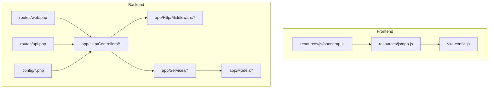
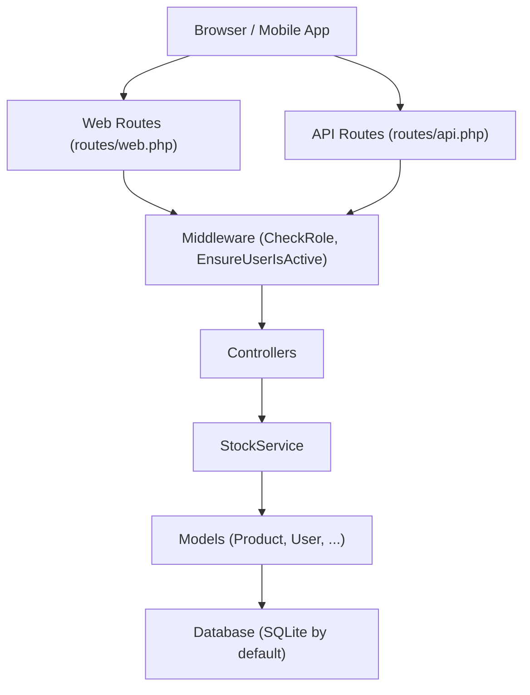
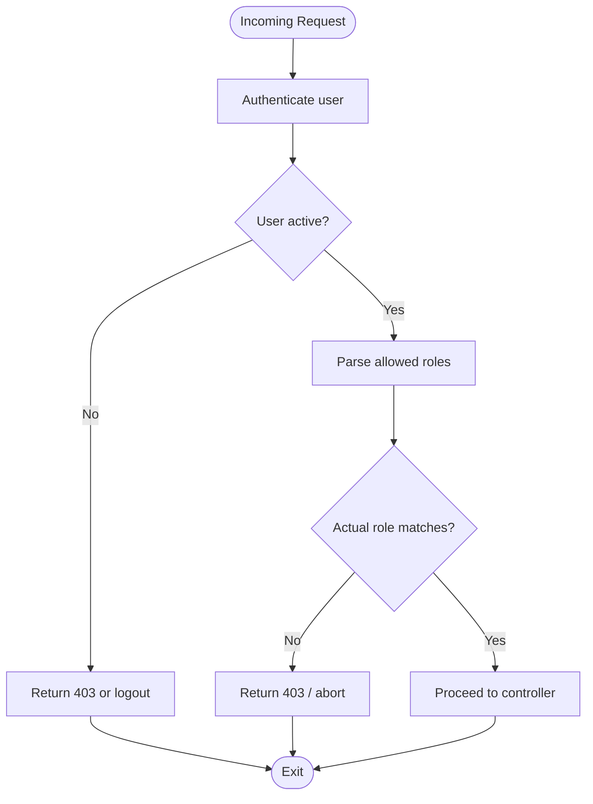
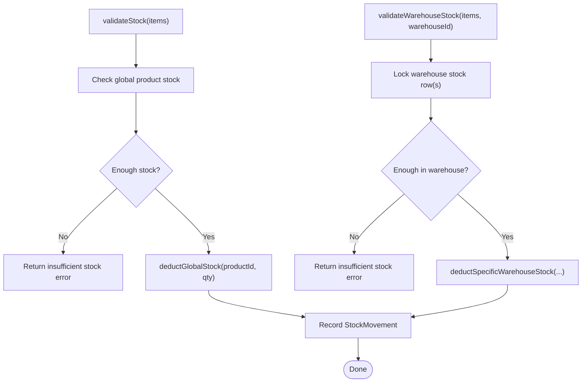
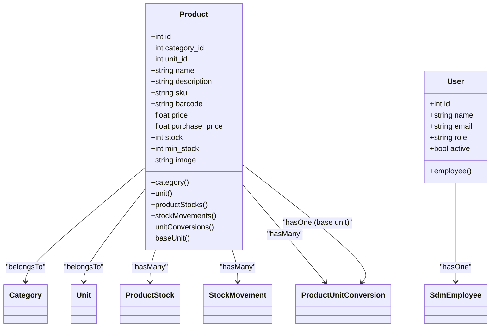
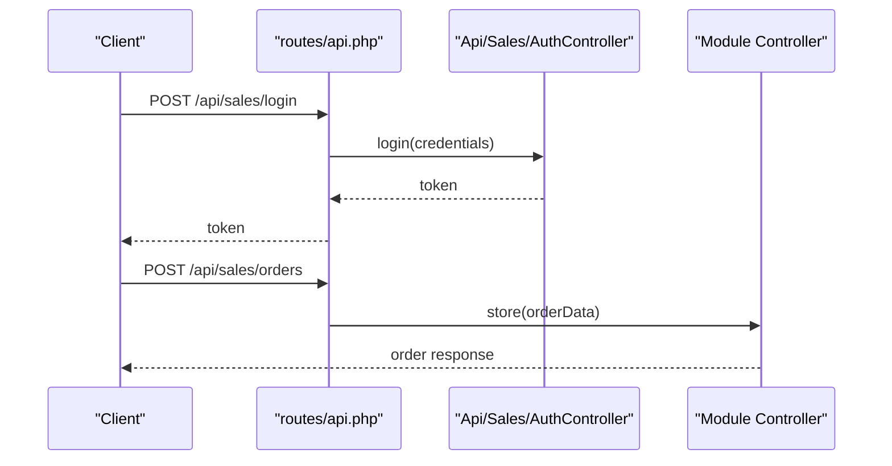
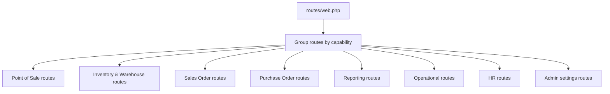
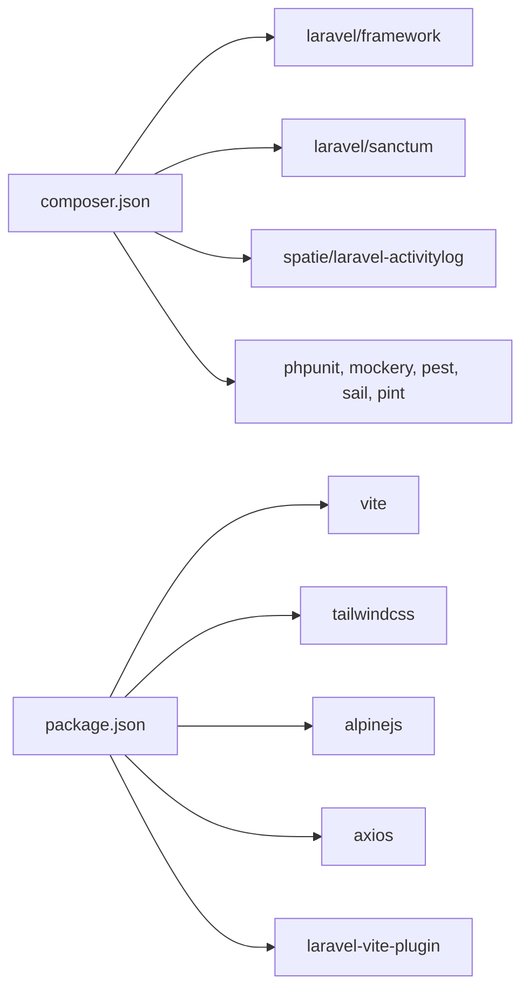

# Developer Guidelines

<cite>
**Referenced Files in This Document**
- [README.md](file://README.md)
- [composer.json](file://composer.json)
- [package.json](file://package.json)
- [phpunit.xml](file://phpunit.xml)
- [.editorconfig](file://.editorconfig)
- [config/app.php](file://config/app.php)
- [config/database.php](file://config/database.php)
- [routes/web.php](file://routes/web.php)
- [routes/api.php](file://routes/api.php)
- [vite.config.js](file://vite.config.js)
- [app/Http/Middleware/CheckRole.php](file://app/Http/Middleware/CheckRole.php)
- [app/Http/Middleware/EnsureUserIsActive.php](file://app/Http/Middleware/EnsureUserIsActive.php)
- [app/Services/StockService.php](file://app/Services/StockService.php)
- [app/Models/Product.php](file://app/Models/Product.php)
- [app/Models/User.php](file://app/Models/User.php)
- [resources/js/app.js](file://resources/js/app.js)
- [resources/js/bootstrap.js](file://resources/js/bootstrap.js)
- [tests/Feature/PosSessionCashTest.php](file://tests/Feature/PosSessionCashTest.php)
- [tests/TestCase.php](file://tests/TestCase.php)
</cite>

## Table of Contents
1. [Introduction](#introduction)
2. [Project Structure](#project-structure)
3. [Core Components](#core-components)
4. [Architecture Overview](#architecture-overview)
5. [Detailed Component Analysis](#detailed-component-analysis)
6. [Dependency Analysis](#dependency-analysis)
7. [Performance Considerations](#performance-considerations)
8. [Troubleshooting Guide](#troubleshooting-guide)
9. [Conclusion](#conclusion)
10. [Appendices](#appendices)

## Introduction
This document defines developer guidelines for DODPOS, focusing on coding standards, development workflows, contribution practices, and quality assurance. It consolidates Laravel conventions, PHP standards, JavaScript development practices, Git workflow, branch management, pull request procedures, code review expectations, testing requirements, documentation standards, and integration with development tools and continuous integration.

The project is a Laravel 12 application with a rich routing model, modular controllers per business domain, centralized middleware for role-based access, and a shared StockService for inventory logic. The frontend leverages Vite with TailwindCSS and AlpineJS.

## Project Structure
The repository follows a standard Laravel layout with modular controllers grouped by business domains (e.g., Gula, Mineral, Kanvas, Minyak), dedicated middleware for role checks, centralized services for cross-cutting concerns, and comprehensive tests organized by feature and unit suites.

**Diagram sources**
- [routes/web.php:1-1108](file://routes/web.php#L1-L1108)
- [routes/api.php:1-199](file://routes/api.php#L1-L199)
- [vite.config.js:1-12](file://vite.config.js#L1-L12)
- [resources/js/app.js](file://resources/js/app.js)
- [resources/js/bootstrap.js](file://resources/js/bootstrap.js)
- [app/Http/Middleware/CheckRole.php:1-75](file://app/Http/Middleware/CheckRole.php#L1-L75)
- [app/Services/StockService.php:1-251](file://app/Services/StockService.php#L1-L251)
- [app/Models/Product.php:1-59](file://app/Models/Product.php#L1-L59)
- [config/app.php:1-127](file://config/app.php#L1-L127)
- [config/database.php:1-184](file://config/database.php#L1-L184)

**Section sources**
- [routes/web.php:1-1108](file://routes/web.php#L1-L1108)
- [routes/api.php:1-199](file://routes/api.php#L1-L199)
- [vite.config.js:1-12](file://vite.config.js#L1-L12)
- [config/app.php:1-127](file://config/app.php#L1-L127)
- [config/database.php:1-184](file://config/database.php#L1-L184)

## Core Components
- Laravel 12 application with PHP 8.2+ runtime and SQLite as default database for development/testing.
- Role-based access control via middleware and policy-like route guards.
- Centralized stock management via a shared service to prevent duplication and race conditions.
- Activity logging for auditability using Spatie’s activitylog.
- Frontend toolchain with Vite, TailwindCSS, and AlpineJS.

Key configuration highlights:
- Application timezone is Asia/Jakarta.
- Default database connection is SQLite for local development and tests.
- Testing environment uses an in-memory SQLite database and array stores for caches/queues/mailers.

**Section sources**
- [composer.json:1-91](file://composer.json#L1-L91)
- [config/app.php:68-68](file://config/app.php#L68-L68)
- [config/database.php:19-19](file://config/database.php#L19-L19)
- [phpunit.xml:21-35](file://phpunit.xml#L21-L35)

## Architecture Overview
The system separates concerns across routes, controllers, middleware, services, and models. Web routes enforce role-based permissions, while API routes provide mobile and external integrations with rate limiting and Sanctum tokens.

**Diagram sources**
- [routes/web.php:29-800](file://routes/web.php#L29-L800)
- [routes/api.php:1-199](file://routes/api.php#L1-L199)
- [app/Http/Middleware/CheckRole.php:17-73](file://app/Http/Middleware/CheckRole.php#L17-L73)
- [app/Http/Middleware/EnsureUserIsActive.php:12-45](file://app/Http/Middleware/EnsureUserIsActive.php#L12-L45)
- [app/Services/StockService.php:15-251](file://app/Services/StockService.php#L15-L251)
- [app/Models/Product.php:10-59](file://app/Models/Product.php#L10-L59)
- [app/Models/User.php:14-135](file://app/Models/User.php#L14-L135)
- [config/database.php:34-44](file://config/database.php#L34-L44)

## Detailed Component Analysis

### Role-Based Access Control and Middleware
The middleware enforces authentication and active status, supports comma or pipe-separated roles, and returns appropriate responses for JSON vs HTML requests.

**Diagram sources**
- [app/Http/Middleware/CheckRole.php:17-73](file://app/Http/Middleware/CheckRole.php#L17-L73)
- [app/Http/Middleware/EnsureUserIsActive.php:12-45](file://app/Http/Middleware/EnsureUserIsActive.php#L12-L45)

**Section sources**
- [app/Http/Middleware/CheckRole.php:1-75](file://app/Http/Middleware/CheckRole.php#L1-L75)
- [app/Http/Middleware/EnsureUserIsActive.php:1-47](file://app/Http/Middleware/EnsureUserIsActive.php#L1-L47)

### Stock Management Service
Centralized logic for validating and adjusting stock across global and warehouse-specific contexts, with FIFO-based deductions and movement logging.

**Diagram sources**
- [app/Services/StockService.php:24-37](file://app/Services/StockService.php#L24-L37)
- [app/Services/StockService.php:46-65](file://app/Services/StockService.php#L46-L65)
- [app/Services/StockService.php:100-148](file://app/Services/StockService.php#L100-L148)
- [app/Services/StockService.php:162-201](file://app/Services/StockService.php#L162-L201)
- [app/Services/StockService.php:213-249](file://app/Services/StockService.php#L213-L249)

**Section sources**
- [app/Services/StockService.php:1-251](file://app/Services/StockService.php#L1-L251)

### Product Model and Activity Logging
The Product model integrates soft deletes and activity logging to capture changes for auditability.

**Diagram sources**
- [app/Models/Product.php:10-59](file://app/Models/Product.php#L10-L59)
- [app/Models/User.php:14-135](file://app/Models/User.php#L14-L135)

**Section sources**
- [app/Models/Product.php:1-59](file://app/Models/Product.php#L1-L59)
- [app/Models/User.php:1-135](file://app/Models/User.php#L1-L135)

### API Routing and Throttling
API routes are grouped by module (sales, minyak, gula, mineral) with shared authentication and throttling policies.

**Diagram sources**
- [routes/api.php:31-68](file://routes/api.php#L31-L68)
- [routes/api.php:73-94](file://routes/api.php#L73-L94)
- [routes/api.php:99-128](file://routes/api.php#L99-L128)
- [routes/api.php:133-158](file://routes/api.php#L133-L158)
- [routes/api.php:163-198](file://routes/api.php#L163-L198)

**Section sources**
- [routes/api.php:1-199](file://routes/api.php#L1-L199)

### Web Routing and Permissions
Web routes group functionality by roles and capabilities, enforcing granular access controls.

**Diagram sources**
- [routes/web.php:29-800](file://routes/web.php#L29-L800)

**Section sources**
- [routes/web.php:1-1108](file://routes/web.php#L1-L1108)

## Dependency Analysis
- Backend dependencies include Laravel framework, Sanctum for tokens, and Spatie activitylog for auditing.
- Development dependencies include PHPUnit, Pest-compatible plugins, Laravel Sail, and Pint for code formatting.
- Frontend dependencies include Vite, TailwindCSS, AlpineJS, Axios, and Laravel Vite plugin.

**Diagram sources**
- [composer.json:8-25](file://composer.json#L8-L25)
- [package.json:9-20](file://package.json#L9-L20)

**Section sources**
- [composer.json:1-91](file://composer.json#L1-L91)
- [package.json:1-22](file://package.json#L1-L22)

## Performance Considerations
- Use database locks and transactions to avoid race conditions during stock adjustments.
- Prefer FIFO-based stock deduction to minimize waste and improve traceability.
- Keep middleware lightweight; avoid heavy computations inside middleware stacks.
- Use array-backed stores for queues and caches during testing to reduce overhead.
- Leverage database indexes and migrations for performance-sensitive tables.

[No sources needed since this section provides general guidance]

## Troubleshooting Guide
Common issues and resolutions:
- Authentication failures: Ensure Sanctum tokens are present and active; inactive users are logged out automatically by middleware.
- Role mismatches: Verify allowed roles syntax (comma or pipe-separated) and lowercase normalization.
- Stock validation errors: Insufficient stock triggers explicit error arrays; validate inputs before invoking stock operations.
- Test environment anomalies: Confirm SQLite in-memory database and array stores are configured for tests.

**Section sources**
- [app/Http/Middleware/CheckRole.php:17-73](file://app/Http/Middleware/CheckRole.php#L17-L73)
- [app/Http/Middleware/EnsureUserIsActive.php:12-45](file://app/Http/Middleware/EnsureUserIsActive.php#L12-L45)
- [app/Services/StockService.php:24-37](file://app/Services/StockService.php#L24-L37)
- [phpunit.xml:21-35](file://phpunit.xml#L21-L35)

## Conclusion
These guidelines establish a consistent development workflow, enforce Laravel and PHP best practices, and ensure maintainable, auditable, and reliable code. By adhering to role-based access control, centralized services, standardized testing, and clear documentation standards, contributors can collaborate effectively and deliver high-quality features across the DODPOS platform.

[No sources needed since this section summarizes without analyzing specific files]

## Appendices

### A. Coding Standards and Formatting
- EditorConfig enforces UTF-8, LF line endings, 4-space indentation, trailing whitespace removal, and special handling for Markdown and YAML files.
- Use PSR-12 style for PHP; Laravel conventions for namespaces, class naming, and method casing.
- Keep controllers thin; move business logic to services.
- Use strict typing and defensive checks for middleware and services.

**Section sources**
- [.editorconfig:1-19](file://.editorconfig#L1-L19)

### B. Development Environment Setup
- Install PHP 8.2+, Composer, and Node.js/npm.
- Run Composer scripts for initial setup and development:
  - setup: installs dependencies, generates app key, runs migrations, installs npm packages, builds assets.
  - dev: starts server, queue listener, logs, and Vite in parallel.
- Configure environment variables (.env) for database and application settings.
- Use SQLite for local development and testing; switch to MySQL/MariaDB/PostgreSQL in staging/production.

**Section sources**
- [composer.json:39-72](file://composer.json#L39-L72)
- [config/database.php:34-44](file://config/database.php#L34-L44)

### C. Git Workflow and Branch Management
- Use feature branches prefixed with feature/, fix/, chore/, or docs/.
- Keep commits small and focused; write clear commit messages.
- Merge via pull requests with at least one reviewer.
- Protect main/master branch; disallow direct pushes.

[No sources needed since this section provides general guidance]

### D. Pull Request Procedures
- Include a summary of changes, rationale, and testing performed.
- Link related issues and include screenshots or videos for UI changes.
- Ensure CI passes and address review comments promptly.

[No sources needed since this section provides general guidance]

### E. Code Review Expectations
- Verify adherence to Laravel conventions, middleware usage, and service-layer separation.
- Confirm tests coverage and correctness for new features and bug fixes.
- Check for security considerations (CSRF, XSS, rate limiting, role checks).
- Ensure documentation updates for new APIs or features.

[No sources needed since this section provides general guidance]

### F. Testing Requirements
- Unit and Feature test suites are configured; run via Composer script.
- Use array-backed stores for caches, queues, and mailers in tests.
- Utilize database memory for SQLite testing; keep fixtures minimal.
- Example tests demonstrate functional coverage for POS cash handling and session logic.

**Section sources**
- [phpunit.xml:7-14](file://phpunit.xml#L7-L14)
- [tests/Feature/PosSessionCashTest.php](file://tests/Feature/PosSessionCashTest.php)
- [tests/TestCase.php](file://tests/TestCase.php)

### G. Documentation Standards
- Keep README concise and link to Laravel documentation.
- Document new API endpoints with route names and middleware groups.
- Update inline comments for complex logic; centralize reusable logic in services.

**Section sources**
- [README.md:1-60](file://README.md#L1-L60)

### H. Continuous Integration and Quality Assurance
- Use Composer scripts for automated setup and testing.
- Integrate static analysis and code formatting (e.g., Laravel Pint) in CI pipelines.
- Enforce test coverage thresholds and linting rules.

**Section sources**
- [composer.json:38-72](file://composer.json#L38-L72)

### I. Practical Examples
- Middleware usage examples:
  - Role enforcement with pipe/comma-separated roles.
  - Active user validation with JSON and HTML responses.
- Service usage examples:
  - Stock validation and warehouse-specific deductions.
  - Movement logging for auditability.
- Frontend integration:
  - Vite configuration for CSS/JS bundling and hot reload.
  - Bootstrap initialization for AJAX and UI components.

**Section sources**
- [app/Http/Middleware/CheckRole.php:17-73](file://app/Http/Middleware/CheckRole.php#L17-L73)
- [app/Http/Middleware/EnsureUserIsActive.php:12-45](file://app/Http/Middleware/EnsureUserIsActive.php#L12-L45)
- [app/Services/StockService.php:24-37](file://app/Services/StockService.php#L24-L37)
- [app/Services/StockService.php:100-148](file://app/Services/StockService.php#L100-L148)
- [vite.config.js:4-11](file://vite.config.js#L4-L11)
- [resources/js/bootstrap.js](file://resources/js/bootstrap.js)