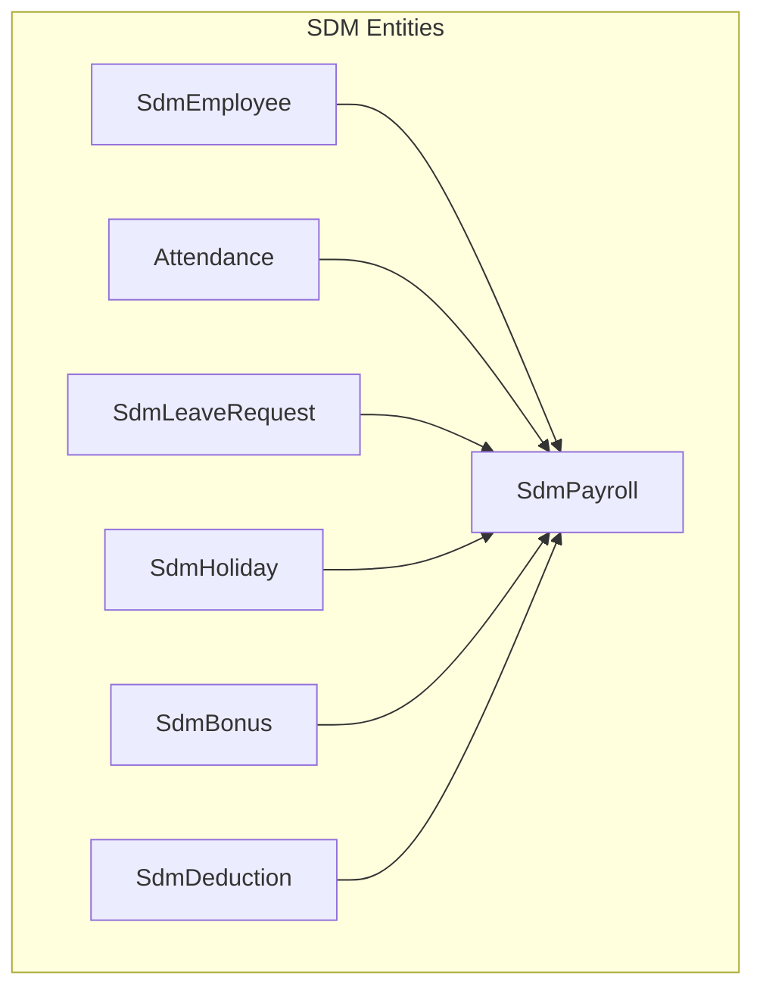
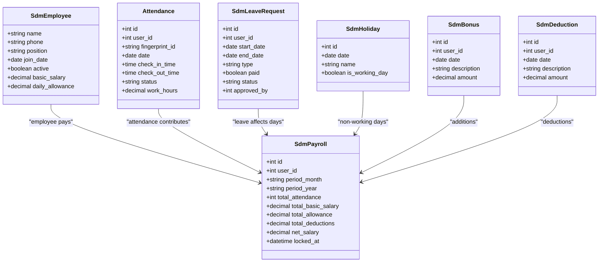
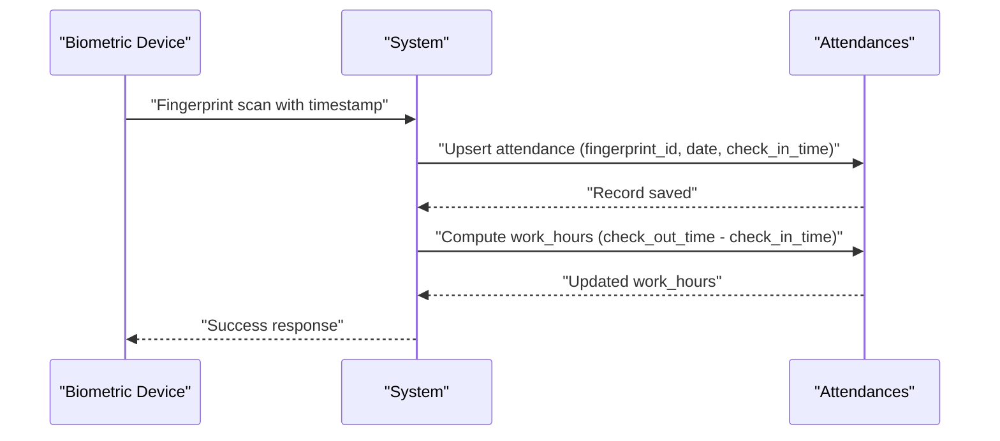
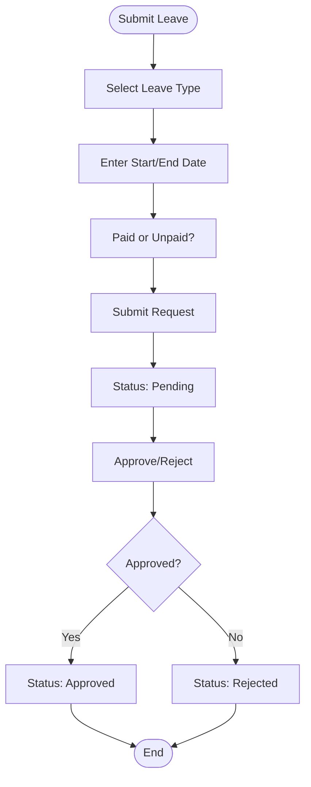
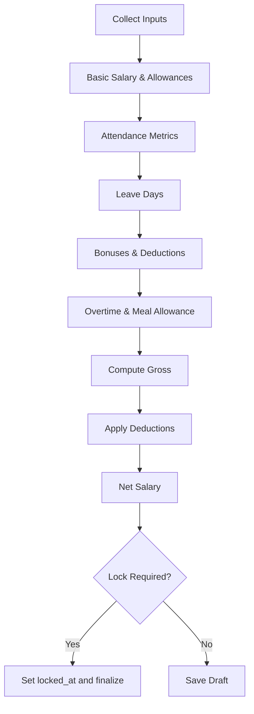
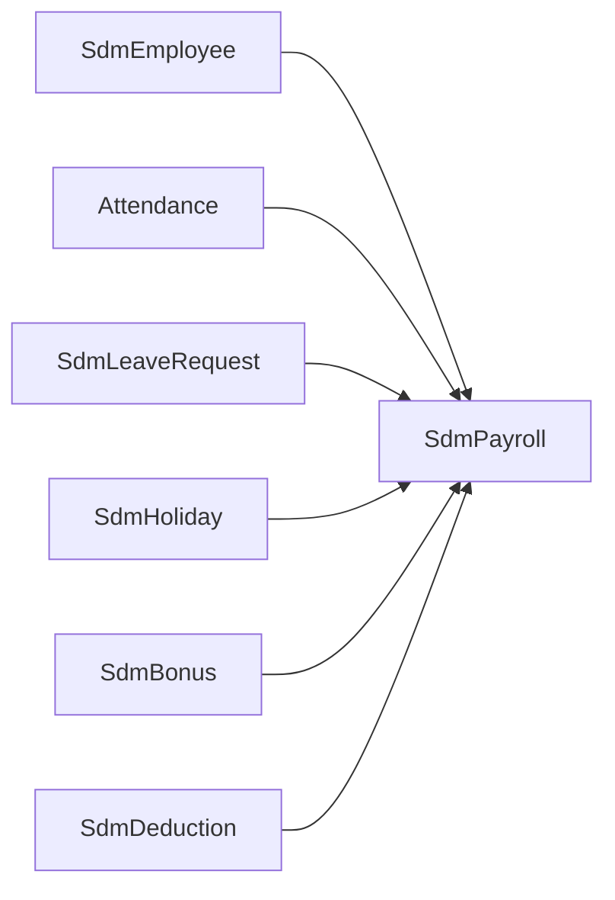

# Human Resources & Payroll (SDM)

<cite>
**Referenced Files in This Document**
- [SdmEmployee.php](file://app/Models/SdmEmployee.php)
- [Attendance.php](file://app/Models/Attendance.php)
- [SdmPayroll.php](file://app/Models/SdmPayroll.php)
- [SdmLeaveRequest.php](file://app/Models/SdmLeaveRequest.php)
- [SdmHoliday.php](file://app/Models/SdmHoliday.php)
- [SdmBonus.php](file://app/Models/SdmBonus.php)
- [SdmDeduction.php](file://app/Models/SdmDeduction.php)
- [2026_03_03_000001_create_sdm_employees_table.php](file://database/migrations/2026_03_03_000001_create_sdm_employees_table.php)
- [2026_03_08_022151_create_attendances_table.php](file://database/migrations/2026_03_08_022151_create_attendances_table.php)
- [2026_03_08_224647_create_sdm_payrolls_table.php](file://database/migrations/2026_03_08_224647_create_sdm_payrolls_table.php)
- [2026_03_11_000004_create_sdm_leave_requests_table.php](file://database/migrations/2026_03_11_000004_create_sdm_leave_requests_table.php)
- [2026_03_11_000007_create_sdm_holidays_table.php](file://database/migrations/2026_03_11_000007_create_sdm_holidays_table.php)
- [2026_03_14_025417_create_sdm_bonuses_table.php](file://database/migrations/2026_03_14_025417_create_sdm_bonuses_table.php)
- [2026_03_08_224638_create_sdm_deductions_table.php](file://database/migrations/2026_03_08_224638_create_sdm_deductions_table.php)
- [2026_03_13_130000_add_selfie_paths_to_attendances_table.php](file://database/migrations/2026_03_13_130000_add_selfie_paths_to_attendances_table.php)
- [2026_03_13_140000_add_sdm_work_end_time_to_store_settings_table.php](file://database/migrations/2026_03_13_140000_add_sdm_work_end_time_to_store_settings_table.php)
- [2026_03_11_000006_add_payroll_components_to_sdm_payrolls_table.php](file://database/migrations/2026_03_11_000006_add_payroll_components_to_sdm_payrolls_table.php)
- [2026_03_13_160000_add_override_fields_to_sdm_payrolls_table.php](file://database/migrations/2026_03_13_160000_add_override_fields_to_sdm_payrolls_table.php)
- [2026_03_11_000001_add_lock_fields_to_sdm_payrolls_table.php](file://database/migrations/2026_03_11_000001_add_lock_fields_to_sdm_payrolls_table.php)
- [2026_03_08_224634_add_salary_fields_to_sdm_employees_table.php](file://database/migrations/2026_03_08_224634_add_salary_fields_to_sdm_employees_table.php)
- [2026_03_13_180000_convert_money_integer_columns_to_decimal.php](file://database/migrations/2026_03_13_180000_convert_money_integer_columns_to_decimal.php)
- [2026_03_14_105302_create_product_requests_table.php](file://database/migrations/2026_03_14_105302_create_product_requests_table.php)
- [2026_03_14_170000_create_stock_opname_sessions_table.php](file://database/migrations/2026_03_14_170000_create_stock_opname_sessions_table.php)
- [2026_03_14_180000_create_transfer_receipts_table.php](file://database/migrations/2026_03_14_180000_create_transfer_receipts_table.php)
- [2026_03_14_190000_create_purchase_order_receipts_table.php](file://database/migrations/2026_03_14_190000_create_purchase_order_receipts_table.php)
- [2026_03_14_200000_add_followup_fields_to_purchase_order_receipts_table.php](file://database/migrations/2026_03_14_200000_add_followup_fields_to_purchase_order_receipts_table.php)
- [2026_03_14_210000_add_indexes_for_hr_payroll_performance.php](file://database/migrations/2026_03_14_210000_add_indexes_for_hr_payroll_performance.php)
- [HrPayrollFunctionalTest.php](file://tests/Feature/HrPayrollFunctionalTest.php)
- [PayrollCalculationTest.php](file://tests/Feature/PayrollCalculationTest.php)
- [Admin12AttendanceSelfStoreTest.php](file://tests/Feature/Admin12AttendanceSelfStoreTest.php)
- [Admin3AttendanceFeedbackTest.php](file://tests/Feature/Admin3AttendanceFeedbackTest.php)
- [SelfAttendanceTest.php](file://tests/Feature/SelfAttendanceTest.php)
- [hr-payroll-full-audit-2026-03-14.md](file://docs/hr-payroll-full-audit-2026-03-14.md)
- [hr-payroll-menu-audit-2026_03_14.md](file://docs/hr-payroll-menu-audit-2026-03-14.md)
- [payroll-audit-2026-03-14.md](file://docs/payroll-audit-2026-03-14.md)
- [meal-allowance-audit-2026-03-14.md](file://docs/meal-allowance-audit-2026-03-14.md)
</cite>

## Table of Contents
1. [Introduction](#introduction)
2. [Project Structure](#project-structure)
3. [Core Components](#core-components)
4. [Architecture Overview](#architecture-overview)
5. [Detailed Component Analysis](#detailed-component-analysis)
6. [Dependency Analysis](#dependency-analysis)
7. [Performance Considerations](#performance-considerations)
8. [Troubleshooting Guide](#troubleshooting-guide)
9. [Conclusion](#conclusion)
10. [Appendices](#appendices)

## Introduction
This document describes the Human Resources and Payroll (SDM) system covering employee management, attendance tracking, and payroll processing. It explains the employee registration workflow, position management, and profile administration; documents biometric fingerprint integration for attendance, time recording, and work hour calculations; details the payroll system including salary computation, bonuses and deductions management, and payslip generation; and provides practical examples for attendance processing, leave management, holiday scheduling, and performance evaluation. It also addresses integration with the biometric device system and compliance reporting requirements.

## Project Structure
The SDM module is implemented as Laravel Eloquent models and database migrations. The core entities are:
- Employee profiles and positions
- Attendance records with biometric fingerprints
- Leave requests and holidays
- Bonuses and deductions
- Payroll computations and locks

**Diagram sources**
- [SdmEmployee.php:10-32](file://app/Models/SdmEmployee.php#L10-L32)
- [Attendance.php:14-18](file://app/Models/Attendance.php#L14-L18)
- [SdmLeaveRequest.php:27-35](file://app/Models/SdmLeaveRequest.php#L27-L35)
- [SdmHoliday.php:9-19](file://app/Models/SdmHoliday.php#L9-L19)
- [SdmBonus.php:21-24](file://app/Models/SdmBonus.php#L21-L24)
- [SdmDeduction.php:22-25](file://app/Models/SdmDeduction.php#L22-L25)
- [SdmPayroll.php:60-63](file://app/Models/SdmPayroll.php#L60-L63)

**Section sources**
- [SdmEmployee.php:1-35](file://app/Models/SdmEmployee.php#L1-L35)
- [Attendance.php:1-20](file://app/Models/Attendance.php#L1-L20)
- [SdmPayroll.php:1-65](file://app/Models/SdmPayroll.php#L1-L65)
- [SdmLeaveRequest.php:1-37](file://app/Models/SdmLeaveRequest.php#L1-L37)
- [SdmHoliday.php:1-21](file://app/Models/SdmHoliday.php#L1-L21)
- [SdmBonus.php:1-26](file://app/Models/SdmBonus.php#L1-L26)
- [SdmDeduction.php:1-27](file://app/Models/SdmDeduction.php#L1-L27)

## Core Components
- Employee model: stores personal info, contact, position, join date, active status, and salary fields.
- Attendance model: captures fingerprint-based check-in/out, date, status, and computed work hours.
- Payroll model: aggregates attendance, basic salary, allowances, overtime, bonuses, deductions, and net salary; supports locking and overrides.
- Leave request model: tracks leave type, paid/unpaid, status, approver, and notes.
- Holiday model: defines non-working days and working day flags.
- Bonus and deduction models: record one-off adjustments per user with amounts and dates.

Key capabilities:
- Biometric fingerprint integration via fingerprint_id and selfie storage paths.
- Attendance self-service and feedback.
- Leave lifecycle management with approval.
- Flexible payroll computation with override and lock mechanisms.
- Compliance-ready audit trails via migration-driven schema and test coverage.

**Section sources**
- [SdmEmployee.php:10-27](file://app/Models/SdmEmployee.php#L10-L27)
- [Attendance.php:12-18](file://app/Models/Attendance.php#L12-L18)
- [SdmPayroll.php:10-58](file://app/Models/SdmPayroll.php#L10-L58)
- [SdmLeaveRequest.php:10-25](file://app/Models/SdmLeaveRequest.php#L10-L25)
- [SdmHoliday.php:9-19](file://app/Models/SdmHoliday.php#L9-L19)
- [SdmBonus.php:9-19](file://app/Models/SdmBonus.php#L9-L19)
- [SdmDeduction.php:10-20](file://app/Models/SdmDeduction.php#L10-L20)

## Architecture Overview
The SDM system follows a layered architecture:
- Data layer: Eloquent models backed by migrations define entities and relationships.
- Business logic: Payroll aggregation and computation are encapsulated in the Payroll model; Attendance and Leave logic are coordinated via controllers and services.
- Integration: Biometric devices feed fingerprint_id and timestamps; selfie images are stored and linked to attendance records.
- Reporting: Payroll locking and override fields support compliance reporting and approvals.

**Diagram sources**
- [SdmEmployee.php:10-27](file://app/Models/SdmEmployee.php#L10-L27)
- [Attendance.php:12-18](file://app/Models/Attendance.php#L12-L18)
- [SdmPayroll.php:10-58](file://app/Models/SdmPayroll.php#L10-L58)
- [SdmLeaveRequest.php:10-25](file://app/Models/SdmLeaveRequest.php#L10-L25)
- [SdmHoliday.php:9-19](file://app/Models/SdmHoliday.php#L9-L19)
- [SdmBonus.php:9-19](file://app/Models/SdmBonus.php#L9-L19)
- [SdmDeduction.php:10-20](file://app/Models/SdmDeduction.php#L10-L20)

## Detailed Component Analysis

### Employee Management
- Fields include personal info, contact, position, join date, active flag, and salary fields.
- Salary fields are cast to decimal with two decimals for currency precision.
- Optional user association enables linking employees to system users.

Practical usage:
- Onboarding: create employee with position and join date; optionally link to a user account.
- Position management: update position field to reflect role changes.
- Profile administration: update phone, notes, and active status.

**Section sources**
- [SdmEmployee.php:10-27](file://app/Models/SdmEmployee.php#L10-L27)
- [2026_03_03_000001_create_sdm_employees_table.php:11-21](file://database/migrations/2026_03_03_000001_create_sdm_employees_table.php#L11-L21)
- [2026_03_08_224634_add_salary_fields_to_sdm_employees_table.php](file://database/migrations/2026_03_08_224634_add_salary_fields_to_sdm_employees_table.php)

### Attendance Tracking with Biometric Fingerprint
- Attendance records capture fingerprint_id, date, check-in/check-out times, status, and computed work hours.
- Unique constraint on fingerprint_id+date prevents duplicate entries per day.
- Selfie image paths can be associated with attendance records for verification.

Biometric integration:
- Device sends fingerprint_id and timestamps; system creates or updates attendance records.
- Work hours computed from check-in/out times.
- Self-service and feedback features supported by selfie storage and rendering tests.

**Diagram sources**
- [2026_03_08_022151_create_attendances_table.php:14-26](file://database/migrations/2026_03_08_022151_create_attendances_table.php#L14-L26)
- [2026_03_13_130000_add_selfie_paths_to_attendances_table.php](file://database/migrations/2026_03_13_130000_add_selfie_paths_to_attendances_table.php)

**Section sources**
- [Attendance.php:12-18](file://app/Models/Attendance.php#L12-L18)
- [2026_03_08_022151_create_attendances_table.php:14-26](file://database/migrations/2026_03_08_022151_create_attendances_table.php#L14-L26)
- [2026_03_13_130000_add_selfie_paths_to_attendances_table.php](file://database/migrations/2026_03_13_130000_add_selfie_paths_to_attendances_table.php)
- [Admin12AttendanceSelfStoreTest.php](file://tests/Feature/Admin12AttendanceSelfStoreTest.php)
- [Admin3AttendanceFeedbackTest.php](file://tests/Feature/Admin3AttendanceFeedbackTest.php)
- [SelfAttendanceTest.php](file://tests/Feature/SelfAttendanceTest.php)

### Leave Management
- Leave requests support types (e.g., annual/cuti, permission/izin, sick/sakit), paid/unpaid, status (pending/approved/rejected), approver, and notes.
- Indexes optimize queries by user and date range.

Workflow:
- Employee submits leave with dates and type.
- Approver updates status and notes.
- Payroll and attendance systems consider leave days accordingly.

**Diagram sources**
- [2026_03_11_000004_create_sdm_leave_requests_table.php:11-24](file://database/migrations/2026_03_11_000004_create_sdm_leave_requests_table.php#L11-L24)

**Section sources**
- [SdmLeaveRequest.php:10-25](file://app/Models/SdmLeaveRequest.php#L10-L25)
- [2026_03_11_000004_create_sdm_leave_requests_table.php:11-24](file://database/migrations/2026_03_11_000004_create_sdm_leave_requests_table.php#L11-L24)

### Holiday Scheduling
- Holidays define non-working days and optional names/notes.
- Boolean flag indicates whether a given date is a working day.

Usage:
- Configure company-specific holidays.
- Attendance and payroll logic exclude non-working days from working days calculations.

**Section sources**
- [SdmHoliday.php:9-19](file://app/Models/SdmHoliday.php#L9-L19)
- [2026_03_11_000007_create_sdm_holidays_table.php:11-18](file://database/migrations/2026_03_11_000007_create_sdm_holidays_table.php#L11-L18)

### Payroll Processing
- Payroll aggregates attendance metrics, basic salary, allowances, overtime, bonuses, and deductions to compute net salary.
- Supports lock mechanism (locked_at) and override fields for corrections.
- Decimal casting ensures financial accuracy.

**Diagram sources**
- [SdmPayroll.php:10-58](file://app/Models/SdmPayroll.php#L10-L58)
- [2026_03_11_000001_add_lock_fields_to_sdm_payrolls_table.php](file://database/migrations/2026_03_11_000001_add_lock_fields_to_sdm_payrolls_table.php)
- [2026_03_13_160000_add_override_fields_to_sdm_payrolls_table.php](file://database/migrations/2026_03_13_160000_add_override_fields_to_sdm_payrolls_table.php)
- [2026_03_11_000006_add_payroll_components_to_sdm_payrolls_table.php](file://database/migrations/2026_03_11_000006_add_payroll_components_to_sdm_payrolls_table.php)

**Section sources**
- [SdmPayroll.php:10-58](file://app/Models/SdmPayroll.php#L10-L58)
- [2026_03_08_224647_create_sdm_payrolls_table.php:14-25](file://database/migrations/2026_03_08_224647_create_sdm_payrolls_table.php#L14-L25)
- [2026_03_11_000001_add_lock_fields_to_sdm_payrolls_table.php](file://database/migrations/2026_03_11_000001_add_lock_fields_to_sdm_payrolls_table.php)
- [2026_03_13_160000_add_override_fields_to_sdm_payrolls_table.php](file://database/migrations/2026_03_13_160000_add_override_fields_to_sdm_payrolls_table.php)
- [2026_03_11_000006_add_payroll_components_to_sdm_payrolls_table.php](file://database/migrations/2026_03_11_000006_add_payroll_components_to_sdm_payrolls_table.php)
- [2026_03_13_180000_convert_money_integer_columns_to_decimal.php](file://database/migrations/2026_03_13_180000_convert_money_integer_columns_to_decimal.php)

### Bonuses and Deductions
- One-off adjustments per user with date, description, and amount.
- Useful for performance bonuses, allowances, penalties, or administrative adjustments.

**Section sources**
- [SdmBonus.php:9-19](file://app/Models/SdmBonus.php#L9-L19)
- [2026_03_14_025417_create_sdm_bonuses_table.php:14-21](file://database/migrations/2026_03_14_025417_create_sdm_bonuses_table.php#L14-L21)
- [SdmDeduction.php:10-20](file://app/Models/SdmDeduction.php#L10-L20)
- [2026_03_08_224638_create_sdm_deductions_table.php:8-25](file://database/migrations/2026_03_08_224638_create_sdm_deductions_table.php#L8-L25)

### Payslip Generation
- Payslips compile gross earnings (basic salary, allowances, bonuses, overtime), deductions (absences, penalties), and net salary.
- Locking ensures finality for reporting and compliance.

**Section sources**
- [SdmPayroll.php:10-58](file://app/Models/SdmPayroll.php#L10-L58)
- [2026_03_11_000001_add_lock_fields_to_sdm_payrolls_table.php](file://database/migrations/2026_03_11_000001_add_lock_fields_to_sdm_payrolls_table.php)

### Practical Examples
- Attendance processing: On fingerprint scan, create/update attendance; compute work hours; optionally attach selfie.
- Leave management: Submit leave request, approve/reject with notes; adjust payroll days.
- Holiday scheduling: Add company holidays; mark non-working days.
- Performance evaluation: Record bonuses/deductions; include in payroll computation; lock for compliance.

**Section sources**
- [Admin12AttendanceSelfStoreTest.php](file://tests/Feature/Admin12AttendanceSelfStoreTest.php)
- [Admin3AttendanceFeedbackTest.php](file://tests/Feature/Admin3AttendanceFeedbackTest.php)
- [SelfAttendanceTest.php](file://tests/Feature/SelfAttendanceTest.php)
- [HrPayrollFunctionalTest.php](file://tests/Feature/HrPayrollFunctionalTest.php)
- [PayrollCalculationTest.php](file://tests/Feature/PayrollCalculationTest.php)

## Dependency Analysis
- Employee to Payroll: one-to-many via user_id.
- Attendance to Payroll: contributes attendance metrics and work hours.
- Leave and Holidays to Payroll: influence working days and absence deductions.
- Bonuses/Deductions to Payroll: impact gross and net salary.

**Diagram sources**
- [SdmEmployee.php:29-32](file://app/Models/SdmEmployee.php#L29-L32)
- [Attendance.php:15-18](file://app/Models/Attendance.php#L15-L18)
- [SdmLeaveRequest.php:27-35](file://app/Models/SdmLeaveRequest.php#L27-L35)
- [SdmHoliday.php:9-19](file://app/Models/SdmHoliday.php#L9-L19)
- [SdmBonus.php:21-24](file://app/Models/SdmBonus.php#L21-L24)
- [SdmDeduction.php:22-25](file://app/Models/SdmDeduction.php#L22-L25)
- [SdmPayroll.php:60-63](file://app/Models/SdmPayroll.php#L60-L63)

**Section sources**
- [SdmEmployee.php:29-32](file://app/Models/SdmEmployee.php#L29-L32)
- [Attendance.php:15-18](file://app/Models/Attendance.php#L15-L18)
- [SdmPayroll.php:60-63](file://app/Models/SdmPayroll.php#L60-L63)

## Performance Considerations
- Database indexes on user_id, date ranges, and composite keys improve query performance for leave and attendance analytics.
- Decimal casting for monetary fields avoids rounding errors.
- Locking and override fields enable batch processing and corrections without recalculating from scratch.

**Section sources**
- [2026_03_14_210000_add_indexes_for_hr_payroll_performance.php](file://database/migrations/2026_03_14_210000_add_indexes_for_hr_payroll_performance.php)
- [2026_03_13_180000_convert_money_integer_columns_to_decimal.php](file://database/migrations/2026_03_13_180000_convert_money_integer_columns_to_decimal.php)

## Troubleshooting Guide
- Duplicate attendance entries: verify unique constraint on fingerprint_id+date and handle upsert logic.
- Selfie upload/display issues: check selfie path fields and storage permissions.
- Payroll not finalizing: ensure lock mechanism is triggered and override fields are used appropriately.
- Leave approvals: confirm status transitions and approver linkage.

**Section sources**
- [2026_03_08_022151_create_attendances_table.php:25](file://database/migrations/2026_03_08_022151_create_attendances_table.php#L25)
- [2026_03_13_130000_add_selfie_paths_to_attendances_table.php](file://database/migrations/2026_03_13_130000_add_selfie_paths_to_attendances_table.php)
- [2026_03_11_000001_add_lock_fields_to_sdm_payrolls_table.php](file://database/migrations/2026_03_11_000001_add_lock_fields_to_sdm_payrolls_table.php)
- [2026_03_11_000004_create_sdm_leave_requests_table.php:18](file://database/migrations/2026_03_11_000004_create_sdm_leave_requests_table.php#L18)

## Conclusion
The SDM module provides a robust foundation for HR and Payroll operations with strong data modeling, biometric integration, and compliance-ready features. Its modular design supports scalable enhancements for advanced attendance analytics, leave workflows, and payroll customization while maintaining financial accuracy and auditability.

## Appendices
- Audit and menu documentation: comprehensive audits and menu designs for HR/Payroll modules.
- Related business modules: product requests, stock opnames, transfers, and purchase order receipts are part of the broader system but outside the HR/Payroll scope.

**Section sources**
- [hr-payroll-full-audit-2026-03-14.md](file://docs/hr-payroll-full-audit-2026-03-14.md)
- [hr-payroll-menu-audit-2026_03_14.md](file://docs/hr-payroll-menu-audit-2026-03-14.md)
- [payroll-audit-2026-03-14.md](file://docs/payroll-audit-2026-03-14.md)
- [meal-allowance-audit-2026-03-14.md](file://docs/meal-allowance-audit-2026-03-14.md)
- [2026_03_14_105302_create_product_requests_table.php](file://database/migrations/2026_03_14_105302_create_product_requests_table.php)
- [2026_03_14_170000_create_stock_opname_sessions_table.php](file://database/migrations/2026_03_14_170000_create_stock_opname_sessions_table.php)
- [2026_03_14_180000_create_transfer_receipts_table.php](file://database/migrations/2026_03_14_180000_create_transfer_receipts_table.php)
- [2026_03_14_190000_create_purchase_order_receipts_table.php](file://database/migrations/2026_03_14_190000_create_purchase_order_receipts_table.php)
- [2026_03_14_200000_add_followup_fields_to_purchase_order_receipts_table.php](file://database/migrations/2026_03_14_200000_add_followup_fields_to_purchase_order_receipts_table.php)