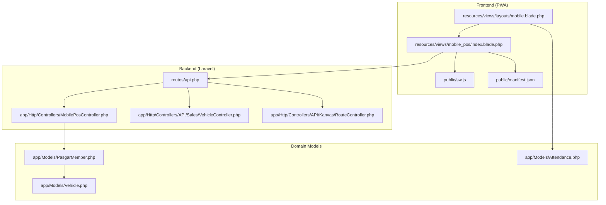
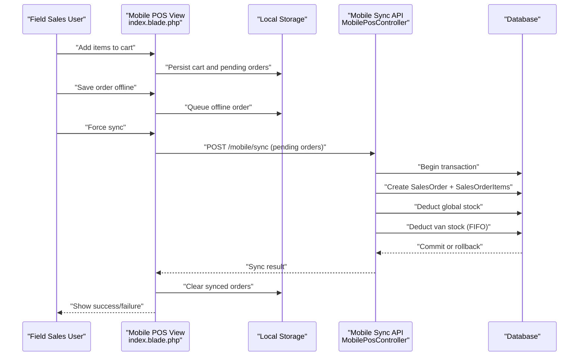
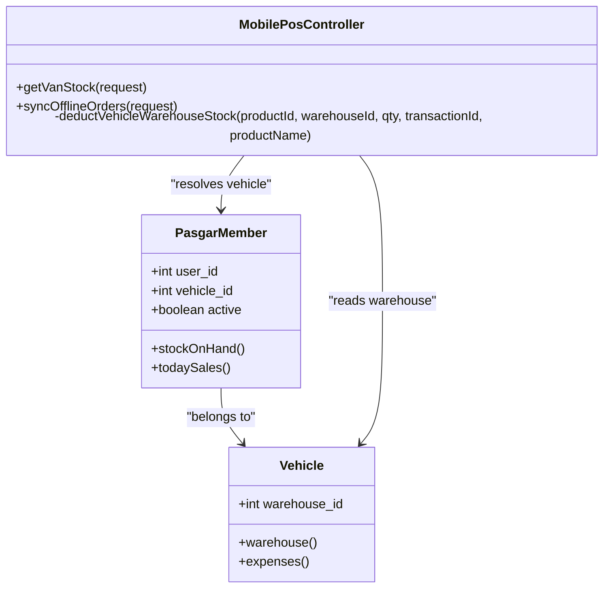

# Mobile POS System

<cite>
**Referenced Files in This Document**
- [MobilePosController.php](file://app/Http/Controllers/MobilePosController.php)
- [index.blade.php](file://resources/views/mobile_pos/index.blade.php)
- [sw.js](file://public/sw.js)
- [manifest.json](file://public/manifest.json)
- [mobile.blade.php](file://resources/views/layouts/mobile.blade.php)
- [api.php](file://routes/api.php)
- [PasgarMember.php](file://app/Models/PasgarMember.php)
- [Vehicle.php](file://app/Models/Vehicle.php)
- [Attendance.php](file://app/Models/Attendance.php)
- [RouteController.php](file://app/Http/Controllers/API/Kanvas/RouteController.php)
- [VehicleController.php](file://app/Http/Controllers/API/Sales/VehicleController.php)
</cite>

## Table of Contents
1. [Introduction](#introduction)
2. [Project Structure](#project-structure)
3. [Core Components](#core-components)
4. [Architecture Overview](#architecture-overview)
5. [Detailed Component Analysis](#detailed-component-analysis)
6. [Dependency Analysis](#dependency-analysis)
7. [Performance Considerations](#performance-considerations)
8. [Troubleshooting Guide](#troubleshooting-guide)
9. [Conclusion](#conclusion)
10. [Appendices](#appendices)

## Introduction
This document describes the Mobile POS system with a focus on Progressive Web App (PWA) architecture and offline-first field operations. It explains how the system captures transactions offline, stores data locally, and synchronizes with the central server when connectivity is restored. It also covers the touch-optimized interface, barcode scanning integration, real-time inventory visibility, conflict resolution during synchronization, and integration with biometric devices for field attendance and GPS/route-based sales.

## Project Structure
The Mobile POS implementation spans Blade templates for the PWA shell, JavaScript logic for offline-first UX, Laravel controllers for backend APIs, and supporting models for inventory and attendance.

**Diagram sources**
- [mobile.blade.php:1-250](file://resources/views/layouts/mobile.blade.php#L1-L250)
- [index.blade.php:1-555](file://resources/views/mobile_pos/index.blade.php#L1-L555)
- [sw.js:1-52](file://public/sw.js#L1-L52)
- [manifest.json:1-26](file://public/manifest.json#L1-L26)
- [api.php:1-199](file://routes/api.php#L1-L199)
- [MobilePosController.php:1-141](file://app/Http/Controllers/MobilePosController.php#L1-L141)
- [VehicleController.php:1-34](file://app/Http/Controllers/API/Sales/VehicleController.php#L1-L34)
- [RouteController.php:1-42](file://app/Http/Controllers/API/Kanvas/RouteController.php#L1-L42)
- [PasgarMember.php:1-73](file://app/Models/PasgarMember.php#L1-L73)
- [Vehicle.php:1-24](file://app/Models/Vehicle.php#L1-L24)
- [Attendance.php:1-20](file://app/Models/Attendance.php#L1-L20)

**Section sources**
- [mobile.blade.php:1-250](file://resources/views/layouts/mobile.blade.php#L1-L250)
- [index.blade.php:1-555](file://resources/views/mobile_pos/index.blade.php#L1-L555)
- [sw.js:1-52](file://public/sw.js#L1-L52)
- [manifest.json:1-26](file://public/manifest.json#L1-L26)
- [api.php:1-199](file://routes/api.php#L1-L199)

## Core Components
- PWA Shell and Service Worker: Provides offline-first behavior, caching, and app installability.
- Mobile POS View: Touch-optimized UI for product browsing, cart management, customer selection, and offline order saving.
- Backend Sync Controller: Persists offline orders, updates global and vehicle inventory, and handles synchronization errors.
- Domain Models: Link salespeople to vehicles and warehouses, enabling accurate stock deduction from the van.
- Route and Vehicle APIs: Supply route plans and vehicle/warehouse data for route-based sales and van inventory.
- Biometric Attendance Integration: Links fingerprint scans to user accounts for field attendance.

**Section sources**
- [index.blade.php:1-555](file://resources/views/mobile_pos/index.blade.php#L1-L555)
- [MobilePosController.php:1-141](file://app/Http/Controllers/MobilePosController.php#L1-L141)
- [PasgarMember.php:1-73](file://app/Models/PasgarMember.php#L1-L73)
- [Vehicle.php:1-24](file://app/Models/Vehicle.php#L1-L24)
- [api.php:1-199](file://routes/api.php#L1-L199)
- [Attendance.php:1-20](file://app/Models/Attendance.php#L1-L20)

## Architecture Overview
The Mobile POS follows an offline-first PWA pattern:
- On load, the app initializes from server-provided data when online, otherwise from local storage.
- Transactions are saved as offline drafts and queued for later synchronization.
- During sync, the backend validates stock availability and applies FIFO-based deductions from the salesperson’s vehicle warehouse.

**Diagram sources**
- [index.blade.php:498-533](file://resources/views/mobile_pos/index.blade.php#L498-L533)
- [mobile.blade.php:196-246](file://resources/views/layouts/mobile.blade.php#L196-L246)
- [MobilePosController.php:45-102](file://app/Http/Controllers/MobilePosController.php#L45-L102)
- [MobilePosController.php:104-139](file://app/Http/Controllers/MobilePosController.php#L104-L139)

## Detailed Component Analysis

### PWA Shell and Service Worker
- Service Worker: Installs a named cache, activates by replacing older caches, and serves assets from cache first. It falls back to cached POS page for HTML requests when offline.
- Manifest: Defines app metadata, start URL, display mode, theme/background colors, and icons for installation.

Practical implications:
- The POS remains usable offline after initial load.
- Assets are cached to reduce bandwidth and improve load times.
- Users can install the app for native-like experience.

**Section sources**
- [sw.js:1-52](file://public/sw.js#L1-L52)
- [manifest.json:1-26](file://public/manifest.json#L1-L26)
- [mobile.blade.php:10-22](file://resources/views/layouts/mobile.blade.php#L10-L22)

### Mobile POS View (Touch-Optimized UI)
Key capabilities:
- Initializes product and customer catalogs from server when online, otherwise from local storage.
- Renders product cards with dynamic van stock indicators and quantity controls.
- Supports customer type-based pricing (retail vs wholesale).
- Saves orders offline to a queue in local storage and attempts background sync when online.
- Shows a floating cart summary and a full-screen cart modal for checkout.

Touch optimizations:
- Large buttons and swipe-friendly layout.
- Sticky search bar and safe-area insets for modern phones.
- Immediate feedback via toast notifications.

Barcode scanning integration:
- The product creation form includes a barcode input field suitable for scanner integration.
- The POS view supports text search by product code, enabling barcode scanning to filter items.

Real-time inventory updates:
- Dynamic van stock is computed by subtracting pending offline orders and current cart from stored van stock.
- Van stock is refreshed on initialization and can be fetched via a dedicated endpoint.

**Section sources**
- [index.blade.php:1-555](file://resources/views/mobile_pos/index.blade.php#L1-L555)
- [mobile.blade.php:176-247](file://resources/views/layouts/mobile.blade.php#L176-L247)

### Mobile Transaction Processing and Data Synchronization
- Offline order saving: Orders are serialized to local storage with a unique offline ID, total amount, and timestamps. They remain unsynced until manually triggered or when online.
- Background sync: When online, the app posts the pending queue to the backend sync endpoint. On success, the queue is cleared; on failure, the user is notified.
- Backend sync logic:
  - Creates sales orders and items.
  - Updates global product stock.
  - Deducts van stock using FIFO from the salesperson’s vehicle warehouse.
  - Uses database transactions to ensure atomicity.
  - Throws explicit errors for insufficient van stock to surface conflicts.

Conflict resolution:
- Insufficient van stock triggers a specific error message indicating missing quantities.
- The app can retry sync after restocking or adjusting quantities.

**Section sources**
- [index.blade.php:498-533](file://resources/views/mobile_pos/index.blade.php#L498-L533)
- [mobile.blade.php:196-246](file://resources/views/layouts/mobile.blade.php#L196-L246)
- [MobilePosController.php:45-102](file://app/Http/Controllers/MobilePosController.php#L45-L102)
- [MobilePosController.php:104-139](file://app/Http/Controllers/MobilePosController.php#L104-L139)

### Local Storage Management
- Stores:
  - Product catalog and customer list when online.
  - Van stock snapshot keyed by product ID.
  - Pending offline orders queue.
- Retrieval:
  - On subsequent loads, the app restores UI state from local storage if offline.
- Cleanup:
  - After successful sync, the pending queue is removed.

Best practices:
- Use structured keys to avoid collisions.
- Persist minimal data to reduce storage footprint.
- Implement periodic cleanup for very old entries.

**Section sources**
- [index.blade.php:318-351](file://resources/views/mobile_pos/index.blade.php#L318-L351)
- [index.blade.php:512-515](file://resources/views/mobile_pos/index.blade.php#L512-L515)
- [mobile.blade.php:207-233](file://resources/views/layouts/mobile.blade.php#L207-L233)

### Route-Based Sales and GPS Tracking
- Route retrieval: The backend provides daily route stores for the current day, enabling field sales to navigate planned stops.
- Vehicle/warehouse linkage: Salespeople are linked to vehicles and warehouses, ensuring accurate van stock visibility and deductions.

Note: The current PWA view focuses on offline order capture and sync. Route navigation and GPS tracking are supported by the backend route APIs and can be integrated into the PWA UI for turn-by-turn directions and check-ins.

**Section sources**
- [api.php:163-198](file://routes/api.php#L163-L198)
- [RouteController.php:17-42](file://app/Http/Controllers/API/Kanvas/RouteController.php#L17-L42)
- [VehicleController.php:15-33](file://app/Http/Controllers/API/Sales/VehicleController.php#L15-L33)
- [PasgarMember.php:49-61](file://app/Models/PasgarMember.php#L49-L61)

### Biometric Devices for Field Attendance
- Fingerprint configuration: Store settings support configuring the fingerprint device IP and port.
- Attendance model: Stores fingerprint ID, check-in/out times, and derived status.
- Backend attendance controller: Handles fingerprint scans, deduplication by fingerprint ID and date, and updates for check-in/out windows.

Integration with Mobile POS:
- While the POS app itself does not directly handle fingerprint scanning, the attendance system can be surfaced within the same PWA shell for field staff to manage check-ins and view reports.

**Section sources**
- [Attendance.php:1-20](file://app/Models/Attendance.php#L1-L20)
- [mobile.blade.php:10-22](file://resources/views/layouts/mobile.blade.php#L10-L22)

## Dependency Analysis
The Mobile POS relies on several domain models and controllers to enforce accurate inventory and user-vehicle linkage.

**Diagram sources**
- [PasgarMember.php:1-73](file://app/Models/PasgarMember.php#L1-L73)
- [Vehicle.php:1-24](file://app/Models/Vehicle.php#L1-L24)
- [MobilePosController.php:18-43](file://app/Http/Controllers/MobilePosController.php#L18-L43)
- [MobilePosController.php:104-139](file://app/Http/Controllers/MobilePosController.php#L104-L139)

**Section sources**
- [PasgarMember.php:1-73](file://app/Models/PasgarMember.php#L1-L73)
- [Vehicle.php:1-24](file://app/Models/Vehicle.php#L1-L24)
- [MobilePosController.php:18-43](file://app/Http/Controllers/MobilePosController.php#L18-L43)
- [MobilePosController.php:104-139](file://app/Http/Controllers/MobilePosController.php#L104-L139)

## Performance Considerations
- Cache-first strategy reduces latency and improves reliability in poor networks.
- Local rendering of product grids avoids repeated network calls for UI updates.
- FIFO stock deduction ensures predictable inventory behavior and minimizes discrepancies.
- Batch sync consolidates multiple offline orders into a single transaction to reduce overhead.

## Troubleshooting Guide
Common issues and resolutions:
- Offline mode: If the POS shows “Sedang OFFLINE dan Belum Ada Data tersimpan,” ensure the device connects and refreshes to populate local storage.
- Insufficient van stock: When sync fails due to lack of van stock, adjust quantities or restock the vehicle before retrying.
- No network during sync: The sync toast indicates failure; reconnect and retry.
- Persistent offline orders: If orders do not clear after sync, verify the sync endpoint response and retry.

**Section sources**
- [index.blade.php:357-360](file://resources/views/mobile_pos/index.blade.php#L357-L360)
- [MobilePosController.php:136-138](file://app/Http/Controllers/MobilePosController.php#L136-L138)
- [mobile.blade.php:196-246](file://resources/views/layouts/mobile.blade.php#L196-L246)

## Conclusion
The Mobile POS system leverages a robust PWA foundation to enable reliable field operations in offline environments. Its offline-first design, combined with precise inventory tracking from the salesperson’s vehicle, ensures accurate sales processing and smooth synchronization. Integrations for route-based sales, barcode scanning, and biometric attendance further enhance field productivity and operational oversight.

## Appendices

### Practical Scenarios and Examples
- Offline operation scenario:
  - Salesperson opens the app while traveling; the UI renders from local storage.
  - They add items to the cart; the van stock indicator reflects pending deductions.
  - At checkout, they save the order offline; it appears in the cart modal.
  - Later, when online, they trigger sync; the backend creates sales orders and updates stocks.
- Sync conflict resolution:
  - If van stock is insufficient, the backend throws a specific error; the user adjusts quantities or restocks before retrying.
- Mobile device management:
  - Use the app manifest and service worker to ensure consistent caching and installation.
  - Monitor network status badges and toast notifications for immediate feedback.

[No sources needed since this section provides general guidance]