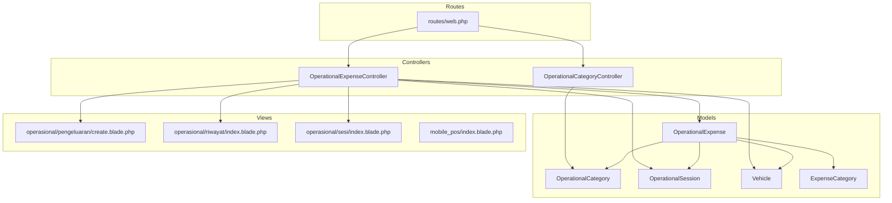
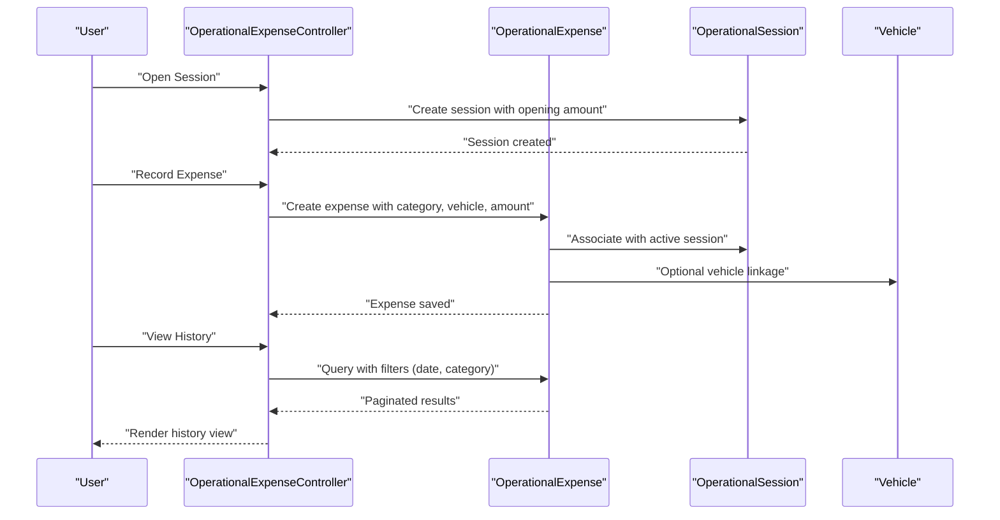
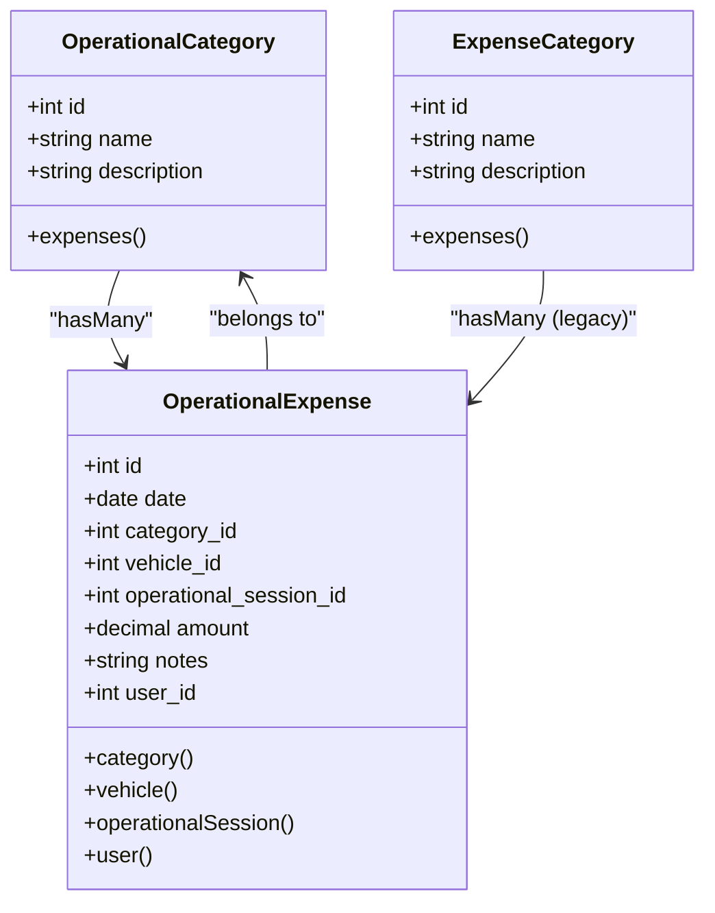
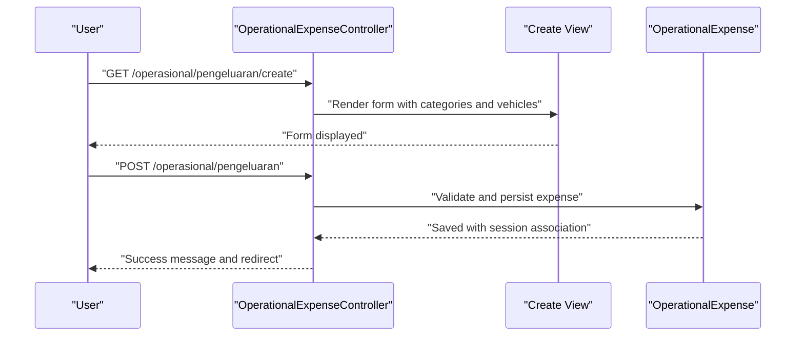
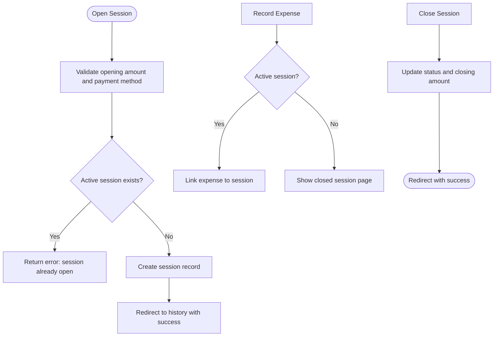
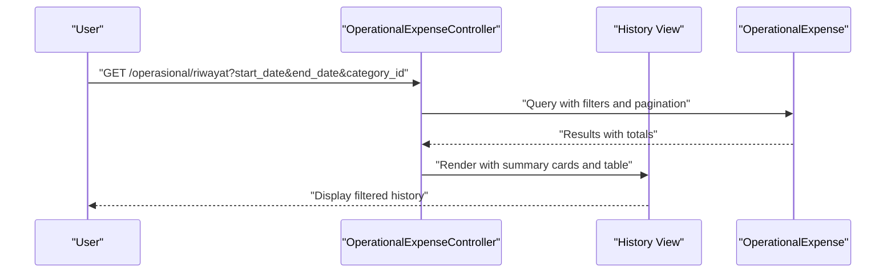
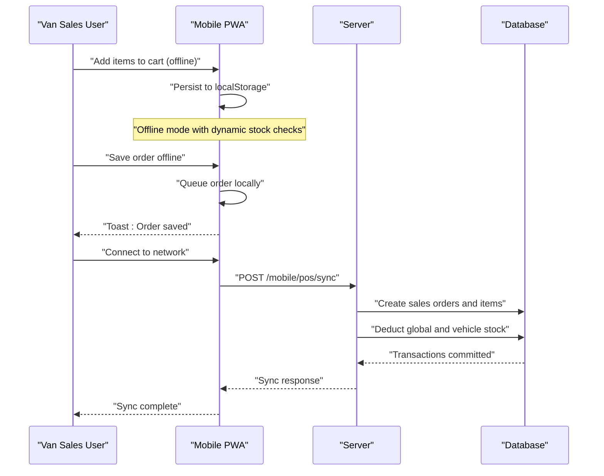
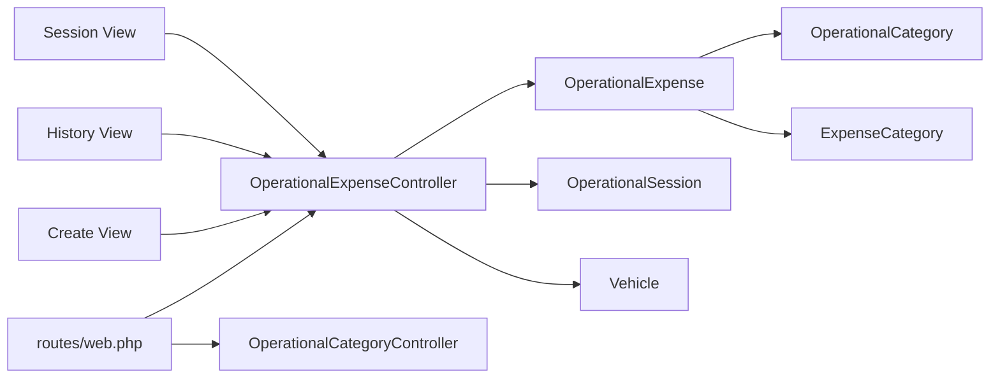

# Operational Expenses

<cite>
**Referenced Files in This Document**
- [OperationalExpenseController.php](file://app/Http/Controllers/OperationalExpenseController.php)
- [OperationalCategoryController.php](file://app/Http/Controllers/OperationalCategoryController.php)
- [OperationalExpense.php](file://app/Models/OperationalExpense.php)
- [OperationalCategory.php](file://app/Models/OperationalCategory.php)
- [ExpenseCategory.php](file://app/Models/ExpenseCategory.php)
- [OperationalSession.php](file://app/Models/OperationalSession.php)
- [Vehicle.php](file://app/Models/Vehicle.php)
- [web.php](file://routes/web.php)
- [2026_02_27_142200_create_operational_expenses_table.php](file://database/migrations/2026_02_27_142200_create_operational_expenses_table.php)
- [2026_02_27_123055_create_expense_categories_table.php](file://database/migrations/2026_02_27_123055_create_expense_categories_table.php)
- [2026_02_27_142138_create_operational_categories_table.php](file://database/migrations/2026_02_27_142138_create_operational_categories_table.php)
- [create.blade.php](file://resources/views/operasional/pengeluaran/create.blade.php)
- [index.blade.php](file://resources/views/operasional/riwayat/index.blade.php)
- [index.blade.php](file://resources/views/operasional/sesi/index.blade.php)
- [MobilePosController.php](file://app/Http/Controllers/MobilePosController.php)
- [index.blade.php](file://resources/views/mobile_pos/index.blade.php)
</cite>

## Table of Contents
1. [Introduction](#introduction)
2. [Project Structure](#project-structure)
3. [Core Components](#core-components)
4. [Architecture Overview](#architecture-overview)
5. [Detailed Component Analysis](#detailed-component-analysis)
6. [Dependency Analysis](#dependency-analysis)
7. [Performance Considerations](#performance-considerations)
8. [Troubleshooting Guide](#troubleshooting-guide)
9. [Conclusion](#conclusion)
10. [Appendices](#appendices)

## Introduction
This document describes the operational expenses system designed for daily expense tracking and management within a point-of-sale (POS) environment. It covers expense category management, daily expense recording, session-based cash control, reporting, and integration with POS revenue tracking. Practical examples illustrate expense entry, category classification, approval-related permissions, and expense analysis. The system also supports mobile expense capture via a PWA and integrates with POS revenue streams for comprehensive financial visibility.

## Project Structure
The operational expenses module is implemented as a Laravel application with dedicated controllers, models, views, and routes. The system centers around:
- Controllers for operational categories, expenses, and sessions
- Models representing categories, expenses, sessions, vehicles, and legacy expense categories
- Blade views for creating, listing, and managing expenses and sessions
- Routes defining permissions and endpoints for operational workflows
- Database migrations establishing schema for operational data and POS session support

**Diagram sources**
- [OperationalExpenseController.php:12-210](file://app/Http/Controllers/OperationalExpenseController.php#L12-L210)
- [OperationalCategoryController.php:8-46](file://app/Http/Controllers/OperationalCategoryController.php#L8-L46)
- [OperationalExpense.php:7-44](file://app/Models/OperationalExpense.php#L7-L44)
- [OperationalCategory.php:8-19](file://app/Models/OperationalCategory.php#L8-L19)
- [ExpenseCategory.php:7-19](file://app/Models/ExpenseCategory.php#L7-L19)
- [OperationalSession.php:7-28](file://app/Models/OperationalSession.php#L7-L28)
- [Vehicle.php:8-24](file://app/Models/Vehicle.php#L8-L24)
- [web.php:626-682](file://routes/web.php#L626-L682)
- [create.blade.php:1-246](file://resources/views/operasional/pengeluaran/create.blade.php#L1-L246)
- [index.blade.php:1-301](file://resources/views/operasional/riwayat/index.blade.php#L1-L301)
- [index.blade.php:1-418](file://resources/views/operasional/sesi/index.blade.php#L1-L418)
- [index.blade.php:1-555](file://resources/views/mobile_pos/index.blade.php#L1-L555)

**Section sources**
- [OperationalExpenseController.php:12-210](file://app/Http/Controllers/OperationalExpenseController.php#L12-L210)
- [OperationalCategoryController.php:8-46](file://app/Http/Controllers/OperationalCategoryController.php#L8-L46)
- [OperationalExpense.php:7-44](file://app/Models/OperationalExpense.php#L7-L44)
- [OperationalCategory.php:8-19](file://app/Models/OperationalCategory.php#L8-L19)
- [ExpenseCategory.php:7-19](file://app/Models/ExpenseCategory.php#L7-L19)
- [OperationalSession.php:7-28](file://app/Models/OperationalSession.php#L7-L28)
- [Vehicle.php:8-24](file://app/Models/Vehicle.php#L8-L24)
- [web.php:626-682](file://routes/web.php#L626-L682)

## Core Components
- OperationalExpenseController: Handles creation, listing, editing, updating, and deletion of operational expenses; manages session opening and closing; filters by date range and category.
- OperationalCategoryController: Manages operational expense categories with CRUD operations.
- OperationalExpense model: Defines fillable attributes, casts, and relationships to session, category, vehicle, and user.
- OperationalCategory model: Defines fillable attributes and relationship to expenses.
- ExpenseCategory model: Legacy category model for general expense categories.
- OperationalSession model: Tracks session lifecycle, cash amounts, and associated expenses.
- Vehicle model: Links vehicles to expenses and session stock deductions.
- Routes: Define permissions for session management, expense creation/edit/delete, and category management.
- Views: Provide forms and lists for expense entry, history, and session control.

Key capabilities:
- Daily expense recording with category and optional vehicle association
- Session-based cash control with opening and closing
- Filtering and reporting by date range and category
- Mobile PWA for offline-first POS operations integrated with revenue tracking

**Section sources**
- [OperationalExpenseController.php:17-208](file://app/Http/Controllers/OperationalExpenseController.php#L17-L208)
- [OperationalCategoryController.php:10-44](file://app/Http/Controllers/OperationalCategoryController.php#L10-L44)
- [OperationalExpense.php:9-42](file://app/Models/OperationalExpense.php#L9-L42)
- [OperationalCategory.php:12-17](file://app/Models/OperationalCategory.php#L12-L17)
- [ExpenseCategory.php:9-17](file://app/Models/ExpenseCategory.php#L9-L17)
- [OperationalSession.php:9-26](file://app/Models/OperationalSession.php#L9-L26)
- [Vehicle.php:12-22](file://app/Models/Vehicle.php#L12-L22)
- [web.php:626-682](file://routes/web.php#L626-L682)

## Architecture Overview
The system follows MVC architecture with explicit separation of concerns:
- Controllers orchestrate requests and delegate to models
- Models encapsulate business logic and relationships
- Views render UI and collect user input
- Routes define endpoints and permission gates
- Database migrations establish schema for operational and POS data

**Diagram sources**
- [OperationalExpenseController.php:97-166](file://app/Http/Controllers/OperationalExpenseController.php#L97-L166)
- [OperationalExpense.php:24-42](file://app/Models/OperationalExpense.php#L24-L42)
- [OperationalSession.php:23-26](file://app/Models/OperationalSession.php#L23-L26)
- [Vehicle.php:19-22](file://app/Models/Vehicle.php#L19-L22)

## Detailed Component Analysis

### Expense Category Management
- Purpose: Maintain reusable categories for operational expenses.
- Implementation:
  - CRUD endpoints via OperationalCategoryController
  - Permissions enforced in routes for viewing, creating, editing, and deleting categories
  - Categories are selectable during expense creation

**Diagram sources**
- [OperationalCategory.php:8-19](file://app/Models/OperationalCategory.php#L8-L19)
- [ExpenseCategory.php:7-19](file://app/Models/ExpenseCategory.php#L7-L19)
- [OperationalExpense.php:24-42](file://app/Models/OperationalExpense.php#L24-L42)

**Section sources**
- [OperationalCategoryController.php:10-44](file://app/Http/Controllers/OperationalCategoryController.php#L10-L44)
- [web.php:627-638](file://routes/web.php#L627-L638)
- [2026_02_27_142138_create_operational_categories_table.php:14-19](file://database/migrations/2026_02_27_142138_create_operational_categories_table.php#L14-L19)

### Daily Expense Recording
- Purpose: Capture daily operational expenses with category, optional vehicle, and amount.
- Implementation:
  - Expense creation form renders categories and vehicles
  - Validation ensures required fields and numeric amounts
  - Association with active session if present
  - Editing and deletion supported with appropriate permissions

**Diagram sources**
- [OperationalExpenseController.php:82-166](file://app/Http/Controllers/OperationalExpenseController.php#L82-L166)
- [create.blade.php:50-132](file://resources/views/operasional/pengeluaran/create.blade.php#L50-L132)

**Section sources**
- [OperationalExpenseController.php:82-166](file://app/Http/Controllers/OperationalExpenseController.php#L82-L166)
- [create.blade.php:1-246](file://resources/views/operasional/pengeluaran/create.blade.php#L1-L246)
- [2026_02_27_142200_create_operational_expenses_table.php:14-22](file://database/migrations/2026_02_27_142200_create_operational_expenses_table.php#L14-L22)

### Session-Based Cash Control
- Purpose: Track cash allocation, usage, and remaining balance per day.
- Implementation:
  - Open/close session endpoints with validation
  - Active session summary with used and remaining balances
  - Session history with totals and status
  - Permissions gate session management actions

**Diagram sources**
- [OperationalExpenseController.php:97-138](file://app/Http/Controllers/OperationalExpenseController.php#L97-L138)
- [index.blade.php:154-197](file://resources/views/operasional/sesi/index.blade.php#L154-L197)

**Section sources**
- [OperationalExpenseController.php:97-138](file://app/Http/Controllers/OperationalExpenseController.php#L97-L138)
- [index.blade.php:1-418](file://resources/views/operasional/sesi/index.blade.php#L1-L418)
- [web.php:653-658](file://routes/web.php#L653-L658)

### Expense Reporting and Analysis
- Purpose: Provide filtered history, totals, and summaries for analysis.
- Implementation:
  - Filters by date range and category
  - Totals computed before pagination
  - Summary cards for total expenses and transaction counts
  - Edit/delete actions per record

**Diagram sources**
- [OperationalExpenseController.php:50-77](file://app/Http/Controllers/OperationalExpenseController.php#L50-L77)
- [index.blade.php:43-173](file://resources/views/operasional/riwayat/index.blade.php#L43-L173)

**Section sources**
- [OperationalExpenseController.php:50-77](file://app/Http/Controllers/OperationalExpenseController.php#L50-L77)
- [index.blade.php:1-301](file://resources/views/operasional/riwayat/index.blade.php#L1-L301)

### Approval Workflows
- Current state: The operational expenses module does not implement formal approval workflows. Session management and expense creation/edit/delete are controlled via permissions rather than multi-level approvals.
- Recommended enhancements (conceptual):
  - Add approval statuses and approver assignments
  - Introduce approval routes and middleware
  - Extend views to show approval history and status indicators

[No sources needed since this section provides conceptual guidance]

### Budget Tracking
- Current state: The system does not implement dedicated budget tracking. Users can filter expenses by category and date range for analysis.
- Recommended enhancements (conceptual):
  - Add budget limits per category or period
  - Compare actual vs. budgeted amounts
  - Alert mechanisms when thresholds are exceeded

[No sources needed since this section provides conceptual guidance]

### Integration with Accounting Systems and Financial Reporting
- Current state: The operational expenses module focuses on internal tracking and reporting. There is no direct integration with external accounting systems in the provided code.
- Recommended enhancements (conceptual):
  - Export historical data to CSV/XLSX for accounting import
  - Generate standardized reports consumable by accounting software
  - Sync periodic exports to ERP/Accounting APIs

[No sources needed since this section provides conceptual guidance]

### Mobile Expense Capture and POS Revenue Integration
- Mobile PWA for POS:
  - Provides offline-first experience with IndexedDB persistence
  - Supports product search, cart management, and offline order saving
  - Synchronizes offline orders to server upon connectivity
  - Deducts vehicle warehouse stock and logs movements
- POS revenue tracking:
  - POS sessions include payment method and cash variance fields
  - Mobile PWA integrates with POS by syncing sales orders and reducing stock

**Diagram sources**
- [MobilePosController.php:45-102](file://app/Http/Controllers/MobilePosController.php#L45-L102)
- [index.blade.php:319-551](file://resources/views/mobile_pos/index.blade.php#L319-L551)
- [web.php:1099-1103](file://routes/web.php#L1099-L1103)

**Section sources**
- [MobilePosController.php:18-141](file://app/Http/Controllers/MobilePosController.php#L18-L141)
- [index.blade.php:1-555](file://resources/views/mobile_pos/index.blade.php#L1-L555)
- [web.php:1099-1103](file://routes/web.php#L1099-L1103)

## Dependency Analysis
- Controllers depend on models for persistence and relationships
- Views depend on controller-provided data and routes
- Routes define permissions for each action
- Migrations define schema for operational and POS data

**Diagram sources**
- [web.php:626-682](file://routes/web.php#L626-L682)
- [OperationalExpenseController.php:12-210](file://app/Http/Controllers/OperationalExpenseController.php#L12-L210)
- [OperationalCategoryController.php:8-46](file://app/Http/Controllers/OperationalCategoryController.php#L8-L46)
- [OperationalExpense.php:7-44](file://app/Models/OperationalExpense.php#L7-L44)
- [OperationalCategory.php:8-19](file://app/Models/OperationalCategory.php#L8-L19)
- [ExpenseCategory.php:7-19](file://app/Models/ExpenseCategory.php#L7-L19)
- [OperationalSession.php:7-28](file://app/Models/OperationalSession.php#L7-L28)
- [Vehicle.php:8-24](file://app/Models/Vehicle.php#L8-L24)
- [create.blade.php:1-246](file://resources/views/operasional/pengeluaran/create.blade.php#L1-L246)
- [index.blade.php:1-301](file://resources/views/operasional/riwayat/index.blade.php#L1-L301)
- [index.blade.php:1-418](file://resources/views/operasional/sesi/index.blade.php#L1-L418)

**Section sources**
- [web.php:626-682](file://routes/web.php#L626-L682)
- [OperationalExpenseController.php:12-210](file://app/Http/Controllers/OperationalExpenseController.php#L12-L210)
- [OperationalCategoryController.php:8-46](file://app/Http/Controllers/OperationalCategoryController.php#L8-L46)
- [OperationalExpense.php:7-44](file://app/Models/OperationalExpense.php#L7-L44)
- [OperationalCategory.php:8-19](file://app/Models/OperationalCategory.php#L8-L19)
- [ExpenseCategory.php:7-19](file://app/Models/ExpenseCategory.php#L7-L19)
- [OperationalSession.php:7-28](file://app/Models/OperationalSession.php#L7-L28)
- [Vehicle.php:8-24](file://app/Models/Vehicle.php#L8-L24)

## Performance Considerations
- Pagination: Expense listing uses pagination to limit result sets.
- Aggregation: Totals and counts are computed before pagination for accurate summaries.
- Database indexing: Consider adding indexes on frequently filtered columns (date, category_id, user_id) to improve query performance.
- Batch operations: When syncing mobile orders, batch processing reduces transaction overhead.

[No sources needed since this section provides general guidance]

## Troubleshooting Guide
Common issues and resolutions:
- Active session conflicts: Opening a session fails if one is already open; ensure to close the current session first.
- Expense without active session: Creating an expense requires an open session; open a session before recording expenses.
- Validation errors: Ensure required fields (date, category, amount) are provided and formatted correctly.
- Mobile sync failures: Verify network connectivity and review server logs for sync exceptions.

**Section sources**
- [OperationalExpenseController.php:97-118](file://app/Http/Controllers/OperationalExpenseController.php#L97-L118)
- [OperationalExpenseController.php:143-166](file://app/Http/Controllers/OperationalExpenseController.php#L143-L166)
- [MobilePosController.php:97-101](file://app/Http/Controllers/MobilePosController.php#L97-L101)

## Conclusion
The operational expenses system provides robust daily expense tracking with session-based cash control, category management, and reporting capabilities. Integration with the POS mobile PWA enables offline-first operations and seamless synchronization with revenue tracking. While formal approval workflows and budget tracking are not currently implemented, the modular design allows for incremental enhancements to meet evolving business needs.

## Appendices

### Practical Examples
- Expense entry:
  - Navigate to the expense creation form, select category and optional vehicle, enter amount and notes, then submit.
- Category classification:
  - Use operational categories to classify expenses consistently across departments or cost centers.
- Approval hierarchy:
  - Manage permissions to control who can open/close sessions and approve expenses.
- Expense analysis:
  - Filter by date range and category to analyze spending trends and reconcile with revenue.

[No sources needed since this section provides general guidance]