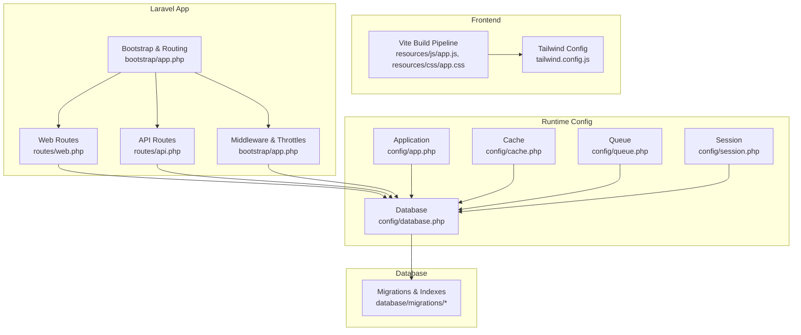
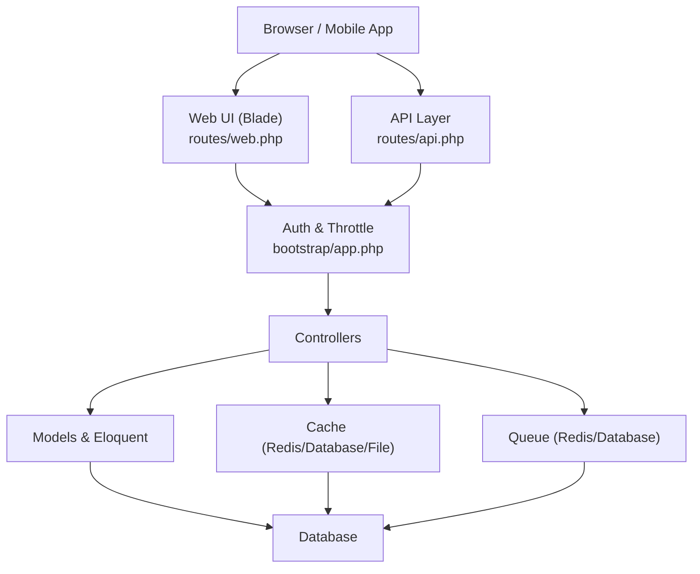
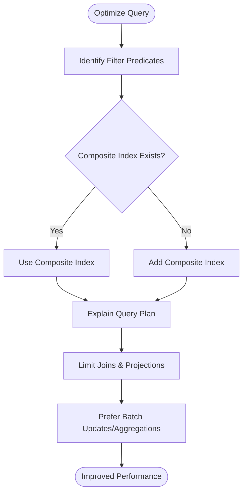
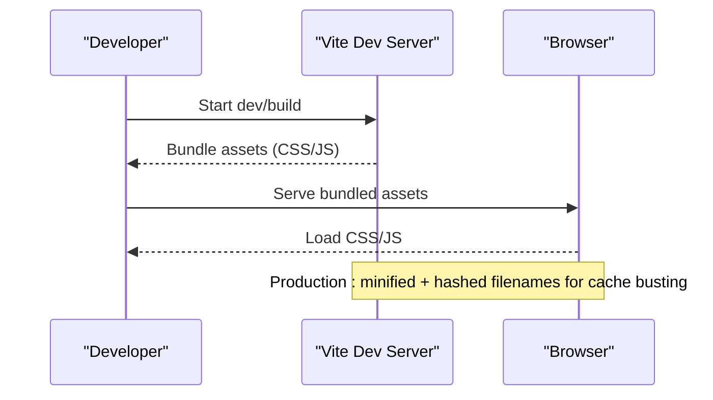
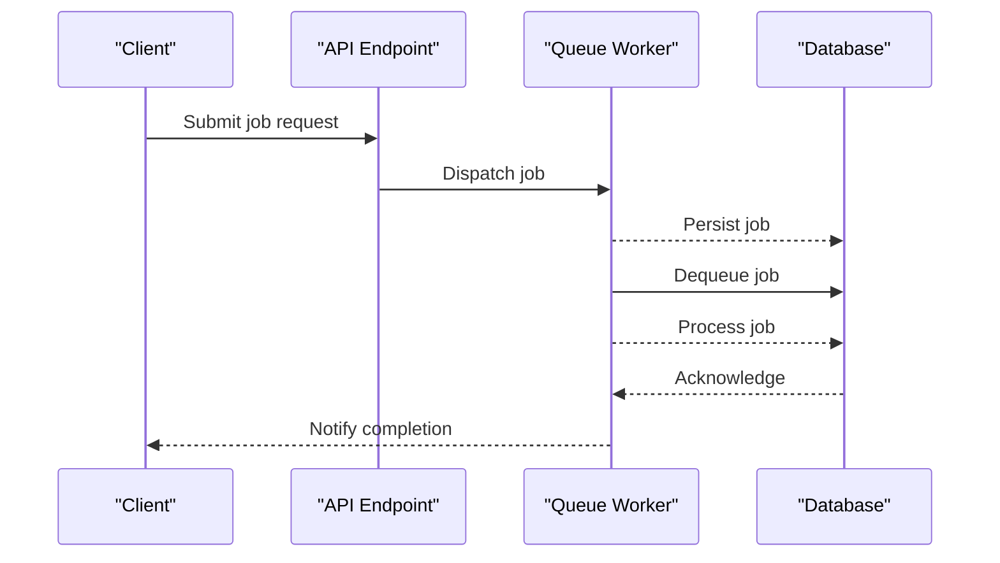
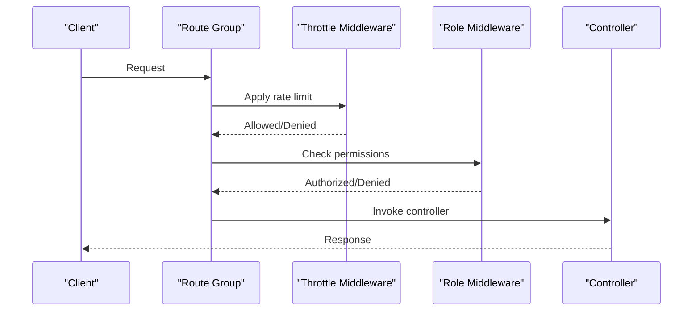
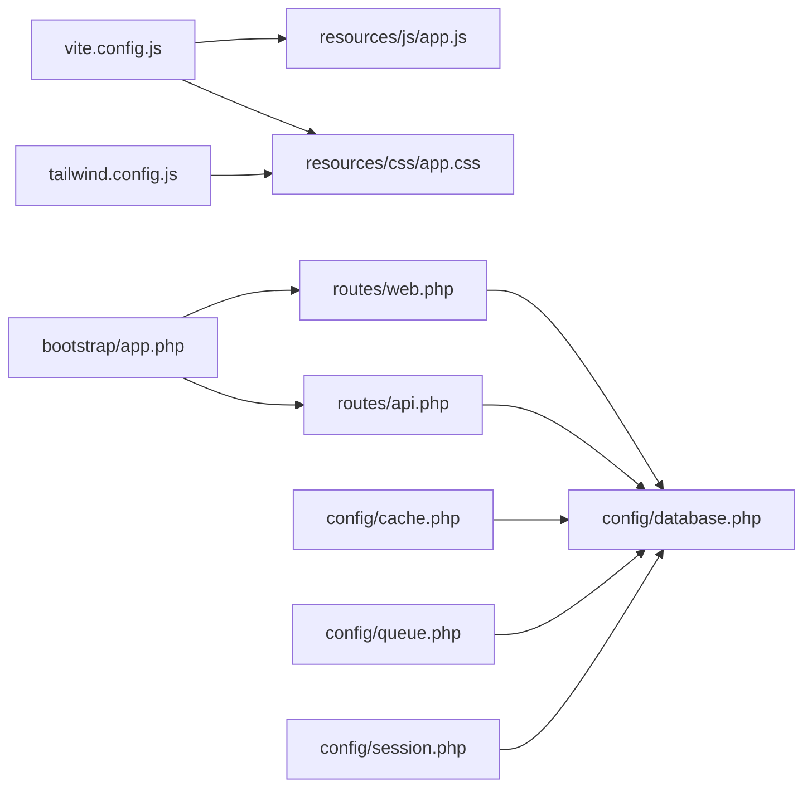

# Performance & Optimization

<cite>
**Referenced Files in This Document**
- [app.php](file://config/app.php)
- [database.php](file://config/database.php)
- [cache.php](file://config/cache.php)
- [queue.php](file://config/queue.php)
- [session.php](file://config/session.php)
- [vite.config.js](file://vite.config.js)
- [package.json](file://package.json)
- [app.js](file://resources/js/app.js)
- [app.css](file://resources/css/app.css)
- [tailwind.config.js](file://tailwind.config.js)
- [2026_02_28_185411_add_performance_indexes_to_tables.php](file://database/migrations/2026_02_28_185411_add_performance_indexes_to_tables.php)
- [2026_03_14_210000_add_indexes_for_hr_payroll_performance.php](file://database/migrations/2026_03_14_210000_add_indexes_for_hr_payroll_performance.php)
- [web.php](file://routes/web.php)
- [api.php](file://routes/api.php)
- [app.php](file://bootstrap/app.php)
</cite>

## Table of Contents
1. [Introduction](#introduction)
2. [Project Structure](#project-structure)
3. [Core Components](#core-components)
4. [Architecture Overview](#architecture-overview)
5. [Detailed Component Analysis](#detailed-component-analysis)
6. [Dependency Analysis](#dependency-analysis)
7. [Performance Considerations](#performance-considerations)
8. [Troubleshooting Guide](#troubleshooting-guide)
9. [Conclusion](#conclusion)
10. [Appendices](#appendices)

## Introduction
This document focuses on performance optimization and system tuning for DODPOS, with an emphasis on scalability and efficiency. It covers database optimization strategies (indexing, query optimization, connection pooling), frontend performance improvements (asset bundling, caching, progressive loading), Laravel framework optimizations (queues, background job management), and practical monitoring and scaling guidance. The goal is to help production deployments handle increased concurrency, reduce response times, and maintain responsiveness under load.

## Project Structure
DODPOS is a Laravel application with a modular feature layout, extensive database migrations, and a modern frontend pipeline using Vite and TailwindCSS. The routing is split between web and API routes, with role-based access control and throttling applied at the framework level.

**Diagram sources**
- [vite.config.js:1-12](file://vite.config.js#L1-L12)
- [tailwind.config.js:1-22](file://tailwind.config.js#L1-L22)
- [app.js:1-8](file://resources/js/app.js#L1-L8)
- [app.css:1-156](file://resources/css/app.css#L1-L156)
- [bootstrap/app.php:1-57](file://bootstrap/app.php#L1-L57)
- [web.php:1-800](file://routes/web.php#L1-L800)
- [api.php:1-199](file://routes/api.php#L1-L199)
- [app.php:1-127](file://config/app.php#L1-L127)
- [database.php:1-184](file://config/database.php#L1-L184)
- [cache.php:1-118](file://config/cache.php#L1-L118)
- [queue.php:1-130](file://config/queue.php#L1-L130)
- [session.php:1-218](file://config/session.php#L1-L218)
- [2026_02_28_185411_add_performance_indexes_to_tables.php:1-192](file://database/migrations/2026_02_28_185411_add_performance_indexes_to_tables.php#L1-L192)
- [2026_03_14_210000_add_indexes_for_hr_payroll_performance.php:1-1108](file://database/migrations/2026_03_14_210000_add_indexes_for_hr_payroll_performance.php#L1-L1108)

**Section sources**
- [vite.config.js:1-12](file://vite.config.js#L1-L12)
- [tailwind.config.js:1-22](file://tailwind.config.js#L1-L22)
- [bootstrap/app.php:1-57](file://bootstrap/app.php#L1-L57)
- [web.php:1-800](file://routes/web.php#L1-L800)
- [api.php:1-199](file://routes/api.php#L1-L199)
- [app.php:1-127](file://config/app.php#L1-L127)
- [database.php:1-184](file://config/database.php#L1-L184)
- [cache.php:1-118](file://config/cache.php#L1-L118)
- [queue.php:1-130](file://config/queue.php#L1-L130)
- [session.php:1-218](file://config/session.php#L1-L218)

## Core Components
- Database configuration supports multiple drivers and Redis-backed stores, enabling flexible caching and queue backends.
- Frontend assets are built via Vite with TailwindCSS for styling, supporting development and production builds.
- Routing enforces role-based access control and API throttling to protect endpoints.
- Migrations include targeted indexes to accelerate common report and inventory queries.

Key runtime configuration highlights:
- Application environment, debug mode, timezone, and maintenance driver.
- Database connections for sqlite/mysql/mariadb/pgsql/sqlsrv with SSL options and charset settings.
- Cache stores including database, file, memcached, redis, dynamodb, octane, failover.
- Queue backends including sync, database, beanstalkd, sqs, redis, deferred, background, failover.
- Session drivers including file, cookie, database, memcached, redis, dynamodb, array.
- Frontend build pipeline configured for CSS/JS bundling and hot reload.

**Section sources**
- [app.php:1-127](file://config/app.php#L1-L127)
- [database.php:1-184](file://config/database.php#L1-L184)
- [cache.php:1-118](file://config/cache.php#L1-L118)
- [queue.php:1-130](file://config/queue.php#L1-L130)
- [session.php:1-218](file://config/session.php#L1-L218)
- [vite.config.js:1-12](file://vite.config.js#L1-L12)
- [package.json:1-22](file://package.json#L1-L22)

## Architecture Overview
The system follows a layered architecture:
- Presentation layer: Blade templates and API endpoints.
- Application layer: Controllers, middleware, and route groups.
- Persistence layer: Eloquent ORM with database-specific configurations and Redis-backed cache/queue.
- Asset pipeline: Vite + TailwindCSS for efficient frontend bundling.

**Diagram sources**
- [web.php:1-800](file://routes/web.php#L1-L800)
- [api.php:1-199](file://routes/api.php#L1-L199)
- [bootstrap/app.php:1-57](file://bootstrap/app.php#L1-L57)
- [database.php:1-184](file://config/database.php#L1-L184)
- [cache.php:1-118](file://config/cache.php#L1-L118)
- [queue.php:1-130](file://config/queue.php#L1-L130)

## Detailed Component Analysis

### Database Optimization Strategies
- Indexing: Targeted indexes exist for frequently filtered columns in transactions, purchase orders, product stocks, stock movements, customer credits, sales orders, products, and supplier debts. These indexes improve report performance and reduce query times.
- Query optimization: Use selective projections, limit joins, and leverage composite indexes aligned to filter predicates. Prefer bulk operations for batch updates and aggregations.
- Connection pooling: Configure persistent connections for MySQL/MariaDB and adjust PDO options for SSL and timeouts. Tune pool sizes at the web server and database level.

**Diagram sources**
- [2026_02_28_185411_add_performance_indexes_to_tables.php:18-191](file://database/migrations/2026_02_28_185411_add_performance_indexes_to_tables.php#L18-L191)
- [2026_03_14_210000_add_indexes_for_hr_payroll_performance.php:1-1108](file://database/migrations/2026_03_14_210000_add_indexes_for_hr_payroll_performance.php#L1-L1108)

**Section sources**
- [2026_02_28_185411_add_performance_indexes_to_tables.php:18-191](file://database/migrations/2026_02_28_185411_add_performance_indexes_to_tables.php#L18-L191)
- [2026_03_14_210000_add_indexes_for_hr_payroll_performance.php:1-1108](file://database/migrations/2026_03_14_210000_add_indexes_for_hr_payroll_performance.php#L1-L1108)
- [database.php:46-84](file://config/database.php#L46-L84)

### Frontend Performance Improvements
- Asset bundling: Vite bundles CSS/JS and enables hot module replacement during development. Production builds should enable minification and chunk splitting.
- Caching strategies: Leverage long-lived static assets with cache headers; use service workers for offline readiness where applicable.
- Progressive loading: Lazy-load heavy components, defer non-critical scripts, and implement skeleton loaders for lists.

**Diagram sources**
- [vite.config.js:1-12](file://vite.config.js#L1-L12)
- [package.json:1-22](file://package.json#L1-L22)
- [app.js:1-8](file://resources/js/app.js#L1-L8)
- [app.css:1-156](file://resources/css/app.css#L1-L156)
- [tailwind.config.js:1-22](file://tailwind.config.js#L1-L22)

**Section sources**
- [vite.config.js:1-12](file://vite.config.js#L1-L12)
- [package.json:1-22](file://package.json#L1-L22)
- [app.js:1-8](file://resources/js/app.js#L1-L8)
- [app.css:1-156](file://resources/css/app.css#L1-L156)
- [tailwind.config.js:1-22](file://tailwind.config.js#L1-L22)

### Laravel Framework Optimizations
- Queue processing: Use Redis or database queues for background jobs. Configure retry intervals and failure logging. Enable batching for large job sets.
- Background job management: Separate queues by job type, use delayed dispatching for scheduled tasks, and monitor queue depth and latency.
- Middleware and throttling: Apply rate limits to API endpoints and enforce role checks early to reduce unnecessary work.

**Diagram sources**
- [queue.php:1-130](file://config/queue.php#L1-L130)
- [api.php:1-199](file://routes/api.php#L1-L199)
- [bootstrap/app.php:16-28](file://bootstrap/app.php#L16-L28)

**Section sources**
- [queue.php:1-130](file://config/queue.php#L1-L130)
- [api.php:1-199](file://routes/api.php#L1-L199)
- [bootstrap/app.php:16-28](file://bootstrap/app.php#L16-L28)

### API Workflow and Throttling
- Web and API routes are grouped with role-based middleware and throttling policies. This reduces server load by limiting request rates and enforcing authorization early.

**Diagram sources**
- [web.php:1-800](file://routes/web.php#L1-L800)
- [api.php:1-199](file://routes/api.php#L1-L199)
- [bootstrap/app.php:16-28](file://bootstrap/app.php#L16-L28)

**Section sources**
- [web.php:1-800](file://routes/web.php#L1-L800)
- [api.php:1-199](file://routes/api.php#L1-L199)
- [bootstrap/app.php:16-28](file://bootstrap/app.php#L16-L28)

## Dependency Analysis
- Frontend build depends on Vite and TailwindCSS; ensure consistent versions and minimal plugin overhead.
- Application routing depends on middleware aliases and throttle policies.
- Database performance depends on migration-defined indexes and connection settings.
- Cache and queue backends depend on Redis configuration and environment variables.

**Diagram sources**
- [vite.config.js:1-12](file://vite.config.js#L1-L12)
- [tailwind.config.js:1-22](file://tailwind.config.js#L1-L22)
- [app.js:1-8](file://resources/js/app.js#L1-L8)
- [app.css:1-156](file://resources/css/app.css#L1-L156)
- [bootstrap/app.php:1-57](file://bootstrap/app.php#L1-L57)
- [web.php:1-800](file://routes/web.php#L1-L800)
- [api.php:1-199](file://routes/api.php#L1-L199)
- [database.php:1-184](file://config/database.php#L1-L184)
- [cache.php:1-118](file://config/cache.php#L1-L118)
- [queue.php:1-130](file://config/queue.php#L1-L130)
- [session.php:1-218](file://config/session.php#L1-L218)

**Section sources**
- [vite.config.js:1-12](file://vite.config.js#L1-L12)
- [tailwind.config.js:1-22](file://tailwind.config.js#L1-L22)
- [bootstrap/app.php:1-57](file://bootstrap/app.php#L1-L57)
- [web.php:1-800](file://routes/web.php#L1-L800)
- [api.php:1-199](file://routes/api.php#L1-L199)
- [database.php:1-184](file://config/database.php#L1-L184)
- [cache.php:1-118](file://config/cache.php#L1-L118)
- [queue.php:1-130](file://config/queue.php#L1-L130)
- [session.php:1-218](file://config/session.php#L1-L218)

## Performance Considerations
- Memory management: Reduce model hydration by selecting only needed columns; use chunking for large datasets; avoid eager loading unnecessary relations.
- Response time optimization: Enable query logging in development; use database EXPLAIN to identify slow queries; apply the indexing strategy from migrations.
- Concurrent user handling: Scale horizontally with multiple queue workers; tune queue concurrency per backend; use Redis for cache and session if shared across instances.
- Monitoring and profiling: Integrate application metrics and database performance insights; track queue backlog and job durations; observe frontend bundle sizes and load times.

[No sources needed since this section provides general guidance]

## Troubleshooting Guide
- Authorization denials: The application logs authorization exceptions for specific inventory paths when certain roles are denied access. Review logs for patterns indicating permission issues.
- Database connectivity: Verify database credentials and driver compatibility; ensure foreign key constraints and charset/collation settings match expectations.
- Cache and queue backends: Confirm Redis availability and credentials; validate cache key prefixes and lock configurations; check failed job storage settings.

**Section sources**
- [bootstrap/app.php:29-56](file://bootstrap/app.php#L29-L56)
- [database.php:32-116](file://config/database.php#L32-L116)
- [cache.php:35-117](file://config/cache.php#L35-L117)
- [queue.php:32-129](file://config/queue.php#L32-L129)
- [session.php:5-218](file://config/session.php#L5-L218)

## Conclusion
By combining targeted database indexing, efficient frontend asset bundling, robust Laravel queueing, and strict middleware throttling, DODPOS can achieve significant improvements in scalability and responsiveness. Adopt continuous monitoring and iterative tuning to sustain performance as the system grows.

[No sources needed since this section summarizes without analyzing specific files]

## Appendices
- Practical examples for performance monitoring and bottleneck identification:
  - Use database EXPLAIN to analyze slow queries and validate index usage.
  - Monitor queue worker throughput and job latency; scale workers proportionally to CPU cores.
  - Track frontend bundle sizes and Core Web Vitals; optimize images and defer non-critical assets.
  - Implement APM tools to capture request traces and error rates in production.

[No sources needed since this section provides general guidance]