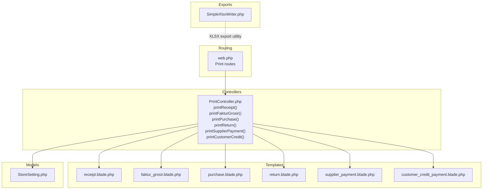
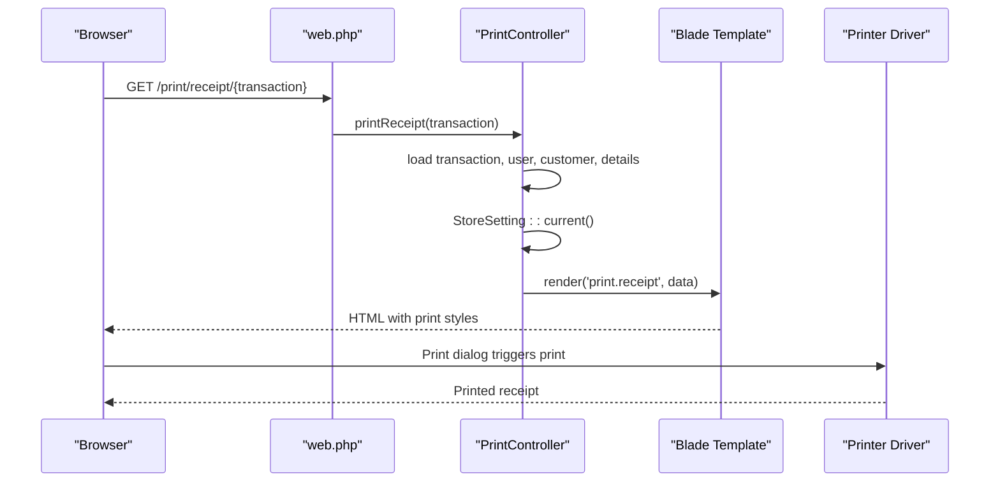
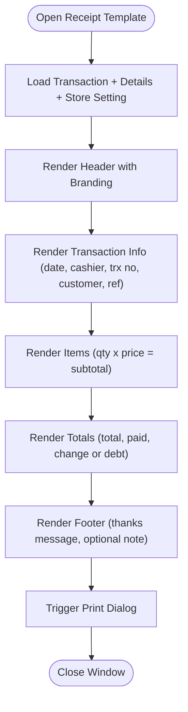
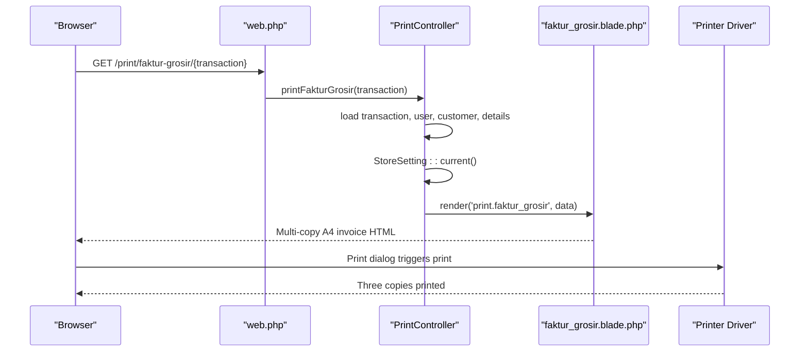
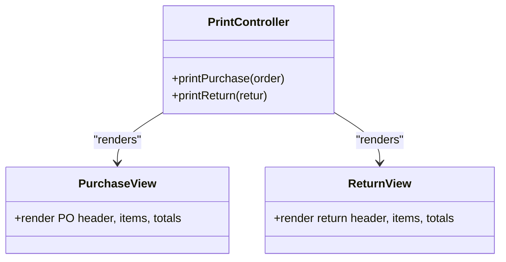
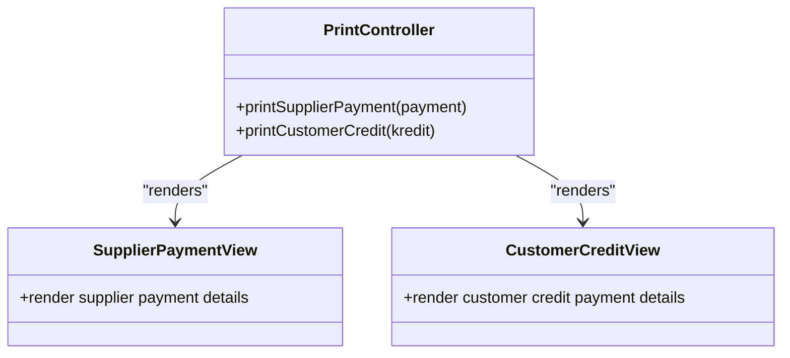
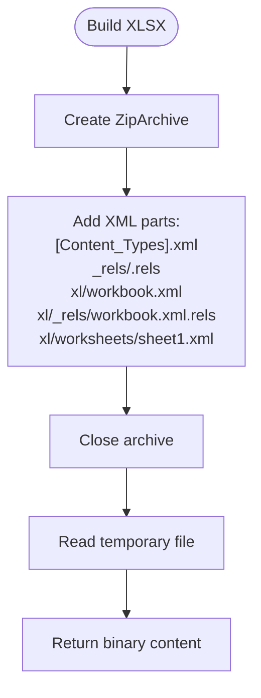
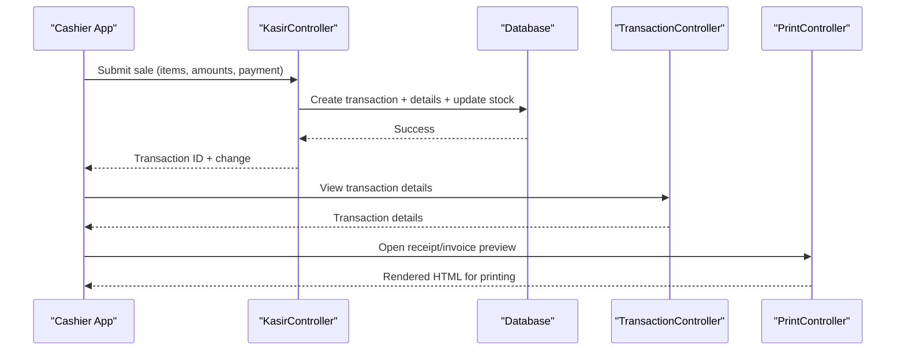
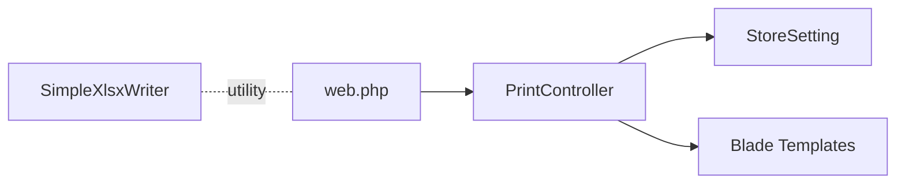

# Printing System

<cite>
**Referenced Files in This Document**
- [PrintController.php](file://app/Http/Controllers/PrintController.php)
- [web.php](file://routes/web.php)
- [receipt.blade.php](file://resources/views/print/receipt.blade.php)
- [faktur_grosir.blade.php](file://resources/views/print/faktur_grosir.blade.php)
- [purchase.blade.php](file://resources/views/print/purchase.blade.php)
- [return.blade.php](file://resources/views/print/return.blade.php)
- [supplier_payment.blade.php](file://resources/views/print/supplier_payment.blade.php)
- [customer_credit_payment.blade.php](file://resources/views/print/customer_credit_payment.blade.php)
- [StoreSetting.php](file://app/Models/StoreSetting.php)
- [SimpleXlsxWriter.php](file://app/Support/Export/SimpleXlsxWriter.php)
- [KasirController.php](file://app/Http/Controllers/KasirController.php)
- [TransactionController.php](file://app/Http/Controllers/TransactionController.php)
</cite>

## Table of Contents
1. [Introduction](#introduction)
2. [Project Structure](#project-structure)
3. [Core Components](#core-components)
4. [Architecture Overview](#architecture-overview)
5. [Detailed Component Analysis](#detailed-component-analysis)
6. [Dependency Analysis](#dependency-analysis)
7. [Performance Considerations](#performance-considerations)
8. [Troubleshooting Guide](#troubleshooting-guide)
9. [Conclusion](#conclusion)
10. [Appendices](#appendices)

## Introduction
This document explains the printing system for generating receipts, invoices, and reports within the POS application. It covers the receipt template system, invoice formatting, report layout customization, printer integration, batch printing operations, and export functionality for XLSX reports. It also documents print queue management, template customization, and branding options, along with practical examples for POS transactions, sales orders, and business document generation.

## Project Structure
The printing system is organized around:
- Routes that expose print endpoints for receipts, wholesale invoices, purchase orders, returns, supplier payments, and customer credit payments
- Blade templates that render printable HTML for each document type
- A controller that loads models and passes data to templates
- A store settings model that supplies branding and formatting data
- An export utility for generating XLSX binary content

**Diagram sources**
- [web.php:64-69](file://routes/web.php#L64-L69)
- [PrintController.php:12-79](file://app/Http/Controllers/PrintController.php#L12-L79)
- [receipt.blade.php:1-216](file://resources/views/print/receipt.blade.php#L1-L216)
- [faktur_grosir.blade.php:1-450](file://resources/views/print/faktur_grosir.blade.php#L1-L450)
- [purchase.blade.php:1-270](file://resources/views/print/purchase.blade.php#L1-L270)
- [return.blade.php:1-135](file://resources/views/print/return.blade.php#L1-L135)
- [supplier_payment.blade.php:1-85](file://resources/views/print/supplier_payment.blade.php#L1-L85)
- [customer_credit_payment.blade.php:1-85](file://resources/views/print/customer_credit_payment.blade.php#L1-L85)
- [StoreSetting.php:42-53](file://app/Models/StoreSetting.php#L42-L53)
- [SimpleXlsxWriter.php:7-33](file://app/Support/Export/SimpleXlsxWriter.php#L7-L33)

**Section sources**
- [web.php:64-69](file://routes/web.php#L64-L69)
- [PrintController.php:12-79](file://app/Http/Controllers/PrintController.php#L12-L79)

## Core Components
- PrintController: Central controller for all print actions. Loads related models and passes data to Blade templates.
- Blade Templates: Document-specific HTML with embedded CSS for print media and branding.
- StoreSetting: Provides brand name, address, phone, and receipt footer note used across templates.
- Export Utility: Generates XLSX binary content from arrays of rows.

Key responsibilities:
- Receipt generation for POS transactions (thermal 58mm)
- Wholesale invoice (A4, three copies)
- Purchase order and return documents (A4/A5)
- Supplier and customer credit payment receipts (A5)
- Branding via store settings
- Export to XLSX for reports

**Section sources**
- [PrintController.php:12-79](file://app/Http/Controllers/PrintController.php#L12-L79)
- [StoreSetting.php:9-53](file://app/Models/StoreSetting.php#L9-L53)
- [SimpleXlsxWriter.php:7-33](file://app/Support/Export/SimpleXlsxWriter.php#L7-L33)

## Architecture Overview
The printing pipeline follows a standard MVC pattern:
- Routes define endpoints for each document type
- Controllers resolve models and load related data
- Blade templates render printable HTML
- Browser print dialog or external printer driver prints the HTML
- Export utility produces downloadable XLSX files

**Diagram sources**
- [web.php:64](file://routes/web.php#L64)
- [PrintController.php:17-23](file://app/Http/Controllers/PrintController.php#L17-L23)
- [receipt.blade.php:99](file://resources/views/print/receipt.blade.php#L99)

## Detailed Component Analysis

### Receipt Template System (POS Thermal 58mm)
- Purpose: Compact receipt for retail transactions on thermal printers
- Data sources: Transaction, user, customer, and transaction details
- Branding: Store name, address, phone, and receipt footer note from StoreSetting
- Payment method normalization and change calculation
- Responsive print layout optimized for 58mm width

**Diagram sources**
- [receipt.blade.php:100-207](file://resources/views/print/receipt.blade.php#L100-L207)
- [StoreSetting.php:42-53](file://app/Models/StoreSetting.php#L42-L53)

**Section sources**
- [receipt.blade.php:1-216](file://resources/views/print/receipt.blade.php#L1-L216)
- [PrintController.php:17-23](file://app/Http/Controllers/PrintController.php#L17-L23)
- [StoreSetting.php:42-53](file://app/Models/StoreSetting.php#L42-L53)

### Wholesale Invoice (A4, Three Copies)
- Purpose: Full-format invoice for wholesale transactions with three copies
- Multi-copy layout: Cut marks between copies with labels
- Customer and itemized details with unit conversions
- Payment summary and signature boxes
- Credit vs cash handling with remaining debt display

**Diagram sources**
- [web.php:65](file://routes/web.php#L65)
- [PrintController.php:28-34](file://app/Http/Controllers/PrintController.php#L28-L34)
- [faktur_grosir.blade.php:262-267](file://resources/views/print/faktur_grosir.blade.php#L262-L267)

**Section sources**
- [faktur_grosir.blade.php:1-450](file://resources/views/print/faktur_grosir.blade.php#L1-L450)
- [PrintController.php:28-34](file://app/Http/Controllers/PrintController.php#L28-L34)

### Purchase Order and Return Documents
- Purchase Order: A4 document with supplier info, items, totals, and payment status
- Return: A4 document detailing returned items, reasons, and total value
- Both include signatures and notes sections

**Diagram sources**
- [PrintController.php:39-54](file://app/Http/Controllers/PrintController.php#L39-L54)
- [purchase.blade.php:155-270](file://resources/views/print/purchase.blade.php#L155-L270)
- [return.blade.php:37-135](file://resources/views/print/return.blade.php#L37-L135)

**Section sources**
- [purchase.blade.php:1-270](file://resources/views/print/purchase.blade.php#L1-L270)
- [return.blade.php:1-135](file://resources/views/print/return.blade.php#L1-L135)
- [PrintController.php:39-54](file://app/Http/Controllers/PrintController.php#L39-L54)

### Supplier and Customer Credit Payment Receipts
- Supplier Payment: A5 receipt for supplier debt payments
- Customer Credit Payment: A5 receipt for customer credit payments
- Both include date, amount, method, reference, and signatures

**Diagram sources**
- [PrintController.php:59-77](file://app/Http/Controllers/PrintController.php#L59-L77)
- [supplier_payment.blade.php:30-85](file://resources/views/print/supplier_payment.blade.php#L30-L85)
- [customer_credit_payment.blade.php:30-85](file://resources/views/print/customer_credit_payment.blade.php#L30-L85)

**Section sources**
- [supplier_payment.blade.php:1-85](file://resources/views/print/supplier_payment.blade.php#L1-L85)
- [customer_credit_payment.blade.php:1-85](file://resources/views/print/customer_credit_payment.blade.php#L1-L85)
- [PrintController.php:59-77](file://app/Http/Controllers/PrintController.php#L59-L77)

### Branding and Store Settings
- StoreSetting::current() provides:
  - Store name, address, phone
  - Receipt header/footer text
  - Currency and rounding modes
- Templates read these values to personalize receipts and invoices

**Section sources**
- [StoreSetting.php:9-53](file://app/Models/StoreSetting.php#L9-L53)
- [receipt.blade.php:100-207](file://resources/views/print/receipt.blade.php#L100-L207)
- [faktur_grosir.blade.php:233-267](file://resources/views/print/faktur_grosir.blade.php#L233-L267)

### Export Functionality for XLSX Reports
- SimpleXlsxWriter builds a minimal XLSX by creating XML parts and zipping them
- Accepts a two-dimensional array of rows and converts numeric and string values appropriately
- Returns binary content suitable for download

**Diagram sources**
- [SimpleXlsxWriter.php:7-33](file://app/Support/Export/SimpleXlsxWriter.php#L7-L33)
- [SimpleXlsxWriter.php:73-99](file://app/Support/Export/SimpleXlsxWriter.php#L73-L99)
- [SimpleXlsxWriter.php:101-119](file://app/Support/Export/SimpleXlsxWriter.php#L101-L119)

**Section sources**
- [SimpleXlsxWriter.php:1-138](file://app/Support/Export/SimpleXlsxWriter.php#L1-L138)

### Printer Integration and Batch Printing
- Browser print dialog handles printing for all templates
- Templates include print media queries and optional auto-print behavior
- Batch printing can be achieved by iterating print URLs and triggering print dialogs programmatically
- For thermal printers, ensure printer drivers support A4 or 58mm width as applicable

**Section sources**
- [receipt.blade.php:90-97](file://resources/views/print/receipt.blade.php#L90-L97)
- [faktur_grosir.blade.php:220-229](file://resources/views/print/faktur_grosir.blade.php#L220-L229)

### Print Queue Management
- The system does not implement a dedicated print queue service
- Recommendations:
  - Introduce a queue table for print jobs with status and retry logic
  - Use Laravel queues to process print jobs asynchronously
  - Persist job metadata (template, payload, printer target)
  - Provide monitoring UI for pending jobs

[No sources needed since this section provides general guidance]

### Template Customization
- Customize templates by editing Blade files under resources/views/print
- Adjust CSS for print media and branding
- Extend StoreSetting fields to support additional branding elements

**Section sources**
- [receipt.blade.php:7-97](file://resources/views/print/receipt.blade.php#L7-L97)
- [faktur_grosir.blade.php:8-229](file://resources/views/print/faktur_grosir.blade.php#L8-L229)
- [StoreSetting.php:9-34](file://app/Models/StoreSetting.php#L9-L34)

### Integration with POS Transactions and Sales Orders
- Receipts are generated from POS transactions with payment method normalization
- Wholesale invoices use transaction details and customer credit status
- Voiding transactions restores stock and updates customer credit accordingly

**Diagram sources**
- [KasirController.php:151-223](file://app/Http/Controllers/KasirController.php#L151-L223)
- [TransactionController.php:64-69](file://app/Http/Controllers/TransactionController.php#L64-L69)
- [PrintController.php:17-34](file://app/Http/Controllers/PrintController.php#L17-L34)

**Section sources**
- [KasirController.php:151-223](file://app/Http/Controllers/KasirController.php#L151-L223)
- [TransactionController.php:64-69](file://app/Http/Controllers/TransactionController.php#L64-L69)
- [PrintController.php:17-34](file://app/Http/Controllers/PrintController.php#L17-L34)

## Dependency Analysis
- Routes depend on PrintController methods
- PrintController depends on StoreSetting and Eloquent models
- Templates depend on data passed by PrintController and StoreSetting
- Export utility is independent and can be reused by reporting features

**Diagram sources**
- [web.php:64-69](file://routes/web.php#L64-L69)
- [PrintController.php:12-79](file://app/Http/Controllers/PrintController.php#L12-L79)
- [StoreSetting.php:42-53](file://app/Models/StoreSetting.php#L42-L53)
- [SimpleXlsxWriter.php:7-33](file://app/Support/Export/SimpleXlsxWriter.php#L7-L33)

**Section sources**
- [web.php:64-69](file://routes/web.php#L64-L69)
- [PrintController.php:12-79](file://app/Http/Controllers/PrintController.php#L12-L79)
- [StoreSetting.php:42-53](file://app/Models/StoreSetting.php#L42-L53)
- [SimpleXlsxWriter.php:7-33](file://app/Support/Export/SimpleXlsxWriter.php#L7-L33)

## Performance Considerations
- Keep templates lightweight; avoid heavy client-side scripts
- Use print media queries to minimize rendering overhead
- For bulk exports, stream XLSX content to reduce memory usage
- Cache StoreSetting data where appropriate

[No sources needed since this section provides general guidance]

## Troubleshooting Guide
Common issues and resolutions:
- Blank or missing data in templates:
  - Verify controller loads related models (details, user, customer)
  - Ensure StoreSetting exists or falls back to defaults
- Print quality problems:
  - Confirm printer driver supports selected paper size and width
  - Test print media CSS in browser before sending to printer
- Export failures:
  - Validate input arrays for SimpleXlsxWriter
  - Check temporary directory permissions for ZipArchive

**Section sources**
- [PrintController.php:17-77](file://app/Http/Controllers/PrintController.php#L17-L77)
- [StoreSetting.php:42-53](file://app/Models/StoreSetting.php#L42-L53)
- [SimpleXlsxWriter.php:7-33](file://app/Support/Export/SimpleXlsxWriter.php#L7-L33)

## Conclusion
The printing system provides comprehensive support for receipts, wholesale invoices, purchase documents, and payment receipts. It leverages Blade templates with print-optimized CSS and integrates with store branding via StoreSetting. While the current implementation relies on browser print dialogs, extending it with a dedicated print queue and asynchronous processing would improve scalability for high-volume environments.

## Appendices

### Practical Examples

- Receipt configuration
  - Access: GET /print/receipt/{transaction}
  - Data: transaction, user, customer, details, store settings
  - Output: 58mm thermal receipt

- Invoice generation
  - Access: GET /print/faktur-grosir/{transaction}
  - Data: transaction, user, customer, details, store settings
  - Output: A4 invoice with three copies and cut marks

- Report exports
  - Use SimpleXlsxWriter::buildBinary($rows) to generate XLSX content
  - Suitable for sales, inventory, and financial summaries

- Printer setup procedures
  - Install printer driver supporting A4 and 58mm widths
  - Configure default paper size in browser print dialog
  - Test templates in browser before production printing

**Section sources**
- [web.php:64-65](file://routes/web.php#L64-L65)
- [receipt.blade.php:99](file://resources/views/print/receipt.blade.php#L99)
- [faktur_grosir.blade.php:231](file://resources/views/print/faktur_grosir.blade.php#L231)
- [SimpleXlsxWriter.php:7-33](file://app/Support/Export/SimpleXlsxWriter.php#L7-L33)