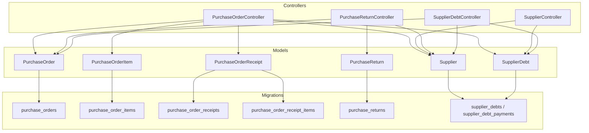
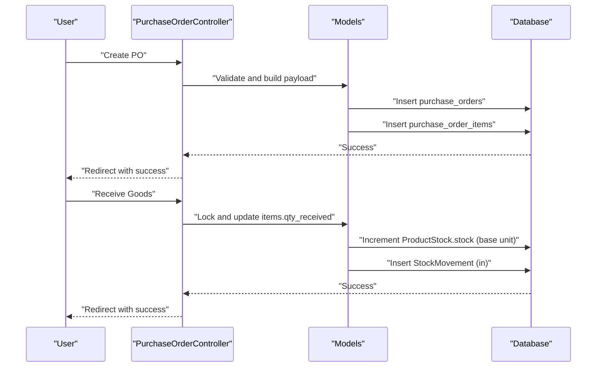
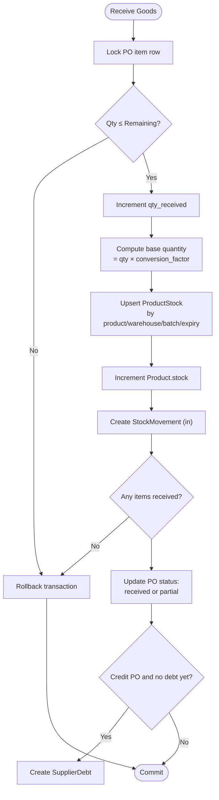
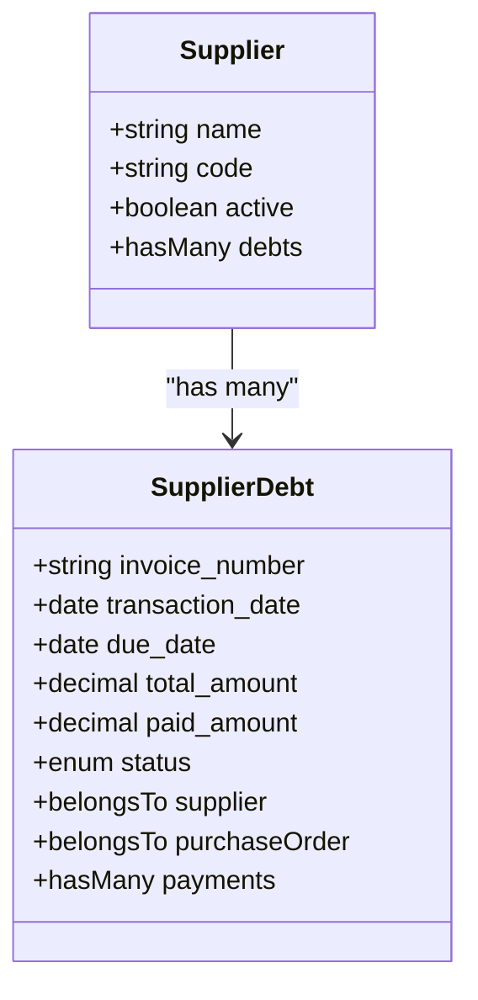
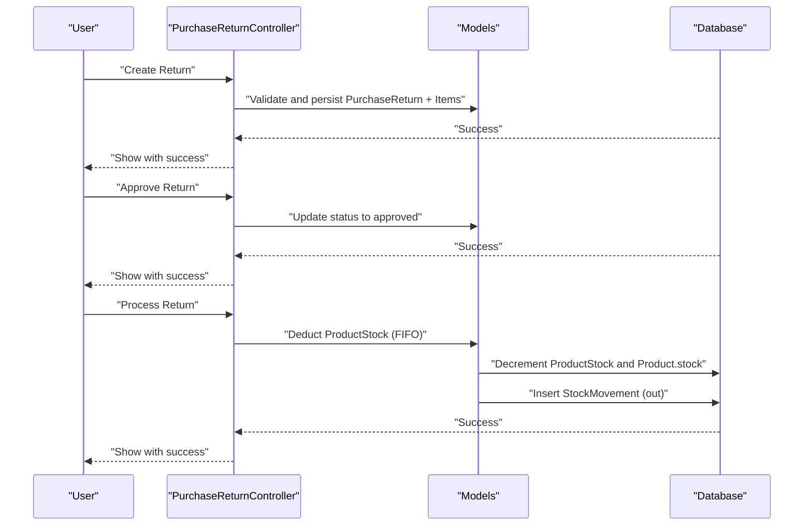
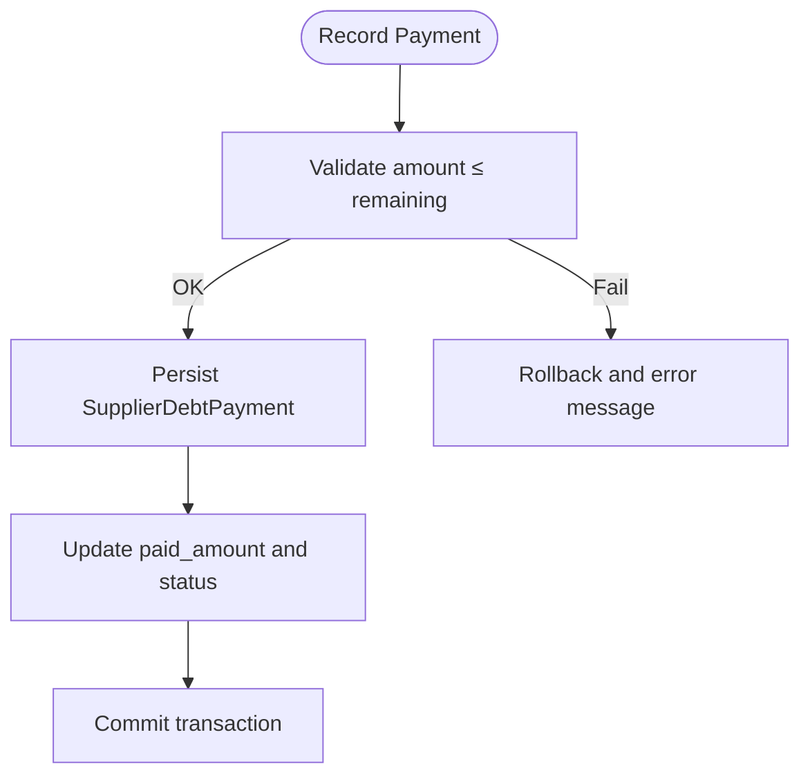
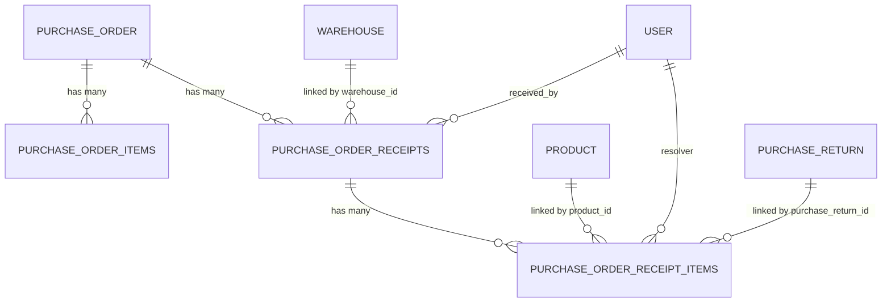
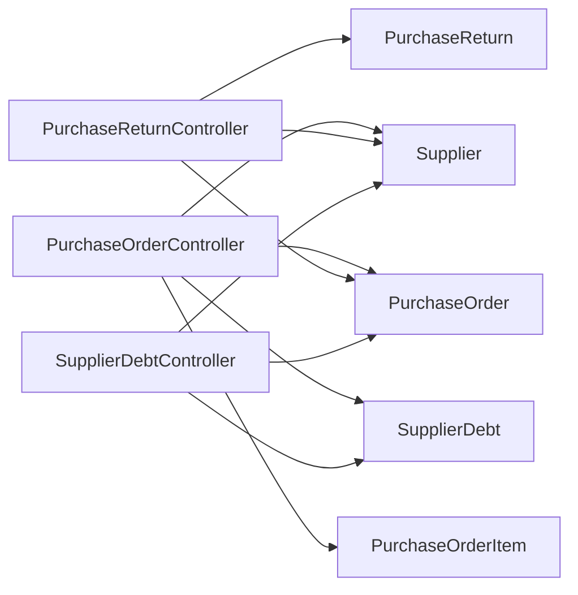
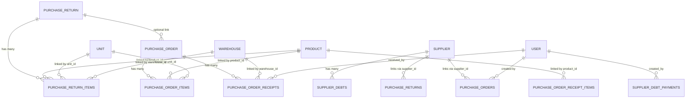

# Procurement & Purchase Orders

<cite>
**Referenced Files in This Document**
- [PurchaseOrderController.php](file://app/Http/Controllers/PurchaseOrderController.php)
- [SupplierController.php](file://app/Http/Controllers/SupplierController.php)
- [PurchaseReturnController.php](file://app/Http/Controllers/PurchaseReturnController.php)
- [SupplierDebtController.php](file://app/Http/Controllers/SupplierDebtController.php)
- [PurchaseOrder.php](file://app/Models/PurchaseOrder.php)
- [PurchaseOrderItem.php](file://app/Models/PurchaseOrderItem.php)
- [PurchaseOrderReceipt.php](file://app/Models/PurchaseOrderReceipt.php)
- [PurchaseReturn.php](file://app/Models/PurchaseReturn.php)
- [Supplier.php](file://app/Models/Supplier.php)
- [SupplierDebt.php](file://app/Models/SupplierDebt.php)
- [2026_02_27_010001_create_purchase_orders_table.php](file://database/migrations/2026_02_27_010001_create_purchase_orders_table.php)
- [2026_02_27_010002_create_purchase_order_items_table.php](file://database/migrations/2026_02_27_010002_create_purchase_order_items_table.php)
- [2026_02_27_070001_create_purchase_returns_table.php](file://database/migrations/2026_02_27_070001_create_purchase_returns_table.php)
- [2026_02_27_070002_create_supplier_debts_table.php](file://database/migrations/2026_02_27_070002_create_supplier_debts_table.php)
- [2026_03_14_190000_create_purchase_order_receipts_table.php](file://database/migrations/2026_03_14_190000_create_purchase_order_receipts_table.php)
- [2026_03_14_190100_create_purchase_order_receipt_items_table.php](file://database/migrations/2026_03_14_190100_create_purchase_order_receipt_items_table.php)
</cite>

## Table of Contents
1. [Introduction](#introduction)
2. [Project Structure](#project-structure)
3. [Core Components](#core-components)
4. [Architecture Overview](#architecture-overview)
5. [Detailed Component Analysis](#detailed-component-analysis)
6. [Dependency Analysis](#dependency-analysis)
7. [Performance Considerations](#performance-considerations)
8. [Troubleshooting Guide](#troubleshooting-guide)
9. [Conclusion](#conclusion)
10. [Appendices](#appendices)

## Introduction
This document explains the procurement and purchase order system with a focus on supplier management and purchasing workflows. It covers purchase order creation, approval and status transitions, supplier relationship management, purchase order receipt and item tracking, quality control processes, purchase return procedures, supplier debt management, and payment processing. It also includes practical examples for supplier onboarding, PO generation, receipt validation, and supplier performance tracking, along with integration points to inventory management, accounts payable, and supplier communication workflows.

## Project Structure
The procurement domain is implemented through dedicated controllers and Eloquent models, backed by database migrations that define the schema for purchase orders, items, receipts, returns, and supplier debts. Views and routes support the web UI for end-to-end workflows.

**Diagram sources**
- [PurchaseOrderController.php:19-712](file://app/Http/Controllers/PurchaseOrderController.php#L19-L712)
- [SupplierController.php:8-98](file://app/Http/Controllers/SupplierController.php#L8-L98)
- [PurchaseReturnController.php:19-277](file://app/Http/Controllers/PurchaseReturnController.php#L19-L277)
- [SupplierDebtController.php:13-131](file://app/Http/Controllers/SupplierDebtController.php#L13-L131)
- [PurchaseOrder.php:9-96](file://app/Models/PurchaseOrder.php#L9-L96)
- [PurchaseOrderItem.php:7-38](file://app/Models/PurchaseOrderItem.php#L7-L38)
- [PurchaseOrderReceipt.php:7-67](file://app/Models/PurchaseOrderReceipt.php#L7-L67)
- [PurchaseReturn.php:7-63](file://app/Models/PurchaseReturn.php#L7-L63)
- [Supplier.php:10-36](file://app/Models/Supplier.php#L10-L36)
- [SupplierDebt.php:7-63](file://app/Models/SupplierDebt.php#L7-L63)
- [2026_02_27_010001_create_purchase_orders_table.php:11-22](file://database/migrations/2026_02_27_010001_create_purchase_orders_table.php#L11-L22)
- [2026_02_27_010002_create_purchase_order_items_table.php:11-21](file://database/migrations/2026_02_27_010002_create_purchase_order_items_table.php#L11-L21)
- [2026_02_27_070001_create_purchase_returns_table.php:11-35](file://database/migrations/2026_02_27_070001_create_purchase_returns_table.php#L11-L35)
- [2026_02_27_070002_create_supplier_debts_table.php:11-35](file://database/migrations/2026_02_27_070002_create_supplier_debts_table.php#L11-L35)
- [2026_03_14_190000_create_purchase_order_receipts_table.php:11-23](file://database/migrations/2026_03_14_190000_create_purchase_order_receipts_table.php#L11-L23)
- [2026_03_14_190100_create_purchase_order_receipt_items_table.php:11-33](file://database/migrations/2026_03_14_190100_create_purchase_order_receipt_items_table.php#L11-L33)

**Section sources**
- [PurchaseOrderController.php:24-44](file://app/Http/Controllers/PurchaseOrderController.php#L24-L44)
- [SupplierController.php:10-25](file://app/Http/Controllers/SupplierController.php#L10-L25)
- [PurchaseReturnController.php:21-41](file://app/Http/Controllers/PurchaseReturnController.php#L21-L41)
- [SupplierDebtController.php:15-39](file://app/Http/Controllers/SupplierDebtController.php#L15-L39)

## Core Components
- Purchase Order Management
  - Creation, editing, deletion, and status transitions (draft → ordered → cancelled).
  - Item-level management with unit conversions and totals.
  - Receipt processing updates inventory and generates stock movements.
- Supplier Management
  - Onboarding, edits, activation/deactivation, and performance visibility via debts.
- Purchase Returns
  - Return creation, approval, and processing that adjusts inventory and records outbound movements.
- Supplier Debts and Payments
  - Automatic credit PO linkage, manual debt entries, payment recording, and status updates.
- Receipt Tracking and Quality Control
  - Dedicated receipts and receipt items with acceptance/partial/rejection outcomes, batch and expiry tracking, and optional follow-up.

**Section sources**
- [PurchaseOrderController.php:128-239](file://app/Http/Controllers/PurchaseOrderController.php#L128-L239)
- [PurchaseOrderController.php:353-467](file://app/Http/Controllers/PurchaseOrderController.php#L353-L467)
- [PurchaseOrderController.php:487-514](file://app/Http/Controllers/PurchaseOrderController.php#L487-L514)
- [PurchaseOrderController.php:535-667](file://app/Http/Controllers/PurchaseOrderController.php#L535-L667)
- [SupplierController.php:41-96](file://app/Http/Controllers/SupplierController.php#L41-L96)
- [PurchaseReturnController.php:88-142](file://app/Http/Controllers/PurchaseReturnController.php#L88-L142)
- [PurchaseReturnController.php:161-225](file://app/Http/Controllers/PurchaseReturnController.php#L161-L225)
- [SupplierDebtController.php:49-74](file://app/Http/Controllers/SupplierDebtController.php#L49-L74)
- [SupplierDebtController.php:82-120](file://app/Http/Controllers/SupplierDebtController.php#L82-L120)

## Architecture Overview
The system follows a layered MVC pattern:
- Controllers orchestrate workflows, validate requests, manage transactions, and coordinate model updates.
- Models encapsulate business rules, relationships, and computed attributes.
- Migrations define normalized schemas with foreign keys and indexes for performance.
- Views render forms and dashboards for POs, receipts, returns, and supplier debts.

**Diagram sources**
- [PurchaseOrderController.php:128-239](file://app/Http/Controllers/PurchaseOrderController.php#L128-L239)
- [PurchaseOrderController.php:535-667](file://app/Http/Controllers/PurchaseOrderController.php#L535-L667)
- [PurchaseOrder.php:9-96](file://app/Models/PurchaseOrder.php#L9-L96)
- [PurchaseOrderItem.php:7-38](file://app/Models/PurchaseOrderItem.php#L7-L38)
- [2026_02_27_010001_create_purchase_orders_table.php:11-22](file://database/migrations/2026_02_27_010001_create_purchase_orders_table.php#L11-L22)
- [2026_02_27_010002_create_purchase_order_items_table.php:11-21](file://database/migrations/2026_02_27_010002_create_purchase_order_items_table.php#L11-L21)

## Detailed Component Analysis

### Purchase Order Management
- Creation
  - Validates PO number uniqueness, supplier existence, dates, and items.
  - Enforces unique product entries per PO.
  - Computes totals and persists items with conversion factors.
- Editing and Deletion
  - Only draft POs can be edited or deleted.
  - Edit replaces items and recalculates totals.
- Status Transitions
  - draft → ordered/cancelled; ordered → cancelled.
  - Ordered POs trigger receipt processing availability.
- Receipt Processing
  - Validates per-item quantities against remaining balances.
  - Converts requested units to base stock quantities.
  - Updates warehouse ProductStock and global Product stock.
  - Records inbound StockMovement with batch/expiry metadata.
  - Automatically creates SupplierDebt for credit POs if none exists.

**Diagram sources**
- [PurchaseOrderController.php:535-667](file://app/Http/Controllers/PurchaseOrderController.php#L535-L667)
- [PurchaseOrderController.php:669-710](file://app/Http/Controllers/PurchaseOrderController.php#L669-L710)
- [PurchaseOrderItem.php:33-36](file://app/Models/PurchaseOrderItem.php#L33-L36)
- [2026_03_14_190000_create_purchase_order_receipts_table.php:11-23](file://database/migrations/2026_03_14_190000_create_purchase_order_receipts_table.php#L11-L23)
- [2026_03_14_190100_create_purchase_order_receipt_items_table.php:11-33](file://database/migrations/2026_03_14_190100_create_purchase_order_receipt_items_table.php#L11-L33)

**Section sources**
- [PurchaseOrderController.php:128-239](file://app/Http/Controllers/PurchaseOrderController.php#L128-L239)
- [PurchaseOrderController.php:353-467](file://app/Http/Controllers/PurchaseOrderController.php#L353-L467)
- [PurchaseOrderController.php:487-514](file://app/Http/Controllers/PurchaseOrderController.php#L487-L514)
- [PurchaseOrderController.php:535-667](file://app/Http/Controllers/PurchaseOrderController.php#L535-L667)
- [PurchaseOrder.php:65-75](file://app/Models/PurchaseOrder.php#L65-L75)
- [PurchaseOrderItem.php:33-36](file://app/Models/PurchaseOrderItem.php#L33-L36)

### Supplier Relationship Management
- Onboarding
  - Generates next supplier code automatically if missing.
  - Validates uniqueness of code and stores contact, banking, terms, and notes.
- Active Status and Search
  - Supports filtering by active status and search across name, phone, and email.
- Debts and Payments
  - Suppliers accumulate unpaid amounts; automatic credit PO linkage occurs during receipt.
  - Payment recording updates paid amount and status.

**Diagram sources**
- [Supplier.php:10-36](file://app/Models/Supplier.php#L10-L36)
- [SupplierDebt.php:7-63](file://app/Models/SupplierDebt.php#L7-L63)
- [SupplierController.php:41-96](file://app/Http/Controllers/SupplierController.php#L41-L96)
- [SupplierDebtController.php:49-74](file://app/Http/Controllers/SupplierDebtController.php#L49-L74)

**Section sources**
- [SupplierController.php:27-33](file://app/Http/Controllers/SupplierController.php#L27-L33)
- [SupplierController.php:41-96](file://app/Http/Controllers/SupplierController.php#L41-L96)
- [Supplier.php:30-34](file://app/Models/Supplier.php#L30-L34)
- [SupplierDebtController.php:15-39](file://app/Http/Controllers/SupplierDebtController.php#L15-L39)
- [SupplierDebtController.php:82-120](file://app/Http/Controllers/SupplierDebtController.php#L82-L120)

### Purchase Return Procedures
- Creation
  - Validates supplier, optional PO linkage, warehouse, return date, and items with unit conversions.
  - Computes total and persists return with items.
- Approval and Processing
  - Approved returns can be processed to adjust warehouse stock and global product stock.
  - Uses FIFO-like deduction across batches (expiry prioritized) and records outbound StockMovement.
- Status Lifecycle
  - draft → approved → returned; cancellation resets to draft; deletion allowed only for draft.

**Diagram sources**
- [PurchaseReturnController.php:88-142](file://app/Http/Controllers/PurchaseReturnController.php#L88-L142)
- [PurchaseReturnController.php:161-225](file://app/Http/Controllers/PurchaseReturnController.php#L161-L225)
- [PurchaseReturn.php:7-63](file://app/Models/PurchaseReturn.php#L7-L63)
- [2026_02_27_070001_create_purchase_returns_table.php:11-35](file://database/migrations/2026_02_27_070001_create_purchase_returns_table.php#L11-L35)

**Section sources**
- [PurchaseReturnController.php:43-86](file://app/Http/Controllers/PurchaseReturnController.php#L43-L86)
- [PurchaseReturnController.php:161-225](file://app/Http/Controllers/PurchaseReturnController.php#L161-L225)
- [PurchaseReturn.php:45-51](file://app/Models/PurchaseReturn.php#L45-L51)

### Supplier Debt Management and Payment Processing
- Debt Entry
  - Manual creation of supplier debts linked to POs; auto-increments invoice numbers.
- Payment Recording
  - Validates payment amount against remaining balance; updates paid amount and status.
- Reporting
  - Provides summary statistics for unpaid, overdue, and counts by status.

**Diagram sources**
- [SupplierDebtController.php:82-120](file://app/Http/Controllers/SupplierDebtController.php#L82-L120)
- [SupplierDebt.php:36-39](file://app/Models/SupplierDebt.php#L36-L39)
- [2026_02_27_070002_create_supplier_debts_table.php:11-35](file://database/migrations/2026_02_27_070002_create_supplier_debts_table.php#L11-L35)

**Section sources**
- [SupplierDebtController.php:15-39](file://app/Http/Controllers/SupplierDebtController.php#L15-L39)
- [SupplierDebtController.php:49-74](file://app/Http/Controllers/SupplierDebtController.php#L49-L74)
- [SupplierDebtController.php:82-120](file://app/Http/Controllers/SupplierDebtController.php#L82-L120)
- [SupplierDebt.php:51-54](file://app/Models/SupplierDebt.php#L51-L54)

### Receipt System, Item Tracking, and Quality Control
- Receipt Header and Items
  - Receipts track warehouse, receiver, photos, and notes; items record accepted/partial/rejected outcomes, batch/expiry, and quality/spec/packaging checks.
- Follow-up Tracking
  - Optional needs_followup flag and resolution metadata for exceptions.
- Integration
  - Links to original PO items and supports reorders and returns.

**Diagram sources**
- [PurchaseOrderReceipt.php:7-67](file://app/Models/PurchaseOrderReceipt.php#L7-L67)
- [2026_03_14_190000_create_purchase_order_receipts_table.php:11-23](file://database/migrations/2026_03_14_190000_create_purchase_order_receipts_table.php#L11-L23)
- [2026_03_14_190100_create_purchase_order_receipt_items_table.php:11-33](file://database/migrations/2026_03_14_190100_create_purchase_order_receipt_items_table.php#L11-L33)

**Section sources**
- [PurchaseOrderReceipt.php:9-30](file://app/Models/PurchaseOrderReceipt.php#L9-L30)
- [2026_03_14_190000_create_purchase_order_receipts_table.php:11-23](file://database/migrations/2026_03_14_190000_create_purchase_order_receipts_table.php#L11-L23)
- [2026_03_14_190100_create_purchase_order_receipt_items_table.php:11-33](file://database/migrations/2026_03_14_190100_create_purchase_order_receipt_items_table.php#L11-L33)

### Practical Examples

- Supplier Onboarding
  - Steps: Access create form, enter details, submit; system auto-generates supplier code if blank; saved to master supplier list.
  - Validation ensures unique code and proper fields.
  - Reference: [SupplierController.php:35-63](file://app/Http/Controllers/SupplierController.php#L35-L63)

- Purchase Order Generation
  - Steps: Open create form, select supplier, add items with product search, set dates and payment term, submit; PO saved as draft; then change status to ordered.
  - Reference: [PurchaseOrderController.php:49-55](file://app/Http/Controllers/PurchaseOrderController.php#L49-L55), [PurchaseOrderController.php:128-239](file://app/Http/Controllers/PurchaseOrderController.php#L128-L239), [PurchaseOrderController.php:487-514](file://app/Http/Controllers/PurchaseOrderController.php#L487-L514)

- Receipt Validation and Inventory Update
  - Steps: Receive goods, select warehouse and date, enter per-item received quantities, optionally batch/expiry; system validates remaining balances, converts to base units, increments stock, records movement, and updates PO status.
  - Reference: [PurchaseOrderController.php:535-667](file://app/Http/Controllers/PurchaseOrderController.php#L535-L667)

- Supplier Performance Tracking
  - Steps: Review supplier debts, filter by status and supplier, check overdue and unpaid summaries; leverage activity logs for auditability.
  - Reference: [SupplierDebtController.php:15-39](file://app/Http/Controllers/SupplierDebtController.php#L15-L39), [Supplier.php:12-21](file://app/Models/Supplier.php#L12-L21)

## Dependency Analysis
- Controllers depend on Models for persistence and business logic.
- Models define relationships and computed attributes (e.g., status labels, remaining quantities).
- Migrations define referential integrity and indexes for performance.
- Transactions wrap critical operations to maintain consistency.

**Diagram sources**
- [PurchaseOrderController.php:19-712](file://app/Http/Controllers/PurchaseOrderController.php#L19-L712)
- [PurchaseReturnController.php:19-277](file://app/Http/Controllers/PurchaseReturnController.php#L19-L277)
- [SupplierDebtController.php:13-131](file://app/Http/Controllers/SupplierDebtController.php#L13-L131)
- [PurchaseOrder.php:9-96](file://app/Models/PurchaseOrder.php#L9-L96)
- [PurchaseOrderItem.php:7-38](file://app/Models/PurchaseOrderItem.php#L7-L38)
- [Supplier.php:10-36](file://app/Models/Supplier.php#L10-L36)
- [SupplierDebt.php:7-63](file://app/Models/SupplierDebt.php#L7-L63)

**Section sources**
- [PurchaseOrder.php:37-60](file://app/Models/PurchaseOrder.php#L37-L60)
- [PurchaseOrderItem.php:15-28](file://app/Models/PurchaseOrderItem.php#L15-L28)
- [Supplier.php:31-34](file://app/Models/Supplier.php#L31-L34)
- [SupplierDebt.php:21-34](file://app/Models/SupplierDebt.php#L21-L34)

## Performance Considerations
- Concurrency and Isolation
  - Receipt processing locks PO items and ProductStock rows to prevent race conditions during stock updates.
- Indexes
  - Receipt and debt tables include composite indexes on frequently filtered columns to improve query performance.
- Batch and Expiry Handling
  - Receipt items capture batch and expiry to enable traceability and expiry-aware stock deductions.
- Decimal Precision
  - Monetary fields use decimal casts to avoid floating-point precision issues.

[No sources needed since this section provides general guidance]

## Troubleshooting Guide
- Duplicate Products in PO Items
  - Symptom: Error indicating duplicate product detected.
  - Resolution: Remove duplicates before saving.
  - Reference: [PurchaseOrderController.php:154-158](file://app/Http/Controllers/PurchaseOrderController.php#L154-L158)

- Invalid Unit Conversion
  - Symptom: Error indicating invalid unit for a product.
  - Resolution: Select a valid unit or rely on base unit fallback.
  - Reference: [PurchaseOrderController.php:208-209](file://app/Http/Controllers/PurchaseOrderController.php#L208-L209)

- Received Quantity Exceeds Remaining
  - Symptom: Error stating received quantity exceeds remaining.
  - Resolution: Adjust received quantity to remain within remaining balance.
  - Reference: [PurchaseOrderController.php:577-578](file://app/Http/Controllers/PurchaseOrderController.php#L577-L578)

- No Items Received
  - Symptom: Error stating no items were received.
  - Resolution: Enter at least one item with quantity > 0.
  - Reference: [PurchaseOrderController.php:624-625](file://app/Http/Controllers/PurchaseOrderController.php#L624-L625)

- Insufficient Warehouse Stock for Return
  - Symptom: Error indicating insufficient stock for return.
  - Resolution: Verify warehouse stock and batch expiry ordering.
  - Reference: [PurchaseReturnController.php:252-254](file://app/Http/Controllers/PurchaseReturnController.php#L252-L254)

- Payment Amount Exceeds Remaining
  - Symptom: Error on payment recording.
  - Resolution: Enter an amount less than or equal to remaining balance.
  - Reference: [SupplierDebtController.php:90-91](file://app/Http/Controllers/SupplierDebtController.php#L90-L91)

**Section sources**
- [PurchaseOrderController.php:154-158](file://app/Http/Controllers/PurchaseOrderController.php#L154-L158)
- [PurchaseOrderController.php:208-209](file://app/Http/Controllers/PurchaseOrderController.php#L208-L209)
- [PurchaseOrderController.php:577-578](file://app/Http/Controllers/PurchaseOrderController.php#L577-L578)
- [PurchaseOrderController.php:624-625](file://app/Http/Controllers/PurchaseOrderController.php#L624-L625)
- [PurchaseReturnController.php:252-254](file://app/Http/Controllers/PurchaseReturnController.php#L252-L254)
- [SupplierDebtController.php:90-91](file://app/Http/Controllers/SupplierDebtController.php#L90-L91)

## Conclusion
The procurement and purchase order system integrates supplier management, PO lifecycle, receipt and return processing, and supplier debt tracking with robust validations, concurrency controls, and clear status transitions. It provides strong inventory integration through base-unit conversions and stock movements, and offers practical tools for supplier performance monitoring and payment reconciliation.

[No sources needed since this section summarizes without analyzing specific files]

## Appendices

### Data Model Overview

**Diagram sources**
- [Supplier.php:31-34](file://app/Models/Supplier.php#L31-L34)
- [PurchaseOrder.php:37-60](file://app/Models/PurchaseOrder.php#L37-L60)
- [PurchaseOrderItem.php:15-28](file://app/Models/PurchaseOrderItem.php#L15-L28)
- [PurchaseReturn.php:20-38](file://app/Models/PurchaseReturn.php#L20-L38)
- [PurchaseOrderReceipt.php:32-65](file://app/Models/PurchaseOrderReceipt.php#L32-L65)
- [SupplierDebt.php:21-34](file://app/Models/SupplierDebt.php#L21-L34)