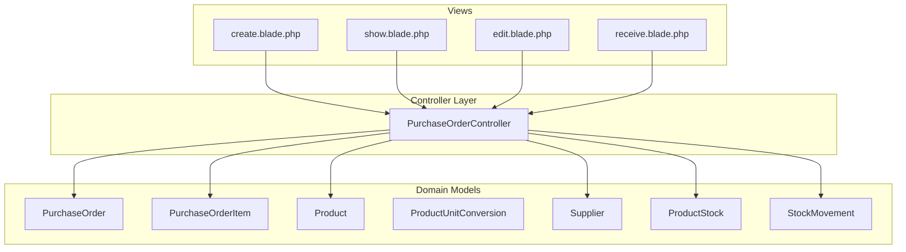
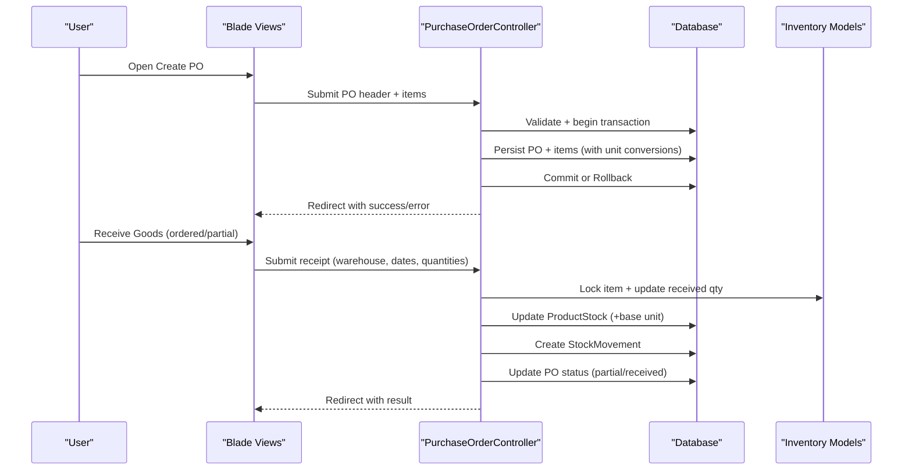
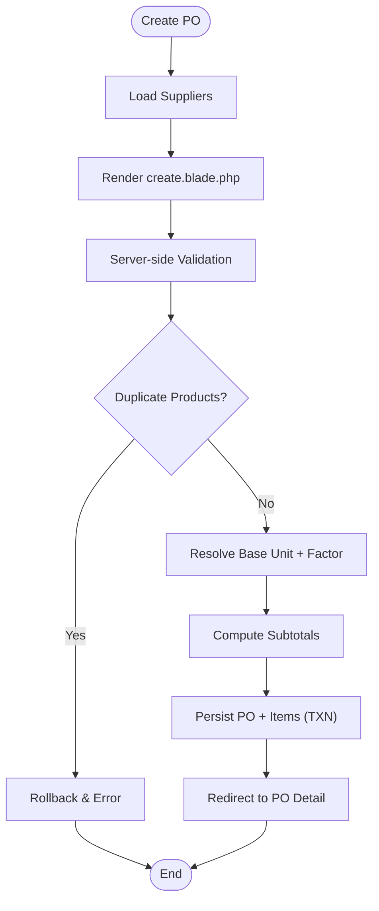
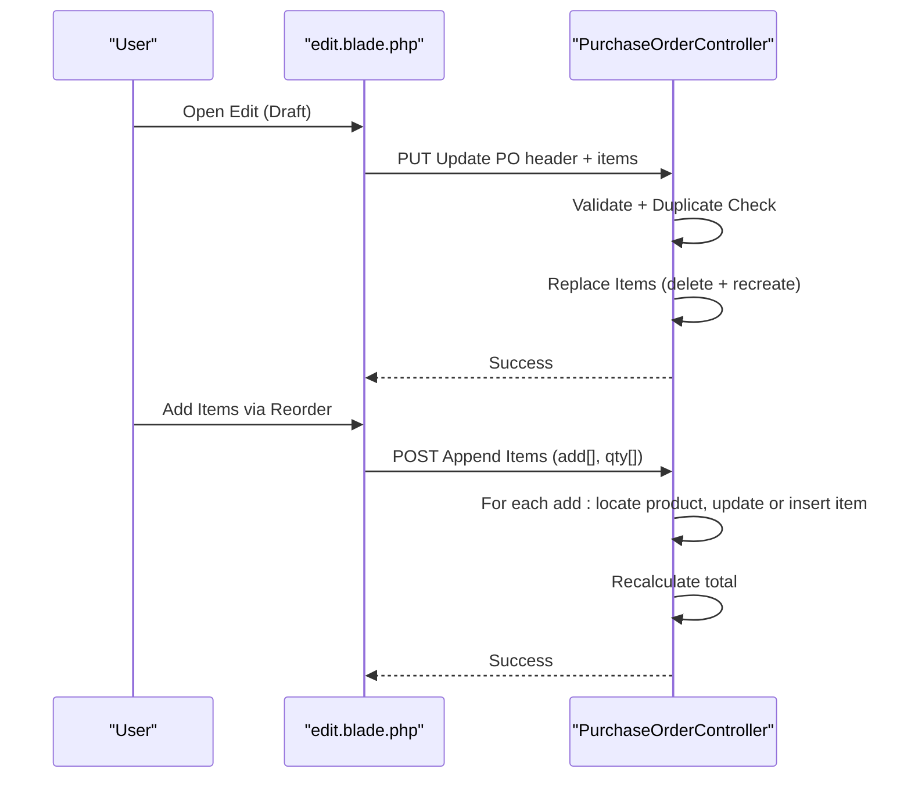
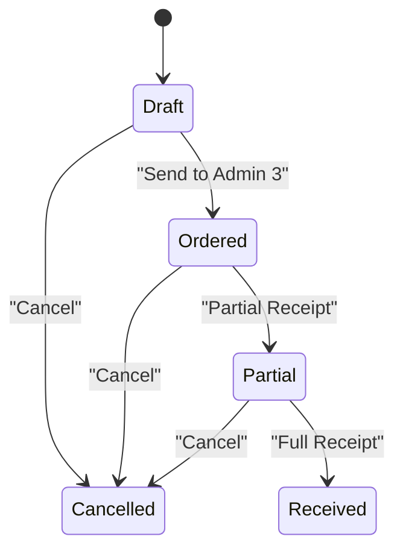
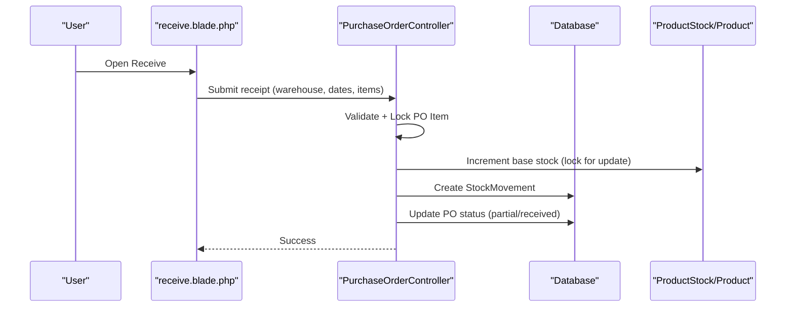
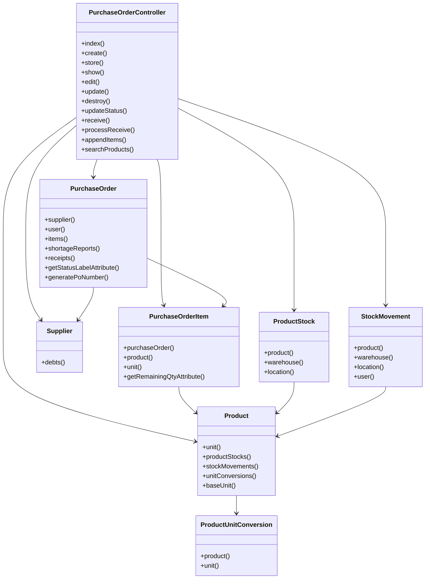

# Purchase Order Management

<cite>
**Referenced Files in This Document**
- [PurchaseOrderController.php](file://app/Http/Controllers/PurchaseOrderController.php)
- [PurchaseOrder.php](file://app/Models/PurchaseOrder.php)
- [PurchaseOrderItem.php](file://app/Models/PurchaseOrderItem.php)
- [Product.php](file://app/Models/Product.php)
- [Supplier.php](file://app/Models/Supplier.php)
- [ProductUnitConversion.php](file://app/Models/ProductUnitConversion.php)
- [ProductStock.php](file://app/Models/ProductStock.php)
- [StockMovement.php](file://app/Models/StockMovement.php)
- [2026_02_27_010001_create_purchase_orders_table.php](file://database/migrations/2026_02_27_010001_create_purchase_orders_table.php)
- [2026_02_27_010002_create_purchase_order_items_table.php](file://database/migrations/2026_02_27_010002_create_purchase_order_items_table.php)
- [create.blade.php](file://resources/views/pembelian/order/create.blade.php)
- [show.blade.php](file://resources/views/pembelian/order/show.blade.php)
- [edit.blade.php](file://resources/views/pembelian/order/edit.blade.php)
- [receive.blade.php](file://resources/views/pembelian/order/receive.blade.php)
</cite>

## Table of Contents
1. [Introduction](#introduction)
2. [Project Structure](#project-structure)
3. [Core Components](#core-components)
4. [Architecture Overview](#architecture-overview)
5. [Detailed Component Analysis](#detailed-component-analysis)
6. [Dependency Analysis](#dependency-analysis)
7. [Performance Considerations](#performance-considerations)
8. [Troubleshooting Guide](#troubleshooting-guide)
9. [Conclusion](#conclusion)

## Introduction
This document explains the complete Purchase Order (PO) lifecycle within the system, from creation to fulfillment. It covers PO generation, approval workflows, status management, product selection with unit conversions and pricing, validation rules, editing capabilities for draft POs, item addition via reorder suggestions, status transitions (draft → ordered → cancelled), automated PO numbering, validation constraints, duplicate product detection, transaction rollback mechanisms, and integrations with supplier management, product catalog, and inventory systems.

## Project Structure
The PO module spans controllers, models, migrations, and Blade views:
- Controller orchestrates creation, updates, status changes, and goods receipt.
- Models define domain entities and relationships.
- Migrations establish database schema for POs, items, suppliers, products, conversions, stocks, and movements.
- Views render PO creation, editing, viewing, and receipt processes.

**Diagram sources**
- [PurchaseOrderController.php:19-712](file://app/Http/Controllers/PurchaseOrderController.php#L19-L712)
- [PurchaseOrder.php:9-96](file://app/Models/PurchaseOrder.php#L9-L96)
- [PurchaseOrderItem.php:7-38](file://app/Models/PurchaseOrderItem.php#L7-L38)
- [Product.php:10-59](file://app/Models/Product.php#L10-L59)
- [ProductUnitConversion.php:7-45](file://app/Models/ProductUnitConversion.php#L7-L45)
- [Supplier.php:10-36](file://app/Models/Supplier.php#L10-L36)
- [ProductStock.php:9-46](file://app/Models/ProductStock.php#L9-L46)
- [StockMovement.php:9-59](file://app/Models/StockMovement.php#L9-L59)
- [create.blade.php:1-469](file://resources/views/pembelian/order/create.blade.php#L1-L469)
- [show.blade.php:1-435](file://resources/views/pembelian/order/show.blade.php#L1-L435)
- [edit.blade.php:1-455](file://resources/views/pembelian/order/edit.blade.php#L1-L455)
- [receive.blade.php:1-170](file://resources/views/pembelian/order/receive.blade.php#L1-L170)

**Section sources**
- [PurchaseOrderController.php:19-712](file://app/Http/Controllers/PurchaseOrderController.php#L19-L712)
- [PurchaseOrder.php:9-96](file://app/Models/PurchaseOrder.php#L9-L96)
- [PurchaseOrderItem.php:7-38](file://app/Models/PurchaseOrderItem.php#L7-L38)
- [Product.php:10-59](file://app/Models/Product.php#L10-L59)
- [Supplier.php:10-36](file://app/Models/Supplier.php#L10-L36)
- [ProductUnitConversion.php:7-45](file://app/Models/ProductUnitConversion.php#L7-L45)
- [ProductStock.php:9-46](file://app/Models/ProductStock.php#L9-L46)
- [StockMovement.php:9-59](file://app/Models/StockMovement.php#L9-L59)
- [2026_02_27_010001_create_purchase_orders_table.php:11-22](file://database/migrations/2026_02_27_010001_create_purchase_orders_table.php#L11-L22)
- [2026_02_27_010002_create_purchase_order_items_table.php:11-21](file://database/migrations/2026_02_27_010002_create_purchase_order_items_table.php#L11-L21)
- [create.blade.php:1-469](file://resources/views/pembelian/order/create.blade.php#L1-L469)
- [show.blade.php:1-435](file://resources/views/pembelian/order/show.blade.php#L1-L435)
- [edit.blade.php:1-455](file://resources/views/pembelian/order/edit.blade.php#L1-L455)
- [receive.blade.php:1-170](file://resources/views/pembelian/order/receive.blade.php#L1-L170)

## Core Components
- PurchaseOrderController: Implements PO CRUD, status transitions, goods receipt, and reorder item additions for drafts.
- PurchaseOrder: Domain model with fillable attributes, relations, status labels, and automatic PO number generation.
- PurchaseOrderItem: Line-item model linking POs to products with unit conversions and pricing.
- Product: Catalog entity with unit conversions and base unit resolution.
- ProductUnitConversion: Defines alternative units and conversion factors with purchase prices.
- Supplier: Vendor entity with debt linkage.
- ProductStock: Warehouse-level stock records with batch and expiry tracking.
- StockMovement: Inventory movement records tied to PO receipts.

**Section sources**
- [PurchaseOrderController.php:19-712](file://app/Http/Controllers/PurchaseOrderController.php#L19-L712)
- [PurchaseOrder.php:9-96](file://app/Models/PurchaseOrder.php#L9-L96)
- [PurchaseOrderItem.php:7-38](file://app/Models/PurchaseOrderItem.php#L7-L38)
- [Product.php:10-59](file://app/Models/Product.php#L10-L59)
- [ProductUnitConversion.php:7-45](file://app/Models/ProductUnitConversion.php#L7-L45)
- [Supplier.php:10-36](file://app/Models/Supplier.php#L10-L36)
- [ProductStock.php:9-46](file://app/Models/ProductStock.php#L9-L46)
- [StockMovement.php:9-59](file://app/Models/StockMovement.php#L9-L59)

## Architecture Overview
The PO lifecycle integrates UI views, controller actions, and domain models with database transactions and inventory updates.

**Diagram sources**
- [PurchaseOrderController.php:128-239](file://app/Http/Controllers/PurchaseOrderController.php#L128-L239)
- [PurchaseOrderController.php:535-667](file://app/Http/Controllers/PurchaseOrderController.php#L535-L667)
- [create.blade.php:25-124](file://resources/views/pembelian/order/create.blade.php#L25-L124)
- [receive.blade.php:66-167](file://resources/views/pembelian/order/receive.blade.php#L66-L167)

## Detailed Component Analysis

### PO Creation Workflow
- UI: create.blade.php renders PO header fields and dynamic item rows with product search, unit selection, and pricing.
- Validation: store validates presence of supplier, dates, items, and numeric/minimum constraints.
- Duplicate product detection: ensures unique product IDs across items.
- Unit conversions: resolves base unit and conversion factor; defaults to base unit if none provided.
- Pricing: computes subtotal per item; totals amount for the PO.
- Persistence: creates PO and items within a transaction; rollback on exceptions.

**Diagram sources**
- [PurchaseOrderController.php:128-239](file://app/Http/Controllers/PurchaseOrderController.php#L128-L239)
- [create.blade.php:127-469](file://resources/views/pembelian/order/create.blade.php#L127-L469)

**Section sources**
- [PurchaseOrderController.php:128-239](file://app/Http/Controllers/PurchaseOrderController.php#L128-L239)
- [create.blade.php:25-124](file://resources/views/pembelian/order/create.blade.php#L25-L124)
- [create.blade.php:204-469](file://resources/views/pembelian/order/create.blade.php#L204-L469)

### PO Editing and Reorder Suggestions
- Draft-only edits: edit validates status and allows replacing items and updating PO header.
- Reorder additions: appendItems accepts add[]=product_id and qty[]=quantity arrays to add items to a draft PO.
- Duplicate detection persists during edits to prevent repeated products.

**Diagram sources**
- [PurchaseOrderController.php:353-467](file://app/Http/Controllers/PurchaseOrderController.php#L353-L467)
- [PurchaseOrderController.php:282-348](file://app/Http/Controllers/PurchaseOrderController.php#L282-L348)
- [edit.blade.php:24-116](file://resources/views/pembelian/order/edit.blade.php#L24-L116)

**Section sources**
- [PurchaseOrderController.php:266-276](file://app/Http/Controllers/PurchaseOrderController.php#L266-L276)
- [PurchaseOrderController.php:353-467](file://app/Http/Controllers/PurchaseOrderController.php#L353-L467)
- [PurchaseOrderController.php:282-348](file://app/Http/Controllers/PurchaseOrderController.php#L282-L348)
- [edit.blade.php:24-116](file://resources/views/pembelian/order/edit.blade.php#L24-L116)
- [edit.blade.php:118-455](file://resources/views/pembelian/order/edit.blade.php#L118-L455)

### Status Transitions and Approval Workflow
- Allowed transitions: draft → ordered/cancelled; ordered → cancelled; partial → cancelled.
- UI triggers status change via hidden forms; messages reflect status changes.
- Ordered POs are routed to Admin 3 for receiving.

**Diagram sources**
- [PurchaseOrderController.php:487-514](file://app/Http/Controllers/PurchaseOrderController.php#L487-L514)
- [show.blade.php:280-304](file://resources/views/pembelian/order/show.blade.php#L280-L304)

**Section sources**
- [PurchaseOrderController.php:487-514](file://app/Http/Controllers/PurchaseOrderController.php#L487-L514)
- [show.blade.php:280-304](file://resources/views/pembelian/order/show.blade.php#L280-L304)

### Goods Receipt and Inventory Integration
- Access: receive action validates status and loads warehouses.
- Receipt processing: validates warehouse, dates, and per-item quantities; enforces remaining balance checks.
- Concurrency-safe stock updates: locks PO items, increments base-unit stock in ProductStock and Product, and records StockMovement.
- Supplier debt auto-creation: for credit POs, creates SupplierDebt if not present.

**Diagram sources**
- [PurchaseOrderController.php:519-667](file://app/Http/Controllers/PurchaseOrderController.php#L519-L667)
- [receive.blade.php:66-167](file://resources/views/pembelian/order/receive.blade.php#L66-L167)

**Section sources**
- [PurchaseOrderController.php:519-667](file://app/Http/Controllers/PurchaseOrderController.php#L519-L667)
- [receive.blade.php:66-167](file://resources/views/pembelian/order/receive.blade.php#L66-L167)

### PO Numbering, Templates, and Bulk Search
- Automated PO numbering: generatePoNumber prefixes with current date and increments by day.
- Templates: create.blade.php supports prefilled items via query parameters (add[], qty[]) and default payment terms/due dates.
- Bulk product search: searchProducts endpoint supports id or query-based filtering with unit conversions and pricing.

**Section sources**
- [PurchaseOrder.php:80-94](file://app/Models/PurchaseOrder.php#L80-L94)
- [PurchaseOrderController.php:57-123](file://app/Http/Controllers/PurchaseOrderController.php#L57-L123)
- [create.blade.php:164-202](file://resources/views/pembelian/order/create.blade.php#L164-L202)

### Supplier Selection Criteria and Integrations
- Supplier selection: create/edit views populate active suppliers; PO links to Supplier.
- Supplier debt: credit POs auto-create SupplierDebt entries with invoice number generation and due date computation.
- Inventory: ProductStock and StockMovement track warehouse, batch, expiry, and movement references.

**Section sources**
- [PurchaseOrderController.php:519-667](file://app/Http/Controllers/PurchaseOrderController.php#L519-L667)
- [Supplier.php:10-36](file://app/Models/Supplier.php#L10-L36)
- [ProductStock.php:9-46](file://app/Models/ProductStock.php#L9-L46)
- [StockMovement.php:9-59](file://app/Models/StockMovement.php#L9-L59)

## Dependency Analysis
The PO subsystem exhibits clear separation of concerns:
- Controller depends on models and database transactions.
- Models encapsulate relations and business attributes.
- Views depend on controller-provided data and routes.
- Inventory updates rely on locking and atomic increments.

**Diagram sources**
- [PurchaseOrderController.php:19-712](file://app/Http/Controllers/PurchaseOrderController.php#L19-L712)
- [PurchaseOrder.php:9-96](file://app/Models/PurchaseOrder.php#L9-L96)
- [PurchaseOrderItem.php:7-38](file://app/Models/PurchaseOrderItem.php#L7-L38)
- [Product.php:10-59](file://app/Models/Product.php#L10-L59)
- [ProductUnitConversion.php:7-45](file://app/Models/ProductUnitConversion.php#L7-L45)
- [Supplier.php:10-36](file://app/Models/Supplier.php#L10-L36)
- [ProductStock.php:9-46](file://app/Models/ProductStock.php#L9-L46)
- [StockMovement.php:9-59](file://app/Models/StockMovement.php#L9-L59)

**Section sources**
- [PurchaseOrderController.php:19-712](file://app/Http/Controllers/PurchaseOrderController.php#L19-L712)
- [PurchaseOrder.php:9-96](file://app/Models/PurchaseOrder.php#L9-L96)
- [PurchaseOrderItem.php:7-38](file://app/Models/PurchaseOrderItem.php#L7-L38)
- [Product.php:10-59](file://app/Models/Product.php#L10-L59)
- [ProductUnitConversion.php:7-45](file://app/Models/ProductUnitConversion.php#L7-L45)
- [Supplier.php:10-36](file://app/Models/Supplier.php#L10-L36)
- [ProductStock.php:9-46](file://app/Models/ProductStock.php#L9-L46)
- [StockMovement.php:9-59](file://app/Models/StockMovement.php#L9-L59)

## Performance Considerations
- Transaction boundaries: All PO creation, updates, and receipt operations wrap in transactions to maintain consistency.
- Locking: processReceive uses row-level locking on PO items to avoid race conditions during concurrent receipts.
- Indexing: migrations include indexes on frequently queried columns (e.g., purchase_orders.po_number, purchase_order_items.purchase_order_id).
- Frontend caching: create/edit views cache product/unit conversion results to reduce API calls.

[No sources needed since this section provides general guidance]

## Troubleshooting Guide
Common issues and remedies:
- Duplicate product in items: Controller rejects submissions with duplicate product IDs; remove duplicates before saving.
- Invalid unit for product: If selected unit lacks a conversion factor for the product, validation throws an error; choose a valid unit or base unit.
- Excess received quantity: Receipt validation prevents receiving more than remaining ordered quantity; adjust quantities accordingly.
- Non-draft status edits: Editing is restricted to draft POs; submit status change to ordered first if needed.
- Transaction failures: Any exception triggers rollback; check server logs for underlying causes.

**Section sources**
- [PurchaseOrderController.php:154-158](file://app/Http/Controllers/PurchaseOrderController.php#L154-L158)
- [PurchaseOrderController.php:206-209](file://app/Http/Controllers/PurchaseOrderController.php#L206-L209)
- [PurchaseOrderController.php:574-578](file://app/Http/Controllers/PurchaseOrderController.php#L574-L578)
- [PurchaseOrderController.php:268-271](file://app/Http/Controllers/PurchaseOrderController.php#L268-L271)
- [PurchaseOrderController.php:234-238](file://app/Http/Controllers/PurchaseOrderController.php#L234-L238)

## Conclusion
The PO management system provides a robust lifecycle from creation to fulfillment, with strong validation, unit conversion support, automated numbering, and seamless inventory integration. Draft-only editing and reorder suggestions streamline PO maintenance, while transactional receipts ensure accurate stock updates and audit trails.