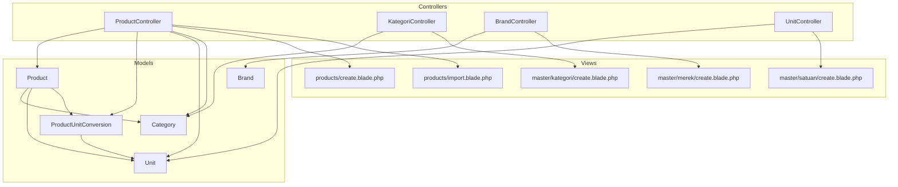
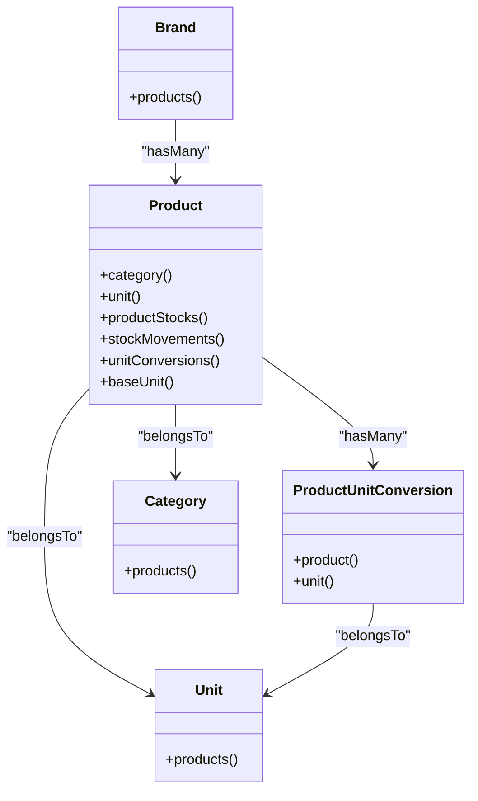
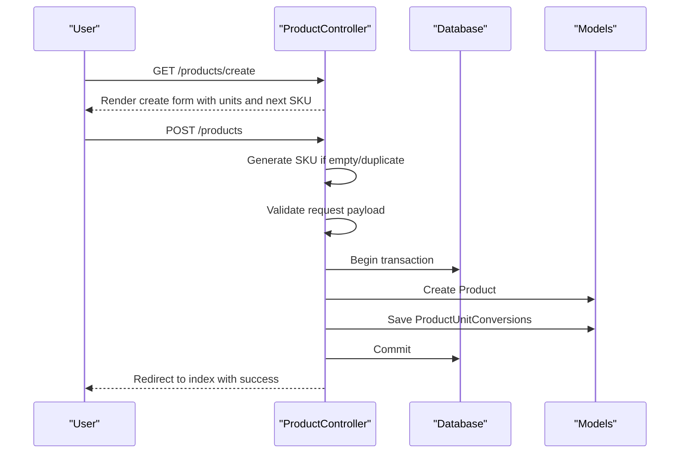
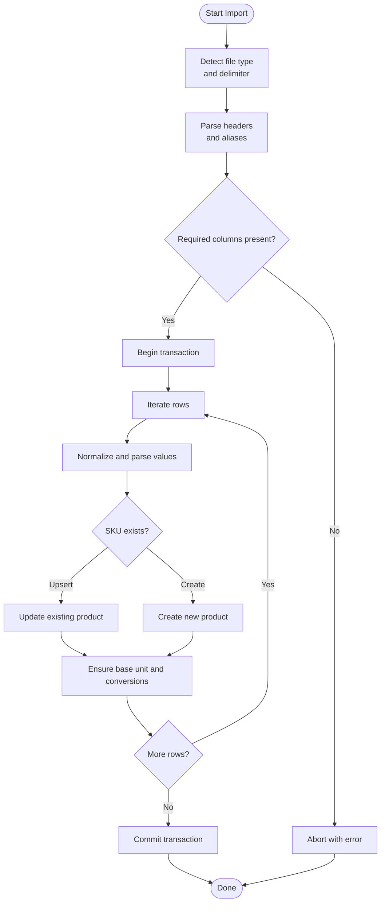
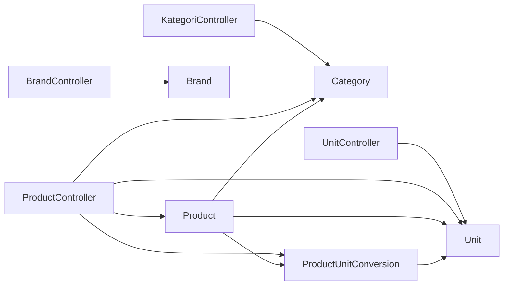
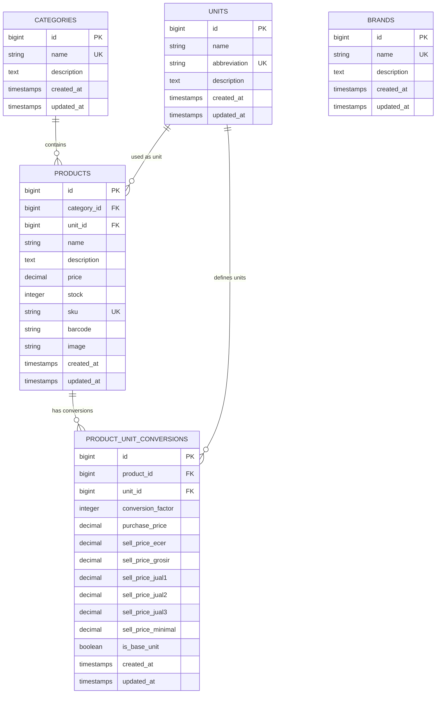

# Product & Master Data Management

<cite>
**Referenced Files in This Document**
- [ProductController.php](file://app/Http/Controllers/ProductController.php)
- [KategoriController.php](file://app/Http/Controllers/KategoriController.php)
- [BrandController.php](file://app/Http/Controllers/BrandController.php)
- [UnitController.php](file://app/Http/Controllers/UnitController.php)
- [Product.php](file://app/Models/Product.php)
- [ProductUnitConversion.php](file://app/Models/ProductUnitConversion.php)
- [Unit.php](file://app/Models/Unit.php)
- [Category.php](file://app/Models/Category.php)
- [Brand.php](file://app/Models/Brand.php)
- [create.blade.php](file://resources/views/products/create.blade.php)
- [create.blade.php (Kategori)](file://resources/views/master/kategori/create.blade.php)
- [create.blade.php (Brand)](file://resources/views/master/merek/create.blade.php)
- [create.blade.php (Unit)](file://resources/views/master/satuan/create.blade.php)
- [create.blade.php (Import)](file://resources/views/products/import.blade.php)
- [create.blade.php (Edit)](file://resources/views/products/edit.blade.php)
- [create.blade.php (Index)](file://resources/views/products/index.blade.php)
- [create.blade.php (Index Kategori)](file://resources/views/master/kategori/index.blade.php)
- [create.blade.php (Index Brand)](file://resources/views/master/merek/index.blade.php)
- [create.blade.php (Index Unit)](file://resources/views/master/satuan/index.blade.php)
- [create.blade.php (Show)](file://resources/views/products/show.blade.php)
- [create.blade.php (Template CSV):219-233](file://app/Http/Controllers/ProductController.php#L219-L233)
- [create.blade.php (Import Template Download):219-233](file://app/Http/Controllers/ProductController.php#L219-L233)
- [create.blade.php (Import Process):235-480](file://app/Http/Controllers/ProductController.php#L235-L480)
- [create.blade.php (SKU Generation):36-45](file://app/Http/Controllers/ProductController.php#L36-L45)
- [create.blade.php (Unit Conversions Save):730-768](file://app/Http/Controllers/ProductController.php#L730-L768)
- [create.blade.php (CSV Import Aliases):508-530](file://app/Http/Controllers/ProductController.php#L508-L530)
- [create.blade.php (CSV Number Parsing):686-724](file://app/Http/Controllers/ProductController.php#L686-L724)
- [create.blade.php (XLSX Reader):532-672](file://app/Http/Controllers/ProductController.php#L532-L672)
- [create.blade.php (Product Model Relations):29-58](file://app/Models/Product.php#L29-L58)
- [create.blade.php (Unit Conversion Model):35-43](file://app/Models/ProductUnitConversion.php#L35-L43)
- [create.blade.php (Unit Model):11-14](file://app/Models/Unit.php#L11-L14)
- [create.blade.php (Category Model):11-14](file://app/Models/Category.php#L11-L14)
- [create.blade.php (Brand Model):11-14](file://app/Models/Brand.php#L11-L14)
- [create.blade.php (Products Migration):14-24](file://database/migrations/2026_02_26_162555_create_products_table.php#L14-L24)
- [create.blade.php (Units Migration):11-17](file://database/migrations/2026_02_27_000001_create_units_table.php#L11-L17)
- [create.blade.php (Brands Migration):11-16](file://database/migrations/2026_02_27_000002_create_brands_table.php#L11-L16)
- [create.blade.php (Product Unit Conversions Migration):11-24](file://database/migrations/2026_02_27_020001_create_product_unit_conversions_table.php#L11-L24)
</cite>

## Table of Contents
1. [Introduction](#introduction)
2. [Project Structure](#project-structure)
3. [Core Components](#core-components)
4. [Architecture Overview](#architecture-overview)
5. [Detailed Component Analysis](#detailed-component-analysis)
6. [Dependency Analysis](#dependency-analysis)
7. [Performance Considerations](#performance-considerations)
8. [Troubleshooting Guide](#troubleshooting-guide)
9. [Conclusion](#conclusion)
10. [Appendices](#appendices)

## Introduction
This document explains the Product & Master Data Management system, focusing on product catalog, categories, brands, and units of measurement. It covers the end-to-end product creation workflow, barcode management, pricing strategies, and inventory tracking. It also documents category hierarchy, brand management, unit conversion systems, product import/export functionality, bulk operations, and data validation processes. Practical examples demonstrate product setup, category organization, unit conversions, and master data maintenance, along with integration points to inventory, sales, and procurement workflows.

## Project Structure
The system is organized around Laravel MVC with dedicated controllers and models for products, categories, brands, and units. Views provide user interfaces for CRUD operations, import templates, and product editing. Migrations define the relational schema for master data and product unit conversions.

**Diagram sources**
- [ProductController.php:13-115](file://app/Http/Controllers/ProductController.php#L13-L115)
- [KategoriController.php:10-37](file://app/Http/Controllers/KategoriController.php#L10-L37)
- [BrandController.php:8-33](file://app/Http/Controllers/BrandController.php#L8-L33)
- [UnitController.php:12-41](file://app/Http/Controllers/UnitController.php#L12-L41)
- [Product.php:10-58](file://app/Models/Product.php#L10-L58)
- [ProductUnitConversion.php:7-43](file://app/Models/ProductUnitConversion.php#L7-L43)
- [Unit.php:7-15](file://app/Models/Unit.php#L7-L15)
- [Category.php:7-15](file://app/Models/Category.php#L7-L15)
- [Brand.php:7-15](file://app/Models/Brand.php#L7-L15)
- [create.blade.php:52-183](file://resources/views/products/create.blade.php#L52-L183)
- [create.blade.php (Import)](file://resources/views/products/import.blade.php)
- [create.blade.php (Kategori)](file://resources/views/master/kategori/create.blade.php)
- [create.blade.php (Brand)](file://resources/views/master/merek/create.blade.php)
- [create.blade.php (Unit)](file://resources/views/master/satuan/create.blade.php)

**Section sources**
- [ProductController.php:13-115](file://app/Http/Controllers/ProductController.php#L13-L115)
- [KategoriController.php:10-37](file://app/Http/Controllers/KategoriController.php#L10-L37)
- [BrandController.php:8-33](file://app/Http/Controllers/BrandController.php#L8-L33)
- [UnitController.php:12-41](file://app/Http/Controllers/UnitController.php#L12-L41)
- [Product.php:10-58](file://app/Models/Product.php#L10-L58)
- [ProductUnitConversion.php:7-43](file://app/Models/ProductUnitConversion.php#L7-L43)
- [Unit.php:7-15](file://app/Models/Unit.php#L7-L15)
- [Category.php:7-15](file://app/Models/Category.php#L7-L15)
- [Brand.php:7-15](file://app/Models/Brand.php#L7-L15)
- [create.blade.php:52-183](file://resources/views/products/create.blade.php#L52-L183)
- [create.blade.php (Import)](file://resources/views/products/import.blade.php)
- [create.blade.php (Kategori)](file://resources/views/master/kategori/create.blade.php)
- [create.blade.php (Brand)](file://resources/views/master/merek/create.blade.php)
- [create.blade.php (Unit)](file://resources/views/master/satuan/create.blade.php)

## Core Components
- Product Catalog: Centralized product entity with category and unit associations, pricing, stock, and conversions.
- Categories: Hierarchical classification of products with counts of associated items.
- Brands: Manufacturer or brand identifiers linked to products.
- Units of Measurement: Base and derived units with conversion factors and multiple pricing tiers.
- Import/Export: CSV/XLSX import with flexible column aliases, upsert modes, and validation; downloadable template export.

Key capabilities:
- Product creation with automatic SKU generation and unique barcode enforcement.
- Multi-unit pricing with configurable markup and base unit selection.
- Bulk import supporting create-only or upsert-by-SKU modes with detailed error reporting.
- Master data maintenance with deletion safeguards against active usage.

**Section sources**
- [ProductController.php:36-45](file://app/Http/Controllers/ProductController.php#L36-L45)
- [ProductController.php:59-115](file://app/Http/Controllers/ProductController.php#L59-L115)
- [ProductController.php:219-233](file://app/Http/Controllers/ProductController.php#L219-L233)
- [ProductController.php:235-480](file://app/Http/Controllers/ProductController.php#L235-L480)
- [Product.php:23-58](file://app/Models/Product.php#L23-L58)
- [ProductUnitConversion.php:9-33](file://app/Models/ProductUnitConversion.php#L9-L33)
- [UnitController.php:59-85](file://app/Http/Controllers/UnitController.php#L59-L85)
- [KategoriController.php:54-69](file://app/Http/Controllers/KategoriController.php#L54-L69)
- [BrandController.php:50-57](file://app/Http/Controllers/BrandController.php#L50-L57)

## Architecture Overview
The system follows a layered MVC pattern with explicit separation of concerns:
- Controllers handle HTTP requests, validations, transactions, and file parsing.
- Models encapsulate business logic, relationships, and persistence.
- Views render forms and dashboards for product creation, editing, importing, and listing.
- Migrations define normalized schemas for products, units, brands, and conversions.

**Diagram sources**
- [Product.php:29-58](file://app/Models/Product.php#L29-L58)
- [ProductUnitConversion.php:35-43](file://app/Models/ProductUnitConversion.php#L35-L43)
- [Unit.php:11-14](file://app/Models/Unit.php#L11-L14)
- [Category.php:11-14](file://app/Models/Category.php#L11-L14)
- [Brand.php:11-14](file://app/Models/Brand.php#L11-L14)

## Detailed Component Analysis

### Product Creation Workflow
End-to-end process:
- Generate SKU automatically if missing or duplicate.
- Validate required fields and uniqueness constraints.
- Persist product record and unit conversions.
- Enforce exactly one base unit per product (explicit checkbox or minimal factor).
- Sync master price/purchase price to hidden inputs for UI consistency.

**Diagram sources**
- [ProductController.php:36-45](file://app/Http/Controllers/ProductController.php#L36-L45)
- [ProductController.php:59-115](file://app/Http/Controllers/ProductController.php#L59-L115)
- [ProductController.php:730-768](file://app/Http/Controllers/ProductController.php#L730-L768)
- [create.blade.php:52-183](file://resources/views/products/create.blade.php#L52-L183)

**Section sources**
- [ProductController.php:36-45](file://app/Http/Controllers/ProductController.php#L36-L45)
- [ProductController.php:59-115](file://app/Http/Controllers/ProductController.php#L59-L115)
- [ProductController.php:730-768](file://app/Http/Controllers/ProductController.php#L730-L768)
- [create.blade.php:52-183](file://resources/views/products/create.blade.php#L52-L183)

### Barcode Management
- Barcodes are optional but enforced to be unique per product.
- The create form includes a barcode field; import supports EAN-like identifiers via aliases.
- During import, blank barcodes are stored as null to maintain referential integrity.

Practical tips:
- Use unique barcodes to avoid conflicts during scanning and POS operations.
- Leverage import aliases to map existing spreadsheets containing EAN or barcode columns.

**Section sources**
- [ProductController.php:66-90](file://app/Http/Controllers/ProductController.php#L66-L90)
- [ProductController.php:357-358](file://app/Http/Controllers/ProductController.php#L357-L358)
- [ProductController.php:516-521](file://app/Http/Controllers/ProductController.php#L516-L521)

### Pricing Strategies
- Multiple price tiers per unit: ecer (retail), grosir (wholesale), jual1–3, minimal.
- Markup calculator computes suggested prices from purchase cost and percentage.
- Base unit determines master price synchronization to top-level product price fields.

Best practices:
- Define the base unit as the smallest unit (factor=1) to simplify calculations.
- Use markup percentages to standardize margins across units.

**Section sources**
- [ProductController.php:78-90](file://app/Http/Controllers/ProductController.php#L78-L90)
- [ProductController.php:154-176](file://app/Http/Controllers/ProductController.php#L154-L176)
- [create.blade.php:144-156](file://resources/views/products/create.blade.php#L144-L156)
- [create.blade.php:318-340](file://resources/views/products/create.blade.php#L318-L340)

### Inventory Tracking
- Products track current stock and minimum stock thresholds.
- Stock movements and warehouse stocks are modeled via related entities (not covered here).
- Import supports initial stock and minimum stock values.

Recommendations:
- Set realistic minimum stock levels to trigger reorder alerts.
- Use consistent units across purchases and sales to prevent discrepancies.

**Section sources**
- [ProductController.php:75-77](file://app/Http/Controllers/ProductController.php#L75-L77)
- [ProductController.php:366-369](file://app/Http/Controllers/ProductController.php#L366-L369)
- [Products Migration:19-21](file://database/migrations/2026_02_26_162555_create_products_table.php#L19-L21)

### Category Hierarchy and Management
- Categories support listing, search, creation, update, and deletion.
- Deletion is prevented if categories are referenced by products or transactions.

Guidelines:
- Avoid deleting categories with existing products; reassign products to another category first.
- Keep category names unique and descriptive for easy filtering.

**Section sources**
- [KategoriController.php:12-22](file://app/Http/Controllers/KategoriController.php#L12-L22)
- [KategoriController.php:29-37](file://app/Http/Controllers/KategoriController.php#L29-L37)
- [KategoriController.php:44-52](file://app/Http/Controllers/KategoriController.php#L44-L52)
- [KategoriController.php:54-69](file://app/Http/Controllers/KategoriController.php#L54-L69)
- [Category Model:11-14](file://app/Models/Category.php#L11-L14)

### Brand Management
- Brands mirror categories in CRUD operations and safety checks.
- Deletion blocked if still associated with products.

Operational notes:
- Maintain brand consistency across suppliers and procurement records.
- Use brands to group products for reporting and promotions.

**Section sources**
- [BrandController.php:10-18](file://app/Http/Controllers/BrandController.php#L10-L18)
- [BrandController.php:25-33](file://app/Http/Controllers/BrandController.php#L25-L33)
- [BrandController.php:40-48](file://app/Http/Controllers/BrandController.php#L40-L48)
- [BrandController.php:50-57](file://app/Http/Controllers/BrandController.php#L50-L57)
- [Brand Model:11-14](file://app/Models/Brand.php#L11-L14)

### Units of Measurement and Conversions
- Units define name, abbreviation, and description.
- ProductUnitConversions link products to units with conversion factors and per-unit prices.
- Exactly one base unit per product; defaults to the row with the smallest factor if none selected.

UI behavior:
- The create form renders a dynamic table of units with money inputs and a base unit toggle.
- Markup calculator applies percentages to purchase price to compute suggested selling prices.

**Section sources**
- [UnitController.php:14-25](file://app/Http/Controllers/UnitController.php#L14-L25)
- [UnitController.php:32-41](file://app/Http/Controllers/UnitController.php#L32-L41)
- [UnitController.php:48-57](file://app/Http/Controllers/UnitController.php#L48-L57)
- [UnitController.php:59-85](file://app/Http/Controllers/UnitController.php#L59-L85)
- [Unit Model:11-14](file://app/Models/Unit.php#L11-L14)
- [ProductUnitConversion Model:35-43](file://app/Models/ProductUnitConversion.php#L35-L43)
- [ProductUnitConversions Migration:11-24](file://database/migrations/2026_02_27_020001_create_product_unit_conversions_table.php#L11-L24)
- [create.blade.php:158-182](file://resources/views/products/create.blade.php#L158-L182)
- [create.blade.php:318-340](file://resources/views/products/create.blade.php#L318-L340)

### Product Import/Export and Bulk Operations
- Import supports CSV and XLSX with automatic delimiter detection and shared string parsing for XLSX.
- Column aliases enable flexible spreadsheets (e.g., product name, category, unit, SKU, barcode, price, purchase price, stock, min_stock, description).
- Modes:
  - Upsert by SKU (default): creates new products or updates existing ones by SKU.
  - Create only: skips existing SKUs.
- Export: downloadable CSV template with sample rows for quick onboarding.

Validation and error handling:
- Reads headers, validates required columns, parses numbers with locale-aware normalization, and reports row-level errors without aborting the entire batch.

**Diagram sources**
- [ProductController.php:235-480](file://app/Http/Controllers/ProductController.php#L235-L480)
- [ProductController.php:508-530](file://app/Http/Controllers/ProductController.php#L508-L530)
- [ProductController.php:686-724](file://app/Http/Controllers/ProductController.php#L686-L724)
- [ProductController.php:532-672](file://app/Http/Controllers/ProductController.php#L532-L672)

**Section sources**
- [ProductController.php:219-233](file://app/Http/Controllers/ProductController.php#L219-L233)
- [ProductController.php:235-480](file://app/Http/Controllers/ProductController.php#L235-L480)
- [ProductController.php:508-530](file://app/Http/Controllers/ProductController.php#L508-L530)
- [ProductController.php:686-724](file://app/Http/Controllers/ProductController.php#L686-L724)
- [ProductController.php:532-672](file://app/Http/Controllers/ProductController.php#L532-L672)

### Practical Examples

- Product Setup
  - Create a product with category, SKU (auto-generated), barcode (optional), stock, and minimum stock.
  - Add unit conversions with a base unit (e.g., piece as base, carton as derived).
  - Use the markup calculator to compute suggested prices.

- Category Organization
  - Create categories like “Sembako,” “Minuman,” and “Snack.”
  - Reassign products to categories as needed; avoid deleting categories with existing products.

- Unit Conversions
  - Define units like “pcs,” “kg,” “dus,” “karton.”
  - Set conversion factors (e.g., 1 karton = 40 pcs) and per-unit prices.
  - Ensure only one base unit per product.

- Master Data Maintenance
  - Brands: Maintain brand list and avoid deletion if still used by products.
  - Units: Prevent deletion if used by products or conversions; check purchase return items.

**Section sources**
- [create.blade.php:52-183](file://resources/views/products/create.blade.php#L52-L183)
- [create.blade.php (Kategori)](file://resources/views/master/kategori/create.blade.php)
- [create.blade.php (Brand)](file://resources/views/master/merek/create.blade.php)
- [create.blade.php (Unit)](file://resources/views/master/satuan/create.blade.php)
- [KategoriController.php:54-69](file://app/Http/Controllers/KategoriController.php#L54-L69)
- [BrandController.php:50-57](file://app/Http/Controllers/BrandController.php#L50-L57)
- [UnitController.php:59-85](file://app/Http/Controllers/UnitController.php#L59-L85)

## Dependency Analysis
- Product depends on Category and Unit; maintains conversions and stock-related relations.
- ProductUnitConversion depends on Product and Unit; ensures unique unit per product and enforces base unit semantics.
- Controllers depend on models and views; ProductController orchestrates transactions and file parsing.

**Diagram sources**
- [ProductController.php:13-115](file://app/Http/Controllers/ProductController.php#L13-L115)
- [KategoriController.php:10-37](file://app/Http/Controllers/KategoriController.php#L10-L37)
- [BrandController.php:8-33](file://app/Http/Controllers/BrandController.php#L8-L33)
- [UnitController.php:12-41](file://app/Http/Controllers/UnitController.php#L12-L41)
- [Product.php:29-58](file://app/Models/Product.php#L29-L58)
- [ProductUnitConversion.php:35-43](file://app/Models/ProductUnitConversion.php#L35-L43)
- [Unit.php:11-14](file://app/Models/Unit.php#L11-L14)
- [Category.php:11-14](file://app/Models/Category.php#L11-L14)
- [Brand.php:11-14](file://app/Models/Brand.php#L11-L14)

**Section sources**
- [Product.php:29-58](file://app/Models/Product.php#L29-L58)
- [ProductUnitConversion.php:35-43](file://app/Models/ProductUnitConversion.php#L35-L43)
- [Unit.php:11-14](file://app/Models/Unit.php#L11-L14)
- [Category.php:11-14](file://app/Models/Category.php#L11-L14)
- [Brand.php:11-14](file://app/Models/Brand.php#L11-L14)

## Performance Considerations
- Use pagination for product and master data listings to limit memory usage.
- Indexes on frequently filtered columns (e.g., category_id, sku, barcode) improve query performance.
- Batch imports leverage transactions to reduce overhead and ensure atomicity.
- Avoid excessive unit conversions per product; keep conversion logic simple to minimize joins.

## Troubleshooting Guide
Common issues and resolutions:
- Duplicate SKU or barcode: The system auto-generates SKU and enforces uniqueness; ensure unique barcodes if used.
- Import failures: Validate required columns, correct delimiters, and number formats; review row-specific errors returned after import.
- Deleting restrictions:
  - Category: Cannot delete if products or transactions reference it.
  - Brand: Cannot delete if products reference it.
  - Unit: Cannot delete if products, conversions, or purchase return items reference it.

**Section sources**
- [ProductController.php:61-64](file://app/Http/Controllers/ProductController.php#L61-L64)
- [ProductController.php:237-240](file://app/Http/Controllers/ProductController.php#L237-L240)
- [KategoriController.php:56-69](file://app/Http/Controllers/KategoriController.php#L56-L69)
- [BrandController.php:52-57](file://app/Http/Controllers/BrandController.php#L52-L57)
- [UnitController.php:61-85](file://app/Http/Controllers/UnitController.php#L61-L85)

## Conclusion
The Product & Master Data Management system provides robust capabilities for maintaining product catalogs, categories, brands, and units of measurement. It supports precise pricing strategies, barcode handling, and comprehensive import/export workflows. By enforcing data integrity, preventing unsafe deletions, and offering powerful bulk operations, the system integrates seamlessly with inventory, sales, and procurement processes.

## Appendices

### Data Model Diagram

**Diagram sources**
- [Products Migration:14-24](file://database/migrations/2026_02_26_162555_create_products_table.php#L14-L24)
- [Units Migration:11-17](file://database/migrations/2026_02_27_000001_create_units_table.php#L11-L17)
- [Brands Migration:11-16](file://database/migrations/2026_02_27_000002_create_brands_table.php#L11-L16)
- [Product Unit Conversions Migration:11-24](file://database/migrations/2026_02_27_020001_create_product_unit_conversions_table.php#L11-L24)
- [Category Model:11-14](file://app/Models/Category.php#L11-L14)
- [Unit Model:11-14](file://app/Models/Unit.php#L11-L14)
- [Product Model:29-58](file://app/Models/Product.php#L29-L58)
- [ProductUnitConversion Model:35-43](file://app/Models/ProductUnitConversion.php#L35-L43)