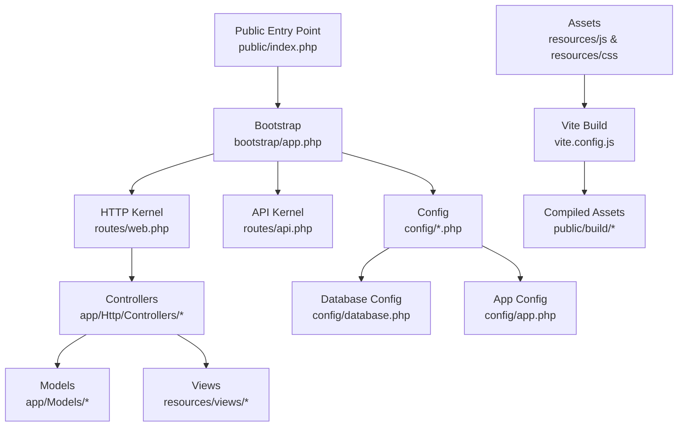
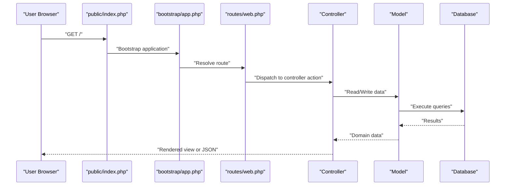
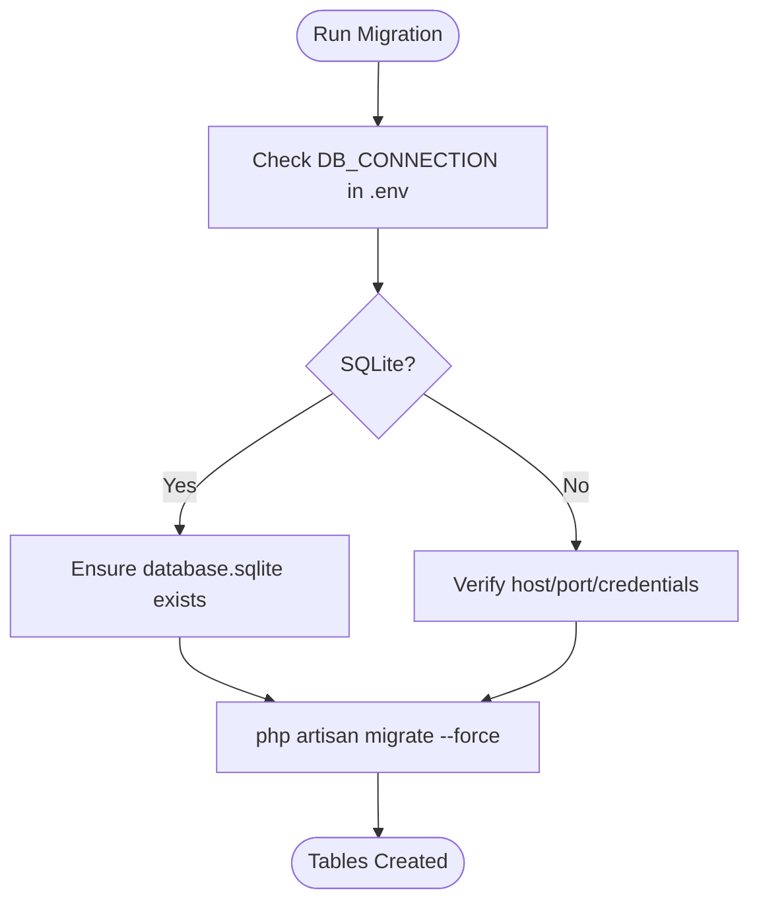
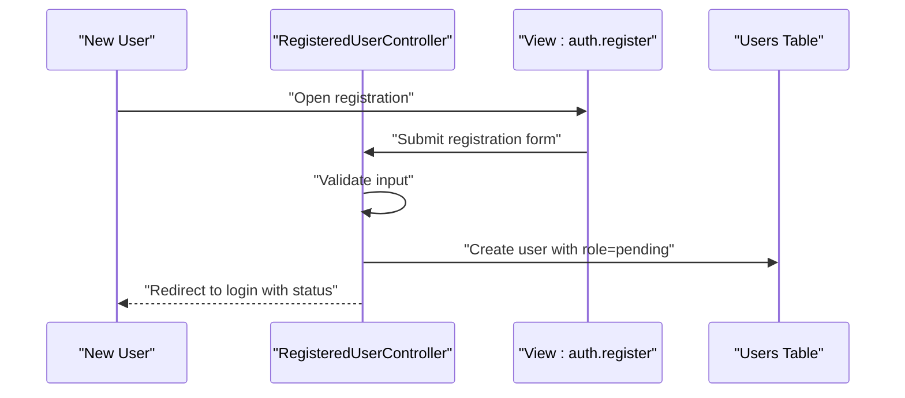
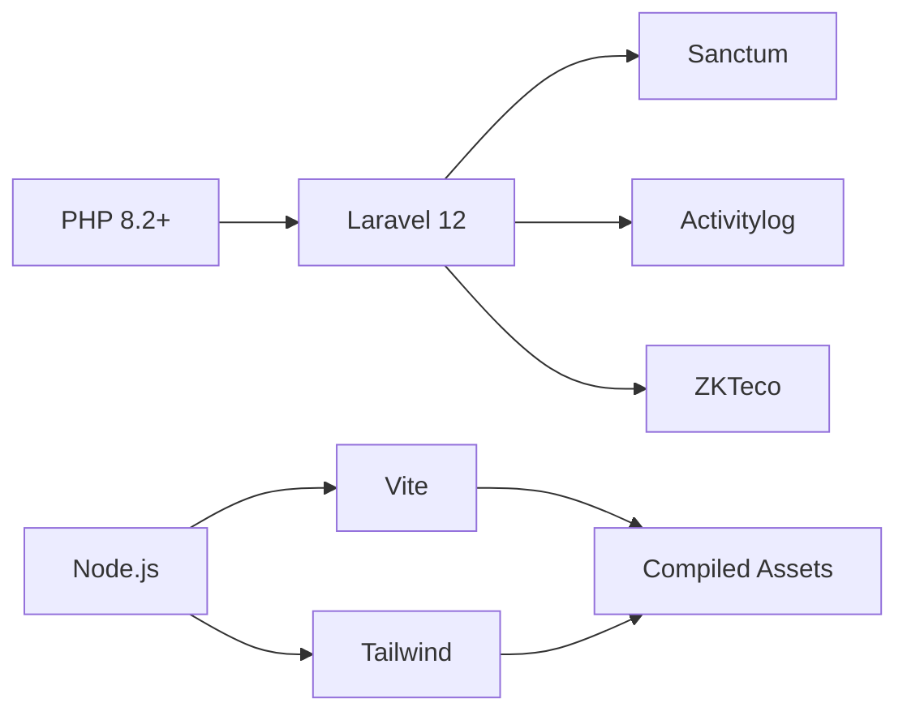

# Getting Started

<cite>
**Referenced Files in This Document**
- [composer.json](file://composer.json)
- [package.json](file://package.json)
- [.env.example](file://.env.example)
- [config/app.php](file://config/app.php)
- [config/database.php](file://config/database.php)
- [vite.config.js](file://vite.config.js)
- [tailwind.config.js](file://tailwind.config.js)
- [bootstrap/app.php](file://bootstrap/app.php)
- [database/migrations/0001_01_01_000000_create_users_table.php](file://database/migrations/0001_01_01_000000_create_users_table.php)
- [app/Http/Controllers/Auth/RegisteredUserController.php](file://app/Http/Controllers/Auth/RegisteredUserController.php)
- [resources/views/auth/register.blade.php](file://resources/views/auth/register.blade.php)
- [resources/views/auth/login.blade.php](file://resources/views/auth/login.blade.php)
- [routes/web.php](file://routes/web.php)
- [routes/api.php](file://routes/api.php)
- [public/index.php](file://public/index.php)
- [README.md](file://README.md)
</cite>

## Table of Contents
1. [Introduction](#introduction)
2. [Project Structure](#project-structure)
3. [Core Components](#core-components)
4. [Architecture Overview](#architecture-overview)
5. [Detailed Component Analysis](#detailed-component-analysis)
6. [Dependency Analysis](#dependency-analysis)
7. [Performance Considerations](#performance-considerations)
8. [Troubleshooting Guide](#troubleshooting-guide)
9. [Conclusion](#conclusion)
10. [Appendices](#appendices)

## Introduction
This guide helps you install and set up the DODPOS system locally and prepare for production deployment. It covers PHP 8.2+, Laravel 12, Node.js and Vite asset pipeline, database configuration, environment variables, Composer and NPM setup, database migrations, and initial user creation. It also includes verification steps, troubleshooting tips, and best practices for local development versus production.

## Project Structure
DODPOS is a Laravel 12 application with a modern frontend built using Vite and Tailwind CSS. The backend is organized by domain features (modules like Gula, Kanvas, Mineral, Minyak, etc.) under app/Http/Controllers and app/Models. Configuration is centralized in config/*. Frontend assets live under resources/js and resources/css, compiled via Vite.

**Diagram sources**
- [public/index.php](file://public/index.php)
- [bootstrap/app.php](file://bootstrap/app.php)
- [routes/web.php](file://routes/web.php)
- [routes/api.php](file://routes/api.php)
- [config/database.php](file://config/database.php)
- [config/app.php](file://config/app.php)
- [vite.config.js](file://vite.config.js)

**Section sources**
- [README.md](file://README.md)
- [composer.json](file://composer.json)
- [package.json](file://package.json)
- [vite.config.js](file://vite.config.js)
- [tailwind.config.js](file://tailwind.config.js)

## Core Components
- PHP runtime: Requires version 8.2 or higher as declared in composer.json.
- Laravel framework: Laravel 12 is required.
- Node.js and Vite: Used for frontend asset compilation and development server.
- Database: SQLite is enabled by default; MySQL/MariaDB/PostgreSQL/SQLSRV are supported via environment variables.
- Environment variables: Application name, environment, debug mode, URL, locale, database connection, session, queue, cache, and mailer are configured in .env.
- Asset pipeline: Vite compiles Tailwind CSS and JS; Tailwind is configured to scan Blade and framework views.

Key setup indicators:
- PHP requirement: [composer.json:8-15](file://composer.json#L8-L15)
- Laravel 12 requirement: [composer.json:11](file://composer.json#L11)
- Node/Vite scripts: [package.json:5-8](file://package.json#L5-L8), [vite.config.js:1-12](file://vite.config.js#L1-L12)
- Default database connection: [config/database.php:19](file://config/database.php#L19)
- Environment defaults: [config/app.php:16](file://config/app.php#L16), [config/app.php:29](file://config/app.php#L29), [config/app.php:42](file://config/app.php#L42), [config/app.php:55](file://config/app.php#L55), [config/app.php:81](file://config/app.php#L81), [config/app.php:85](file://config/app.php#L85)
- Environment variable defaults: [.env.example:1-66](file://.env.example#L1-L66)

**Section sources**
- [composer.json:8-15](file://composer.json#L8-L15)
- [package.json:5-8](file://package.json#L5-L8)
- [vite.config.js:1-12](file://vite.config.js#L1-L12)
- [config/app.php:16-55](file://config/app.php#L16-L55)
- [.env.example:1-66](file://.env.example#L1-L66)

## Architecture Overview
The application boots through public/index.php, which delegates to bootstrap/app.php. Routing is split between web and API routes. Controllers orchestrate requests, models handle persistence, and Blade templates render views. Assets are compiled by Vite and served from public/build.

**Diagram sources**
- [public/index.php](file://public/index.php)
- [bootstrap/app.php](file://bootstrap/app.php)
- [routes/web.php](file://routes/web.php)

## Detailed Component Analysis

### Local Installation Steps
Follow these steps to install and run DODPOS locally:

1) Prerequisites
- PHP 8.2+ installed and enabled required extensions.
- Composer installed globally.
- Node.js LTS and npm installed.
- Web server (Apache/Nginx) configured to serve the public/ directory.

2) Clone and install backend dependencies
- Copy repository to your web root.
- Install PHP dependencies:
  - Run: composer install
- Generate application key:
  - Run: php artisan key:generate
- Prepare environment:
  - Copy .env.example to .env and adjust settings as needed.
  - Ensure APP_KEY is set after key generation.

3) Configure database
- Default is SQLite (config/database.php sets sqlite). Ensure the database file exists or let migrations create it.
- To use MySQL/MariaDB/PostgreSQL/SQLSRV, update DB_CONNECTION and related variables in .env according to .env.example.

4) Run migrations
- Execute: php artisan migrate --force

5) Install frontend dependencies and build assets
- Install Node dependencies: npm install
- Build assets: npm run build

6) Start the application
- Development server with hot reload and queue listener:
  - Run: composer dev
- Or start Laravel server and Vite separately:
  - Terminal 1: php artisan serve
  - Terminal 2: npm run dev

7) Access the application
- Open http://localhost in your browser.
- Default login is available if you created an admin user during seeding or manual creation.

Verification steps
- Confirm homepage loads without errors.
- Verify assets compile and Vite refreshes on change.
- Ensure sessions and authentication work.

**Section sources**
- [composer.json:39-50](file://composer.json#L39-L50)
- [composer.json](file://composer.json#L11)
- [composer.json:8-15](file://composer.json#L8-L15)
- [package.json:5-8](file://package.json#L5-L8)
- [config/database.php](file://config/database.php#L19)
- [.env.example:23-28](file://.env.example#L23-L28)
- [bootstrap/app.php:9-28](file://bootstrap/app.php#L9-L28)

### Production Deployment Considerations
- PHP and Composer
  - Ensure PHP 8.2+ is installed and all Composer dependencies are installed in production.
  - Use composer install with --no-dev and --optimize-autoloader for performance.
- Node.js and assets
  - Build assets locally in CI/CD: npm ci followed by npm run build.
  - Commit public/build assets to version control or precompile in deployment pipeline.
- Environment
  - Set APP_ENV=production and APP_DEBUG=false.
  - Set APP_URL to your production hostname.
  - Configure database credentials for MySQL/MariaDB/PostgreSQL/SQLSRV.
  - Set QUEUE_CONNECTION appropriate for your environment (database recommended for simplicity).
- Web server
  - Point document root to public/.
  - Ensure mod_rewrite or equivalent is enabled.
- Sessions and cache
  - Use database or Redis for SESSION_DRIVER and CACHE_STORE.
- HTTPS and security
  - Enforce HTTPS and secure cookies.
  - Rotate APP_KEY regularly.

[No sources needed since this section provides general guidance]

### Initial Setup and First-Time Configuration
- Generate application key and set APP_KEY in .env.
- Choose database:
  - SQLite: default; ensure database.sqlite exists or run migrations.
  - MySQL/MariaDB/PostgreSQL/SQLSRV: set DB_CONNECTION and credentials in .env.
- Configure locales and timezone in .env if needed.
- Configure mailer and broadcast settings for production.
- Build assets once for production.

**Section sources**
- [config/app.php:16-55](file://config/app.php#L16-L55)
- [config/database.php](file://config/database.php#L19)
- [.env.example:1-66](file://.env.example#L1-L66)

### Database Migration Execution
- Default migrations exist for core tables (users, sessions, password reset tokens).
- Run migrations to create tables:
  - php artisan migrate --force
- Migrations are located under database/migrations and include timestamps for ordering.

**Diagram sources**
- [config/database.php](file://config/database.php#L19)
- [database/migrations/0001_01_01_000000_create_users_table.php:12-38](file://database/migrations/0001_01_01_000000_create_users_table.php#L12-L38)

**Section sources**
- [database/migrations/0001_01_01_000000_create_users_table.php:12-38](file://database/migrations/0001_01_01_000000_create_users_table.php#L12-L38)

### Initial User Account Creation
- Registration flow:
  - Users register via the registration form.
  - Roles are filtered to exclude supervisor and pending roles initially.
  - Newly registered users are marked as pending and await supervisor approval.
- Supervisor approval:
  - Approval notifications can be sent to configured supervisor emails.

**Diagram sources**
- [app/Http/Controllers/Auth/RegisteredUserController.php:47-86](file://app/Http/Controllers/Auth/RegisteredUserController.php#L47-L86)
- [resources/views/auth/register.blade.php](file://resources/views/auth/register.blade.php)
- [resources/views/auth/login.blade.php](file://resources/views/auth/login.blade.php)

**Section sources**
- [app/Http/Controllers/Auth/RegisteredUserController.php:22-86](file://app/Http/Controllers/Auth/RegisteredUserController.php#L22-L86)
- [resources/views/auth/register.blade.php](file://resources/views/auth/register.blade.php)
- [resources/views/auth/login.blade.php](file://resources/views/auth/login.blade.php)

## Dependency Analysis
- Backend dependencies (PHP):
  - PHP 8.2+: [composer.json:9](file://composer.json#L9)
  - Laravel 12: [composer.json:11](file://composer.json#L11)
  - Sanctum, Tinker, Activitylog, ZKTeco, etc.: [composer.json:10-14](file://composer.json#L10-L14)
- Frontend dependencies (Node.js):
  - Vite, Tailwind, Axios, Alpine.js, Laravel Vite Plugin: [package.json:9-20](file://package.json#L9-L20)
- Scripts:
  - Composer setup script runs install, key generation, migrations, npm install, and build: [composer.json:39-46](file://composer.json#L39-L46)
  - Dev script runs Laravel server, queue listener, logs, and Vite concurrently: [composer.json:47-54](file://composer.json#L47-L54)

**Diagram sources**
- [composer.json:8-15](file://composer.json#L8-L15)
- [package.json:9-20](file://package.json#L9-L20)

**Section sources**
- [composer.json:8-15](file://composer.json#L8-L15)
- [package.json:9-20](file://package.json#L9-L20)

## Performance Considerations
- Use production-ready queue and cache drivers (database or Redis).
- Enable OPcache and short-open-tag appropriately in php.ini.
- Precompile assets in CI/CD and avoid compiling on-the-fly in production.
- Keep APP_DEBUG=false and APP_ENV=production.
- Use a reverse proxy and optimize static asset caching.

[No sources needed since this section provides general guidance]

## Troubleshooting Guide
Common installation issues and resolutions:
- PHP version mismatch
  - Symptom: Composer fails with PHP version error.
  - Resolution: Upgrade to PHP 8.2+.
  - Reference: [composer.json:9](file://composer.json#L9)
- Missing APP_KEY
  - Symptom: Application throws encryption/key errors.
  - Resolution: Run php artisan key:generate and restart server.
  - Reference: [composer.json:42](file://composer.json#L42)
- Database connection failures
  - Symptom: SQLSTATE errors or inability to connect.
  - Resolution: Set DB_CONNECTION and credentials in .env; verify host/port/credentials; ensure database exists.
  - References: [.env.example:23-28](file://.env.example#L23-L28), [config/database.php:19](file://config/database.php#L19)
- SQLite database file missing
  - Symptom: SQLite errors indicating missing database file.
  - Resolution: Ensure database.sqlite exists or run migrations to create it.
  - Reference: [config/database.php:37](file://config/database.php#L37)
- Asset compilation errors
  - Symptom: Missing node_modules or Vite build errors.
  - Resolution: Run npm ci and npm run build; ensure Node.js LTS is installed.
  - References: [package.json:5-8](file://package.json#L5-L8), [vite.config.js:1-12](file://vite.config.js#L1-L12)
- Permissions for storage and cache
  - Symptom: Storage write errors.
  - Resolution: Ensure storage/ and bootstrap/cache are writable by the web server.
- Tailwind classes not applied
  - Symptom: Styles not reflecting Tailwind changes.
  - Resolution: Rebuild assets with npm run build; verify Tailwind content globs in tailwind.config.js.
  - Reference: [tailwind.config.js:6-10](file://tailwind.config.js#L6-L10)

**Section sources**
- [composer.json](file://composer.json#L9)
- [composer.json](file://composer.json#L42)
- [.env.example:23-28](file://.env.example#L23-L28)
- [config/database.php](file://config/database.php#L37)
- [package.json:5-8](file://package.json#L5-L8)
- [vite.config.js:1-12](file://vite.config.js#L1-L12)
- [tailwind.config.js:6-10](file://tailwind.config.js#L6-L10)

## Conclusion
You now have a complete, step-by-step guide to install DODPOS locally, configure environment variables, run migrations, build assets, and create your first user. For production, follow the deployment considerations to ensure performance, security, and reliability. Use the verification steps and troubleshooting tips to resolve common issues quickly.

## Appendices

### A. Environment Variables Quick Reference
- Application
  - APP_NAME, APP_ENV, APP_KEY, APP_DEBUG, APP_URL, APP_LOCALE, APP_FALLBACK_LOCALE, APP_FAKER_LOCALE
- Database
  - DB_CONNECTION, DB_HOST, DB_PORT, DB_DATABASE, DB_USERNAME, DB_PASSWORD
- Sessions, Queue, Cache
  - SESSION_DRIVER, QUEUE_CONNECTION, CACHE_STORE
- Mailer and Broadcasting
  - MAIL_MAILER, BROADCAST_CONNECTION
- Vite
  - VITE_APP_NAME

**Section sources**
- [.env.example:1-66](file://.env.example#L1-L66)

### B. Composer and NPM Scripts
- Composer
  - setup: install dependencies, copy .env.example to .env, generate key, migrate, install npm deps, build
  - dev: run Laravel server, queue listener, logs, and Vite concurrently
- NPM
  - dev: start Vite dev server
  - build: build assets with Vite

**Section sources**
- [composer.json:39-54](file://composer.json#L39-L54)
- [package.json:5-8](file://package.json#L5-L8)