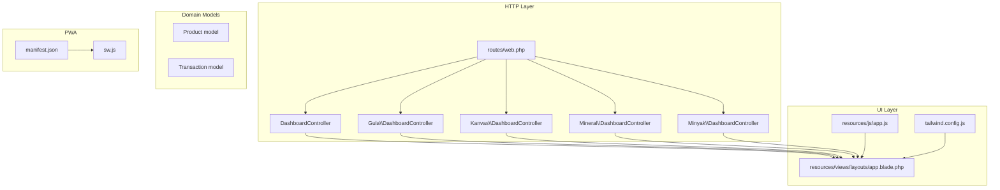
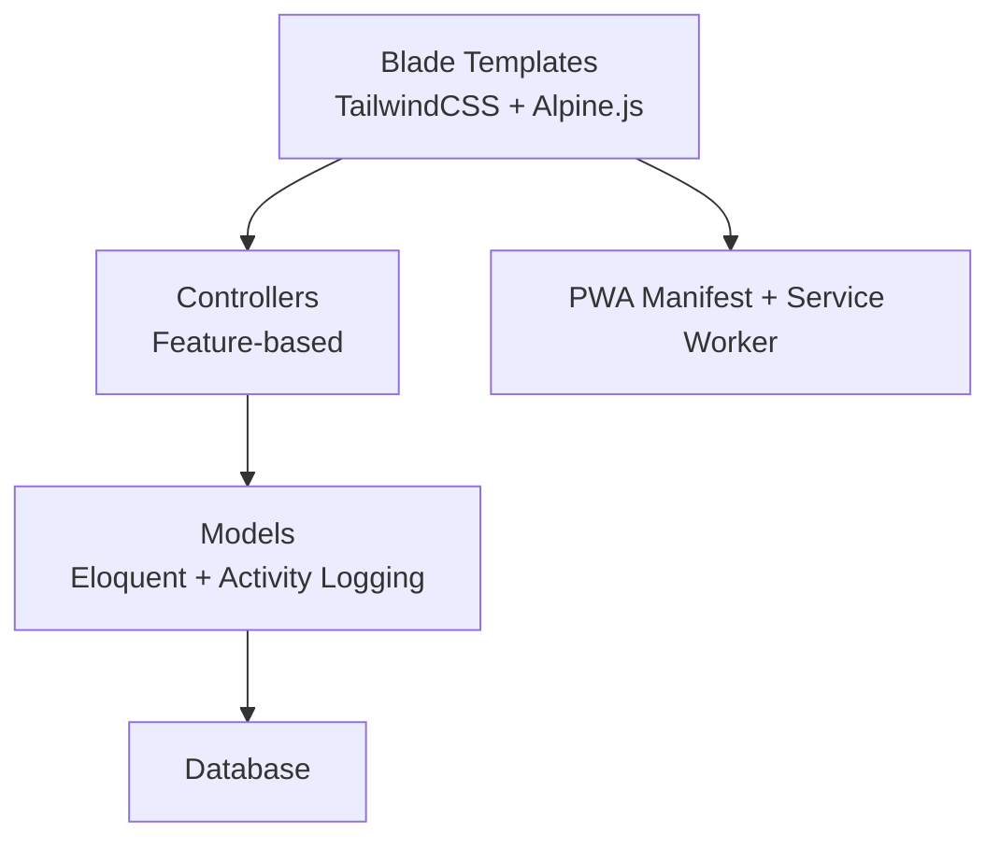
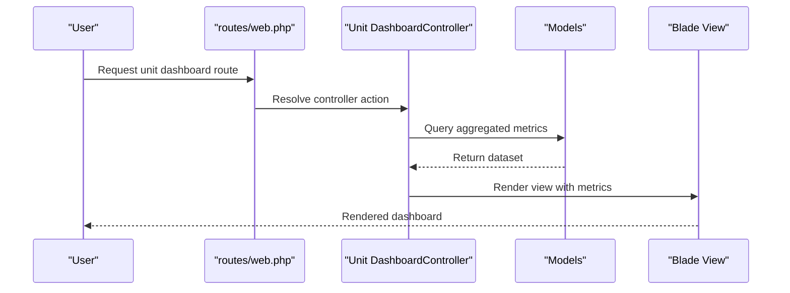
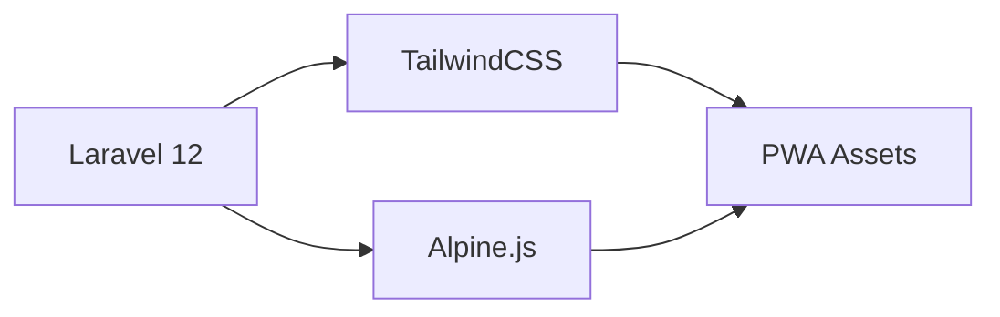
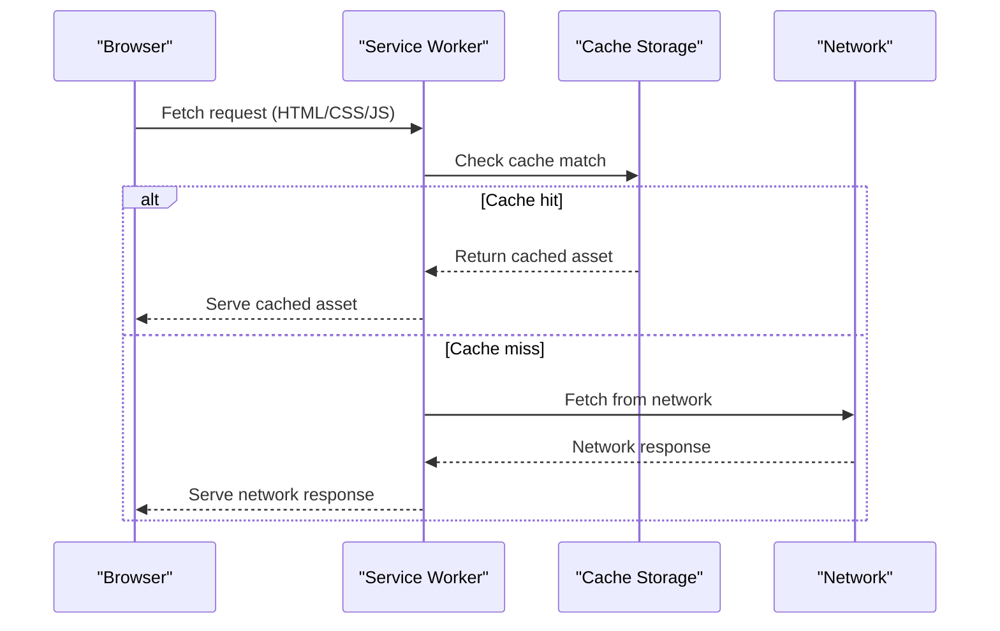
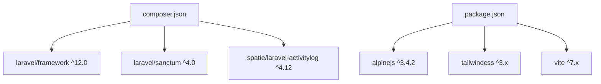

# Project Overview

<cite>
**Referenced Files in This Document**
- [README.md](file://README.md)
- [composer.json](file://composer.json)
- [package.json](file://package.json)
- [routes/web.php](file://routes/web.php)
- [app/Http/Controllers/DashboardController.php](file://app/Http/Controllers/DashboardController.php)
- [app/Http/Controllers/Gula/DashboardController.php](file://app/Http/Controllers/Gula/DashboardController.php)
- [app/Http/Controllers/Kanvas/DashboardController.php](file://app/Http/Controllers/Kanvas/DashboardController.php)
- [app/Http/Controllers/Mineral/DashboardController.php](file://app/Http/Controllers/Mineral/DashboardController.php)
- [app/Http/Controllers/Minyak/DashboardController.php](file://app/Http/Controllers/Minyak/DashboardController.php)
- [resources/js/app.js](file://resources/js/app.js)
- [manifest.json](file://manifest.json)
- [sw.js](file://sw.js)
- [tailwind.config.js](file://tailwind.config.js)
- [resources/views/layouts/app.blade.php](file://resources/views/layouts/app.blade.php)
- [app/Models/Product.php](file://app/Models/Product.php)
- [app/Models/Transaction.php](file://app/Models/Transaction.php)
</cite>

## Table of Contents
1. [Introduction](#introduction)
2. [Project Structure](#project-structure)
3. [Core Components](#core-components)
4. [Architecture Overview](#architecture-overview)
5. [Detailed Component Analysis](#detailed-component-analysis)
6. [Dependency Analysis](#dependency-analysis)
7. [Performance Considerations](#performance-considerations)
8. [Troubleshooting Guide](#troubleshooting-guide)
9. [Conclusion](#conclusion)

## Introduction
DODPOS is an enterprise-grade Laravel 12 Point of Sale (POS) platform designed to manage multiple business units and operational domains from a unified system. It supports traditional retail POS, van-based sales (Kanvas), sugar production (Gula), mineral processing (Mineral), oil sales (Minyak), warehouse management, and human resources/payroll integration. The system emphasizes multi-unit visibility, real-time transaction processing, offline-first mobile capabilities, and role-based access control to streamline operations across diverse industrial and commercial environments.

Key stakeholder value:
- Unified dashboards and reporting across business units
- Real-time visibility of sales, stock, and operational metrics
- Streamlined procurement, inventory, and payroll workflows
- Secure, role-aware access and audit trails

Developer highlights:
- Modular controllers and models per business domain
- Blade-based UI with TailwindCSS styling and Alpine.js interactivity
- Progressive Web App (PWA) support for offline-capable mobile POS
- Activity logging and comprehensive middleware for security and auditing

## Project Structure
The project follows a Laravel MVC architecture with feature-based grouping under app/Http/Controllers and app/Models. Routes are organized by functional areas and permissions, enabling granular access control. Views are rendered via Blade templates with shared layouts and components.



**Diagram sources**
- [routes/web.php:1-1108](file://routes/web.php#L1-L1108)
- [app/Http/Controllers/DashboardController.php:1-320](file://app/Http/Controllers/DashboardController.php#L1-L320)
- [app/Http/Controllers/Gula/DashboardController.php:1-45](file://app/Http/Controllers/Gula/DashboardController.php#L1-L45)
- [app/Http/Controllers/Kanvas/DashboardController.php:1-51](file://app/Http/Controllers/Kanvas/DashboardController.php#L1-L51)
- [app/Http/Controllers/Mineral/DashboardController.php:1-29](file://app/Http/Controllers/Mineral/DashboardController.php#L1-L29)
- [app/Http/Controllers/Minyak/DashboardController.php:1-93](file://app/Http/Controllers/Minyak/DashboardController.php#L1-L93)
- [resources/views/layouts/app.blade.php:1-1226](file://resources/views/layouts/app.blade.php#L1-L1226)
- [resources/js/app.js:1-8](file://resources/js/app.js#L1-L8)
- [tailwind.config.js:1-22](file://tailwind.config.js#L1-L22)
- [manifest.json:1-26](file://manifest.json#L1-L26)
- [sw.js:1-52](file://sw.js#L1-L52)

**Section sources**
- [routes/web.php:1-1108](file://routes/web.php#L1-L1108)
- [resources/views/layouts/app.blade.php:1-1226](file://resources/views/layouts/app.blade.php#L1-L1226)

## Core Components
- Multi-unit dashboards: Centralized summaries for POS, Kanvas, Gula, Mineral, and Minyak, aggregating daily sales, vehicle activity, and stock positions.
- Role-based navigation: Permission-driven menus tailored to admin roles and supervisors.
- Transaction and product models: Core entities supporting sales, inventory, conversions, and audit logging.
- PWA mobile POS: Standalone offline-capable interface for field operations.

Practical examples:
- Admin1 dashboard aggregates POS sales, vehicle deposits, and total cash inflow across units.
- Kanvas dashboard tracks active vehicles, verified cash deposits, and on-road stock valuation.
- Gula dashboard shows total bags/bales/loose quantities across warehouses and active delivery vehicles.
- Mineral dashboard reports daily sales volume and current warehouse stocks.
- Minyak dashboard consolidates per-product sales across vehicles and displays current stock by vehicle.

**Section sources**
- [app/Http/Controllers/DashboardController.php:1-320](file://app/Http/Controllers/DashboardController.php#L1-L320)
- [app/Http/Controllers/Gula/DashboardController.php:1-45](file://app/Http/Controllers/Gula/DashboardController.php#L1-L45)
- [app/Http/Controllers/Kanvas/DashboardController.php:1-51](file://app/Http/Controllers/Kanvas/DashboardController.php#L1-L51)
- [app/Http/Controllers/Mineral/DashboardController.php:1-29](file://app/Http/Controllers/Mineral/DashboardController.php#L1-L29)
- [app/Http/Controllers/Minyak/DashboardController.php:1-93](file://app/Http/Controllers/Minyak/DashboardController.php#L1-L93)

## Architecture Overview
The system uses a layered architecture:
- Presentation: Blade templates with TailwindCSS and Alpine.js for interactive UI.
- Application: Laravel controllers orchestrating domain-specific workflows and permissions.
- Domain: Eloquent models encapsulating business entities and relationships.
- Infrastructure: PWA assets and caching for offline-first mobile POS.



**Diagram sources**
- [resources/views/layouts/app.blade.php:1-1226](file://resources/views/layouts/app.blade.php#L1-L1226)
- [resources/js/app.js:1-8](file://resources/js/app.js#L1-L8)
- [tailwind.config.js:1-22](file://tailwind.config.js#L1-L22)
- [manifest.json:1-26](file://manifest.json#L1-L26)
- [sw.js:1-52](file://sw.js#L1-L52)
- [app/Models/Product.php:1-59](file://app/Models/Product.php#L1-L59)
- [app/Models/Transaction.php:1-48](file://app/Models/Transaction.php#L1-L48)

## Detailed Component Analysis

### Multi-Business-Unit Dashboards
Each business unit exposes a dedicated dashboard controller that aggregates key metrics:
- Gula: Global on-hand quantities (bags/bales/loose), active vehicles, and active vehicle count.
- Kanvas: On-road stock valuation, verified cash deposits, active sales drivers, and SKU variety.
- Mineral: Daily sold quantities and current warehouse stocks.
- Minyak: Per-product sales across vehicles, vehicle stock visibility, and consolidated totals.



**Diagram sources**
- [routes/web.php:358-444](file://routes/web.php#L358-L444)
- [app/Http/Controllers/Gula/DashboardController.php:1-45](file://app/Http/Controllers/Gula/DashboardController.php#L1-L45)
- [app/Http/Controllers/Kanvas/DashboardController.php:1-51](file://app/Http/Controllers/Kanvas/DashboardController.php#L1-L51)
- [app/Http/Controllers/Mineral/DashboardController.php:1-29](file://app/Http/Controllers/Mineral/DashboardController.php#L1-L29)
- [app/Http/Controllers/Minyak/DashboardController.php:1-93](file://app/Http/Controllers/Minyak/DashboardController.php#L1-L93)

**Section sources**
- [routes/web.php:358-444](file://routes/web.php#L358-L444)
- [app/Http/Controllers/Gula/DashboardController.php:1-45](file://app/Http/Controllers/Gula/DashboardController.php#L1-L45)
- [app/Http/Controllers/Kanvas/DashboardController.php:1-51](file://app/Http/Controllers/Kanvas/DashboardController.php#L1-L51)
- [app/Http/Controllers/Mineral/DashboardController.php:1-29](file://app/Http/Controllers/Mineral/DashboardController.php#L1-L29)
- [app/Http/Controllers/Minyak/DashboardController.php:1-93](file://app/Http/Controllers/Minyak/DashboardController.php#L1-L93)

### Technology Stack Highlights
- Backend: Laravel 12 with robust routing, middleware, and Eloquent ORM.
- Frontend: TailwindCSS for utility-first styling and Blade templates for server-rendered pages.
- Interactivity: Alpine.js for lightweight client-side behavior.
- PWA: Service worker and manifest enabling offline-capable mobile POS.



**Diagram sources**
- [composer.json:1-91](file://composer.json#L1-L91)
- [package.json:1-22](file://package.json#L1-L22)
- [tailwind.config.js:1-22](file://tailwind.config.js#L1-L22)
- [resources/js/app.js:1-8](file://resources/js/app.js#L1-L8)
- [manifest.json:1-26](file://manifest.json#L1-L26)
- [sw.js:1-52](file://sw.js#L1-L52)

**Section sources**
- [composer.json:1-91](file://composer.json#L1-L91)
- [package.json:1-22](file://package.json#L1-L22)
- [tailwind.config.js:1-22](file://tailwind.config.js#L1-L22)
- [resources/js/app.js:1-8](file://resources/js/app.js#L1-L8)
- [manifest.json:1-26](file://manifest.json#L1-L26)
- [sw.js:1-52](file://sw.js#L1-L52)

### Data Models Overview
Core models encapsulate product catalog, transactions, and related entities with soft deletes and activity logging.

```mermaid
classDiagram
class Product {
+int category_id
+int unit_id
+string name
+string sku
+float price
+float purchase_price
+float stock
+float min_stock
+category()
+unit()
+productStocks()
+stockMovements()
+unitConversions()
+baseUnit()
}
class Transaction {
+int user_id
+int customer_id
+float total_amount
+float paid_amount
+float change_amount
+string payment_method
+string payment_reference
+string status
+user()
+customer()
+details()
}
Product ||--o{ ProductUnitConversion : "has many"
Product ||--o{ ProductStock : "has many"
Product ||--o{ StockMovement : "has many"
Product ||--|| Category : "belongs to"
Product ||--|| Unit : "belongs to"
Transaction ||--|| User : "belongs to"
Transaction ||--|| Customer : "belongs to"
Transaction ||--o{ TransactionDetail : "has many"
```

**Diagram sources**
- [app/Models/Product.php:1-59](file://app/Models/Product.php#L1-L59)
- [app/Models/Transaction.php:1-48](file://app/Models/Transaction.php#L1-L48)

**Section sources**
- [app/Models/Product.php:1-59](file://app/Models/Product.php#L1-L59)
- [app/Models/Transaction.php:1-48](file://app/Models/Transaction.php#L1-L48)

### PWA Mobile POS Flow
The PWA enables offline-first mobile POS with a service worker caching critical assets and prioritizing cached responses.



**Diagram sources**
- [sw.js:1-52](file://sw.js#L1-L52)
- [manifest.json:1-26](file://manifest.json#L1-L26)

**Section sources**
- [sw.js:1-52](file://sw.js#L1-L52)
- [manifest.json:1-26](file://manifest.json#L1-L26)

## Dependency Analysis
External dependencies include Laravel framework, Sanctum for API authentication, Tinker for REPL, Spatie Activitylog for audit trails, and optional developer tools. Frontend dependencies include Alpine.js, TailwindCSS, and Vite for asset bundling.



**Diagram sources**
- [composer.json:1-91](file://composer.json#L1-L91)
- [package.json:1-22](file://package.json#L1-L22)

**Section sources**
- [composer.json:1-91](file://composer.json#L1-L91)
- [package.json:1-22](file://package.json#L1-L22)

## Performance Considerations
- Use database indexes on frequently filtered columns (e.g., created_at, status) to optimize queries for transactions, stock movements, and operational sessions.
- Leverage eager loading in controllers to reduce N+1 query risks when rendering dashboards.
- Implement pagination for large datasets in reports and transaction listings.
- Minimize heavy computations in Blade templates; precompute metrics in controllers.
- Utilize caching for static configuration and infrequently changing lists.

## Troubleshooting Guide
Common issues and resolutions:
- Authentication and authorization failures: Verify middleware stacks and role-based permissions in routes.
- Dashboard metric discrepancies: Confirm date filters and aggregation logic in unit controllers.
- PWA offline behavior: Ensure service worker is registered and cache assets are precached.
- Asset pipeline problems: Rebuild frontend assets using Vite and clear browser cache.

**Section sources**
- [routes/web.php:1-1108](file://routes/web.php#L1-L1108)
- [resources/views/layouts/app.blade.php:1-1226](file://resources/views/layouts/app.blade.php#L1-L1226)
- [sw.js:1-52](file://sw.js#L1-L52)

## Conclusion
DODPOS delivers a comprehensive, multi-unit POS solution built on Laravel 12 with modular controllers, robust models, and a modern frontend stack. Its PWA mobile POS, role-based dashboards, and integrated HR/payroll capabilities make it suitable for complex industrial and commercial environments requiring real-time visibility, offline resilience, and scalable operations.