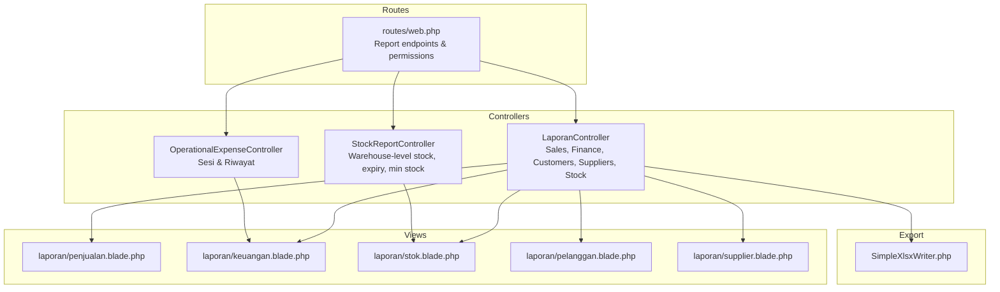
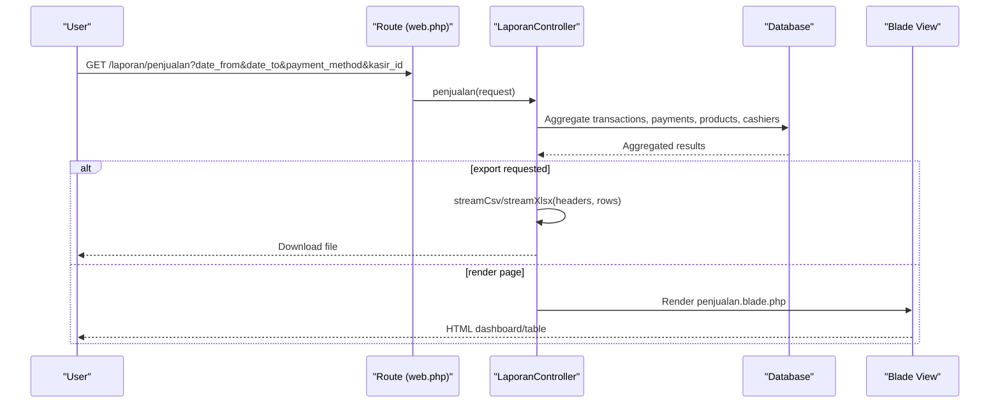
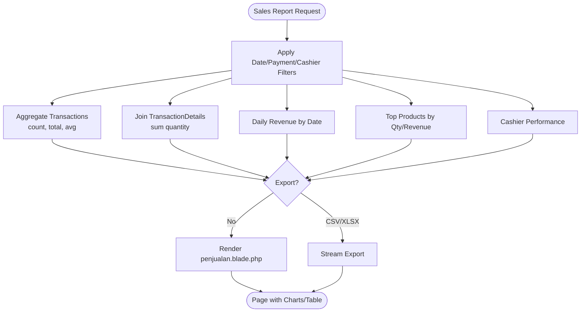
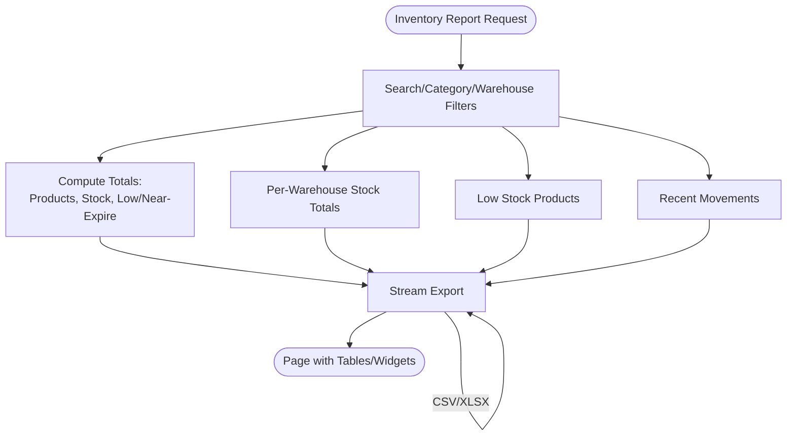
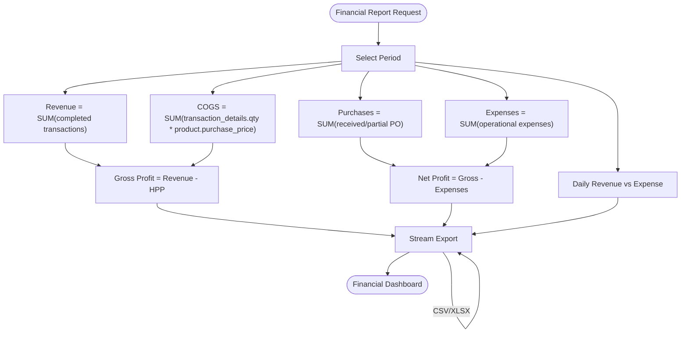
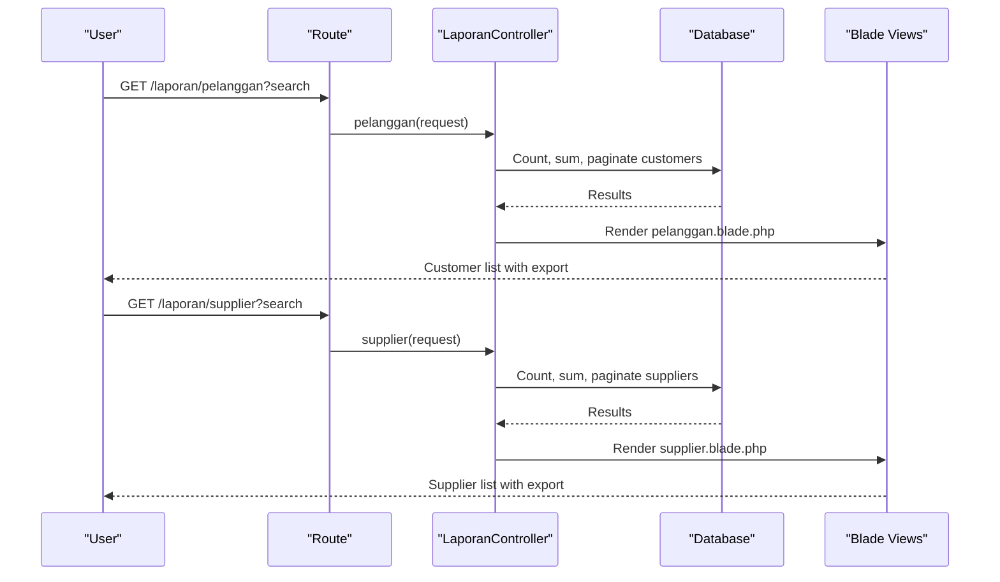
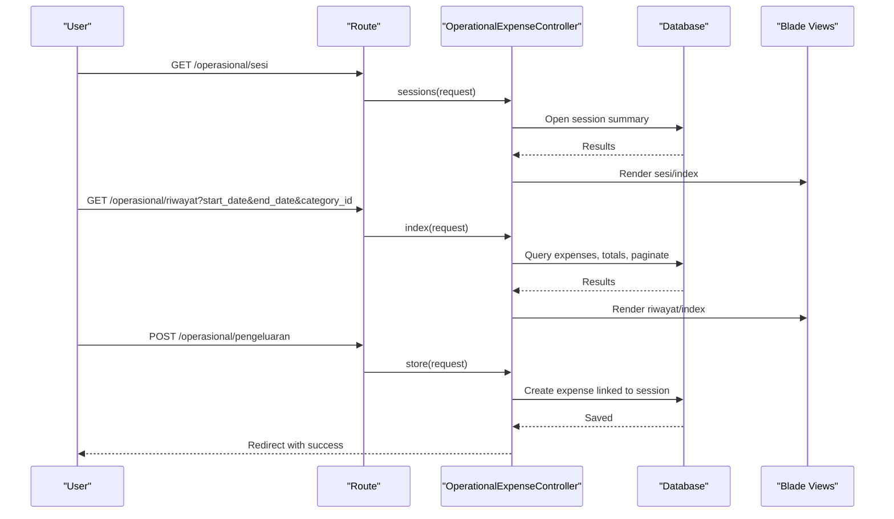
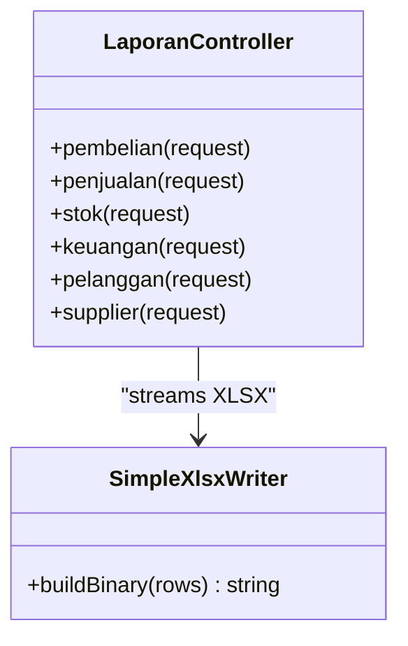
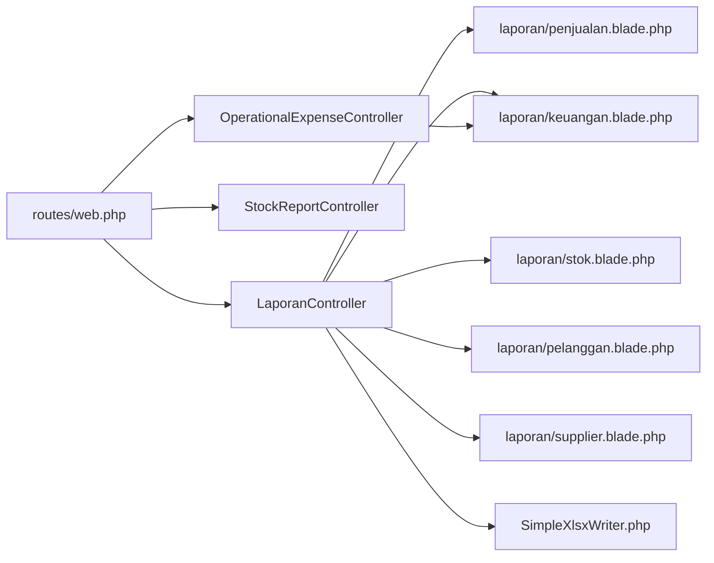

# Reporting & Analytics

<cite>
**Referenced Files in This Document**
- [LaporanController.php](file://app/Http/Controllers/LaporanController.php)
- [StockReportController.php](file://app/Http/Controllers/StockReportController.php)
- [OperationalExpenseController.php](file://app/Http/Controllers/OperationalExpenseController.php)
- [penjualan.blade.php](file://resources/views/laporan/penjualan.blade.php)
- [stok.blade.php](file://resources/views/laporan/stok.blade.php)
- [keuangan.blade.php](file://resources/views/laporan/keuangan.blade.php)
- [pelanggan.blade.php](file://resources/views/laporan/pelanggan.blade.php)
- [supplier.blade.php](file://resources/views/laporan/supplier.blade.php)
- [SimpleXlsxWriter.php](file://app/Support/Export/SimpleXlsxWriter.php)
- [web.php](file://routes/web.php)
</cite>

## Table of Contents
1. [Introduction](#introduction)
2. [Project Structure](#project-structure)
3. [Core Components](#core-components)
4. [Architecture Overview](#architecture-overview)
5. [Detailed Component Analysis](#detailed-component-analysis)
6. [Dependency Analysis](#dependency-analysis)
7. [Performance Considerations](#performance-considerations)
8. [Troubleshooting Guide](#troubleshooting-guide)
9. [Conclusion](#conclusion)
10. [Appendices](#appendices)

## Introduction
This document describes the reporting and analytics system designed for business intelligence and performance monitoring. It covers:
- Sales reporting: revenue tracking, customer analytics, and product performance metrics
- Inventory reporting: stock levels, movement analysis, and expiration tracking
- Financial reporting: operational expense tracking and profitability analysis
- Practical capabilities: report generation, dashboard creation, export functionality, and custom report development
- Integration with business modules and real-time data aggregation

## Project Structure
The reporting system is implemented as Laravel controllers and Blade views:
- Controllers under app/Http/Controllers handle report queries, aggregations, and exports
- Blade templates under resources/views/laporan render dashboards and tables
- Routes under routes/web.php expose report endpoints and permissions
- Export utilities under app/Support/Export provide CSV/XLSX streaming

**Diagram sources**
- [LaporanController.php:21-649](file://app/Http/Controllers/LaporanController.php#L21-L649)
- [StockReportController.php:14-105](file://app/Http/Controllers/StockReportController.php#L14-L105)
- [OperationalExpenseController.php:12-210](file://app/Http/Controllers/OperationalExpenseController.php#L12-L210)
- [penjualan.blade.php:1-522](file://resources/views/laporan/penjualan.blade.php#L1-L522)
- [keuangan.blade.php:1-250](file://resources/views/laporan/keuangan.blade.php#L1-L250)
- [stok.blade.php:1-575](file://resources/views/laporan/stok.blade.php#L1-L575)
- [pelanggan.blade.php:1-151](file://resources/views/laporan/pelanggan.blade.php#L1-L151)
- [supplier.blade.php:1-107](file://resources/views/laporan/supplier.blade.php#L1-L107)
- [web.php:596-621](file://routes/web.php#L596-L621)
- [SimpleXlsxWriter.php:5-138](file://app/Support/Export/SimpleXlsxWriter.php#L5-L138)

**Section sources**
- [LaporanController.php:21-649](file://app/Http/Controllers/LaporanController.php#L21-L649)
- [StockReportController.php:14-105](file://app/Http/Controllers/StockReportController.php#L14-L105)
- [OperationalExpenseController.php:12-210](file://app/Http/Controllers/OperationalExpenseController.php#L12-L210)
- [web.php:596-621](file://routes/web.php#L596-L621)

## Core Components
- Sales reporting controller aggregates transactions, payment methods, cashier performance, daily revenue, and top products
- Inventory reporting controller provides global stock summaries, per-warehouse distribution, low stock alerts, and expiry warnings
- Financial reporting controller computes revenue, cost of goods sold (COGS), operational expenses, and daily profit trends
- Customer and supplier reporting controllers summarize receivables/payables and outstanding balances
- Export utilities enable CSV/XLSX streaming for all tabular reports
- Routes define permission-based access to each report module

Key implementation highlights:
- Efficient database aggregation using Eloquent and raw SQL to avoid loading unnecessary rows
- Pagination for large datasets
- Export pipeline supporting CSV and XLSX via a lightweight XLSX writer
- Masking logic for stock visibility during stocktaking sessions

**Section sources**
- [LaporanController.php:50-303](file://app/Http/Controllers/LaporanController.php#L50-L303)
- [LaporanController.php:305-418](file://app/Http/Controllers/LaporanController.php#L305-L418)
- [LaporanController.php:420-523](file://app/Http/Controllers/LaporanController.php#L420-L523)
- [LaporanController.php:525-584](file://app/Http/Controllers/LaporanController.php#L525-L584)
- [LaporanController.php:586-648](file://app/Http/Controllers/LaporanController.php#L586-L648)
- [StockReportController.php:44-103](file://app/Http/Controllers/StockReportController.php#L44-L103)
- [SimpleXlsxWriter.php:7-33](file://app/Support/Export/SimpleXlsxWriter.php#L7-L33)

## Architecture Overview
The reporting architecture follows a layered pattern:
- Presentation: Blade templates render interactive dashboards and tables
- Control: Controllers orchestrate queries, aggregations, and exports
- Persistence: Eloquent models and DB queries access normalized tables
- Export: Streaming writers produce downloadable files

**Diagram sources**
- [web.php:596-598](file://routes/web.php#L596-L598)
- [LaporanController.php:147-303](file://app/Http/Controllers/LaporanController.php#L147-L303)
- [penjualan.blade.php:21-66](file://resources/views/laporan/penjualan.blade.php#L21-L66)

**Section sources**
- [web.php:596-621](file://routes/web.php#L596-L621)
- [LaporanController.php:147-303](file://app/Http/Controllers/LaporanController.php#L147-L303)

## Detailed Component Analysis

### Sales Reporting System
- Revenue tracking: total transactions, total revenue, average per transaction, total items sold
- Customer analytics: top customers by receivable balance and payment method distribution
- Product performance: top products by quantity and revenue
- Cashier performance: revenue and transaction counts per cashier
- Daily trend visualization: bar chart of daily revenue
- Export: CSV/XLSX of transaction lists

**Diagram sources**
- [LaporanController.php:147-303](file://app/Http/Controllers/LaporanController.php#L147-L303)
- [penjualan.blade.php:108-310](file://resources/views/laporan/penjualan.blade.php#L108-L310)

Practical examples:
- Generate a sales report filtered by date range and payment method, then export to XLSX
- View daily revenue trend and top-performing products for a selected period

**Section sources**
- [LaporanController.php:147-303](file://app/Http/Controllers/LaporanController.php#L147-L303)
- [penjualan.blade.php:1-522](file://resources/views/laporan/penjualan.blade.php#L1-L522)

### Inventory Reporting
- Global stock summary: total products, total physical quantity, low stock count, expired and near-expiry counts
- Per-warehouse stock distribution: grouped totals per product across warehouses
- Alerts: low stock and expiry warnings
- Movement tracking: recent stock movements
- Export: CSV/XLSX of current stock snapshot

**Diagram sources**
- [LaporanController.php:305-418](file://app/Http/Controllers/LaporanController.php#L305-L418)
- [stok.blade.php:69-342](file://resources/views/laporan/stok.blade.php#L69-L342)

Practical examples:
- Generate a stock report filtered by category and warehouse, then export to CSV
- Monitor low stock and expiry alerts for timely replenishment

**Section sources**
- [LaporanController.php:305-418](file://app/Http/Controllers/LaporanController.php#L305-L418)
- [stok.blade.php:1-575](file://resources/views/laporan/stok.blade.php#L1-L575)

### Financial Reporting and Profitability
- Revenue: sum of completed transactions
- Cost of Goods Sold (COGS): computed from transaction quantities and product purchase price
- Purchases: received/partial PO amounts during the period
- Expenses: operational expenses recorded during the period
- Profitability: gross profit and net profit; daily revenue vs expense trend
- Export: CSV/XLSX of daily financial summary

**Diagram sources**
- [LaporanController.php:420-523](file://app/Http/Controllers/LaporanController.php#L420-L523)
- [keuangan.blade.php:59-98](file://resources/views/laporan/keuangan.blade.php#L59-L98)

Practical examples:
- Compare daily revenue and expenses to identify profitable periods
- Export financial trends for external analysis

**Section sources**
- [LaporanController.php:420-523](file://app/Http/Controllers/LaporanController.php#L420-L523)
- [keuangan.blade.php:1-250](file://resources/views/laporan/keuangan.blade.php#L1-L250)

### Customer and Supplier Analytics
- Customer report: total active customers, total receivables, customers with outstanding balances, searchable list with credit limits and remaining credit
- Supplier report: total active suppliers, total payable, suppliers with outstanding balances, searchable list with invoice totals and remaining amounts
- Export: CSV/XLSX of customer and supplier lists

**Diagram sources**
- [web.php:605-613](file://routes/web.php#L605-L613)
- [LaporanController.php:525-584](file://app/Http/Controllers/LaporanController.php#L525-L584)
- [LaporanController.php:586-648](file://app/Http/Controllers/LaporanController.php#L586-L648)
- [pelanggan.blade.php:1-151](file://resources/views/laporan/pelanggan.blade.php#L1-L151)
- [supplier.blade.php:1-107](file://resources/views/laporan/supplier.blade.php#L1-L107)

Practical examples:
- Export customer receivables for accounting reconciliation
- Export supplier payables to procurement planning

**Section sources**
- [LaporanController.php:525-584](file://app/Http/Controllers/LaporanController.php#L525-L584)
- [LaporanController.php:586-648](file://app/Http/Controllers/LaporanController.php#L586-L648)
- [pelanggan.blade.php:1-151](file://resources/views/laporan/pelanggan.blade.php#L1-L151)
- [supplier.blade.php:1-107](file://resources/views/laporan/supplier.blade.php#L1-L107)

### Operational Expense Tracking
- Sessions: open/close sessions, track opening/closing amounts, and total usage
- History: filter by date range and category, compute totals, paginate entries
- Creation: associate expenses with active sessions and vehicles/categories
- Export: CSV/XLSX of operational history

**Diagram sources**
- [web.php:653-682](file://routes/web.php#L653-L682)
- [OperationalExpenseController.php:17-77](file://app/Http/Controllers/OperationalExpenseController.php#L17-L77)
- [OperationalExpenseController.php:143-166](file://app/Http/Controllers/OperationalExpenseController.php#L143-L166)

Practical examples:
- Track daily operational costs by category and vehicle
- Export operational expenses for budget variance analysis

**Section sources**
- [OperationalExpenseController.php:17-77](file://app/Http/Controllers/OperationalExpenseController.php#L17-L77)
- [OperationalExpenseController.php:143-166](file://app/Http/Controllers/OperationalExpenseController.php#L143-L166)
- [web.php:653-682](file://routes/web.php#L653-L682)

### Export Functionality and Custom Reports
- CSV/XLSX export: controllers stream tabular data using a lightweight XLSX writer
- Export parameters: append export=csv or export=xlsx to report URLs
- Custom reports: extend controllers to add new aggregations and views; reuse export utilities

**Diagram sources**
- [LaporanController.php:96-131](file://app/Http/Controllers/LaporanController.php#L96-L131)
- [LaporanController.php:247-286](file://app/Http/Controllers/LaporanController.php#L247-L286)
- [LaporanController.php:492-516](file://app/Http/Controllers/LaporanController.php#L492-L516)
- [SimpleXlsxWriter.php:7-33](file://app/Support/Export/SimpleXlsxWriter.php#L7-L33)

Practical examples:
- Add a new pivot report by extending controller aggregation and adding a view
- Stream export for any paginated dataset by reusing export helpers

**Section sources**
- [LaporanController.php:96-131](file://app/Http/Controllers/LaporanController.php#L96-L131)
- [LaporanController.php:247-286](file://app/Http/Controllers/LaporanController.php#L247-L286)
- [LaporanController.php:492-516](file://app/Http/Controllers/LaporanController.php#L492-L516)
- [SimpleXlsxWriter.php:7-33](file://app/Support/Export/SimpleXlsxWriter.php#L7-L33)

## Dependency Analysis
- Controllers depend on Eloquent models and DB facades for aggregations
- Views depend on controller-provided data arrays and pagination metadata
- Routes gate access to reports via role-based permissions
- Export utilities are shared across controllers for consistent output

**Diagram sources**
- [web.php:596-621](file://routes/web.php#L596-L621)
- [LaporanController.php:21-649](file://app/Http/Controllers/LaporanController.php#L21-L649)
- [StockReportController.php:14-105](file://app/Http/Controllers/StockReportController.php#L14-L105)
- [OperationalExpenseController.php:12-210](file://app/Http/Controllers/OperationalExpenseController.php#L12-L210)
- [SimpleXlsxWriter.php:5-138](file://app/Support/Export/SimpleXlsxWriter.php#L5-L138)

**Section sources**
- [web.php:596-621](file://routes/web.php#L596-L621)

## Performance Considerations
- Prefer database-level aggregation to avoid loading large result sets into memory
- Use pagination for large datasets to reduce rendering overhead
- Apply filters early to narrow result sets
- Avoid N+1 queries by eager-loading relations and using select clauses
- For real-time dashboards, cache frequently accessed summaries with appropriate invalidation

## Troubleshooting Guide
Common issues and resolutions:
- Empty or stale report data
  - Verify date filters and ensure transactions/expenses exist in the selected period
  - Confirm warehouse/product filters are correct
- Export fails or returns empty file
  - Check server temporary directory permissions for XLSX writer
  - Validate export parameter presence in URL
- Stock visibility masked during stocktaking
  - Stock masking applies when stocktaking sessions are active within the current day; disable mask or complete the session
- Permission denied to reports
  - Ensure user roles include required abilities for the report module

**Section sources**
- [LaporanController.php:23-48](file://app/Http/Controllers/LaporanController.php#L23-L48)
- [StockReportController.php:16-41](file://app/Http/Controllers/StockReportController.php#L16-L41)
- [web.php:596-621](file://routes/web.php#L596-L621)

## Conclusion
The reporting and analytics system provides comprehensive business insights across sales, inventory, finance, and operational domains. It leverages efficient database aggregations, interactive dashboards, and robust export capabilities to support decision-making. By integrating with core business modules and enforcing role-based access, it ensures secure, accurate, and timely reporting for stakeholders.

## Appendices
- Dashboard creation tips
  - Use summary KPI cards for quick overviews
  - Pair charts with sortable tables for drill-down capability
  - Provide export buttons alongside filters for easy sharing
- Custom report development checklist
  - Define required aggregations and joins
  - Implement pagination and filters
  - Add export endpoints
  - Create a dedicated Blade view
  - Secure with appropriate route permissions