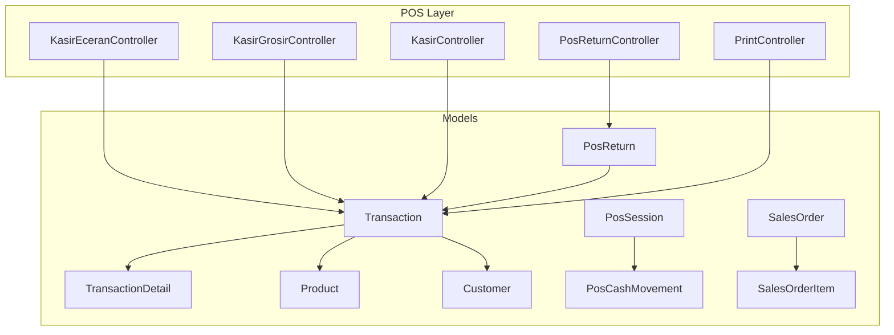
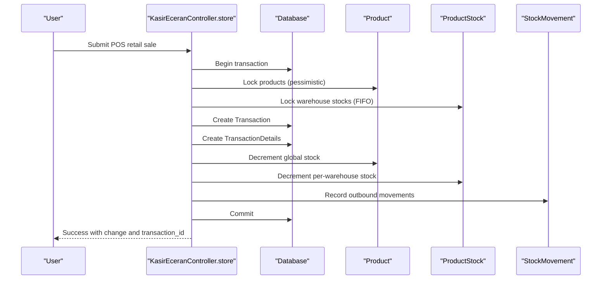
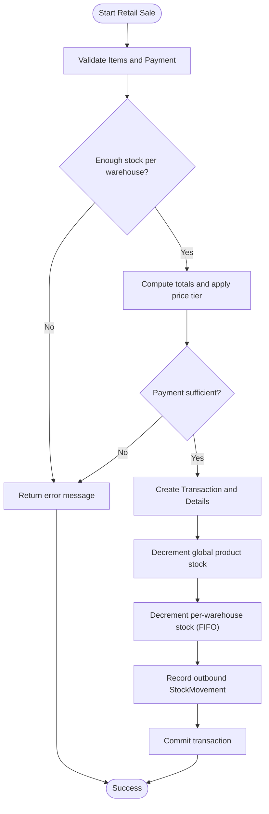
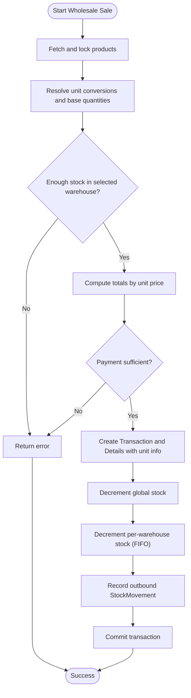
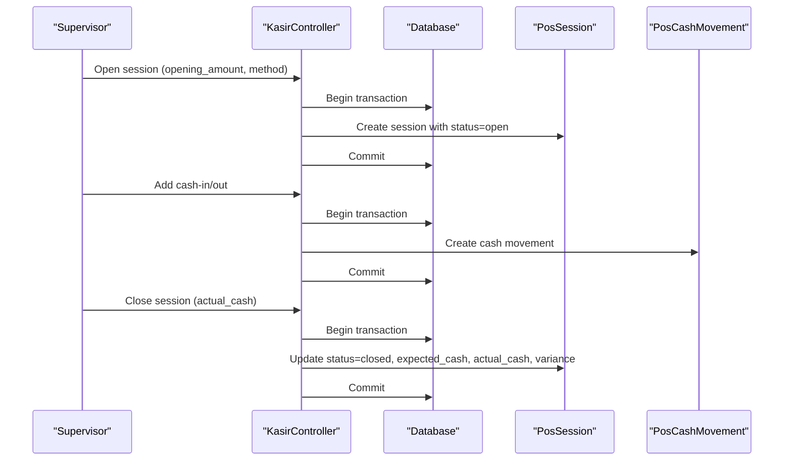
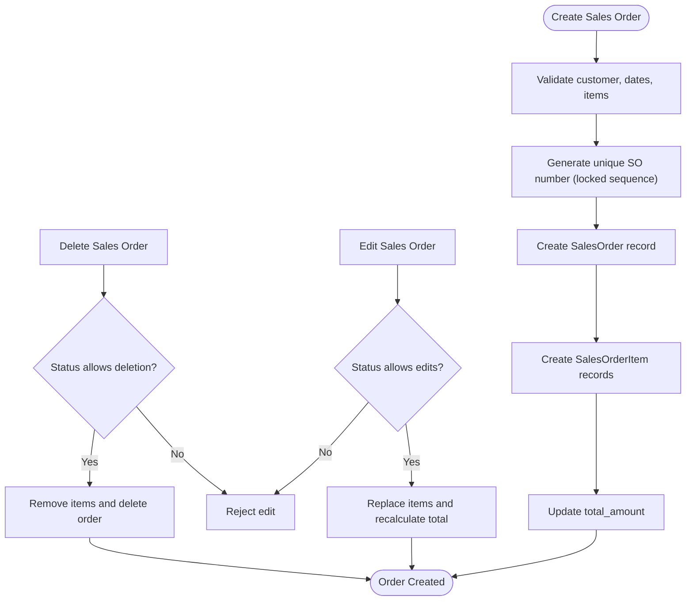
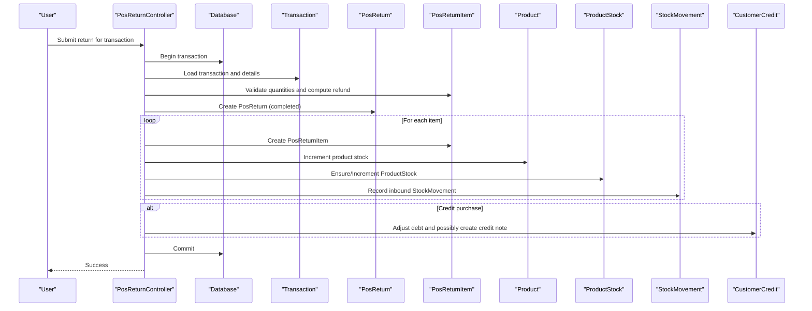
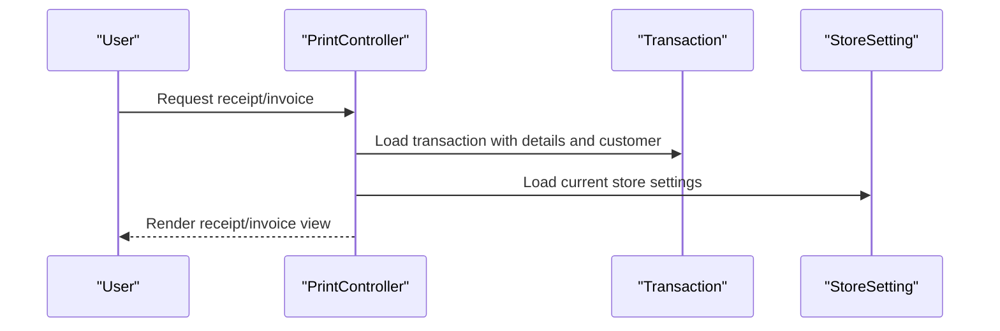
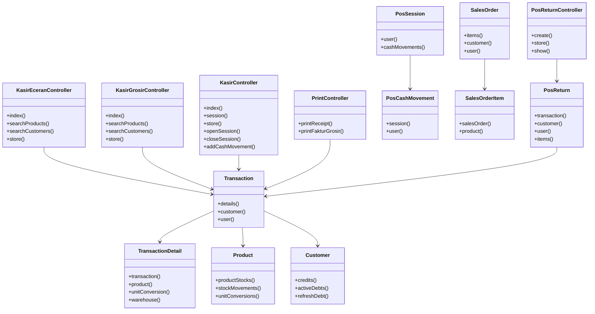

# Sales Management System

<cite>
**Referenced Files in This Document**
- [SalesOrderController.php](file://app/Http/Controllers/SalesOrderController.php)
- [KasirController.php](file://app/Http/Controllers/KasirController.php)
- [KasirEceranController.php](file://app/Http/Controllers/KasirEceranController.php)
- [KasirGrosirController.php](file://app/Http/Controllers/KasirGrosirController.php)
- [PosReturnController.php](file://app/Http/Controllers/PosReturnController.php)
- [PrintController.php](file://app/Http/Controllers/PrintController.php)
- [SalesOrder.php](file://app/Models/SalesOrder.php)
- [SalesOrderItem.php](file://app/Models/SalesOrderItem.php)
- [PosSession.php](file://app/Models/PosSession.php)
- [PosCashMovement.php](file://app/Models/PosCashMovement.php)
- [Transaction.php](file://app/Models/Transaction.php)
- [TransactionDetail.php](file://app/Models/TransactionDetail.php)
- [PosReturn.php](file://app/Models/PosReturn.php)
- [Product.php](file://app/Models/Product.php)
- [Customer.php](file://app/Models/Customer.php)
</cite>

## Table of Contents
1. [Introduction](#introduction)
2. [Project Structure](#project-structure)
3. [Core Components](#core-components)
4. [Architecture Overview](#architecture-overview)
5. [Detailed Component Analysis](#detailed-component-analysis)
6. [Dependency Analysis](#dependency-analysis)
7. [Performance Considerations](#performance-considerations)
8. [Troubleshooting Guide](#troubleshooting-guide)
9. [Conclusion](#conclusion)
10. [Appendices](#appendices)

## Introduction
This document describes the sales management system for DODPOS’s multi-channel sales operations. It covers traditional point-of-sale (POS) transaction processing, cashier session management, and payment handling. It documents the sales order system for pre-orders and future delivery, including order fulfillment workflows. It also details POS return processing, transaction history, and receipt generation. Practical examples illustrate cash handling procedures, payment methods, customer interactions, and sales reporting. Finally, it explains the integration between different sales channels and how orders flow from creation to fulfillment across business units.

## Project Structure
The system is organized around controllers and models that handle POS transactions, sales orders, returns, and reporting. Key areas include:
- POS transaction processing via dedicated controllers for retail and wholesale
- Cashier session lifecycle and cash movement tracking
- Sales order lifecycle for pre-orders and future deliveries
- Returns and refunds against POS transactions
- Receipt and invoice printing
- Supporting models for products, customers, and inventory movements

**Diagram sources**
- [KasirEceranController.php:118-313](file://app/Http/Controllers/KasirEceranController.php#L118-L313)
- [KasirGrosirController.php:124-327](file://app/Http/Controllers/KasirGrosirController.php#L124-L327)
- [KasirController.php:151-223](file://app/Http/Controllers/KasirController.php#L151-L223)
- [PosReturnController.php:58-264](file://app/Http/Controllers/PosReturnController.php#L58-L264)
- [PrintController.php:17-34](file://app/Http/Controllers/PrintController.php#L17-L34)
- [Transaction.php:22-46](file://app/Models/Transaction.php#L22-L46)
- [TransactionDetail.php:9-29](file://app/Models/TransactionDetail.php#L9-L29)
- [PosSession.php:9-21](file://app/Models/PosSession.php#L9-L21)
- [PosCashMovement.php:9-15](file://app/Models/PosCashMovement.php#L9-L15)
- [SalesOrder.php:9-19](file://app/Models/SalesOrder.php#L9-L19)
- [SalesOrderItem.php:9-15](file://app/Models/SalesOrderItem.php#L9-L15)
- [Product.php:23-52](file://app/Models/Product.php#L23-L52)
- [Customer.php:23-48](file://app/Models/Customer.php#L23-L48)
- [PosReturn.php:9-20](file://app/Models/PosReturn.php#L9-L20)

**Section sources**
- [KasirEceranController.php:1-362](file://app/Http/Controllers/KasirEceranController.php#L1-L362)
- [KasirGrosirController.php:1-378](file://app/Http/Controllers/KasirGrosirController.php#L1-L378)
- [KasirController.php:1-368](file://app/Http/Controllers/KasirController.php#L1-L368)
- [PosReturnController.php:1-273](file://app/Http/Controllers/PosReturnController.php#L1-L273)
- [PrintController.php:1-79](file://app/Http/Controllers/PrintController.php#L1-L79)
- [SalesOrderController.php:1-380](file://app/Http/Controllers/SalesOrderController.php#L1-L380)

## Core Components
- POS transaction processing (retail and wholesale):
  - Validates items, prices, quantities, and payment methods
  - Deducts inventory globally and per-warehouse FIFO
  - Creates transaction records and transaction details
  - Supports cash, credit, transfer, and other payment methods
- Cashier session management:
  - Opens and closes sessions with opening/closing amounts
  - Tracks expected vs. actual cash and variance
  - Records cash-in/out movements
- Sales order system:
  - Manages pre-orders with order and delivery dates
  - Supports draft, confirmed, processing, completed, cancelled statuses
  - Generates unique order numbers with date-based sequences
- POS returns:
  - Validates return quantities against sold and previously returned amounts
  - Supports refund methods (cash, transfer, no refund)
  - Updates inventory and customer credit accordingly
- Receipt and invoice printing:
  - Generates receipts and invoices for POS transactions
  - Integrates store settings for branding and configurations

**Section sources**
- [KasirEceranController.php:118-313](file://app/Http/Controllers/KasirEceranController.php#L118-L313)
- [KasirGrosirController.php:124-327](file://app/Http/Controllers/KasirGrosirController.php#L124-L327)
- [KasirController.php:265-330](file://app/Http/Controllers/KasirController.php#L265-L330)
- [SalesOrderController.php:189-248](file://app/Http/Controllers/SalesOrderController.php#L189-L248)
- [PosReturnController.php:58-264](file://app/Http/Controllers/PosReturnController.php#L58-L264)
- [PrintController.php:17-34](file://app/Http/Controllers/PrintController.php#L17-L34)

## Architecture Overview
The system follows a layered architecture:
- Controllers orchestrate requests, validate inputs, and coordinate model operations
- Models encapsulate business rules, relationships, and persistence
- Transactions are atomic with database-level locking to prevent race conditions
- Inventory deductions follow FIFO across warehouses and batches

**Diagram sources**
- [KasirEceranController.php:132-295](file://app/Http/Controllers/KasirEceranController.php#L132-L295)
- [Product.php:23-52](file://app/Models/Product.php#L23-L52)
- [Transaction.php:22-46](file://app/Models/Transaction.php#L22-L46)
- [TransactionDetail.php:9-29](file://app/Models/TransactionDetail.php#L9-L29)

**Section sources**
- [KasirEceranController.php:118-313](file://app/Http/Controllers/KasirEceranController.php#L118-L313)
- [KasirGrosirController.php:124-327](file://app/Http/Controllers/KasirGrosirController.php#L124-L327)
- [KasirController.php:151-223](file://app/Http/Controllers/KasirController.php#L151-L223)

## Detailed Component Analysis

### POS Transaction Processing (Retail)
Key behaviors:
- Validates items, quantities, price tiers, and payment method
- Locks products and customers to prevent concurrent modifications
- Computes totals, checks credit limits, and validates payment amounts
- Deducts inventory globally and per-warehouse FIFO
- Records transaction details and outbound stock movements

**Diagram sources**
- [KasirEceranController.php:118-313](file://app/Http/Controllers/KasirEceranController.php#L118-L313)

**Section sources**
- [KasirEceranController.php:118-313](file://app/Http/Controllers/KasirEceranController.php#L118-L313)

### POS Transaction Processing (Wholesale)
Key behaviors:
- Accepts unit conversions and computes base quantities
- Validates stock across selected warehouse
- Supports multiple price tiers (retail, wholesale, and custom tiers)
- Creates transaction with unit conversion metadata

**Diagram sources**
- [KasirGrosirController.php:124-327](file://app/Http/Controllers/KasirGrosirController.php#L124-L327)

**Section sources**
- [KasirGrosirController.php:124-327](file://app/Http/Controllers/KasirGrosirController.php#L124-L327)

### Cashier Session Management
Key behaviors:
- Opening sessions requires supervisor role and initial amount
- Closing sessions computes expected cash, compares with actual cash, and records variance
- Cash-in/out entries are recorded against the active session

**Diagram sources**
- [KasirController.php:265-330](file://app/Http/Controllers/KasirController.php#L265-L330)
- [PosSession.php:9-21](file://app/Models/PosSession.php#L9-L21)
- [PosCashMovement.php:9-15](file://app/Models/PosCashMovement.php#L9-L15)

**Section sources**
- [KasirController.php:265-330](file://app/Http/Controllers/KasirController.php#L265-L330)

### Sales Order System (Pre-orders and Future Delivery)
Key behaviors:
- Creates sales orders with unique order numbers
- Supports multiple statuses and updates totals atomically
- Allows editing/deletion with status guards
- Provides filtering by search, status, and date

**Diagram sources**
- [SalesOrderController.php:189-248](file://app/Http/Controllers/SalesOrderController.php#L189-L248)
- [SalesOrderController.php:279-339](file://app/Http/Controllers/SalesOrderController.php#L279-L339)
- [SalesOrderController.php:341-359](file://app/Http/Controllers/SalesOrderController.php#L341-L359)
- [SalesOrder.php:9-19](file://app/Models/SalesOrder.php#L9-L19)
- [SalesOrderItem.php:9-15](file://app/Models/SalesOrderItem.php#L9-L15)

**Section sources**
- [SalesOrderController.php:189-248](file://app/Http/Controllers/SalesOrderController.php#L189-L248)
- [SalesOrderController.php:279-339](file://app/Http/Controllers/SalesOrderController.php#L279-L339)
- [SalesOrderController.php:341-359](file://app/Http/Controllers/SalesOrderController.php#L341-L359)
- [SalesOrder.php:9-19](file://app/Models/SalesOrder.php#L9-L19)
- [SalesOrderItem.php:9-15](file://app/Models/SalesOrderItem.php#L9-L15)

### POS Return Processing
Key behaviors:
- Validates return quantities against sold and previously returned amounts
- Supports refund methods (cash, transfer, no refund)
- Updates inventory and creates inbound stock movements
- Adjusts customer credit for credit purchases and may issue credit notes

**Diagram sources**
- [PosReturnController.php:58-264](file://app/Http/Controllers/PosReturnController.php#L58-L264)
- [PosReturn.php:47-63](file://app/Models/PosReturn.php#L47-L63)
- [Transaction.php:22-46](file://app/Models/Transaction.php#L22-L46)
- [TransactionDetail.php:9-29](file://app/Models/TransactionDetail.php#L9-L29)
- [Product.php:23-52](file://app/Models/Product.php#L23-L52)
- [PosCashMovement.php:9-15](file://app/Models/PosCashMovement.php#L9-L15)

**Section sources**
- [PosReturnController.php:58-264](file://app/Http/Controllers/PosReturnController.php#L58-L264)
- [PosReturn.php:47-63](file://app/Models/PosReturn.php#L47-L63)

### Transaction History and Receipt Generation
Key behaviors:
- Transaction history is maintained with activity logging
- Receipts and invoices are generated via dedicated controller actions
- Store settings are applied for branding and layout

**Diagram sources**
- [PrintController.php:17-34](file://app/Http/Controllers/PrintController.php#L17-L34)
- [Transaction.php:22-46](file://app/Models/Transaction.php#L22-L46)

**Section sources**
- [PrintController.php:17-34](file://app/Http/Controllers/PrintController.php#L17-L34)
- [Transaction.php:13-20](file://app/Models/Transaction.php#L13-L20)

## Dependency Analysis
The controllers depend on models and database transactions to maintain consistency. Controllers coordinate inventory adjustments and financial records while enforcing business rules such as stock availability, payment sufficiency, and session status.

**Diagram sources**
- [KasirEceranController.php:1-362](file://app/Http/Controllers/KasirEceranController.php#L1-L362)
- [KasirGrosirController.php:1-378](file://app/Http/Controllers/KasirGrosirController.php#L1-L378)
- [KasirController.php:1-368](file://app/Http/Controllers/KasirController.php#L1-L368)
- [PosReturnController.php:1-273](file://app/Http/Controllers/PosReturnController.php#L1-L273)
- [PrintController.php:1-79](file://app/Http/Controllers/PrintController.php#L1-L79)
- [Transaction.php:22-46](file://app/Models/Transaction.php#L22-L46)
- [TransactionDetail.php:9-29](file://app/Models/TransactionDetail.php#L9-L29)
- [PosSession.php:9-21](file://app/Models/PosSession.php#L9-L21)
- [PosCashMovement.php:9-15](file://app/Models/PosCashMovement.php#L9-L15)
- [SalesOrder.php:9-19](file://app/Models/SalesOrder.php#L9-L19)
- [SalesOrderItem.php:9-15](file://app/Models/SalesOrderItem.php#L9-L15)
- [Product.php:23-52](file://app/Models/Product.php#L23-L52)
- [Customer.php:23-58](file://app/Models/Customer.php#L23-L58)
- [PosReturn.php:9-20](file://app/Models/PosReturn.php#L9-L20)

**Section sources**
- [KasirEceranController.php:1-362](file://app/Http/Controllers/KasirEceranController.php#L1-L362)
- [KasirGrosirController.php:1-378](file://app/Http/Controllers/KasirGrosirController.php#L1-L378)
- [KasirController.php:1-368](file://app/Http/Controllers/KasirController.php#L1-L368)
- [PosReturnController.php:1-273](file://app/Http/Controllers/PosReturnController.php#L1-L273)
- [PrintController.php:1-79](file://app/Http/Controllers/PrintController.php#L1-L79)
- [Transaction.php:1-48](file://app/Models/Transaction.php#L1-L48)
- [TransactionDetail.php:1-36](file://app/Models/TransactionDetail.php#L1-L36)
- [PosSession.php:1-43](file://app/Models/PosSession.php#L1-L43)
- [PosCashMovement.php:1-31](file://app/Models/PosCashMovement.php#L1-L31)
- [SalesOrder.php:1-42](file://app/Models/SalesOrder.php#L1-L42)
- [SalesOrderItem.php:1-27](file://app/Models/SalesOrderItem.php#L1-L27)
- [Product.php:1-59](file://app/Models/Product.php#L1-L59)
- [Customer.php:1-60](file://app/Models/Customer.php#L1-L60)
- [PosReturn.php:1-65](file://app/Models/PosReturn.php#L1-L65)

## Performance Considerations
- Pessimistic locking:
  - Controllers lock products and warehouse stocks during transactions to avoid race conditions and stock inconsistencies.
- Batched queries:
  - Bulk fetch and sort product IDs to reduce contention and improve performance.
- FIFO stock deduction:
  - Orders by expiry and creation date to ensure oldest stock is used first.
- Atomic operations:
  - All POS operations and returns are wrapped in transactions to maintain data integrity.
- Indexing and casting:
  - Decimal casts and indexes on frequently queried columns improve precision and query performance.

[No sources needed since this section provides general guidance]

## Troubleshooting Guide
Common issues and resolutions:
- Insufficient stock:
  - Retail and wholesale controllers validate stock per warehouse and return specific messages when stock is unavailable.
- Payment validation failures:
  - Controllers enforce payment sufficiency and require transfer references when applicable.
- Session management:
  - Opening/closing sessions requires supervisor role; ensure active session exists before performing operations.
- Return quantity mismatches:
  - Returns validate against sold and previously returned quantities; ensure correct selection of transaction detail rows.
- Credit limit exceeded:
  - Credit sales check remaining credit limit; adjust customer credit settings if needed.

**Section sources**
- [KasirEceranController.php:190-241](file://app/Http/Controllers/KasirEceranController.php#L190-L241)
- [KasirGrosirController.php:203-256](file://app/Http/Controllers/KasirGrosirController.php#L203-L256)
- [KasirController.php:267-330](file://app/Http/Controllers/KasirController.php#L267-L330)
- [PosReturnController.php:110-118](file://app/Http/Controllers/PosReturnController.php#L110-L118)

## Conclusion
The DODPOS sales management system provides robust support for multi-channel sales operations. POS transactions are processed with strict validation, FIFO inventory deduction, and comprehensive audit trails. Cashier sessions are managed end-to-end with expected vs. actual cash reconciliation. Sales orders enable pre-orders and future deliveries with clear status tracking. Returns are handled with careful validation and inventory/credit adjustments. Receipt and invoice generation integrates with store settings for consistent branding. Together, these components form a cohesive system supporting efficient and accurate sales operations across business units.

[No sources needed since this section summarizes without analyzing specific files]

## Appendices

### Practical Examples

- Cash handling procedures:
  - Opening a session: Supervisor opens a session with an opening amount and payment method; the system records the session with status open.
  - Recording cash-in/out: Supervisor records cash inflows or outflows against the active session.
  - Closing a session: Supervisor provides the actual cash count; the system computes expected cash, actual cash, and variance, then closes the session.

- Payment methods:
  - Cash: Immediate payment with change computed automatically.
  - Credit: Customer must be selected; remaining credit limit is checked; debt is recorded if unpaid portion exists.
  - Transfer: Transfer reference is mandatory; amount is recorded against the transaction.

- Customer interactions:
  - Retail sales: Choose price tier (retail, wholesale, or custom tiers); select warehouse; enter quantities; process payment.
  - Wholesale sales: Select unit conversion; specify unit quantity; choose warehouse; process payment.

- Sales reporting:
  - Transaction history: Logged with activity logging; viewable via transaction details and customer records.
  - Session reports: Revenue, cash transactions, and cash movements are summarized per session.

[No sources needed since this section provides general guidance]