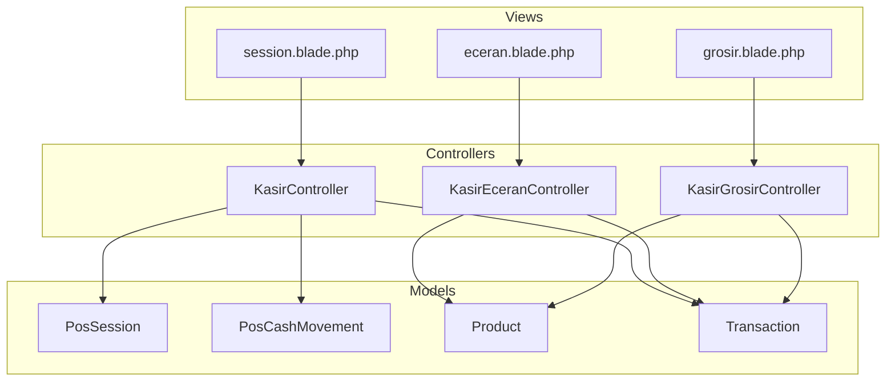
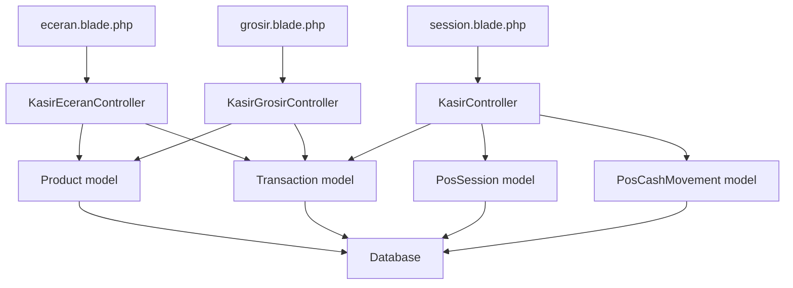
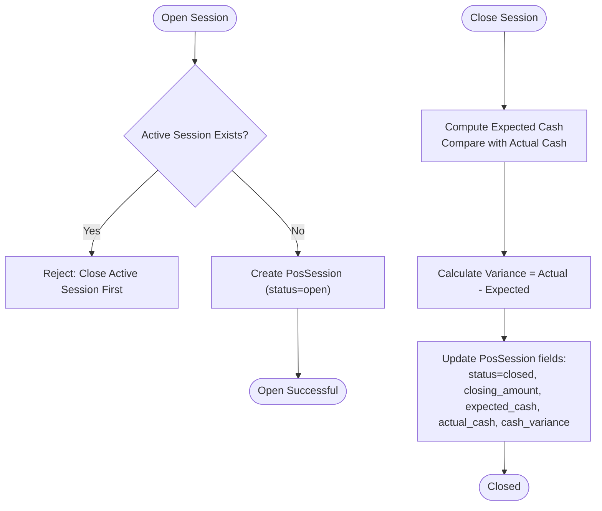
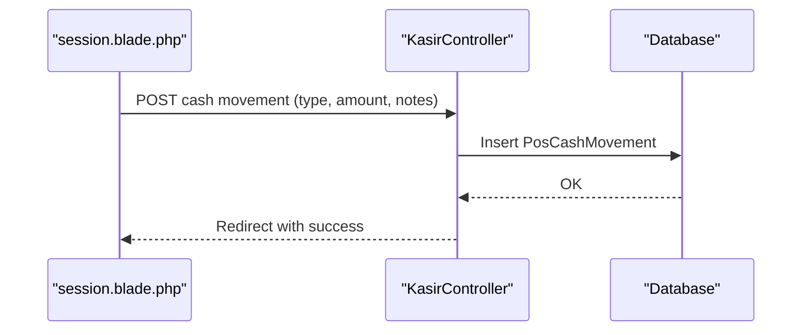
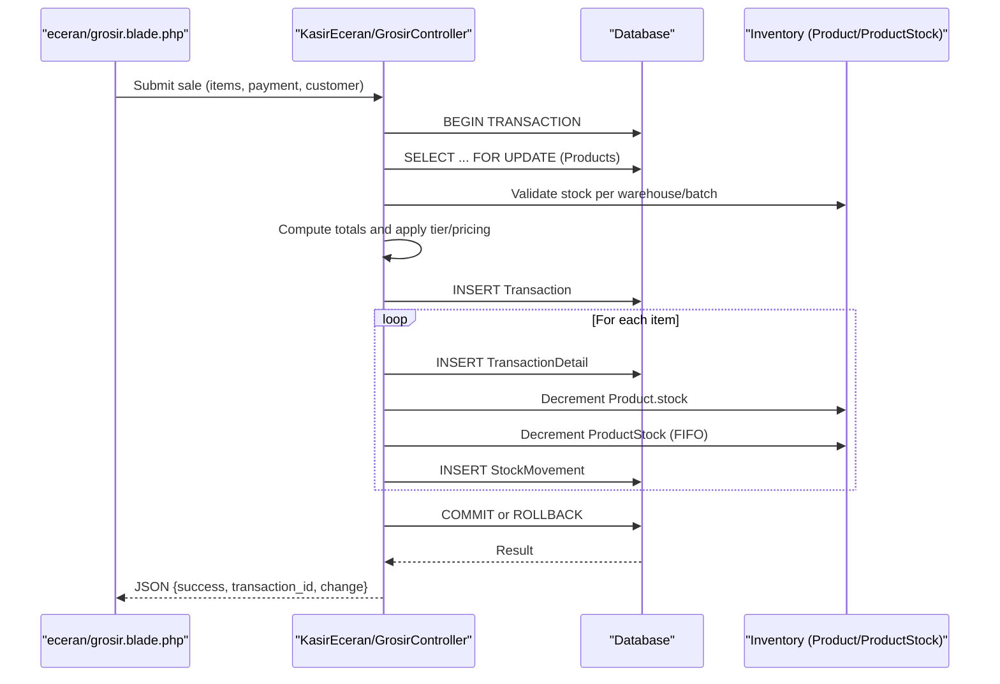
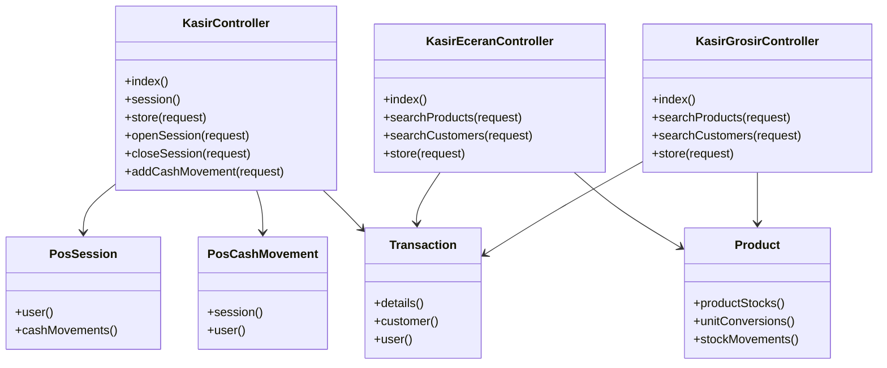

# Traditional POS Operations

<cite>
**Referenced Files in This Document**
- [KasirController.php](file://app/Http/Controllers/KasirController.php)
- [KasirEceranController.php](file://app/Http/Controllers/KasirEceranController.php)
- [KasirGrosirController.php](file://app/Http/Controllers/KasirGrosirController.php)
- [PosSession.php](file://app/Models/PosSession.php)
- [PosCashMovement.php](file://app/Models/PosCashMovement.php)
- [Product.php](file://app/Models/Product.php)
- [Transaction.php](file://app/Models/Transaction.php)
- [2026_02_28_071227_create_pos_sessions_table.php](file://database/migrations/2026_02_28_071227_create_pos_sessions_table.php)
- [2026_03_12_110000_add_cash_count_fields_to_pos_sessions_table.php](file://database/migrations/2026_03_12_110000_add_cash_count_fields_to_pos_sessions_table.php)
- [2026_03_12_110100_create_pos_cash_movements_table.php](file://database/migrations/2026_03_12_110100_create_pos_cash_movements_table.php)
- [eceran.blade.php](file://resources/views/kasir/eceran.blade.php)
- [grosir.blade.php](file://resources/views/kasir/grosir.blade.php)
- [session.blade.php](file://resources/views/kasir/session.blade.php)
</cite>

## Table of Contents
1. [Introduction](#introduction)
2. [Project Structure](#project-structure)
3. [Core Components](#core-components)
4. [Architecture Overview](#architecture-overview)
5. [Detailed Component Analysis](#detailed-component-analysis)
6. [Dependency Analysis](#dependency-analysis)
7. [Performance Considerations](#performance-considerations)
8. [Troubleshooting Guide](#troubleshooting-guide)
9. [Conclusion](#conclusion)

## Introduction
This document describes the traditional Point of Sale (POS) operations subsystem in DodPOS, focusing on cashier terminal functionality, POS session lifecycle, cash handling, transaction processing, and integration with inventory deduction. It covers both retail (eceran) and wholesale (grosir) variants, including their distinct pricing logic, discount handling via down payments, and payment method processing. Practical workflows for daily cash operations—such as session opening/closing, cash-in/cash-out entries, variance calculation—and receipt generation are documented.

## Project Structure
The POS subsystem spans controllers, models, database migrations, and Blade templates:
- Controllers orchestrate POS workflows:
  - General cashier operations: [KasirController.php](file://app/Http/Controllers/KasirController.php)
  - Retail (eceran) variant: [KasirEceranController.php](file://app/Http/Controllers/KasirEceranController.php)
  - Wholesale (grosir) variant: [KasirGrosirController.php](file://app/Http/Controllers/KasirGrosirController.php)
- Models define domain entities:
  - POS session: [PosSession.php](file://app/Models/PosSession.php)
  - Cash movement: [PosCashMovement.php](file://app/Models/PosCashMovement.php)
  - Product and transaction records: [Product.php](file://app/Models/Product.php), [Transaction.php](file://app/Models/Transaction.php)
- Database migrations establish schema for sessions, cash movements, and related fields:
  - [2026_02_28_071227_create_pos_sessions_table.php](file://database/migrations/2026_02_28_071227_create_pos_sessions_table.php)
  - [2026_03_12_110000_add_cash_count_fields_to_pos_sessions_table.php](file://database/migrations/2026_03_12_110000_add_cash_count_fields_to_pos_sessions_table.php)
  - [2026_03_12_110100_create_pos_cash_movements_table.php](file://database/migrations/2026_03_12_110100_create_pos_cash_movements_table.php)
- Frontend templates implement cashier terminals and session management:
  - [eceran.blade.php](file://resources/views/kasir/eceran.blade.php)
  - [grosir.blade.php](file://resources/views/kasir/grosir.blade.php)
  - [session.blade.php](file://resources/views/kasir/session.blade.php)

**Diagram sources**
- [KasirController.php:15-368](file://app/Http/Controllers/KasirController.php#L15-L368)
- [KasirEceranController.php:16-362](file://app/Http/Controllers/KasirEceranController.php#L16-L362)
- [KasirGrosirController.php:16-378](file://app/Http/Controllers/KasirGrosirController.php#L16-L378)
- [PosSession.php:7-42](file://app/Models/PosSession.php#L7-L42)
- [PosCashMovement.php:7-30](file://app/Models/PosCashMovement.php#L7-L30)
- [Product.php:10-58](file://app/Models/Product.php#L10-L58)
- [Transaction.php:9-47](file://app/Models/Transaction.php#L9-L47)
- [eceran.blade.php:1-658](file://resources/views/kasir/eceran.blade.php#L1-L658)
- [grosir.blade.php:1-669](file://resources/views/kasir/grosir.blade.php#L1-L669)
- [session.blade.php:1-344](file://resources/views/kasir/session.blade.php#L1-L344)

**Section sources**
- [KasirController.php:15-368](file://app/Http/Controllers/KasirController.php#L15-L368)
- [KasirEceranController.php:16-362](file://app/Http/Controllers/KasirEceranController.php#L16-L362)
- [KasirGrosirController.php:16-378](file://app/Http/Controllers/KasirGrosirController.php#L16-L378)
- [PosSession.php:7-42](file://app/Models/PosSession.php#L7-L42)
- [PosCashMovement.php:7-30](file://app/Models/PosCashMovement.php#L7-L30)
- [Product.php:10-58](file://app/Models/Product.php#L10-L58)
- [Transaction.php:9-47](file://app/Models/Transaction.php#L9-L47)
- [2026_02_28_071227_create_pos_sessions_table.php:12-24](file://database/migrations/2026_02_28_071227_create_pos_sessions_table.php#L12-L24)
- [2026_03_12_110000_add_cash_count_fields_to_pos_sessions_table.php:9-23](file://database/migrations/2026_03_12_110000_add_cash_count_fields_to_pos_sessions_table.php#L9-L23)
- [2026_03_12_110100_create_pos_cash_movements_table.php:11-19](file://database/migrations/2026_03_12_110100_create_pos_cash_movements_table.php#L11-L19)
- [eceran.blade.php:1-658](file://resources/views/kasir/eceran.blade.php#L1-L658)
- [grosir.blade.php:1-669](file://resources/views/kasir/grosir.blade.php#L1-L669)
- [session.blade.php:1-344](file://resources/views/kasir/session.blade.php#L1-L344)

## Core Components
- POS Session Management
  - Opening and closing sessions with supervisor authorization.
  - Tracking opening amount, expected cash, actual cash, and variance.
  - Cash-in/cash-out entries during a session.
- Cash Handling Procedures
  - Expected cash calculation includes opening amount, cash sales, down-payments, plus/minus cash movements.
  - Variance computed as actual minus expected.
- Transaction Processing
  - Validation of stock availability per warehouse and per batch (FIFO).
  - Deduction of global and warehouse-specific inventory.
  - Recording of transaction details and stock movements.
- Payment Methods
  - Cash, transfer, QRIS, and credit (down-payment with customer credit tracking).
- Retail (eceran) vs. Wholesale (grosir)
  - Eceran: unit price resolved per tier; single warehouse selection per item.
  - Grosir: selectable units/sizes with conversion factors; base-unit aggregation for stock checks; unit-aware pricing tiers.

**Section sources**
- [KasirController.php:28-66](file://app/Http/Controllers/KasirController.php#L28-L66)
- [KasirController.php:265-330](file://app/Http/Controllers/KasirController.php#L265-L330)
- [KasirController.php:332-358](file://app/Http/Controllers/KasirController.php#L332-L358)
- [KasirEceranController.php:118-313](file://app/Http/Controllers/KasirEceranController.php#L118-L313)
- [KasirGrosirController.php:124-327](file://app/Http/Controllers/KasirGrosirController.php#L124-L327)
- [PosSession.php:9-31](file://app/Models/PosSession.php#L9-L31)
- [PosCashMovement.php:9-19](file://app/Models/PosCashMovement.php#L9-L19)

## Architecture Overview
The POS subsystem follows a layered architecture:
- Presentation layer: Blade templates render cashier terminals and session dashboards.
- Application layer: Controllers coordinate business logic, validation, and persistence.
- Domain layer: Models encapsulate entities and relationships.
- Persistence layer: Eloquent ORM maps to relational schema defined by migrations.

**Diagram sources**
- [eceran.blade.php:1-658](file://resources/views/kasir/eceran.blade.php#L1-L658)
- [grosir.blade.php:1-669](file://resources/views/kasir/grosir.blade.php#L1-L669)
- [session.blade.php:1-344](file://resources/views/kasir/session.blade.php#L1-L344)
- [KasirEceranController.php:16-362](file://app/Http/Controllers/KasirEceranController.php#L16-L362)
- [KasirGrosirController.php:16-378](file://app/Http/Controllers/KasirGrosirController.php#L16-L378)
- [KasirController.php:15-368](file://app/Http/Controllers/KasirController.php#L15-L368)
- [Product.php:10-58](file://app/Models/Product.php#L10-L58)
- [Transaction.php:9-47](file://app/Models/Transaction.php#L9-L47)
- [PosSession.php:7-42](file://app/Models/PosSession.php#L7-L42)
- [PosCashMovement.php:7-30](file://app/Models/PosCashMovement.php#L7-L30)

## Detailed Component Analysis

### POS Session Management
- Lifecycle
  - Opening: Supervisor validates role and ensures no active session exists; creates a new session with opening amount, payment method, and notes.
  - Closing: Supervisor computes expected cash, compares with actual cash, calculates variance, and updates session status and fields.
- Expected Cash Calculation
  - Sum of opening amount, cash sales, down-payments, plus/minus cash movements.
- Variance
  - Actual cash minus expected cash; recorded for audit and reconciliation.

**Diagram sources**
- [KasirController.php:265-330](file://app/Http/Controllers/KasirController.php#L265-L330)
- [PosSession.php:9-31](file://app/Models/PosSession.php#L9-L31)
- [2026_03_12_110000_add_cash_count_fields_to_pos_sessions_table.php:11-15](file://database/migrations/2026_03_12_110000_add_cash_count_fields_to_pos_sessions_table.php#L11-L15)

**Section sources**
- [KasirController.php:265-330](file://app/Http/Controllers/KasirController.php#L265-L330)
- [PosSession.php:9-31](file://app/Models/PosSession.php#L9-L31)
- [2026_03_12_110000_add_cash_count_fields_to_pos_sessions_table.php:11-15](file://database/migrations/2026_03_12_110000_add_cash_count_fields_to_pos_sessions_table.php#L11-L15)

### Cash Handling Procedures
- Cash Movement Recording
  - Supervisors can record cash-in/cash-out entries linked to the active POS session.
  - Movements include type, amount, notes, and user.
- Expected Cash Composition
  - Opening amount + cash sales + down-payments + (cash-in - cash-out).

**Diagram sources**
- [session.blade.php:139-164](file://resources/views/kasir/session.blade.php#L139-L164)
- [KasirController.php:332-358](file://app/Http/Controllers/KasirController.php#L332-L358)
- [PosCashMovement.php:9-19](file://app/Models/PosCashMovement.php#L9-L19)

**Section sources**
- [KasirController.php:332-358](file://app/Http/Controllers/KasirController.php#L332-L358)
- [PosCashMovement.php:9-19](file://app/Models/PosCashMovement.php#L9-L19)

### Transaction Processing Workflows
- Validation and Locking
  - Fetch and lock products by ID to prevent deadlocks; verify stock availability per warehouse/batch.
- Pricing and Discount Handling
  - Eceran: price resolved by selected tier; down-payment handled via paid amount for credit.
  - Grosir: unit conversions applied; base-unit aggregation for stock checks; tiered pricing per unit.
- Inventory Deduction
  - Global stock decremented; warehouse-specific stock decremented using FIFO by expired date and creation time.
  - Stock movement entries created with source type and reference numbers.
- Transaction Recording
  - Transaction header created with totals, payment method, and change.
  - Transaction details created per item with unit and quantity mapping.

**Diagram sources**
- [KasirEceranController.php:118-313](file://app/Http/Controllers/KasirEceranController.php#L118-L313)
- [KasirGrosirController.php:124-327](file://app/Http/Controllers/KasirGrosirController.php#L124-L327)
- [Transaction.php:22-31](file://app/Models/Transaction.php#L22-L31)
- [Product.php:23-27](file://app/Models/Product.php#L23-L27)

**Section sources**
- [KasirEceranController.php:118-313](file://app/Http/Controllers/KasirEceranController.php#L118-L313)
- [KasirGrosirController.php:124-327](file://app/Http/Controllers/KasirGrosirController.php#L124-L327)
- [Transaction.php:22-31](file://app/Models/Transaction.php#L22-L31)
- [Product.php:23-27](file://app/Models/Product.php#L23-L27)

### Eceran (Retail) Variant
- Pricing Logic
  - Price resolved by selected tier: eceran, grosir, jual1, jual2, jual3.
  - Default fallback to eceran price if tier unavailable.
- Stock Handling
  - Single warehouse selection per item; stock validated against warehouse breakdown.
- Payment Options
  - Cash, transfer, QRIS, credit (down-payment).
- Receipt Generation
  - Receipt template accessible after successful transaction.

**Section sources**
- [KasirEceranController.php:74-116](file://app/Http/Controllers/KasirEceranController.php#L74-L116)
- [eceran.blade.php:1-658](file://resources/views/kasir/eceran.blade.php#L1-L658)

### Grosir (Wholesale) Variant
- Pricing Logic
  - Unit conversions with conversion factors; base-unit aggregation for stock checks.
  - Tiered pricing per unit: grosir, eceran, jual1, jual2, jual3.
- Stock Handling
  - Unit-aware selection; warehouse stock validated in base units.
- Payment Options
  - Cash, transfer, QRIS, credit (down-payment).
- Receipt Generation
  - Invoice template accessible after successful transaction.

**Section sources**
- [KasirGrosirController.php:71-122](file://app/Http/Controllers/KasirGrosirController.php#L71-L122)
- [grosir.blade.php:1-669](file://resources/views/kasir/grosir.blade.php#L1-L669)

### Session Opening/Closing Procedures
- Opening
  - Supervisor authorization required; prevents multiple concurrent sessions.
- Closing
  - Expected cash computed; variance calculated; session marked closed with actual cash and notes.

**Section sources**
- [KasirController.php:265-294](file://app/Http/Controllers/KasirController.php#L265-L294)
- [KasirController.php:296-330](file://app/Http/Controllers/KasirController.php#L296-L330)

### Variance Calculations
- Expected cash formula: opening amount + cash sales + down-payments + (cash-in - cash-out).
- Variance: actual cash - expected cash.

**Section sources**
- [KasirController.php:53-66](file://app/Http/Controllers/KasirController.php#L53-L66)
- [PosSession.php:9-31](file://app/Models/PosSession.php#L9-L31)

### Practical Examples
- Daily Cash Operations
  - Opening: Provide opening amount and payment method; session becomes active.
  - During day: Record cash-in/cash-out entries; monitor expected vs. actual cash.
  - Closing: Enter actual cash counted; system computes variance and closes session.
- Payment Method Processing
  - Cash: compute change automatically.
  - Transfer: require payment reference; bank details rendered from store settings.
  - Credit: down-payment supported; remaining balance tracked via customer credit.
- Transaction Recording and Receipt Generation
  - After successful POST to eceran/grosir store endpoint, client receives transaction_id and change; receipt/invoice can be printed via provided links.

**Section sources**
- [session.blade.php:58-76](file://resources/views/kasir/session.blade.php#L58-L76)
- [eceran.blade.php:611-652](file://resources/views/kasir/eceran.blade.php#L611-L652)
- [grosir.blade.php:640-663](file://resources/views/kasir/grosir.blade.php#L640-L663)

## Dependency Analysis
- Controllers depend on models for persistence and on database transactions for atomicity.
- Product and Transaction models centralize product pricing, unit conversions, and transaction details.
- PosSession and PosCashMovement models manage cash accounting and session state.
- Views depend on controllers for product/customer search and on store settings for bank details.

**Diagram sources**
- [KasirController.php:15-368](file://app/Http/Controllers/KasirController.php#L15-L368)
- [KasirEceranController.php:16-362](file://app/Http/Controllers/KasirEceranController.php#L16-L362)
- [KasirGrosirController.php:16-378](file://app/Http/Controllers/KasirGrosirController.php#L16-L378)
- [PosSession.php:33-41](file://app/Models/PosSession.php#L33-L41)
- [PosCashMovement.php:21-29](file://app/Models/PosCashMovement.php#L21-L29)
- [Product.php:39-57](file://app/Models/Product.php#L39-L57)
- [Transaction.php:33-46](file://app/Models/Transaction.php#L33-L46)

**Section sources**
- [KasirController.php:15-368](file://app/Http/Controllers/KasirController.php#L15-L368)
- [KasirEceranController.php:16-362](file://app/Http/Controllers/KasirEceranController.php#L16-L362)
- [KasirGrosirController.php:16-378](file://app/Http/Controllers/KasirGrosirController.php#L16-L378)
- [PosSession.php:33-41](file://app/Models/PosSession.php#L33-L41)
- [PosCashMovement.php:21-29](file://app/Models/PosCashMovement.php#L21-L29)
- [Product.php:39-57](file://app/Models/Product.php#L39-L57)
- [Transaction.php:33-46](file://app/Models/Transaction.php#L33-L46)

## Performance Considerations
- Deadlock Prevention
  - Bulk fetch and sort product IDs before locking; lock products and customer in deterministic order.
- Inventory Deduction
  - FIFO ordering by expired date and creation time; warehouse-scoped locks reduce contention.
- Batch Updates
  - Minimize queries by eager-loading related data (unit conversions, product stocks) and using bulk operations.

[No sources needed since this section provides general guidance]

## Troubleshooting Guide
- Session Issues
  - Cannot open session: ensure no active session exists; supervisor role required.
  - Cannot close session: verify expected cash computation and that actual cash is provided.
- Stock Errors
  - “Insufficient stock”: check warehouse breakdown and unit conversion factors; ensure requested quantities do not exceed available stock.
  - “Inconsistency” messages: indicate mismatch between requested base units and warehouse stock; adjust quantity or unit.
- Payment Errors
  - Transfer requires reference; cash must meet or exceed total; credit down-payment must not exceed total.
- Logging
  - Controller logs errors with user context for diagnostics.

**Section sources**
- [KasirController.php:265-294](file://app/Http/Controllers/KasirController.php#L265-L294)
- [KasirController.php:296-330](file://app/Http/Controllers/KasirController.php#L296-L330)
- [KasirEceranController.php:297-312](file://app/Http/Controllers/KasirEceranController.php#L297-L312)
- [KasirGrosirController.php:315-327](file://app/Http/Controllers/KasirGrosirController.php#L315-L327)

## Conclusion
The traditional POS subsystem integrates cashier session management, robust cash handling, and precise transaction processing with inventory deduction. The eceran and grosir variants support tiered pricing and unit conversions, while credit payments enable down-payment flows. The design emphasizes supervisor controls, expected/actual cash reconciliation, and FIFO inventory tracking to maintain accuracy and auditability.