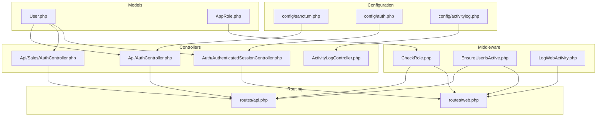
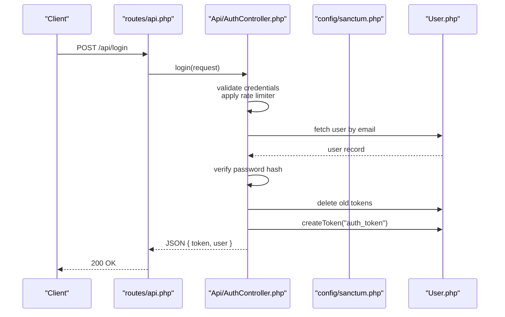
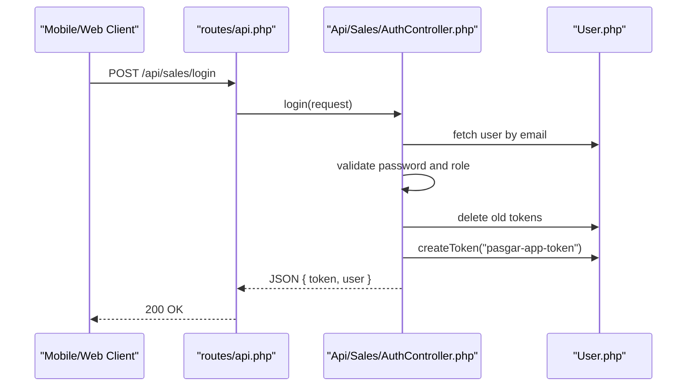
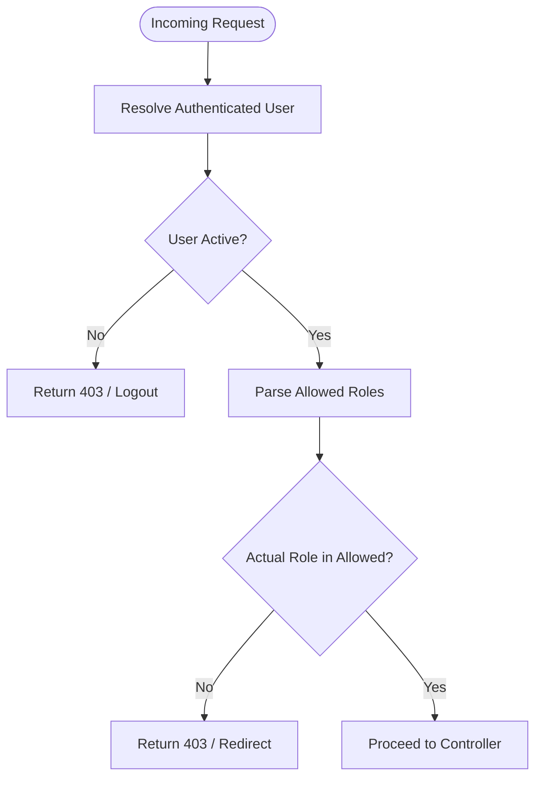
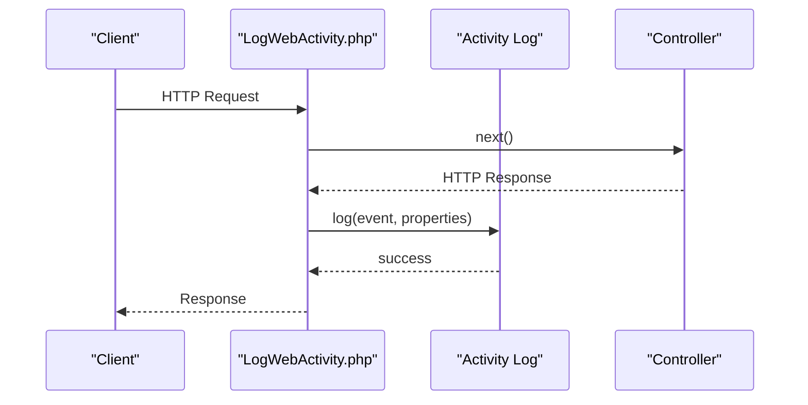
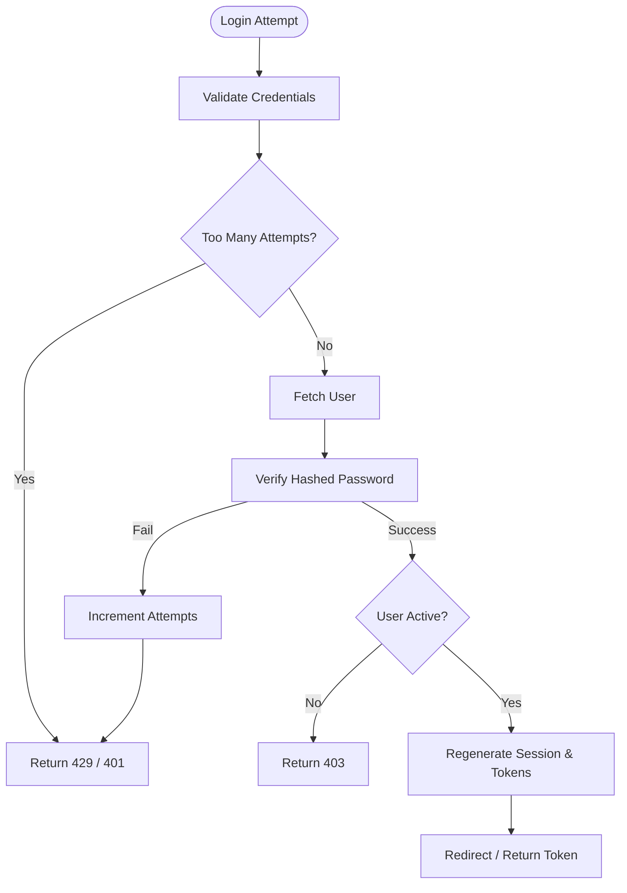
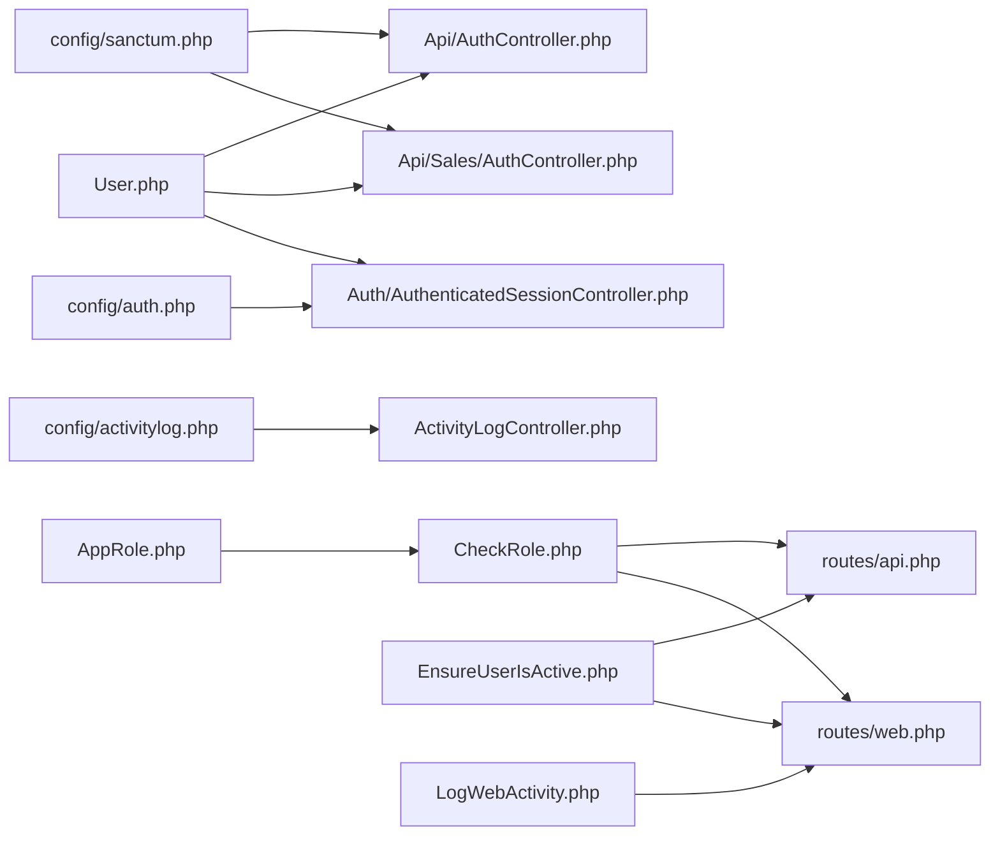

# Security & Access Control

<cite>
**Referenced Files in This Document**
- [sanctum.php](file://config/sanctum.php)
- [auth.php](file://config/auth.php)
- [activitylog.php](file://config/activitylog.php)
- [CheckRole.php](file://app/Http/Middleware/CheckRole.php)
- [EnsureUserIsActive.php](file://app/Http/Middleware/EnsureUserIsActive.php)
- [LogWebActivity.php](file://app/Http/Middleware/LogWebActivity.php)
- [User.php](file://app/Models/User.php)
- [AppRole.php](file://app/Models/AppRole.php)
- [RoleAbilities.php](file://app/Support/RoleAbilities.php)
- [api.php](file://routes/api.php)
- [web.php](file://routes/web.php)
- [AuthController.php](file://app/Http/Controllers/Api/AuthController.php)
- [Sales/AuthController.php](file://app/Http/Controllers/Api/Sales/AuthController.php)
- [AuthenticatedSessionController.php](file://app/Http/Controllers/Auth/AuthenticatedSessionController.php)
- [ActivityLogController.php](file://app/Http/Controllers/ActivityLogController.php)
</cite>

## Table of Contents
1. [Introduction](#introduction)
2. [Project Structure](#project-structure)
3. [Core Components](#core-components)
4. [Architecture Overview](#architecture-overview)
5. [Detailed Component Analysis](#detailed-component-analysis)
6. [Dependency Analysis](#dependency-analysis)
7. [Performance Considerations](#performance-considerations)
8. [Troubleshooting Guide](#troubleshooting-guide)
9. [Conclusion](#conclusion)

## Introduction
This document explains the security and access control system of the application, focusing on:
- API authentication via Laravel Sanctum
- Role-based access control (RBAC) and ability checks
- Middleware protection for web and API routes
- Comprehensive activity logging and audit trails
- Session management and password handling
- Practical examples for permissions, access validation, and monitoring
- Security best practices and vulnerability mitigation strategies

## Project Structure
Security-related components are organized across configuration, middleware, models, controllers, and routing layers. The system integrates Sanctum for API tokens, a custom role middleware for fine-grained access, and Spatie’s activity logger for audit trails.

**Diagram sources**
- [sanctum.php:1-85](file://config/sanctum.php#L1-L85)
- [auth.php:1-116](file://config/auth.php#L1-L116)
- [activitylog.php:1-53](file://config/activitylog.php#L1-L53)
- [CheckRole.php:1-75](file://app/Http/Middleware/CheckRole.php#L1-L75)
- [EnsureUserIsActive.php:1-47](file://app/Http/Middleware/EnsureUserIsActive.php#L1-L47)
- [LogWebActivity.php:1-194](file://app/Http/Middleware/LogWebActivity.php#L1-L194)
- [User.php:1-135](file://app/Models/User.php#L1-L135)
- [AppRole.php:1-31](file://app/Models/AppRole.php#L1-L31)
- [AuthController.php:1-85](file://app/Http/Controllers/Api/AuthController.php#L1-L85)
- [Sales/AuthController.php:1-99](file://app/Http/Controllers/Api/Sales/AuthController.php#L1-L99)
- [AuthenticatedSessionController.php:1-54](file://app/Http/Controllers/Auth/AuthenticatedSessionController.php#L1-L54)
- [ActivityLogController.php:1-80](file://app/Http/Controllers/ActivityLogController.php#L1-L80)
- [api.php:1-199](file://routes/api.php#L1-L199)
- [web.php:1-800](file://routes/web.php#L1-L800)

**Section sources**
- [sanctum.php:1-85](file://config/sanctum.php#L1-L85)
- [auth.php:1-116](file://config/auth.php#L1-L116)
- [activitylog.php:1-53](file://config/activitylog.php#L1-L53)
- [CheckRole.php:1-75](file://app/Http/Middleware/CheckRole.php#L1-L75)
- [EnsureUserIsActive.php:1-47](file://app/Http/Middleware/EnsureUserIsActive.php#L1-L47)
- [LogWebActivity.php:1-194](file://app/Http/Middleware/LogWebActivity.php#L1-L194)
- [User.php:1-135](file://app/Models/User.php#L1-L135)
- [AppRole.php:1-31](file://app/Models/AppRole.php#L1-L31)
- [RoleAbilities.php:1-173](file://app/Support/RoleAbilities.php#L1-L173)
- [api.php:1-199](file://routes/api.php#L1-L199)
- [web.php:1-800](file://routes/web.php#L1-L800)
- [AuthController.php:1-85](file://app/Http/Controllers/Api/AuthController.php#L1-L85)
- [Sales/AuthController.php:1-99](file://app/Http/Controllers/Api/Sales/AuthController.php#L1-L99)
- [AuthenticatedSessionController.php:1-54](file://app/Http/Controllers/Auth/AuthenticatedSessionController.php#L1-L54)
- [ActivityLogController.php:1-80](file://app/Http/Controllers/ActivityLogController.php#L1-L80)

## Core Components
- Sanctum configuration governs stateful domains, guards, token expiration, and middleware stack for session authentication.
- Authentication configuration defines the default guard and password broker behavior.
- Activity logging configuration controls enabling/disabling logs, retention, default log name, and persistence.
- Middleware:
  - CheckRole enforces role-based access for routes and API endpoints.
  - EnsureUserIsActive blocks inactive users from accessing protected routes.
  - LogWebActivity records user actions for web requests into the activity log.
- Models:
  - User integrates Sanctum tokens, activity logging, and role validation.
  - AppRole stores active roles for dynamic RBAC.
- Controllers:
  - API authentication controllers manage login, logout, and token issuance with rate limiting and account lockout.
  - Web authentication controller handles session-based login and redirects.
  - Activity log controller provides listing and pruning of audit events.

**Section sources**
- [sanctum.php:1-85](file://config/sanctum.php#L1-L85)
- [auth.php:1-116](file://config/auth.php#L1-L116)
- [activitylog.php:1-53](file://config/activitylog.php#L1-L53)
- [CheckRole.php:1-75](file://app/Http/Middleware/CheckRole.php#L1-L75)
- [EnsureUserIsActive.php:1-47](file://app/Http/Middleware/EnsureUserIsActive.php#L1-L47)
- [LogWebActivity.php:1-194](file://app/Http/Middleware/LogWebActivity.php#L1-L194)
- [User.php:1-135](file://app/Models/User.php#L1-L135)
- [AppRole.php:1-31](file://app/Models/AppRole.php#L1-L31)
- [AuthController.php:1-85](file://app/Http/Controllers/Api/AuthController.php#L1-L85)
- [Sales/AuthController.php:1-99](file://app/Http/Controllers/Api/Sales/AuthController.php#L1-L99)
- [AuthenticatedSessionController.php:1-54](file://app/Http/Controllers/Auth/AuthenticatedSessionController.php#L1-L54)
- [ActivityLogController.php:1-80](file://app/Http/Controllers/ActivityLogController.php#L1-L80)

## Architecture Overview
The security architecture combines:
- API authentication via Sanctum personal access tokens with rate limiting and account lockout.
- Web session authentication with CSRF protection and secure cookie handling.
- Role-based access control enforced by middleware and ability checks.
- Audit trail generation for web actions and model changes.

**Diagram sources**
- [api.php:11-26](file://routes/api.php#L11-L26)
- [AuthController.php:14-64](file://app/Http/Controllers/Api/AuthController.php#L14-L64)
- [sanctum.php:50-50](file://config/sanctum.php#L50-L50)
- [User.php:10-10](file://app/Models/User.php#L10-L10)

**Section sources**
- [api.php:11-26](file://routes/api.php#L11-L26)
- [AuthController.php:14-64](file://app/Http/Controllers/Api/AuthController.php#L14-L64)
- [sanctum.php:50-50](file://config/sanctum.php#L50-L50)
- [User.php:10-10](file://app/Models/User.php#L10-L10)

## Detailed Component Analysis

### Laravel Sanctum Integration for API Authentication
- Stateful domains and guards are configured to support SPA and API clients.
- Token expiration is configurable; Sanctum middleware includes session authentication, cookie encryption, and CSRF validation.
- API controllers issue personal access tokens scoped to “auth_token” or “pasgar-app-token” and enforce active status and role checks for sales endpoints.

**Diagram sources**
- [api.php:31-68](file://routes/api.php#L31-L68)
- [Sales/AuthController.php:11-75](file://app/Http/Controllers/Api/Sales/AuthController.php#L11-L75)
- [User.php:10-10](file://app/Models/User.php#L10-L10)

**Section sources**
- [sanctum.php:18-82](file://config/sanctum.php#L18-L82)
- [AuthController.php:50-57](file://app/Http/Controllers/Api/AuthController.php#L50-L57)
- [Sales/AuthController.php:57-61](file://app/Http/Controllers/Api/Sales/AuthController.php#L57-L61)
- [api.php:31-68](file://routes/api.php#L31-L68)

### Role-Based Access Control (RBAC)
- Roles are validated against a fixed list and optionally extended by the app_roles table.
- The CheckRole middleware supports comma or pipe-separated roles and rejects unauthorized access with JSON or HTTP 403.
- Web routes use the “can:*” policy gates (e.g., view_dashboard) alongside “role:*” middleware for granular permissions.

**Diagram sources**
- [CheckRole.php:17-73](file://app/Http/Middleware/CheckRole.php#L17-L73)
- [EnsureUserIsActive.php:12-45](file://app/Http/Middleware/EnsureUserIsActive.php#L12-L45)
- [User.php:94-123](file://app/Models/User.php#L94-L123)

**Section sources**
- [CheckRole.php:17-73](file://app/Http/Middleware/CheckRole.php#L17-L73)
- [EnsureUserIsActive.php:12-45](file://app/Http/Middleware/EnsureUserIsActive.php#L12-L45)
- [User.php:76-123](file://app/Models/User.php#L76-L123)
- [web.php:29-76](file://routes/web.php#L29-L76)
- [RoleAbilities.php:7-171](file://app/Support/RoleAbilities.php#L7-L171)

### Middleware Protection
- Web routes apply “auth”, “active”, and “verified” guards for session-based access.
- API routes apply “auth:sanctum” and “active” guards for token-based access.
- “role:*” middleware restricts endpoints to specific roles.
- “can:*” gates complement role checks for feature-level permissions.

```mermaid
sequenceDiagram
participant Client as "Client"
participant WebRoutes as "routes/web.php"
participant MWActive as "EnsureUserIsActive.php"
participant MWRole as "CheckRole.php"
participant Controller as "Controller"
Client->>WebRoutes : GET /dashboard
WebRoutes->>MWActive : handle(request)
MWActive->>MWRole : handle(request, roles...)
MWRole->>Controller : next()
Controller-->>Client : 200 OK
```

**Diagram sources**
- [web.php:25-27](file://routes/web.php#L25-L27)
- [EnsureUserIsActive.php:12-45](file://app/Http/Middleware/EnsureUserIsActive.php#L12-L45)
- [CheckRole.php:17-73](file://app/Http/Middleware/CheckRole.php#L17-L73)

**Section sources**
- [web.php:29-800](file://routes/web.php#L29-L800)
- [api.php:11-68](file://routes/api.php#L11-L68)
- [EnsureUserIsActive.php:12-45](file://app/Http/Middleware/EnsureUserIsActive.php#L12-L45)
- [CheckRole.php:17-73](file://app/Http/Middleware/CheckRole.php#L17-L73)

### Activity Logging and Audit Trails
- Web actions are logged by LogWebActivity middleware for POST/PUT/PATCH/DELETE requests, capturing method, path, route name, parameters, sanitized input, response status, duration, and outcome.
- Events are categorized as created, updated, deleted, or performed based on HTTP method and route hints.
- The User model logs changes to fillable attributes using Spatie’s activity traits.
- ActivityLogController provides filtering and pruning of audit logs.

**Diagram sources**
- [LogWebActivity.php:14-94](file://app/Http/Middleware/LogWebActivity.php#L14-L94)
- [User.php:19-26](file://app/Models/User.php#L19-L26)
- [ActivityLogController.php:14-41](file://app/Http/Controllers/ActivityLogController.php#L14-L41)

**Section sources**
- [LogWebActivity.php:14-194](file://app/Http/Middleware/LogWebActivity.php#L14-L194)
- [User.php:19-26](file://app/Models/User.php#L19-L26)
- [ActivityLogController.php:14-80](file://app/Http/Controllers/ActivityLogController.php#L14-L80)
- [activitylog.php:8-52](file://config/activitylog.php#L8-L52)

### Session Management and Password Policies
- Session-based login uses the “web” guard with CSRF protection and secure cookie handling via Sanctum middleware.
- Passwords are hashed automatically during model hydration.
- Rate limiting and account lockout prevent brute-force attacks on login endpoints.
- Password reset configuration defines token lifetime and throttling.

**Diagram sources**
- [AuthenticatedSessionController.php:25-38](file://app/Http/Controllers/Auth/AuthenticatedSessionController.php#L25-L38)
- [AuthController.php:21-48](file://app/Http/Controllers/Api/AuthController.php#L21-L48)
- [auth.php:93-100](file://config/auth.php#L93-L100)

**Section sources**
- [AuthenticatedSessionController.php:25-38](file://app/Http/Controllers/Auth/AuthenticatedSessionController.php#L25-L38)
- [AuthController.php:21-48](file://app/Http/Controllers/Api/AuthController.php#L21-L48)
- [auth.php:93-100](file://config/auth.php#L93-L100)

### Biometric Integration Security
- The User model includes a fingerprint identifier field and attendance records with selfie storage, indicating biometric and photo capture capabilities.
- Store settings include a fingerprint IP configuration field, suggesting integration with external biometric devices.
- Security recommendations:
  - Enforce HTTPS for selfie uploads and device communication.
  - Apply strict file upload validation and limit file sizes/types.
  - Store selfies under secure directories and rotate access keys regularly.
  - Add device-bound tokenization and device attestation for biometric endpoints.

**Section sources**
- [User.php:46-46](file://app/Models/User.php#L46-L46)
- [web.php:762-786](file://routes/web.php#L762-L786)

### Practical Examples

- Permission configuration:
  - Define roles and abilities using the RoleAbilities helper and enforce via “role:*” middleware on routes.
  - Example: Restrict product management to supervisor or warehouse roles in API routes.

- Access validation:
  - Use “auth:sanctum,active,role:…” on API endpoints and “auth,active,role:...” on web routes.
  - Combine with “can:*” gates for feature-level permissions.

- Security monitoring:
  - Use ActivityLogController to filter logs by user, event type, and date range.
  - Prune old entries periodically to maintain performance.

**Section sources**
- [RoleAbilities.php:7-171](file://app/Support/RoleAbilities.php#L7-L171)
- [api.php:23-25](file://routes/api.php#L23-L25)
- [web.php:42-59](file://routes/web.php#L42-L59)
- [ActivityLogController.php:14-78](file://app/Http/Controllers/ActivityLogController.php#L14-L78)

## Dependency Analysis

**Diagram sources**
- [sanctum.php:18-82](file://config/sanctum.php#L18-L82)
- [auth.php:16-19](file://config/auth.php#L16-L19)
- [activitylog.php:8-52](file://config/activitylog.php#L8-L52)
- [User.php:10-10](file://app/Models/User.php#L10-L10)
- [AppRole.php:12-17](file://app/Models/AppRole.php#L12-L17)
- [CheckRole.php:17-73](file://app/Http/Middleware/CheckRole.php#L17-L73)
- [EnsureUserIsActive.php:12-45](file://app/Http/Middleware/EnsureUserIsActive.php#L12-L45)
- [LogWebActivity.php:14-94](file://app/Http/Middleware/LogWebActivity.php#L14-L94)
- [AuthController.php:14-64](file://app/Http/Controllers/Api/AuthController.php#L14-L64)
- [Sales/AuthController.php:11-75](file://app/Http/Controllers/Api/Sales/AuthController.php#L11-L75)
- [AuthenticatedSessionController.php:25-38](file://app/Http/Controllers/Auth/AuthenticatedSessionController.php#L25-L38)
- [ActivityLogController.php:14-41](file://app/Http/Controllers/ActivityLogController.php#L14-L41)
- [api.php:11-68](file://routes/api.php#L11-L68)
- [web.php:29-76](file://routes/web.php#L29-L76)

**Section sources**
- [sanctum.php:18-82](file://config/sanctum.php#L18-L82)
- [auth.php:16-19](file://config/auth.php#L16-L19)
- [activitylog.php:8-52](file://config/activitylog.php#L8-L52)
- [User.php:10-10](file://app/Models/User.php#L10-L10)
- [AppRole.php:12-17](file://app/Models/AppRole.php#L12-L17)
- [CheckRole.php:17-73](file://app/Http/Middleware/CheckRole.php#L17-L73)
- [EnsureUserIsActive.php:12-45](file://app/Http/Middleware/EnsureUserIsActive.php#L12-L45)
- [LogWebActivity.php:14-94](file://app/Http/Middleware/LogWebActivity.php#L14-L94)
- [AuthController.php:14-64](file://app/Http/Controllers/Api/AuthController.php#L14-L64)
- [Sales/AuthController.php:11-75](file://app/Http/Controllers/Api/Sales/AuthController.php#L11-L75)
- [AuthenticatedSessionController.php:25-38](file://app/Http/Controllers/Auth/AuthenticatedSessionController.php#L25-L38)
- [ActivityLogController.php:14-41](file://app/Http/Controllers/ActivityLogController.php#L14-L41)
- [api.php:11-68](file://routes/api.php#L11-L68)
- [web.php:29-76](file://routes/web.php#L29-L76)

## Performance Considerations
- Prefer lightweight JSON responses for API endpoints and avoid exposing sensitive fields.
- Use pagination for activity log listings and prune old entries to keep the audit table manageable.
- Limit request payload sizes and sanitize inputs to reduce memory overhead.
- Cache frequently accessed role/permission lookups where appropriate.

## Troubleshooting Guide
- Unauthenticated API requests:
  - Ensure clients send a valid Sanctum token in the Authorization header and include CSRF tokens for web requests.
- Locked-out accounts:
  - After repeated failed attempts, users will be temporarily locked out; wait for the limiter to reset or contact an administrator.
- Disabled user accounts:
  - Inactive users are blocked by EnsureUserIsActive middleware; tokens are invalidated for API requests.
- Role denied errors:
  - Verify the user’s role matches allowed roles in route middleware and that the role exists in the app_roles table if dynamic roles are enabled.
- Audit logs not appearing:
  - Confirm activity logging is enabled and the middleware is attached to web routes; check database connectivity and table creation.

**Section sources**
- [AuthController.php:21-48](file://app/Http/Controllers/Api/AuthController.php#L21-L48)
- [Sales/AuthController.php:18-52](file://app/Http/Controllers/Api/Sales/AuthController.php#L18-L52)
- [EnsureUserIsActive.php:27-42](file://app/Http/Middleware/EnsureUserIsActive.php#L27-L42)
- [CheckRole.php:31-70](file://app/Http/Middleware/CheckRole.php#L31-L70)
- [LogWebActivity.php:21-23](file://app/Http/Middleware/LogWebActivity.php#L21-L23)
- [activitylog.php:8-8](file://config/activitylog.php#L8-L8)

## Conclusion
The application implements a robust security posture combining Sanctum-based API tokens, session authentication, role-based access control, and comprehensive activity logging. By enforcing middleware protections, validating roles dynamically, and maintaining audit trails, the system supports secure operations across web and mobile APIs. Adhering to the recommended best practices and continuously reviewing configurations will further strengthen resilience against common vulnerabilities.