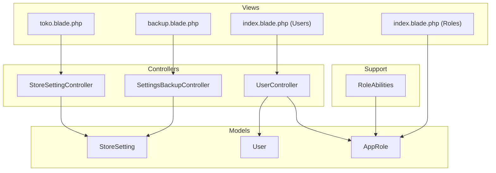
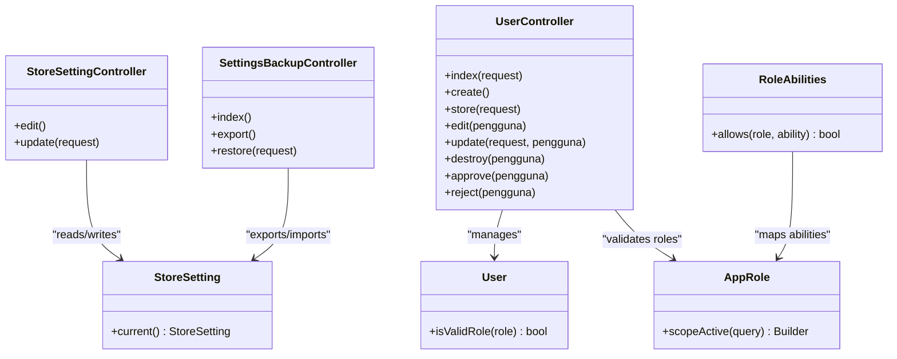
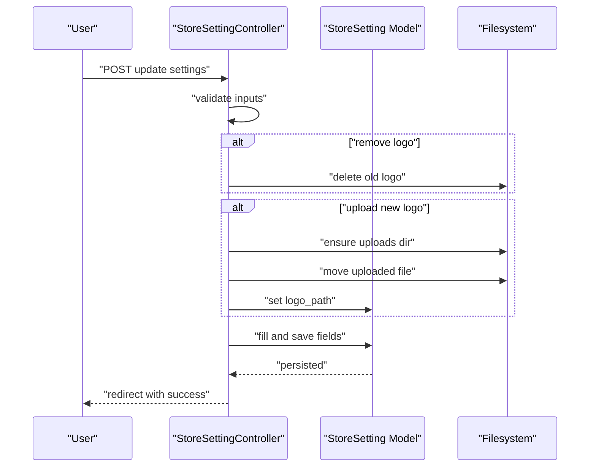
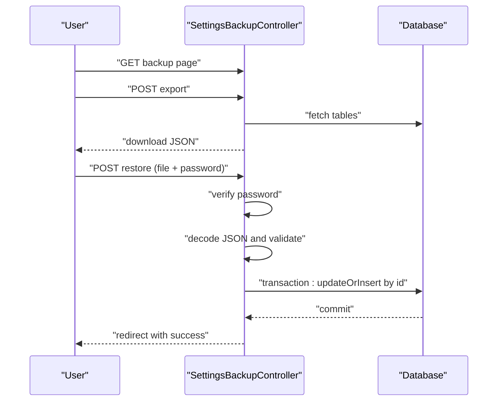
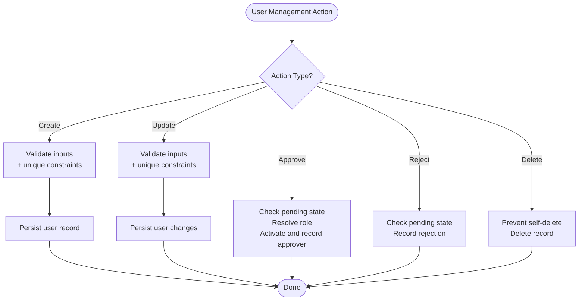
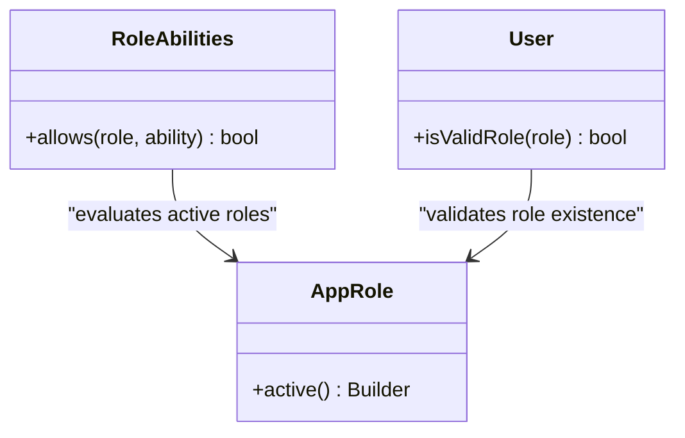
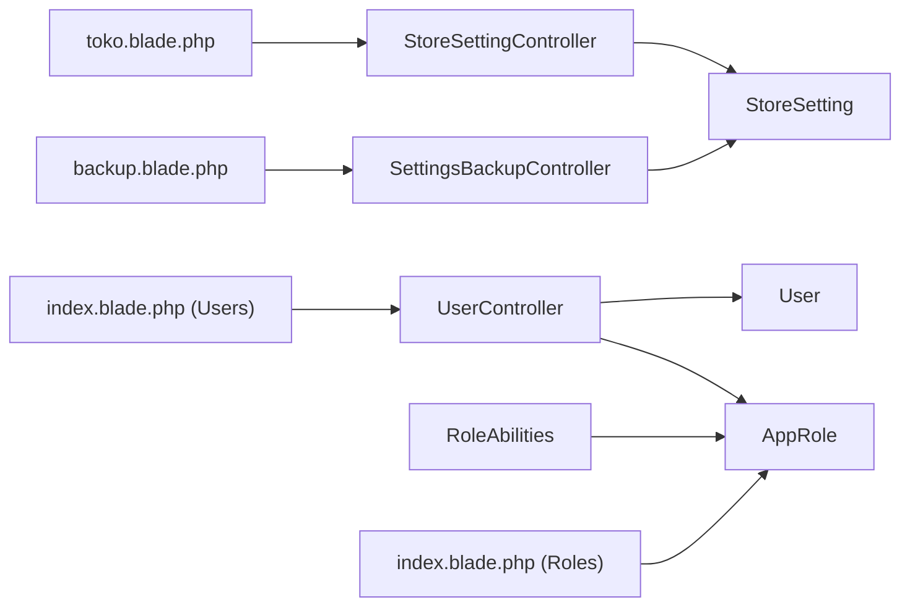

# Settings & Configuration

<cite>
**Referenced Files in This Document**
- [StoreSettingController.php](file://app/Http/Controllers/StoreSettingController.php)
- [SettingsBackupController.php](file://app/Http/Controllers/SettingsBackupController.php)
- [StoreSetting.php](file://app/Models/StoreSetting.php)
- [UserController.php](file://app/Http/Controllers/UserController.php)
- [AppRole.php](file://app/Models/AppRole.php)
- [RoleAbilities.php](file://app/Support/RoleAbilities.php)
- [User.php](file://app/Models/User.php)
- [2026_03_02_000001_create_store_settings_table.php](file://database/migrations/2026_03_02_000001_create_store_settings_table.php)
- [2026_03_12_130000_add_registration_approval_fields_to_users_table.php](file://database/migrations/2026_03_12_130000_add_registration_approval_fields_to_users_table.php)
- [2026_03_12_150000_create_app_roles_table.php](file://database/migrations/2026_03_12_150000_create_app_roles_table.php)
- [toko.blade.php](file://resources/views/pengaturan/toko.blade.php)
- [backup.blade.php](file://resources/views/pengaturan/backup.blade.php)
- [index.blade.php (Users)](file://resources/views/pengaturan/pengguna/index.blade.php)
- [index.blade.php (Roles)](file://resources/views/pengaturan/roles/index.blade.php)
</cite>

## Table of Contents
1. [Introduction](#introduction)
2. [Project Structure](#project-structure)
3. [Core Components](#core-components)
4. [Architecture Overview](#architecture-overview)
5. [Detailed Component Analysis](#detailed-component-analysis)
6. [Dependency Analysis](#dependency-analysis)
7. [Performance Considerations](#performance-considerations)
8. [Troubleshooting Guide](#troubleshooting-guide)
9. [Conclusion](#conclusion)
10. [Appendices](#appendices)

## Introduction
This document explains the Settings & Configuration system for system administration and customization. It covers:
- Store configuration: general settings, bank account setup, operational preferences, and HR policy settings
- User management: role administration, permission configuration, and user provisioning workflows
- Backup and maintenance: export/restore of settings and master data, plus guidance for full database backups
- Practical examples: customizing store settings, managing user roles, restoring configuration, and maintaining permissions
- Security, performance, and compliance considerations aligned with the implemented controls

## Project Structure
The settings and configuration system spans controllers, models, migrations, Blade views, and support utilities:
- Controllers handle store settings updates, backup export/restore, and user lifecycle actions
- Models encapsulate store settings persistence and user/role metadata
- Migrations define the schema for store settings, user approval fields, and roles
- Blade templates render the admin UI for store settings, backup/restore, user management, and role management
- RoleAbilities defines permission rules mapped to roles

**Diagram sources**
- [StoreSettingController.php:1-105](file://app/Http/Controllers/StoreSettingController.php#L1-L105)
- [SettingsBackupController.php:1-103](file://app/Http/Controllers/SettingsBackupController.php#L1-L103)
- [UserController.php:1-248](file://app/Http/Controllers/UserController.php#L1-L248)
- [StoreSetting.php:1-55](file://app/Models/StoreSetting.php#L1-L55)
- [User.php:1-135](file://app/Models/User.php#L1-L135)
- [AppRole.php:1-31](file://app/Models/AppRole.php#L1-L31)
- [RoleAbilities.php:1-173](file://app/Support/RoleAbilities.php#L1-L173)
- [toko.blade.php:1-386](file://resources/views/pengaturan/toko.blade.php#L1-L386)
- [backup.blade.php:1-136](file://resources/views/pengaturan/backup.blade.php#L1-L136)
- [index.blade.php (Users):1-421](file://resources/views/pengaturan/pengguna/index.blade.php#L1-L421)
- [index.blade.php (Roles):1-117](file://resources/views/pengaturan/roles/index.blade.php#L1-L117)

**Section sources**
- [StoreSettingController.php:1-105](file://app/Http/Controllers/StoreSettingController.php#L1-L105)
- [SettingsBackupController.php:1-103](file://app/Http/Controllers/SettingsBackupController.php#L1-L103)
- [StoreSetting.php:1-55](file://app/Models/StoreSetting.php#L1-L55)
- [UserController.php:1-248](file://app/Http/Controllers/UserController.php#L1-L248)
- [AppRole.php:1-31](file://app/Models/AppRole.php#L1-L31)
- [RoleAbilities.php:1-173](file://app/Support/RoleAbilities.php#L1-L173)
- [2026_03_02_000001_create_store_settings_table.php:1-33](file://database/migrations/2026_03_02_000001_create_store_settings_table.php#L1-L33)
- [2026_03_12_130000_add_registration_approval_fields_to_users_table.php:1-30](file://database/migrations/2026_03_12_130000_add_registration_approval_fields_to_users_table.php#L1-L30)
- [2026_03_12_150000_create_app_roles_table.php:1-58](file://database/migrations/2026_03_12_150000_create_app_roles_table.php#L1-L58)
- [toko.blade.php:1-386](file://resources/views/pengaturan/toko.blade.php#L1-L386)
- [backup.blade.php:1-136](file://resources/views/pengaturan/backup.blade.php#L1-L136)
- [index.blade.php (Users):1-421](file://resources/views/pengaturan/pengguna/index.blade.php#L1-L421)
- [index.blade.php (Roles):1-117](file://resources/views/pengaturan/roles/index.blade.php#L1-L117)

## Core Components
- Store settings model and controller: manage store identity, tax/rounding, receipt template, fingerprint device, and HR policy defaults
- Backup/restore controller: exports and restores a curated set of master tables as a JSON payload with integrity checks
- User management controller: CRUD for users, role assignment, approval/rejection workflow, and protection against self-deletion
- Role administration: centralized roles table with activation and dynamic permission mapping
- Permission engine: role-to-capability mapping for granular access control across features

**Section sources**
- [StoreSetting.php:1-55](file://app/Models/StoreSetting.php#L1-L55)
- [StoreSettingController.php:1-105](file://app/Http/Controllers/StoreSettingController.php#L1-L105)
- [SettingsBackupController.php:1-103](file://app/Http/Controllers/SettingsBackupController.php#L1-L103)
- [UserController.php:1-248](file://app/Http/Controllers/UserController.php#L1-L248)
- [AppRole.php:1-31](file://app/Models/AppRole.php#L1-L31)
- [RoleAbilities.php:1-173](file://app/Support/RoleAbilities.php#L1-L173)

## Architecture Overview
The system follows a layered MVC pattern with explicit separation of concerns:
- Presentation: Blade views render forms and dashboards for store settings, backup/restore, users, and roles
- Application: controllers orchestrate validation, authorization, and persistence
- Domain: models encapsulate store settings, user profiles, and roles
- Permissions: RoleAbilities maps roles to abilities for fine-grained authorization
- Data: migrations define schema for store settings, user approvals, and roles

**Diagram sources**
- [StoreSettingController.php:1-105](file://app/Http/Controllers/StoreSettingController.php#L1-L105)
- [SettingsBackupController.php:1-103](file://app/Http/Controllers/SettingsBackupController.php#L1-L103)
- [UserController.php:1-248](file://app/Http/Controllers/UserController.php#L1-L248)
- [StoreSetting.php:1-55](file://app/Models/StoreSetting.php#L1-L55)
- [User.php:1-135](file://app/Models/User.php#L1-L135)
- [AppRole.php:1-31](file://app/Models/AppRole.php#L1-L31)
- [RoleAbilities.php:1-173](file://app/Support/RoleAbilities.php#L1-L173)

## Detailed Component Analysis

### Store Configuration: Identity, Tax, Receipts, Fingerprint, HR Policy
- Purpose: Centralized store identity, financial rounding, receipt branding, device connectivity, and HR policy defaults
- Key fields: store name, phone, email, address, bank details, timezone, currency symbol, tax rate, rounding mode, receipt header/footer, fingerprint IP/port, HR work hours, grace minutes, overtime rate, working days mode, calendar mode, and meal cut policy
- Validation and persistence: strict validation ensures data integrity; logo upload handled with safe file handling and optional removal
- UI: organized sections with navigation anchors and capability-aware save actions

**Diagram sources**
- [StoreSettingController.php:18-103](file://app/Http/Controllers/StoreSettingController.php#L18-L103)
- [StoreSetting.php:1-55](file://app/Models/StoreSetting.php#L1-L55)
- [toko.blade.php:1-386](file://resources/views/pengaturan/toko.blade.php#L1-L386)

**Section sources**
- [StoreSettingController.php:1-105](file://app/Http/Controllers/StoreSettingController.php#L1-L105)
- [StoreSetting.php:1-55](file://app/Models/StoreSetting.php#L1-L55)
- [2026_03_02_000001_create_store_settings_table.php:1-33](file://database/migrations/2026_03_02_000001_create_store_settings_table.php#L1-L33)
- [toko.blade.php:1-386](file://resources/views/pengaturan/toko.blade.php#L1-L386)

### Backup and Maintenance: Export/Restore of Settings and Master Data
- Scope: Exports and imports a curated set of master tables (store settings, categories, units, brands, suppliers, warehouses, locations) as a JSON payload
- Integrity: Includes type/version metadata, app info, and table rows; restore validates file signature and table presence
- Security: Requires authenticated user password confirmation before applying changes
- Workflow: Export downloads a timestamped JSON; Restore uploads JSON and prompts for password confirmation

**Diagram sources**
- [SettingsBackupController.php:27-101](file://app/Http/Controllers/SettingsBackupController.php#L27-L101)

**Section sources**
- [SettingsBackupController.php:1-103](file://app/Http/Controllers/SettingsBackupController.php#L1-L103)
- [backup.blade.php:1-136](file://resources/views/pengaturan/backup.blade.php#L1-L136)

### User Management: Provisioning, Approval, and Role Administration
- Provisioning: Create users with validated unique identifiers, role selection from active roles, and optional activation
- Editing: Update profile, role, activity status, and password; changing email resets verification state
- Approval workflow: Pending registrations can be approved or rejected; default role fallback ensures validity
- Protection: Prevents self-deletion; restricts destructive actions via authorization checks
- Role administration: Manage roles (key, label, description, active) with search and pagination; supports migration to default roles

**Diagram sources**
- [UserController.php:90-246](file://app/Http/Controllers/UserController.php#L90-L246)
- [User.php:76-135](file://app/Models/User.php#L76-L135)
- [AppRole.php:1-31](file://app/Models/AppRole.php#L1-L31)
- [2026_03_12_130000_add_registration_approval_fields_to_users_table.php:1-30](file://database/migrations/2026_03_12_130000_add_registration_approval_fields_to_users_table.php#L1-L30)
- [2026_03_12_150000_create_app_roles_table.php:1-58](file://database/migrations/2026_03_12_150000_create_app_roles_table.php#L1-L58)

**Section sources**
- [UserController.php:1-248](file://app/Http/Controllers/UserController.php#L1-L248)
- [User.php:1-135](file://app/Models/User.php#L1-L135)
- [AppRole.php:1-31](file://app/Models/AppRole.php#L1-L31)
- [index.blade.php (Users):1-421](file://resources/views/pengaturan/pengguna/index.blade.php#L1-L421)
- [index.blade.php (Roles):1-117](file://resources/views/pengaturan/roles/index.blade.php#L1-L117)
- [2026_03_12_130000_add_registration_approval_fields_to_users_table.php:1-30](file://database/migrations/2026_03_12_130000_add_registration_approval_fields_to_users_table.php#L1-L30)
- [2026_03_12_150000_create_app_roles_table.php:1-58](file://database/migrations/2026_03_12_150000_create_app_roles_table.php#L1-L58)

### Permission Configuration: Role-Based Access Control
- Role keys are normalized and validated against active roles; fallback to built-in roles if roles table is empty
- RoleAbilities maps roles to abilities for features such as dashboards, POS, reports, inventory, operational expenses, HR/payroll, and settings/log management
- Views conditionally render actions based on user capabilities

**Diagram sources**
- [RoleAbilities.php:1-173](file://app/Support/RoleAbilities.php#L1-L173)
- [AppRole.php:1-31](file://app/Models/AppRole.php#L1-L31)
- [User.php:94-135](file://app/Models/User.php#L94-L135)

**Section sources**
- [RoleAbilities.php:1-173](file://app/Support/RoleAbilities.php#L1-L173)
- [AppRole.php:1-31](file://app/Models/AppRole.php#L1-L31)
- [User.php:1-135](file://app/Models/User.php#L1-L135)

## Dependency Analysis
- Controllers depend on models for persistence and on views for rendering
- StoreSettingController depends on StoreSetting model and filesystem for logo handling
- SettingsBackupController depends on DB schema builder and transactional writes
- UserController depends on AppRole for role validation and User model for profile operations
- RoleAbilities depends on AppRole for active role enumeration
- Views depend on controllers for data and on authorization directives for visibility

**Diagram sources**
- [StoreSettingController.php:1-105](file://app/Http/Controllers/StoreSettingController.php#L1-L105)
- [SettingsBackupController.php:1-103](file://app/Http/Controllers/SettingsBackupController.php#L1-L103)
- [UserController.php:1-248](file://app/Http/Controllers/UserController.php#L1-L248)
- [StoreSetting.php:1-55](file://app/Models/StoreSetting.php#L1-L55)
- [User.php:1-135](file://app/Models/User.php#L1-L135)
- [AppRole.php:1-31](file://app/Models/AppRole.php#L1-L31)
- [RoleAbilities.php:1-173](file://app/Support/RoleAbilities.php#L1-L173)
- [toko.blade.php:1-386](file://resources/views/pengaturan/toko.blade.php#L1-L386)
- [backup.blade.php:1-136](file://resources/views/pengaturan/backup.blade.php#L1-L136)
- [index.blade.php (Users):1-421](file://resources/views/pengaturan/pengguna/index.blade.php#L1-L421)
- [index.blade.php (Roles):1-117](file://resources/views/pengaturan/roles/index.blade.php#L1-L117)

**Section sources**
- [StoreSettingController.php:1-105](file://app/Http/Controllers/StoreSettingController.php#L1-L105)
- [SettingsBackupController.php:1-103](file://app/Http/Controllers/SettingsBackupController.php#L1-L103)
- [UserController.php:1-248](file://app/Http/Controllers/UserController.php#L1-L248)
- [StoreSetting.php:1-55](file://app/Models/StoreSetting.php#L1-L55)
- [User.php:1-135](file://app/Models/User.php#L1-L135)
- [AppRole.php:1-31](file://app/Models/AppRole.php#L1-L31)
- [RoleAbilities.php:1-173](file://app/Support/RoleAbilities.php#L1-L173)
- [toko.blade.php:1-386](file://resources/views/pengaturan/toko.blade.php#L1-L386)
- [backup.blade.php:1-136](file://resources/views/pengaturan/backup.blade.php#L1-L136)
- [index.blade.php (Users):1-421](file://resources/views/pengaturan/pengguna/index.blade.php#L1-L421)
- [index.blade.php (Roles):1-117](file://resources/views/pengaturan/roles/index.blade.php#L1-L117)

## Performance Considerations
- Store settings retrieval: current() creates a default record if none exists; keep reads minimal by caching frequently accessed values at runtime where appropriate
- Backup export: iterates over a fixed set of tables; ensure database indexes exist on primary keys for efficient updateOrInsert operations
- User listing: paginated with filters; avoid N+1 queries by eager-loading related data if extended in future
- Logo uploads: ensure filesystem permissions and disk quotas are configured; consider offloading image processing to background jobs if scaling

## Troubleshooting Guide
- Store settings update fails validation:
  - Verify required fields and numeric ranges; check file size limits for logo uploads
  - Review validation rules and error messages rendered in the store settings view
- Backup export returns empty or incomplete data:
  - Confirm target tables exist and are accessible; check database connectivity
- Restore fails:
  - Ensure uploaded file matches expected type/version and contains required keys
  - Confirm password matches current user’s password; avoid concurrent restores
- User creation/update errors:
  - Unique constraint violations for email/NIK; invalid role keys; password confirmation mismatch
- Role-based UI elements missing:
  - Confirm user has the required capability; verify active roles and RoleAbilities mapping

**Section sources**
- [StoreSettingController.php:18-103](file://app/Http/Controllers/StoreSettingController.php#L18-L103)
- [SettingsBackupController.php:56-101](file://app/Http/Controllers/SettingsBackupController.php#L56-L101)
- [UserController.php:90-183](file://app/Http/Controllers/UserController.php#L90-L183)
- [toko.blade.php:1-386](file://resources/views/pengaturan/toko.blade.php#L1-L386)
- [backup.blade.php:1-136](file://resources/views/pengaturan/backup.blade.php#L1-L136)
- [index.blade.php (Users):1-421](file://resources/views/pengaturan/pengguna/index.blade.php#L1-L421)
- [RoleAbilities.php:1-173](file://app/Support/RoleAbilities.php#L1-L173)

## Conclusion
The Settings & Configuration system provides a robust foundation for centralizing store identity, financial rules, branding, device integration, and HR policies. It offers secure user provisioning with role-based access control and a safe mechanism to export/import settings and master data. By adhering to validation rules, capability checks, and best practices for file handling and database transactions, administrators can maintain a consistent and compliant environment across deployments.

## Appendices

### Practical Examples

- Customize store settings
  - Update store name, address, bank details, timezone, currency, tax rate, rounding mode, receipt header/footer, fingerprint IP/port, and HR policy defaults
  - Use the store settings form and submit to the update endpoint; logo can be uploaded or removed safely

  **Section sources**
  - [StoreSettingController.php:18-103](file://app/Http/Controllers/StoreSettingController.php#L18-L103)
  - [toko.blade.php:1-386](file://resources/views/pengaturan/toko.blade.php#L1-L386)

- Manage user roles
  - Create roles with keys and labels; activate/deactivate roles; search and paginate roles
  - Assign roles during user creation or update; ensure role keys match active roles

  **Section sources**
  - [index.blade.php (Roles):1-117](file://resources/views/pengaturan/roles/index.blade.php#L1-L117)
  - [2026_03_12_150000_create_app_roles_table.php:1-58](file://database/migrations/2026_03_12_150000_create_app_roles_table.php#L1-L58)
  - [UserController.php:90-183](file://app/Http/Controllers/UserController.php#L90-L183)

- Backup and restore configuration
  - Export a JSON backup containing store settings and selected master tables
  - Restore by uploading the JSON and confirming with your password; review the restore steps in the UI

  **Section sources**
  - [SettingsBackupController.php:27-101](file://app/Http/Controllers/SettingsBackupController.php#L27-L101)
  - [backup.blade.php:1-136](file://resources/views/pengaturan/backup.blade.php#L1-L136)

- Configure permissions
  - Map roles to abilities using RoleAbilities; verify active roles and ensure role keys are normalized
  - Use capability directives in views to conditionally render actions

  **Section sources**
  - [RoleAbilities.php:1-173](file://app/Support/RoleAbilities.php#L1-L173)
  - [AppRole.php:1-31](file://app/Models/AppRole.php#L1-L31)
  - [User.php:94-135](file://app/Models/User.php#L94-L135)

### Security, Performance, and Compliance Notes
- Security
  - Restore requires current user password confirmation to prevent unauthorized changes
  - Logo uploads are validated and stored under a controlled directory; existing logos are removed safely
  - User self-deletion is prevented; approval/rejection protects unverified accounts
- Performance
  - Keep store settings read operations lightweight; consider caching where appropriate
  - Backup/restore operates on a fixed set of tables; ensure database performance for updateOrInsert
- Compliance
  - Backup excludes sensitive data like passwords and focuses on configuration and master data
  - Audit trail via activity logging is available for user records

**Section sources**
- [SettingsBackupController.php:56-101](file://app/Http/Controllers/SettingsBackupController.php#L56-L101)
- [StoreSettingController.php:50-74](file://app/Http/Controllers/StoreSettingController.php#L50-L74)
- [UserController.php:187-194](file://app/Http/Controllers/UserController.php#L187-L194)
- [User.php:19-26](file://app/Models/User.php#L19-L26)