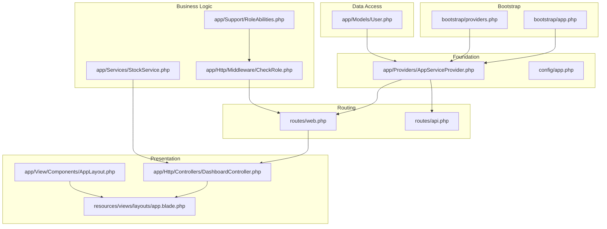
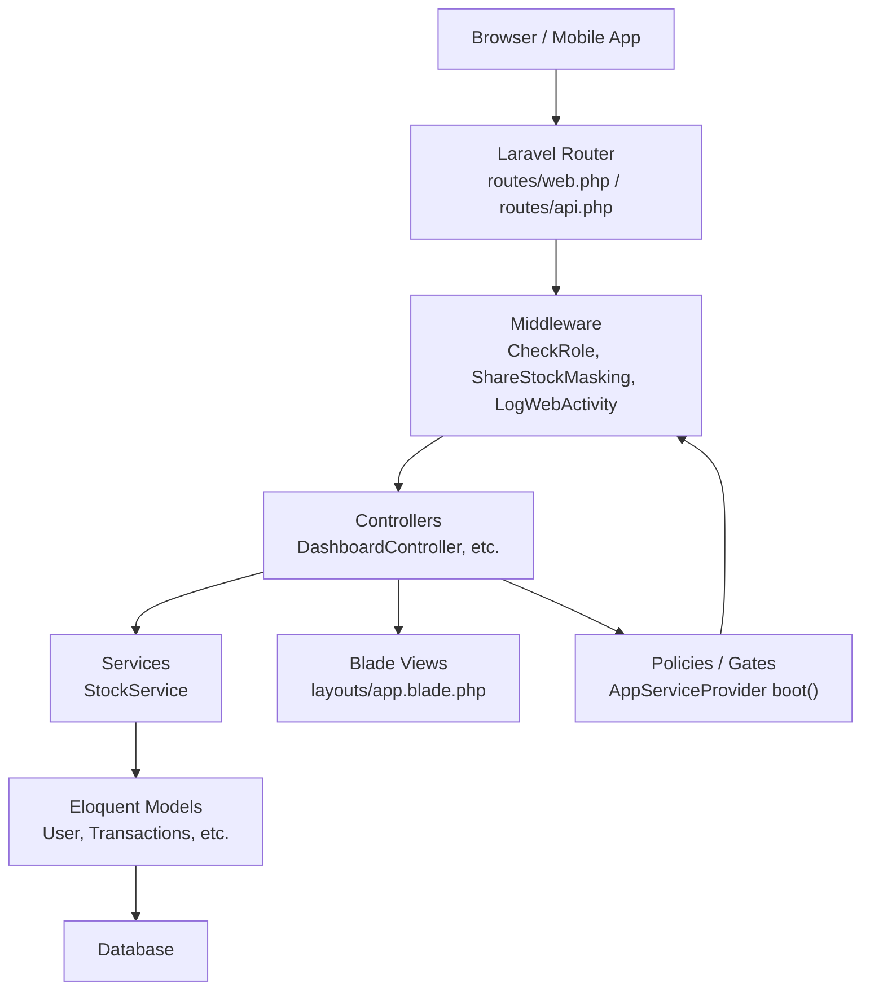
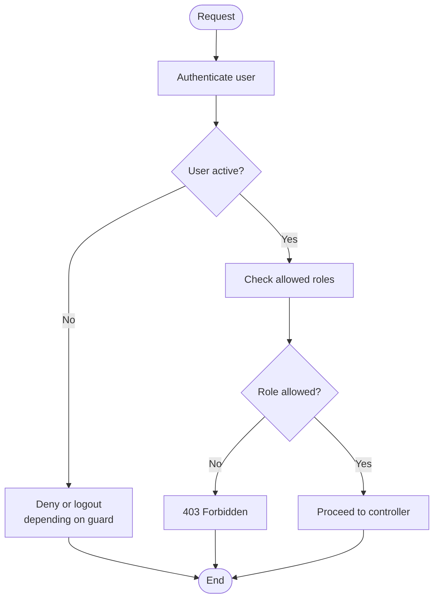
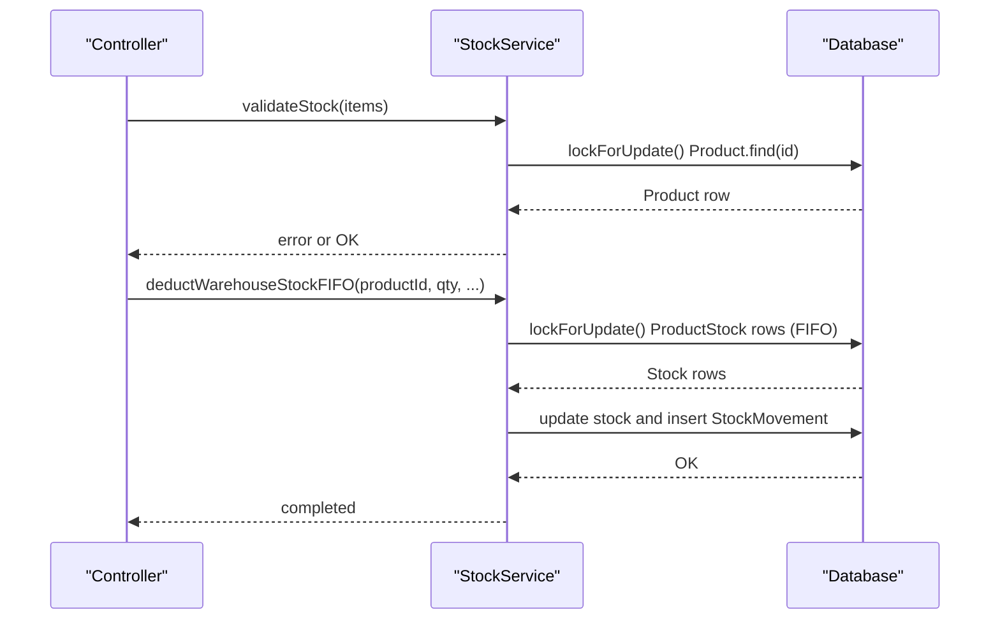
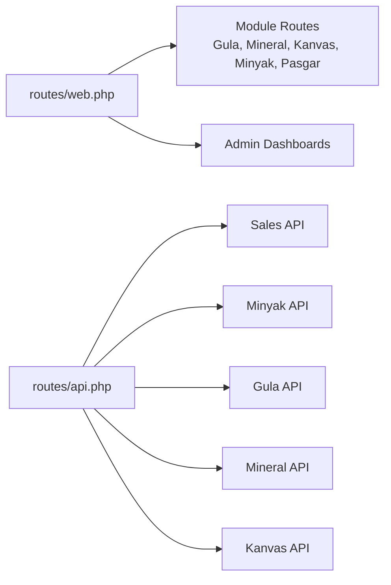
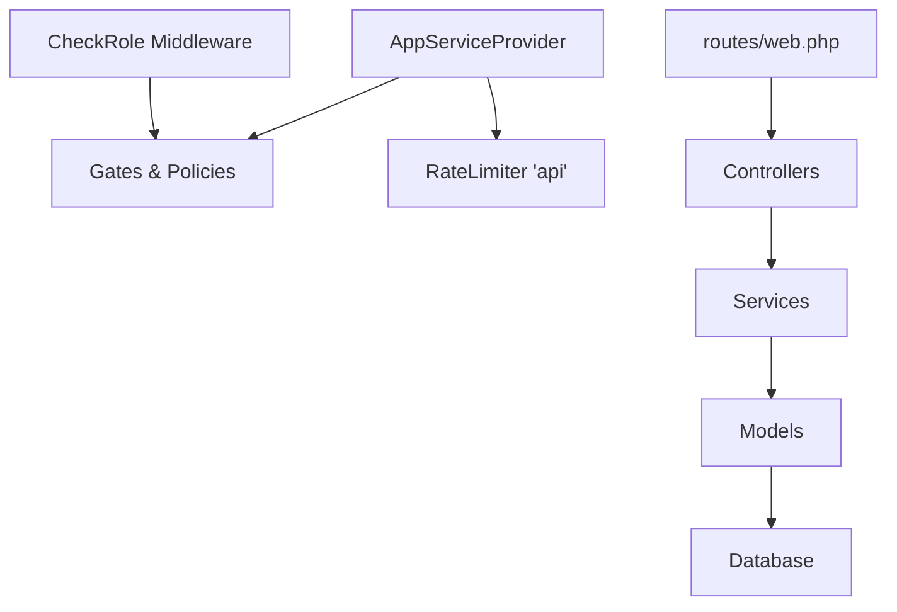

# Overall Architecture

<cite>
**Referenced Files in This Document**
- [bootstrap/app.php](file://bootstrap/app.php)
- [bootstrap/providers.php](file://bootstrap/providers.php)
- [app/Providers/AppServiceProvider.php](file://app/Providers/AppServiceProvider.php)
- [routes/web.php](file://routes/web.php)
- [routes/api.php](file://routes/api.php)
- [app/Http/Middleware/CheckRole.php](file://app/Http/Middleware/CheckRole.php)
- [app/Support/RoleAbilities.php](file://app/Support/RoleAbilities.php)
- [app/Http/Controllers/Controller.php](file://app/Http/Controllers/Controller.php)
- [app/Http/Controllers/DashboardController.php](file://app/Http/Controllers/DashboardController.php)
- [app/Services/StockService.php](file://app/Services/StockService.php)
- [app/Models/User.php](file://app/Models/User.php)
- [resources/views/layouts/app.blade.php](file://resources/views/layouts/app.blade.php)
- [app/View/Components/AppLayout.php](file://app/View/Components/AppLayout.php)
- [composer.json](file://composer.json)
- [config/app.php](file://config/app.php)
</cite>

## Table of Contents
1. [Introduction](#introduction)
2. [Project Structure](#project-structure)
3. [Core Components](#core-components)
4. [Architecture Overview](#architecture-overview)
5. [Detailed Component Analysis](#detailed-component-analysis)
6. [Dependency Analysis](#dependency-analysis)
7. [Performance Considerations](#performance-considerations)
8. [Troubleshooting Guide](#troubleshooting-guide)
9. [Conclusion](#conclusion)

## Introduction
This document describes the overall architecture of DODPOS, a multi-unit retail and logistics management system built on the Laravel framework. The application follows a layered, modular MVC pattern with clear separation of concerns:
- Presentation layer: Controllers and Blade templates
- Business logic layer: Services and policies
- Data access layer: Eloquent models and database migrations
- Foundation: Laravel’s application container, service providers, routing, middleware, and Blade components

The system supports multiple business units (e.g., Gula, Mineral, Kanvas, Minyak, Pasgar) with unified dashboards, role-based access control, and robust inventory and transaction workflows.

## Project Structure
The repository is organized around Laravel conventions:
- app/: Application code (Controllers, Models, Services, Providers, Middleware, Views)
- routes/: Web and API route definitions
- resources/views/: Blade templates and layout scaffolding
- config/: Framework and application configuration
- bootstrap/: Application bootstrap and provider registration
- database/: Migrations and seeders for domain models
- public/: Public assets and entry point



**Diagram sources**
- [bootstrap/app.php:1-57](file://bootstrap/app.php#L1-L57)
- [bootstrap/providers.php:1-6](file://bootstrap/providers.php#L1-L6)
- [app/Providers/AppServiceProvider.php:1-55](file://app/Providers/AppServiceProvider.php#L1-L55)
- [routes/web.php:1-800](file://routes/web.php#L1-L800)
- [routes/api.php:1-199](file://routes/api.php#L1-L199)
- [app/Http/Controllers/DashboardController.php:1-320](file://app/Http/Controllers/DashboardController.php#L1-L320)
- [resources/views/layouts/app.blade.php:1-800](file://resources/views/layouts/app.blade.php#L1-L800)
- [app/View/Components/AppLayout.php:1-18](file://app/View/Components/AppLayout.php#L1-L18)
- [app/Support/RoleAbilities.php:1-173](file://app/Support/RoleAbilities.php#L1-L173)
- [app/Http/Middleware/CheckRole.php:1-75](file://app/Http/Middleware/CheckRole.php#L1-L75)
- [app/Services/StockService.php:1-251](file://app/Services/StockService.php#L1-L251)
- [app/Models/User.php:1-135](file://app/Models/User.php#L1-L135)
- [config/app.php:1-127](file://config/app.php#L1-L127)

**Section sources**
- [bootstrap/app.php:1-57](file://bootstrap/app.php#L1-L57)
- [bootstrap/providers.php:1-6](file://bootstrap/providers.php#L1-L6)
- [routes/web.php:1-800](file://routes/web.php#L1-L800)
- [routes/api.php:1-199](file://routes/api.php#L1-L199)
- [config/app.php:1-127](file://config/app.php#L1-L127)

## Core Components
- Application container and service providers: Bootstrapped via bootstrap/app.php and configured providers in bootstrap/providers.php. AppServiceProvider registers global policies and rate limiters.
- Routing: Web routes define multi-module access controls and dashboards; API routes segment by business unit and role.
- Middleware: Custom role middleware and shared middleware groups enforce authorization and logging.
- Controllers: Base controller class and specialized controllers (e.g., DashboardController) orchestrate presentation logic and delegate business logic to services.
- Services: Centralized business logic (e.g., StockService) encapsulates inventory operations.
- Models: Domain entities (e.g., User) with role validation and relations.
- Views and Layouts: Blade layouts and components provide consistent UI and navigation.

**Section sources**
- [app/Providers/AppServiceProvider.php:1-55](file://app/Providers/AppServiceProvider.php#L1-L55)
- [routes/web.php:1-800](file://routes/web.php#L1-L800)
- [routes/api.php:1-199](file://routes/api.php#L1-L199)
- [app/Http/Middleware/CheckRole.php:1-75](file://app/Http/Middleware/CheckRole.php#L1-L75)
- [app/Http/Controllers/Controller.php:1-9](file://app/Http/Controllers/Controller.php#L1-L9)
- [app/Http/Controllers/DashboardController.php:1-320](file://app/Http/Controllers/DashboardController.php#L1-L320)
- [app/Services/StockService.php:1-251](file://app/Services/StockService.php#L1-L251)
- [app/Models/User.php:1-135](file://app/Models/User.php#L1-L135)
- [resources/views/layouts/app.blade.php:1-800](file://resources/views/layouts/app.blade.php#L1-L800)
- [app/View/Components/AppLayout.php:1-18](file://app/View/Components/AppLayout.php#L1-L18)

## Architecture Overview
DODPOS implements a layered MVC architecture:
- Presentation Layer: Controllers and Blade views. Navigation and layout are centralized in a Blade layout component.
- Business Logic Layer: Services encapsulate domain logic (e.g., stock validation and movement).
- Data Access Layer: Eloquent models represent domain entities and relationships.
- Foundation Layer: Laravel’s container resolves dependencies, providers bootstrap policies and rate limits, middleware enforces roles and activity logging, and routing directs requests to controllers.



**Diagram sources**
- [routes/web.php:1-800](file://routes/web.php#L1-L800)
- [routes/api.php:1-199](file://routes/api.php#L1-L199)
- [app/Http/Middleware/CheckRole.php:1-75](file://app/Http/Middleware/CheckRole.php#L1-L75)
- [app/Http/Controllers/DashboardController.php:1-320](file://app/Http/Controllers/DashboardController.php#L1-L320)
- [app/Services/StockService.php:1-251](file://app/Services/StockService.php#L1-L251)
- [app/Providers/AppServiceProvider.php:1-55](file://app/Providers/AppServiceProvider.php#L1-L55)
- [app/Models/User.php:1-135](file://app/Models/User.php#L1-L135)
- [resources/views/layouts/app.blade.php:1-800](file://resources/views/layouts/app.blade.php#L1-L800)

## Detailed Component Analysis

### MVC Pattern and Separation of Concerns
- Presentation (Controllers and Views):
  - Controllers handle HTTP requests and render views or JSON responses. The base Controller class centralizes common controller behavior.
  - Blade layouts and components provide reusable UI scaffolding and navigation menus tailored by role and module.
- Business Logic (Services):
  - Services encapsulate complex operations (e.g., stock validation and FIFO deductions) to keep controllers thin and testable.
- Data Access (Models):
  - Models define entity schemas, relationships, and behaviors (e.g., user role normalization and activity logging).

```mermaid
classDiagram
class Controller {
<<abstract>>
}
class DashboardController {
+index()
}
class AppLayout {
+render() View
}
class StockService {
+validateStock(items) array?
+deductWarehouseStockFIFO(...)
+restoreWarehouseStock(...)
}
class User {
+employee()
+isValidRole(role) bool
}
Controller <|-- DashboardController
AppLayout --> "renders" "layouts/app.blade.php"
DashboardController --> StockService : "uses"
DashboardController --> User : "auth/user"
```

**Diagram sources**
- [app/Http/Controllers/Controller.php:1-9](file://app/Http/Controllers/Controller.php#L1-L9)
- [app/Http/Controllers/DashboardController.php:1-320](file://app/Http/Controllers/DashboardController.php#L1-L320)
- [app/View/Components/AppLayout.php:1-18](file://app/View/Components/AppLayout.php#L1-L18)
- [app/Services/StockService.php:1-251](file://app/Services/StockService.php#L1-L251)
- [app/Models/User.php:1-135](file://app/Models/User.php#L1-L135)
- [resources/views/layouts/app.blade.php:1-800](file://resources/views/layouts/app.blade.php#L1-L800)

**Section sources**
- [app/Http/Controllers/Controller.php:1-9](file://app/Http/Controllers/Controller.php#L1-L9)
- [app/Http/Controllers/DashboardController.php:1-320](file://app/Http/Controllers/DashboardController.php#L1-L320)
- [app/View/Components/AppLayout.php:1-18](file://app/View/Components/AppLayout.php#L1-L18)
- [app/Services/StockService.php:1-251](file://app/Services/StockService.php#L1-L251)
- [app/Models/User.php:1-135](file://app/Models/User.php#L1-L135)
- [resources/views/layouts/app.blade.php:1-800](file://resources/views/layouts/app.blade.php#L1-L800)

### Role-Based Access Control and Authorization
- Global policy and gates:
  - AppServiceProvider boot() defines a Gate that checks user role and active status, delegating ability checks to RoleAbilities.
- Middleware:
  - CheckRole middleware validates role parameters and handles unauthenticated or inactive users differently for web vs. API.
- Route-level permissions:
  - Web routes apply role and capability middleware to restrict access to modules and actions.



**Diagram sources**
- [app/Providers/AppServiceProvider.php:1-55](file://app/Providers/AppServiceProvider.php#L1-L55)
- [app/Support/RoleAbilities.php:1-173](file://app/Support/RoleAbilities.php#L1-L173)
- [app/Http/Middleware/CheckRole.php:1-75](file://app/Http/Middleware/CheckRole.php#L1-L75)
- [routes/web.php:1-800](file://routes/web.php#L1-L800)

**Section sources**
- [app/Providers/AppServiceProvider.php:1-55](file://app/Providers/AppServiceProvider.php#L1-L55)
- [app/Support/RoleAbilities.php:1-173](file://app/Support/RoleAbilities.php#L1-L173)
- [app/Http/Middleware/CheckRole.php:1-75](file://app/Http/Middleware/CheckRole.php#L1-L75)
- [routes/web.php:1-800](file://routes/web.php#L1-L800)

### Data Flow: Stock Management Workflow
StockService encapsulates inventory operations to prevent race conditions and maintain accurate stock balances.



**Diagram sources**
- [app/Services/StockService.php:1-251](file://app/Services/StockService.php#L1-L251)

**Section sources**
- [app/Services/StockService.php:1-251](file://app/Services/StockService.php#L1-L251)

### API and Module Routing Strategy
- Web routes define role-scoped modules (e.g., Gula, Mineral, Kanvas, Minyak) and administrative dashboards.
- API routes segment by business unit (sales, minyak, gula, mineral, kanvas) with throttling and role checks.



**Diagram sources**
- [routes/web.php:1-800](file://routes/web.php#L1-L800)
- [routes/api.php:1-199](file://routes/api.php#L1-L199)

**Section sources**
- [routes/web.php:1-800](file://routes/web.php#L1-L800)
- [routes/api.php:1-199](file://routes/api.php#L1-L199)

### Framework Conventions and Naming Standards
- PSR-4 autoloading is configured in composer.json to autoload app/, database/, and tests/.
- Blade components and layouts follow Laravel conventions for reusability and consistent UI.
- Middleware aliases and groups are registered in bootstrap/app.php for concise route definitions.

**Section sources**
- [composer.json:1-91](file://composer.json#L1-L91)
- [bootstrap/app.php:1-57](file://bootstrap/app.php#L1-L57)
- [resources/views/layouts/app.blade.php:1-800](file://resources/views/layouts/app.blade.php#L1-L800)

## Dependency Analysis
The application container resolves dependencies through service providers and middleware. AppServiceProvider bootstraps gates and rate limiters; routes bind controllers to endpoints; middleware enforces role checks; services encapsulate business logic; models persist data.



**Diagram sources**
- [app/Providers/AppServiceProvider.php:1-55](file://app/Providers/AppServiceProvider.php#L1-L55)
- [app/Http/Middleware/CheckRole.php:1-75](file://app/Http/Middleware/CheckRole.php#L1-L75)
- [routes/web.php:1-800](file://routes/web.php#L1-L800)
- [app/Services/StockService.php:1-251](file://app/Services/StockService.php#L1-L251)
- [app/Models/User.php:1-135](file://app/Models/User.php#L1-L135)

**Section sources**
- [app/Providers/AppServiceProvider.php:1-55](file://app/Providers/AppServiceProvider.php#L1-L55)
- [app/Http/Middleware/CheckRole.php:1-75](file://app/Http/Middleware/CheckRole.php#L1-L75)
- [routes/web.php:1-800](file://routes/web.php#L1-L800)
- [app/Services/StockService.php:1-251](file://app/Services/StockService.php#L1-L251)
- [app/Models/User.php:1-135](file://app/Models/User.php#L1-L135)

## Performance Considerations
- Use of lockForUpdate() in StockService prevents race conditions during stock operations.
- Throttling middleware and rate limiters protect APIs from abuse.
- Blade layouts and components reduce template duplication and improve rendering consistency.
- Consider database indexing for frequently queried columns (e.g., product_id, warehouse_id) to optimize stock queries.

## Troubleshooting Guide
- Authorization failures:
  - Check role middleware and AppServiceProvider gate logic for unexpected role or active status.
  - Review inventory visibility exceptions logged for admin3/admin4 roles accessing stock paths.
- Middleware issues:
  - Verify middleware aliases and groups in bootstrap/app.php and route definitions.
- API throttling:
  - Ensure RateLimiter 'api' is defined in AppServiceProvider boot() to avoid MissingRateLimiterException.

**Section sources**
- [bootstrap/app.php:1-57](file://bootstrap/app.php#L1-L57)
- [app/Providers/AppServiceProvider.php:1-55](file://app/Providers/AppServiceProvider.php#L1-L55)
- [app/Http/Middleware/CheckRole.php:1-75](file://app/Http/Middleware/CheckRole.php#L1-L75)

## Conclusion
DODPOS employs a clean, layered MVC architecture on Laravel, with strong separation of concerns, role-based access control, and centralized business logic in services. The modular routing strategy supports multiple business units while maintaining a unified user experience through shared layouts and components. The application container and service providers provide a robust foundation for dependency management and policy enforcement, enabling scalable growth across multi-unit operations.