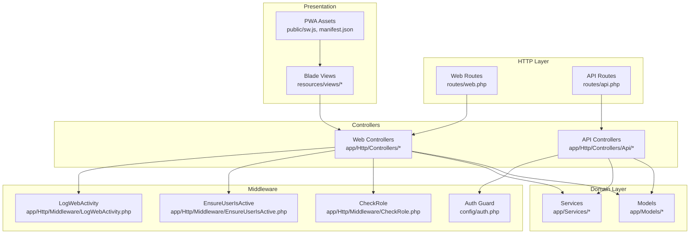
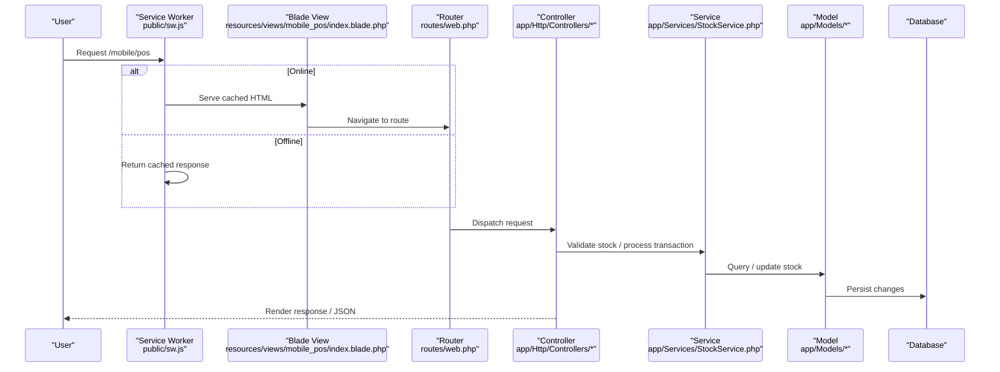
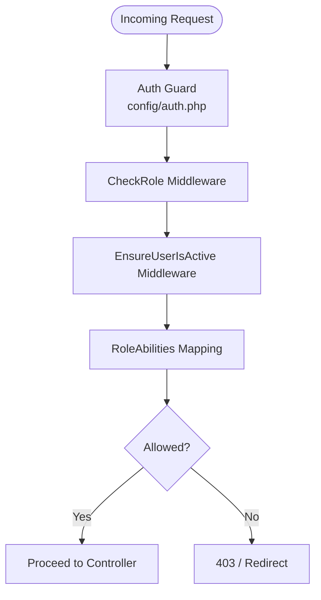
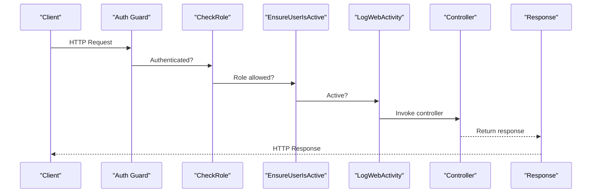
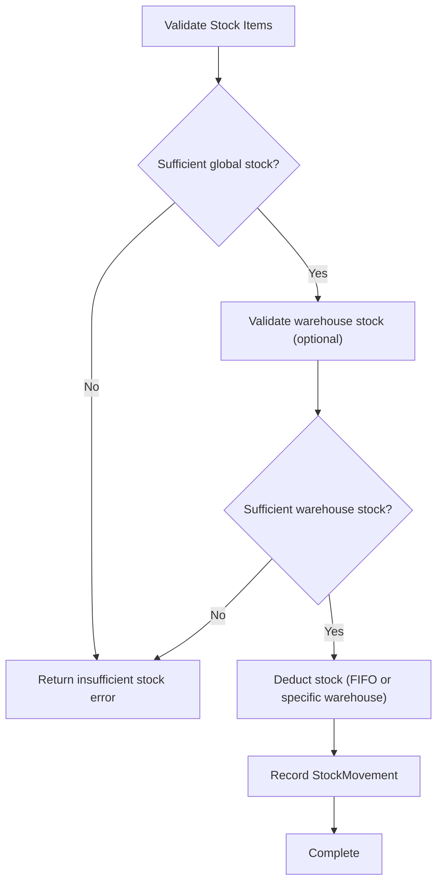
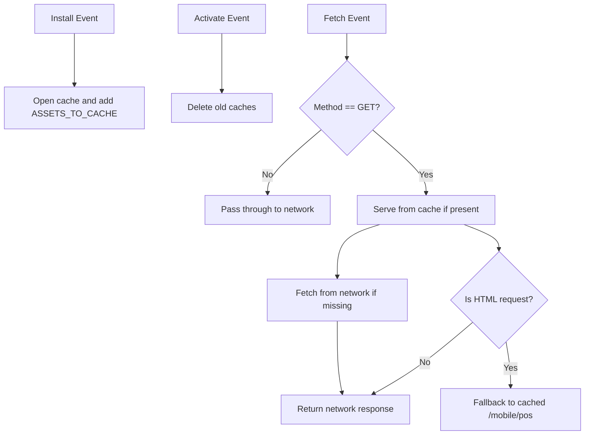
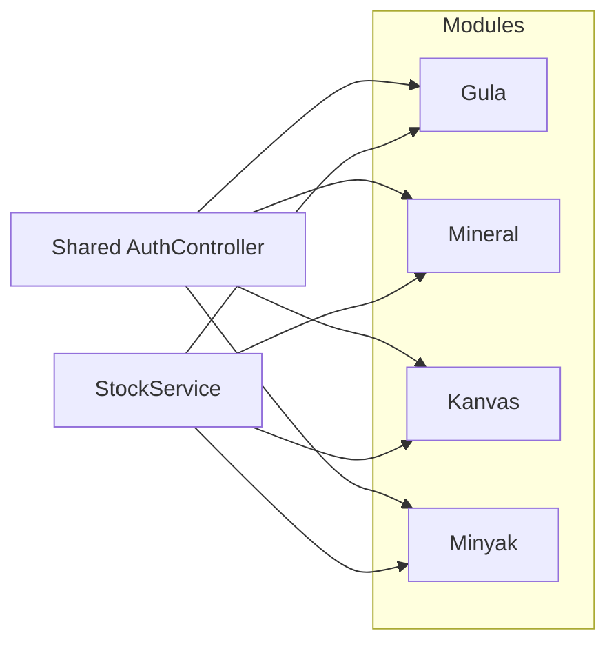
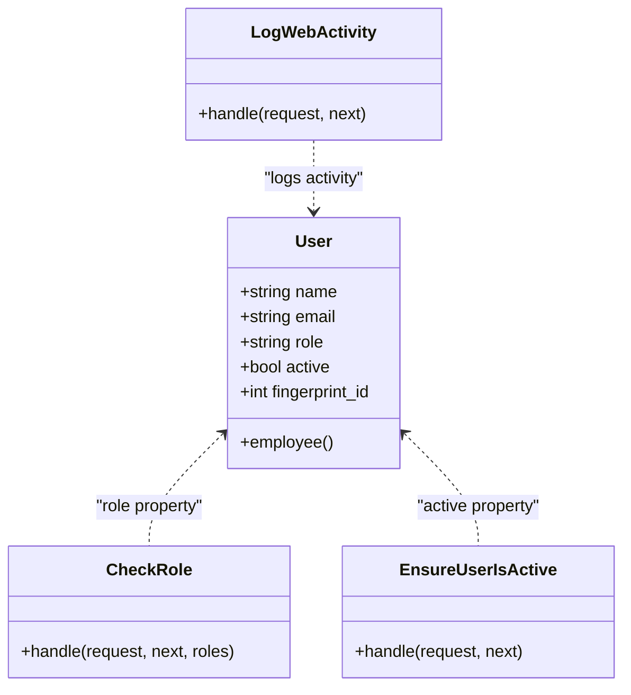
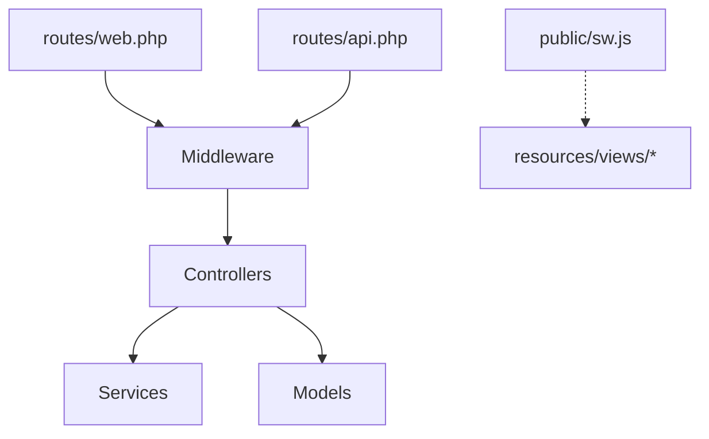
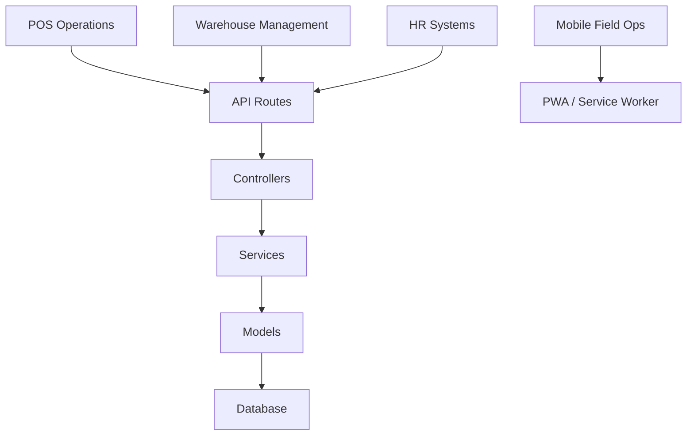

# System Architecture

<cite>
**Referenced Files in This Document**
- [bootstrap/app.php](file://bootstrap/app.php)
- [routes/web.php](file://routes/web.php)
- [routes/api.php](file://routes/api.php)
- [config/auth.php](file://config/auth.php)
- [config/activitylog.php](file://config/activitylog.php)
- [app/Http/Middleware/CheckRole.php](file://app/Http/Middleware/CheckRole.php)
- [app/Http/Middleware/EnsureUserIsActive.php](file://app/Http/Middleware/EnsureUserIsActive.php)
- [app/Http/Middleware/LogWebActivity.php](file://app/Http/Middleware/LogWebActivity.php)
- [app/Support/RoleAbilities.php](file://app/Support/RoleAbilities.php)
- [app/Models/User.php](file://app/Models/User.php)
- [app/Services/StockService.php](file://app/Services/StockService.php)
- [public/sw.js](file://public/sw.js)
- [public/manifest.json](file://public/manifest.json)
</cite>

## Table of Contents
1. [Introduction](#introduction)
2. [Project Structure](#project-structure)
3. [Core Components](#core-components)
4. [Architecture Overview](#architecture-overview)
5. [Detailed Component Analysis](#detailed-component-analysis)
6. [Dependency Analysis](#dependency-analysis)
7. [Performance Considerations](#performance-considerations)
8. [Troubleshooting Guide](#troubleshooting-guide)
9. [Conclusion](#conclusion)
10. [Appendices](#appendices)

## Introduction
This document describes the DODPOS system architecture, focusing on high-level design patterns (MVC, layered architecture, and modular design), component interactions, role-based access control (RBAC), middleware chain, request-response flow, business unit boundaries (Gula, Mineral, Kanvas, Minyak), Progressive Web App (PWA) and offline-first design, and cross-cutting concerns such as authentication, authorization, activity logging, and biometric integration. It also outlines system context diagrams showing data flows between POS operations, warehouse management, HR systems, and mobile field operations.

## Project Structure
DODPOS follows a Laravel application layout with clear separation of concerns:
- Routing: web and API routes define entry points and permissions.
- Controllers: organized by feature modules (e.g., Gula, Mineral, Kanvas, Minyak) and shared modules (POS, warehouse, HR).
- Middleware: centralized in bootstrap and per-route groups for RBAC and auditing.
- Models: Eloquent ORM models representing business entities.
- Services: reusable business logic (e.g., StockService).
- Views: Blade templates for server-rendered pages and PWA assets (service worker and manifest).
- Configuration: authentication, activity logging, and other runtime settings.

**Diagram sources**
- [routes/web.php:1-1108](file://routes/web.php#L1-L1108)
- [routes/api.php:1-199](file://routes/api.php#L1-L199)
- [config/auth.php:1-116](file://config/auth.php#L1-L116)
- [app/Http/Middleware/CheckRole.php:1-75](file://app/Http/Middleware/CheckRole.php#L1-L75)
- [app/Http/Middleware/EnsureUserIsActive.php:1-47](file://app/Http/Middleware/EnsureUserIsActive.php#L1-L47)
- [app/Http/Middleware/LogWebActivity.php:1-194](file://app/Http/Middleware/LogWebActivity.php#L1-L194)
- [app/Models/User.php:1-135](file://app/Models/User.php#L1-L135)
- [app/Services/StockService.php:1-251](file://app/Services/StockService.php#L1-L251)
- [public/sw.js:1-52](file://public/sw.js#L1-L52)
- [public/manifest.json:1-26](file://public/manifest.json#L1-L26)

**Section sources**
- [routes/web.php:1-1108](file://routes/web.php#L1-L1108)
- [routes/api.php:1-199](file://routes/api.php#L1-L199)
- [config/auth.php:1-116](file://config/auth.php#L1-L116)
- [bootstrap/app.php:1-57](file://bootstrap/app.php#L1-L57)

## Core Components
- MVC architecture: Controllers orchestrate requests, Models encapsulate domain data, and Views render responses. API and web controllers share common business logic via Services.
- Layered architecture: Presentation (Controllers/Views), Business (Services), Persistence (Models), and Infrastructure (Middleware, Config).
- Modular design: Feature-specific controllers under Api/Gula, Api/Kanvas, Api/Mineral, Api/Minyak, and web modules (Gula/, Mineral/, Kanvas/, Minyak/) keep responsibilities cohesive.

Key cross-cutting components:
- Authentication and Authorization: Sanctum guard, role middleware, and ability mapping.
- Activity logging: Web middleware logs auditable actions.
- Stock management: Centralized logic in StockService to prevent race conditions and maintain FIFO.

**Section sources**
- [routes/web.php:1-1108](file://routes/web.php#L1-L1108)
- [routes/api.php:1-199](file://routes/api.php#L1-L199)
- [app/Http/Middleware/CheckRole.php:1-75](file://app/Http/Middleware/CheckRole.php#L1-L75)
- [app/Http/Middleware/EnsureUserIsActive.php:1-47](file://app/Http/Middleware/EnsureUserIsActive.php#L1-L47)
- [app/Http/Middleware/LogWebActivity.php:1-194](file://app/Http/Middleware/LogWebActivity.php#L1-L194)
- [app/Support/RoleAbilities.php:1-173](file://app/Support/RoleAbilities.php#L1-L173)
- [app/Services/StockService.php:1-251](file://app/Services/StockService.php#L1-L251)

## Architecture Overview
The system enforces a robust middleware chain for authentication and authorization, with role-based route protection and activity logging. Controllers delegate business logic to Services, while Models persist state. The PWA stack enables offline-first mobile POS experiences.

**Diagram sources**
- [public/sw.js:1-52](file://public/sw.js#L1-L52)
- [routes/web.php:1-1108](file://routes/web.php#L1-L1108)
- [app/Services/StockService.php:1-251](file://app/Services/StockService.php#L1-L251)
- [app/Models/User.php:1-135](file://app/Models/User.php#L1-L135)

## Detailed Component Analysis

### Role-Based Access Control (RBAC)
- Middleware aliases: role and active are registered globally.
- Route-level protection: web routes apply role checks and ability gates; API routes enforce Sanctum and role filters.
- Ability mapping: RoleAbilities defines allowable abilities per role, enabling fine-grained permissions.

**Diagram sources**
- [bootstrap/app.php:16-28](file://bootstrap/app.php#L16-L28)
- [routes/web.php:29-80](file://routes/web.php#L29-L80)
- [routes/api.php:11-26](file://routes/api.php#L11-L26)
- [app/Http/Middleware/CheckRole.php:17-73](file://app/Http/Middleware/CheckRole.php#L17-L73)
- [app/Http/Middleware/EnsureUserIsActive.php:12-45](file://app/Http/Middleware/EnsureUserIsActive.php#L12-L45)
- [app/Support/RoleAbilities.php:7-171](file://app/Support/RoleAbilities.php#L7-L171)

**Section sources**
- [bootstrap/app.php:16-28](file://bootstrap/app.php#L16-L28)
- [routes/web.php:29-80](file://routes/web.php#L29-L80)
- [routes/api.php:11-26](file://routes/api.php#L11-L26)
- [app/Http/Middleware/CheckRole.php:17-73](file://app/Http/Middleware/CheckRole.php#L17-L73)
- [app/Http/Middleware/EnsureUserIsActive.php:12-45](file://app/Http/Middleware/EnsureUserIsActive.php#L12-L45)
- [app/Support/RoleAbilities.php:7-171](file://app/Support/RoleAbilities.php#L7-L171)

### Middleware Chain and Request-Response Flow
- Web requests: pass through auth, active, and activity logging middleware before reaching controllers.
- API requests: enforced by Sanctum guard and throttling; role middleware applied per module.
- Activity logging: captures method, path, route name, parameters, sanitized input, status code, and duration.

**Diagram sources**
- [config/auth.php:38-43](file://config/auth.php#L38-L43)
- [app/Http/Middleware/CheckRole.php:17-73](file://app/Http/Middleware/CheckRole.php#L17-L73)
- [app/Http/Middleware/EnsureUserIsActive.php:12-45](file://app/Http/Middleware/EnsureUserIsActive.php#L12-L45)
- [app/Http/Middleware/LogWebActivity.php:14-94](file://app/Http/Middleware/LogWebActivity.php#L14-L94)
- [routes/web.php:29-80](file://routes/web.php#L29-L80)

**Section sources**
- [config/auth.php:38-43](file://config/auth.php#L38-L43)
- [app/Http/Middleware/LogWebActivity.php:14-94](file://app/Http/Middleware/LogWebActivity.php#L14-L94)
- [routes/web.php:29-80](file://routes/web.php#L29-L80)

### Stock Management Service (Centralized Business Logic)
StockService centralizes stock validation and adjustments, ensuring consistency across POS, sales APIs, and warehouse operations. It supports:
- Global stock validation and deductions.
- Warehouse-specific stock validation and FIFO-based deductions.
- Movement logging for auditability.

**Diagram sources**
- [app/Services/StockService.php:24-201](file://app/Services/StockService.php#L24-L201)

**Section sources**
- [app/Services/StockService.php:10-251](file://app/Services/StockService.php#L10-L251)

### PWA, Offline-First, and Service Worker
The PWA stack provides offline-first behavior for mobile POS:
- Service worker caches key assets and routes (/mobile/pos, manifest).
- Cache-first strategy serves cached content; falls back to network and returns cached POS page for HTML requests when offline.
- Manifest defines app metadata for installation and standalone display.

**Diagram sources**
- [public/sw.js:10-51](file://public/sw.js#L10-L51)
- [public/manifest.json:1-26](file://public/manifest.json#L1-26)

**Section sources**
- [public/sw.js:1-52](file://public/sw.js#L1-L52)
- [public/manifest.json:1-26](file://public/manifest.json#L1-L26)

### Business Unit Boundaries and Integration Points
- Gula: Stock, loading, repacking, setoran, and POS APIs.
- Mineral: Stock, loading, setoran, and POS APIs.
- Kanvas: Catalog, route planning, POS, NOO, and setoran APIs.
- Minyak: Customer, route, transactions, and reporting APIs.
- Integration points:
  - Shared Sales AuthController for login across modules.
  - Unified StockService for inventory consistency.
  - Role-based route groups and ability checks to gate access.

**Diagram sources**
- [routes/api.php:31-198](file://routes/api.php#L31-L198)
- [app/Services/StockService.php:10-251](file://app/Services/StockService.php#L10-L251)

**Section sources**
- [routes/api.php:31-198](file://routes/api.php#L31-L198)
- [app/Services/StockService.php:10-251](file://app/Services/StockService.php#L10-L251)

### Cross-Cutting Concerns
- Authentication: Sanctum guard configured for API and session-based web authentication.
- Authorization: Role middleware and ability mapping enforce permissions.
- Activity logging: Web middleware logs auditable events with sanitized request/response metadata.
- Biometric integration: User model supports fingerprint_id and related settings.

**Diagram sources**
- [app/Models/User.php:14-135](file://app/Models/User.php#L14-L135)
- [app/Http/Middleware/CheckRole.php:11-75](file://app/Http/Middleware/CheckRole.php#L11-L75)
- [app/Http/Middleware/EnsureUserIsActive.php:10-47](file://app/Http/Middleware/EnsureUserIsActive.php#L10-L47)
- [app/Http/Middleware/LogWebActivity.php:12-194](file://app/Http/Middleware/LogWebActivity.php#L12-L194)

**Section sources**
- [config/auth.php:38-43](file://config/auth.php#L38-L43)
- [app/Models/User.php:19-26](file://app/Models/User.php#L19-L26)
- [config/activitylog.php:1-53](file://config/activitylog.php#L1-L53)
- [app/Http/Middleware/LogWebActivity.php:14-94](file://app/Http/Middleware/LogWebActivity.php#L14-L94)

## Dependency Analysis
- Controllers depend on Models and Services for business logic.
- Middleware depends on configuration and request context.
- Routes define dependency chains: route → middleware → controller → model/service.
- PWA assets are decoupled from backend logic but integrate with frontend rendering.

**Diagram sources**
- [routes/web.php:1-1108](file://routes/web.php#L1-L1108)
- [routes/api.php:1-199](file://routes/api.php#L1-L199)
- [public/sw.js:1-52](file://public/sw.js#L1-L52)

**Section sources**
- [routes/web.php:1-1108](file://routes/web.php#L1-L1108)
- [routes/api.php:1-199](file://routes/api.php#L1-L199)
- [public/sw.js:1-52](file://public/sw.js#L1-L52)

## Performance Considerations
- Throttling: API routes include throttle middleware to limit requests.
- Database locks: StockService uses row-level locking to prevent race conditions during stock adjustments.
- Logging overhead: Activity logging is configurable and avoids excessive metadata for non-POST/PUT/PATCH/DELETE methods.

Recommendations:
- Monitor slow queries and enable database query logging for stock-heavy operations.
- Consider caching frequently accessed catalogs and customer credits for mobile sales APIs.
- Tune throttle limits per module based on traffic patterns.

**Section sources**
- [bootstrap/app.php:27-27](file://bootstrap/app.php#L27-L27)
- [app/Services/StockService.php:27-51](file://app/Services/StockService.php#L27-L51)
- [app/Http/Middleware/LogWebActivity.php:30-42](file://app/Http/Middleware/LogWebActivity.php#L30-L42)

## Troubleshooting Guide
- Authentication failures: Verify Sanctum guard and active user state; ensure middleware aliases are registered.
- Authorization denials: Review role middleware and ability mapping; check route-level role guards.
- Activity logging issues: Confirm activitylog enabled flag and table creation; sanitize sensitive fields in logs.
- Stock discrepancies: Validate StockService usage and FIFO logic; inspect movement records.

**Section sources**
- [bootstrap/app.php:16-28](file://bootstrap/app.php#L16-L28)
- [app/Http/Middleware/CheckRole.php:17-73](file://app/Http/Middleware/CheckRole.php#L17-L73)
- [app/Support/RoleAbilities.php:7-171](file://app/Support/RoleAbilities.php#L7-L171)
- [config/activitylog.php:8-8](file://config/activitylog.php#L8-L8)
- [app/Services/StockService.php:100-148](file://app/Services/StockService.php#L100-L148)

## Conclusion
DODPOS employs a layered, modular MVC architecture with strong RBAC enforcement, centralized business services, and a PWA stack for offline-first mobile POS. The middleware chain ensures secure and auditable operations, while role-based route protection and ability mapping provide granular access control across business units. The system’s design supports scalability, maintainability, and cross-unit integration through shared services and unified authentication.

## Appendices
- System context diagram: POS operations, warehouse management, HR systems, and mobile field operations interact via web and API routes, with role-based permissions and activity logging.

[No sources needed since this diagram shows conceptual workflow, not actual code structure]