# Testing Strategy

<cite>
**Referenced Files in This Document**
- [phpunit.xml](file://phpunit.xml)
- [TestCase.php](file://tests/TestCase.php)
- [ExampleTest.php](file://tests/Unit/ExampleTest.php)
- [SalesOrderTest.php](file://tests/Feature/Api/SalesOrderTest.php)
- [AuthenticationTest.php](file://tests/Feature/Auth/AuthenticationTest.php)
- [HrPayrollFunctionalTest.php](file://tests/Feature/HrPayrollFunctionalTest.php)
- [PurchaseOrderReceiveTest.php](file://tests/Feature/PurchaseOrderReceiveTest.php)
- [StockOpnameTest.php](file://tests/Feature/StockOpnameTest.php)
- [PosSessionCashTest.php](file://tests/Feature/PosSessionCashTest.php)
- [PosReturnTest.php](file://tests/Feature/PosReturnTest.php)
- [ActivityLogIntegrationTest.php](file://tests/Feature/ActivityLogIntegrationTest.php)
- [InventoryVisibilityTest.php](file://tests/Feature/InventoryVisibilityTest.php)
- [UserFactory.php](file://database/factories/UserFactory.php)
- [DatabaseSeeder.php](file://database/seeders/DatabaseSeeder.php)
- [composer.json](file://composer.json)
</cite>

## Table of Contents
1. [Introduction](#introduction)
2. [Project Structure](#project-structure)
3. [Core Components](#core-components)
4. [Architecture Overview](#architecture-overview)
5. [Detailed Component Analysis](#detailed-component-analysis)
6. [Dependency Analysis](#dependency-analysis)
7. [Performance Considerations](#performance-considerations)
8. [Troubleshooting Guide](#troubleshooting-guide)
9. [Conclusion](#conclusion)
10. [Appendices](#appendices)

## Introduction
This document defines the comprehensive testing strategy for DODPOS quality assurance and validation. It explains the PHPUnit test suite organization (unit, feature, and API tests), outlines domain-specific testing approaches for sales operations, inventory management, HR/payroll, and API endpoints, and documents test case design patterns, mock implementations, and data seeding strategies. It also provides practical examples of writing tests, assertion patterns, and continuous integration setup guidance, along with coverage of critical business workflows, security validation, and performance testing methodologies.

## Project Structure
The test suite is organized under the tests directory with two primary categories:
- Unit: Basic unit tests for isolated logic.
- Feature: End-to-end tests covering web and API flows, including domain-specific scenarios.

The PHPUnit configuration defines two test suites and sets up the testing environment, including an in-memory SQLite database and environment variables optimized for fast, deterministic runs.

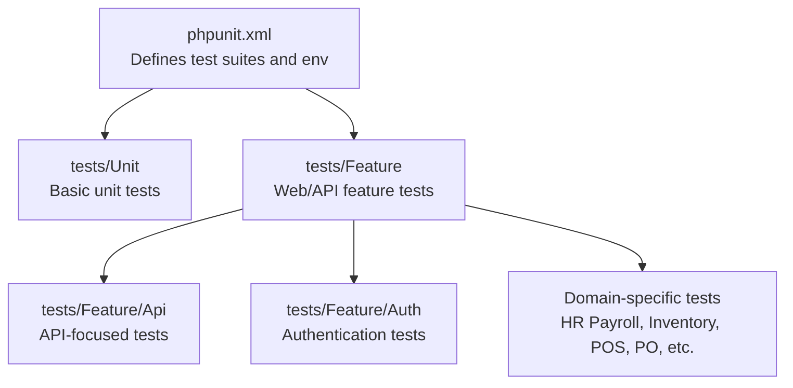

**Diagram sources**
- [phpunit.xml:1-37](file://phpunit.xml#L1-L37)
- [TestCase.php:1-11](file://tests/TestCase.php#L1-L11)

**Section sources**
- [phpunit.xml:1-37](file://phpunit.xml#L1-L37)
- [TestCase.php:1-11](file://tests/TestCase.php#L1-L11)

## Core Components
- Base test harness: A shared abstract test case class extends the framework’s base to standardize setup and teardown across tests.
- PHPUnit configuration: Declares Unit and Feature test suites, includes the app directory for coverage, and configures environment variables for testing (SQLite in-memory DB, array caches, sync queues, etc.).
- Factories and seeders: Factories generate realistic test data, while seeders bootstrap predefined users and product catalogs for repeatable tests.

Key patterns:
- RefreshDatabase trait per feature test to ensure a clean database state.
- ActingAs helpers to simulate authenticated requests.
- JSON assertions for API responses and database assertions for state verification.
- Storage fake for file-based features (e.g., selfie uploads).

**Section sources**
- [TestCase.php:1-11](file://tests/TestCase.php#L1-L11)
- [phpunit.xml:1-37](file://phpunit.xml#L1-L37)
- [UserFactory.php:1-47](file://database/factories/UserFactory.php#L1-L47)
- [DatabaseSeeder.php:1-60](file://database/seeders/DatabaseSeeder.php#L1-L60)

## Architecture Overview
The testing architecture aligns with Laravel conventions:
- Feature tests drive HTTP requests and validate controller behavior and response shapes.
- API tests focus on JSON endpoints and enforce validation rules and business constraints.
- Domain-specific tests encapsulate workflows for sales orders, inventory adjustments, purchase order receiving, POS sessions, returns, and HR/payroll calculations.

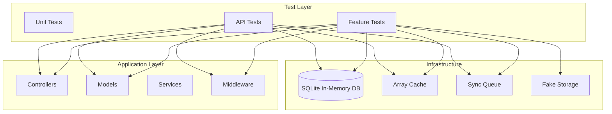

**Diagram sources**
- [phpunit.xml:20-35](file://phpunit.xml#L20-L35)
- [SalesOrderTest.php:16-83](file://tests/Feature/Api/SalesOrderTest.php#L16-L83)
- [HrPayrollFunctionalTest.php:19-441](file://tests/Feature/HrPayrollFunctionalTest.php#L19-L441)

## Detailed Component Analysis

### PHPUnit Suite Organization
- Suites: Unit and Feature.
- Coverage: Includes the app directory.
- Environment: SQLite in-memory database, array cache/store, sync queue, null broadcast driver, and disabled observability/testing integrations for speed.

Best practices:
- Keep Feature tests self-contained with RefreshDatabase.
- Use actingAs for authentication and assertStatus/assertJsonPath for API assertions.
- Prefer database assertions (assertDatabaseHas/Missing) for state checks.

**Section sources**
- [phpunit.xml:7-19](file://phpunit.xml#L7-L19)
- [phpunit.xml:20-35](file://phpunit.xml#L20-L35)

### Unit Tests
- Purpose: Validate isolated logic units.
- Example: A trivial pass/fail test demonstrates the pattern.

Recommendations:
- Keep unit tests minimal and fast.
- Use Mockery for external dependencies when appropriate.

**Section sources**
- [ExampleTest.php:1-17](file://tests/Unit/ExampleTest.php#L1-L17)

### API Tests: Sales Orders
- Scope: Validates authentication gating, order creation, validation rules, stock deduction for vehicle-based orders, insufficient stock handling, and item validation.
- Patterns:
  - Setup via factories and manual model creation to establish prerequisites (users, customers, products, warehouses, vehicles).
  - JSON assertions for response shape and status codes.
  - Database assertions to verify persisted state and stock movements.

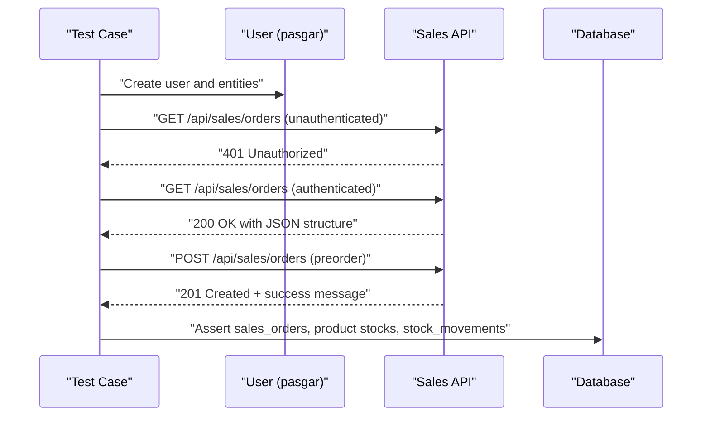

**Diagram sources**
- [SalesOrderTest.php:85-138](file://tests/Feature/Api/SalesOrderTest.php#L85-L138)
- [SalesOrderTest.php:162-205](file://tests/Feature/Api/SalesOrderTest.php#L162-L205)

**Section sources**
- [SalesOrderTest.php:16-83](file://tests/Feature/Api/SalesOrderTest.php#L16-L83)
- [SalesOrderTest.php:85-278](file://tests/Feature/Api/SalesOrderTest.php#L85-L278)

### Authentication Tests
- Scope: Login screen rendering, successful login, invalid credentials, and logout.
- Patterns: Factory-generated users, actingAs for authenticated requests, and redirect assertions.

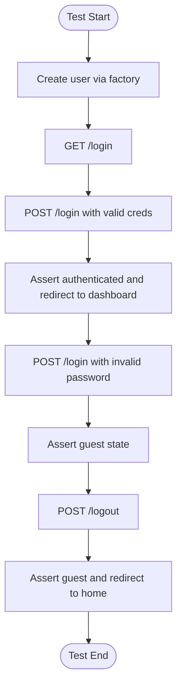

**Diagram sources**
- [AuthenticationTest.php:13-53](file://tests/Feature/Auth/AuthenticationTest.php#L13-L53)

**Section sources**
- [AuthenticationTest.php:9-54](file://tests/Feature/Auth/AuthenticationTest.php#L9-L54)

### HR Payroll Functional Tests
- Scope: Employee CRUD, leave requests, holidays, bonuses/deductions, attendance with selfie uploads, payroll generation/print/lock/unlock/adjustment, and performance page load.
- Patterns: Storage fake for selfie images, factory-generated users, route-based assertions, CSV export checks, and strict database assertions for generated records.

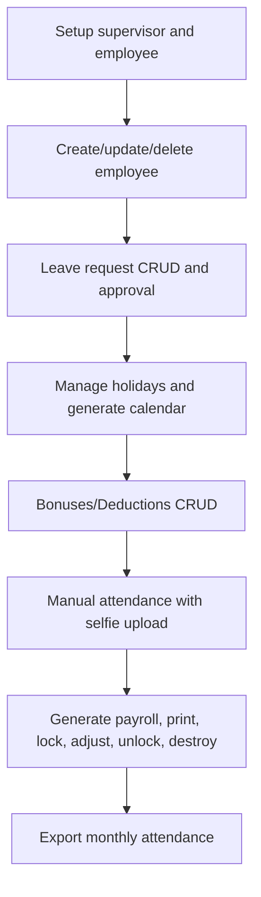

**Diagram sources**
- [HrPayrollFunctionalTest.php:23-68](file://tests/Feature/HrPayrollFunctionalTest.php#L23-L68)
- [HrPayrollFunctionalTest.php:245-318](file://tests/Feature/HrPayrollFunctionalTest.php#L245-L318)
- [HrPayrollFunctionalTest.php:320-426](file://tests/Feature/HrPayrollFunctionalTest.php#L320-L426)

**Section sources**
- [HrPayrollFunctionalTest.php:19-441](file://tests/Feature/HrPayrollFunctionalTest.php#L19-L441)

### Purchase Order Receive Tests
- Scope: Receiving purchase order items updates stock, product stock, stock movements, PO status transitions, and supplier debt creation; rejects items not belonging to the PO.
- Patterns: Disable middleware for direct route testing, assert PO status transitions, and verify stock deltas.

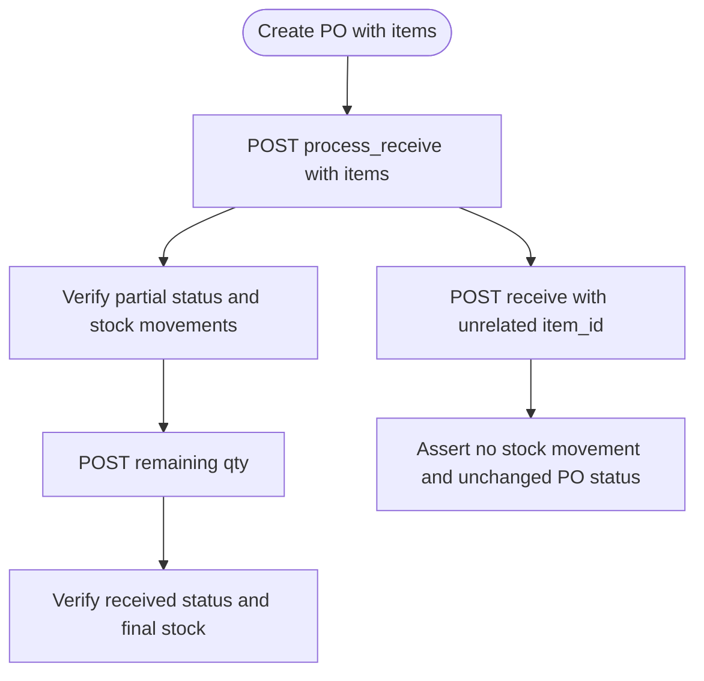

**Diagram sources**
- [PurchaseOrderReceiveTest.php:23-130](file://tests/Feature/PurchaseOrderReceiveTest.php#L23-L130)
- [PurchaseOrderReceiveTest.php:132-206](file://tests/Feature/PurchaseOrderReceiveTest.php#L132-L206)

**Section sources**
- [PurchaseOrderReceiveTest.php:19-207](file://tests/Feature/PurchaseOrderReceiveTest.php#L19-L207)

### Stock Opname Tests
- Scope: Adjusting stock upwards or downwards based on actual counts versus system count; difference input mode; validation of movement entries and user association.
- Patterns: Assert quantity delta and movement type, verify user association in movement records.

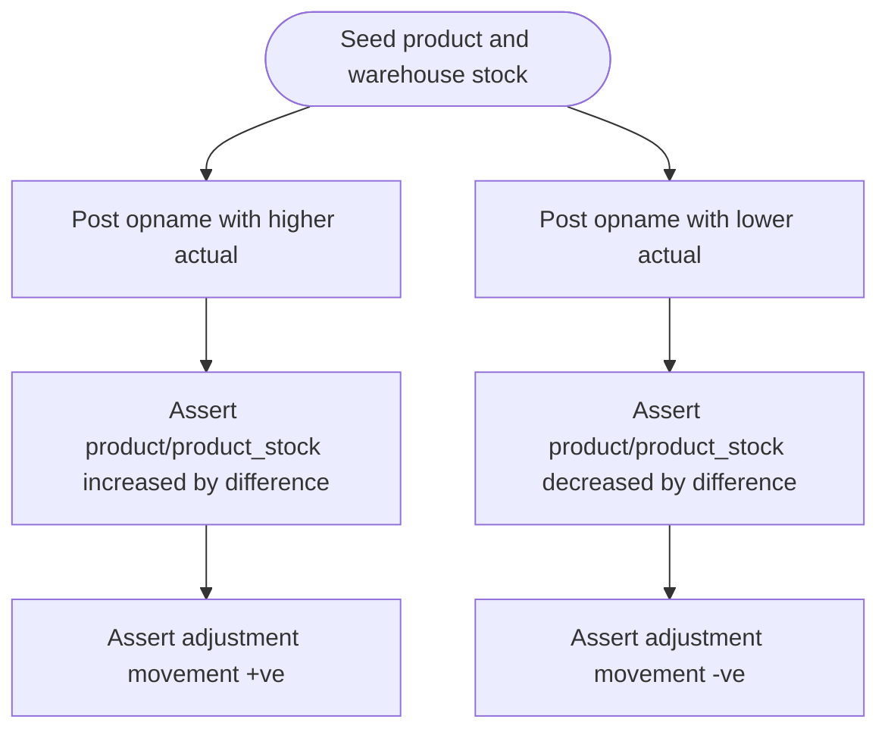

**Diagram sources**
- [StockOpnameTest.php:19-79](file://tests/Feature/StockOpnameTest.php#L19-L79)
- [StockOpnameTest.php:81-141](file://tests/Feature/StockOpnameTest.php#L81-L141)
- [StockOpnameTest.php:143-203](file://tests/Feature/StockOpnameTest.php#L143-L203)

**Section sources**
- [StockOpnameTest.php:15-204](file://tests/Feature/StockOpnameTest.php#L15-L204)

### POS Session Cash Tests
- Scope: Closing a POS session stores expected cash, actual cash, variance, and closing amount; validates calculation correctness.
- Patterns: Create transactions and cash movements, then assert session state after closure.

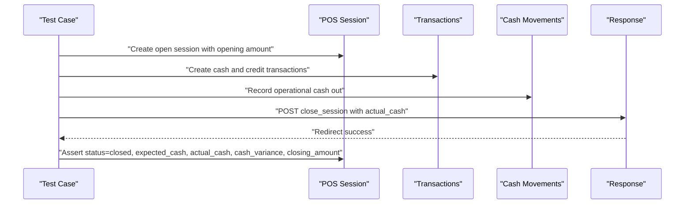

**Diagram sources**
- [PosSessionCashTest.php:16-74](file://tests/Feature/PosSessionCashTest.php#L16-L74)

**Section sources**
- [PosSessionCashTest.php:12-75](file://tests/Feature/PosSessionCashTest.php#L12-L75)

### POS Return Tests
- Scope: Prevents transaction void if returns exist; reduces customer debt for credit transactions upon return.
- Patterns: Build transaction and return records, then assert state and financial impact.

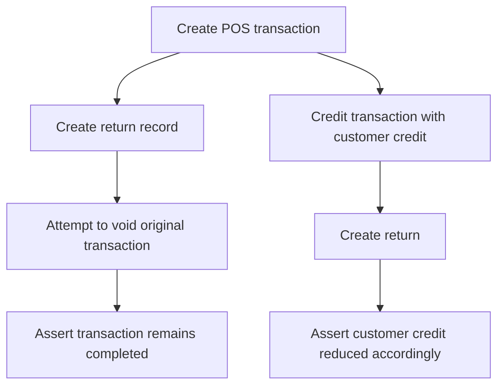

**Diagram sources**
- [PosReturnTest.php:23-87](file://tests/Feature/PosReturnTest.php#L23-L87)
- [PosReturnTest.php:89-158](file://tests/Feature/PosReturnTest.php#L89-L158)

**Section sources**
- [PosReturnTest.php:19-159](file://tests/Feature/PosReturnTest.php#L19-L159)

### Activity Log Integration Tests
- Scope: Verifies that state-changing requests produce activity log entries with expected fields (causer, event, description, properties with request/response metadata).
- Patterns: Use Spatie Activitylog models to assert presence and structure of log entries.

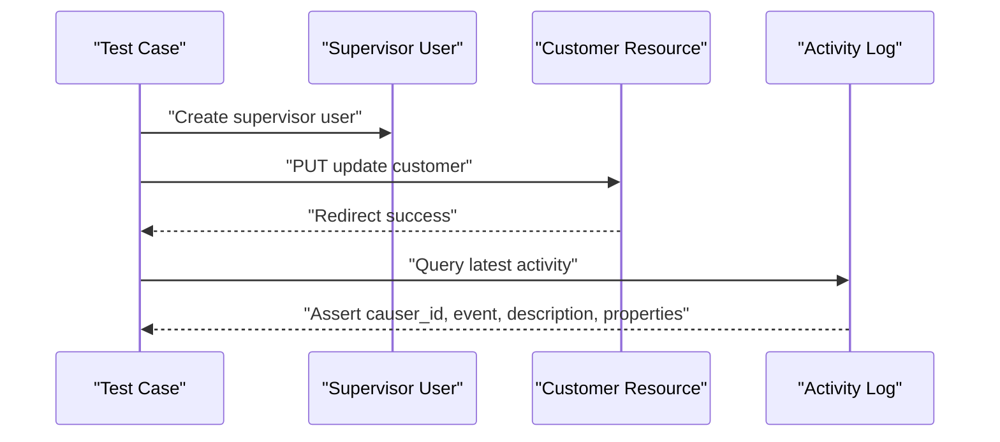

**Diagram sources**
- [ActivityLogIntegrationTest.php:16-80](file://tests/Feature/ActivityLogIntegrationTest.php#L16-L80)

**Section sources**
- [ActivityLogIntegrationTest.php:12-101](file://tests/Feature/ActivityLogIntegrationTest.php#L12-L101)

### Inventory Visibility Tests
- Scope: Enforces masked stock visibility until stocktake/opname submission; blocks admin3/admin4 checkout until opname submitted; allows non-warehouse roles to check out without opname; verifies masking and unmasking behavior.
- Patterns: Seed warehouses and product stocks, create attendance records, submit opname sessions, and assert UI messages and database states.

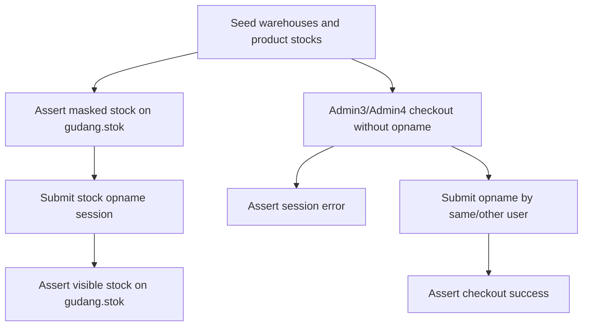

**Diagram sources**
- [InventoryVisibilityTest.php:78-96](file://tests/Feature/InventoryVisibilityTest.php#L78-L96)
- [InventoryVisibilityTest.php:125-161](file://tests/Feature/InventoryVisibilityTest.php#L125-L161)
- [InventoryVisibilityTest.php:259-282](file://tests/Feature/InventoryVisibilityTest.php#L259-L282)

**Section sources**
- [InventoryVisibilityTest.php:16-312](file://tests/Feature/InventoryVisibilityTest.php#L16-L312)

## Dependency Analysis
- External libraries:
  - PHPUnit for unit and feature testing.
  - Faker for generating test data.
  - Spatie Activitylog for audit trails.
  - Sanctum for API authentication in tests.
- Internal dependencies:
  - Factories and seeders supply deterministic test data.
  - Controllers under test are exercised via HTTP requests in Feature tests.

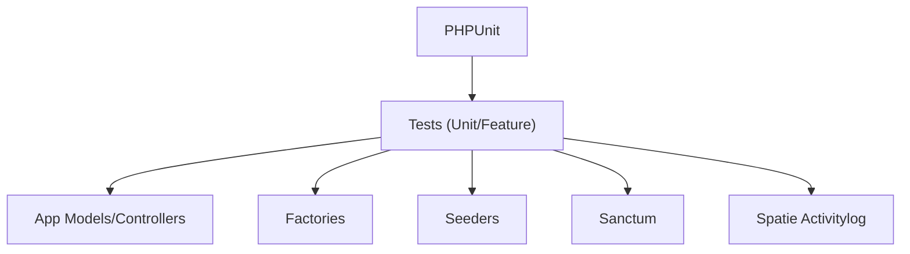

**Diagram sources**
- [composer.json:16-24](file://composer.json#L16-L24)
- [composer.json:14](file://composer.json#L14)
- [SalesOrderTest.php:5-14](file://tests/Feature/Api/SalesOrderTest.php#L5-L14)

**Section sources**
- [composer.json:16-24](file://composer.json#L16-L24)
- [composer.json:14](file://composer.json#L14)

## Performance Considerations
- Database isolation: RefreshDatabase per test ensures clean state but can be slow. Consider grouping related tests and minimizing cross-test dependencies.
- In-memory SQLite: Fast for unit and feature tests; avoid heavy filesystem operations.
- Fake storage: Use Storage::fake for image uploads to prevent real disk writes.
- Parallelization: PHPUnit supports parallelization; configure via phpunit.xml if needed.
- Assertions: Prefer targeted database assertions to reduce overhead.

[No sources needed since this section provides general guidance]

## Troubleshooting Guide
Common issues and resolutions:
- Authentication failures in API tests:
  - Ensure actingAs is used with a valid Sanctum user and that the API endpoint requires Sanctum guards.
- JSON assertion mismatches:
  - Use assertJsonStructure and assertJsonPath to validate nested response shapes.
- Database state inconsistencies:
  - Use RefreshDatabase and assertDatabaseHas/Missing to verify persistence.
- File upload assertions:
  - Use Storage::fake and assertExists on the expected disk path.
- Middleware interference:
  - Use withoutMiddleware() for direct route testing when necessary.

**Section sources**
- [SalesOrderTest.php:95-104](file://tests/Feature/Api/SalesOrderTest.php#L95-L104)
- [PosSessionCashTest.php:18-74](file://tests/Feature/PosSessionCashTest.php#L18-L74)
- [HrPayrollFunctionalTest.php:247-302](file://tests/Feature/HrPayrollFunctionalTest.php#L247-L302)

## Conclusion
The DODPOS testing strategy leverages PHPUnit’s Unit and Feature suites with domain-specific tests covering sales, inventory, HR/payroll, POS, purchase orders, returns, and activity logging. The approach emphasizes deterministic data via factories and seeders, robust assertions for API responses and database state, and targeted mocking for file uploads. By following the documented patterns and best practices, teams can maintain high-quality assurance and validation across critical business workflows.

[No sources needed since this section summarizes without analyzing specific files]

## Appendices

### Practical Test Writing Examples (by file path)
- API Sales Orders: [SalesOrderTest.php:85-278](file://tests/Feature/Api/SalesOrderTest.php#L85-L278)
- Authentication: [AuthenticationTest.php:13-53](file://tests/Feature/Auth/AuthenticationTest.php#L13-L53)
- HR Payroll: [HrPayrollFunctionalTest.php:23-426](file://tests/Feature/HrPayrollFunctionalTest.php#L23-L426)
- Purchase Order Receive: [PurchaseOrderReceiveTest.php:23-130](file://tests/Feature/PurchaseOrderReceiveTest.php#L23-L130)
- Stock Opname: [StockOpnameTest.php:19-203](file://tests/Feature/StockOpnameTest.php#L19-L203)
- POS Session Cash: [PosSessionCashTest.php:16-74](file://tests/Feature/PosSessionCashTest.php#L16-L74)
- POS Return: [PosReturnTest.php:23-158](file://tests/Feature/PosReturnTest.php#L23-L158)
- Activity Log Integration: [ActivityLogIntegrationTest.php:16-80](file://tests/Feature/ActivityLogIntegrationTest.php#L16-L80)
- Inventory Visibility: [InventoryVisibilityTest.php:78-311](file://tests/Feature/InventoryVisibilityTest.php#L78-L311)

### Continuous Integration Setup
- Use the project’s Composer script to run tests:
  - Command: composer run-script test
  - Internally executes: php artisan config:clear && php artisan test
- Configure CI to:
  - Install dependencies (composer install).
  - Prepare environment (.env.testing if needed).
  - Run composer test.
  - Collect coverage if desired (configure phpunit.xml accordingly).

**Section sources**
- [composer.json:51-54](file://composer.json#L51-L54)