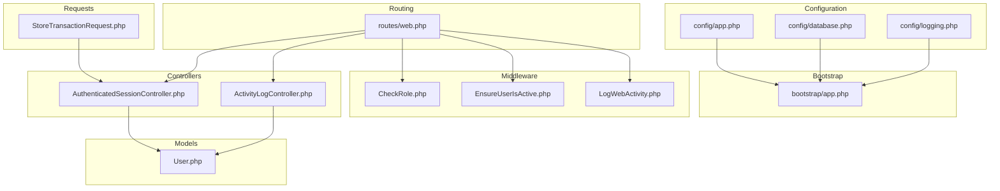
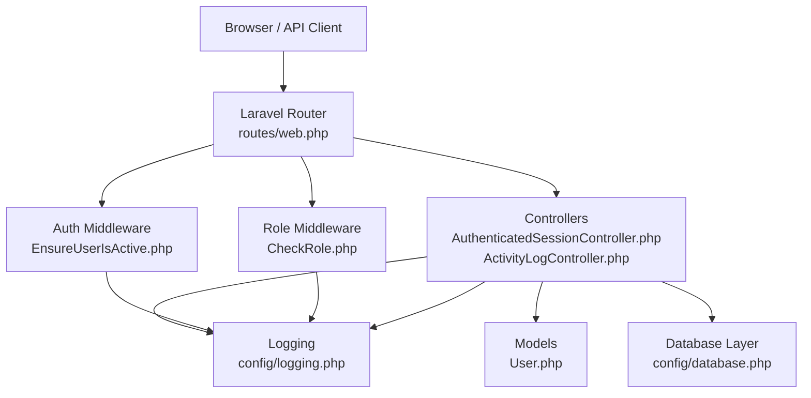
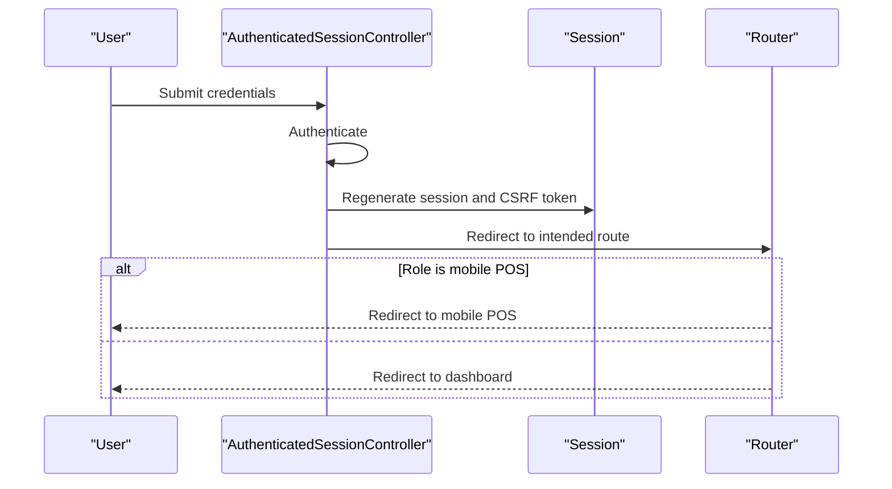
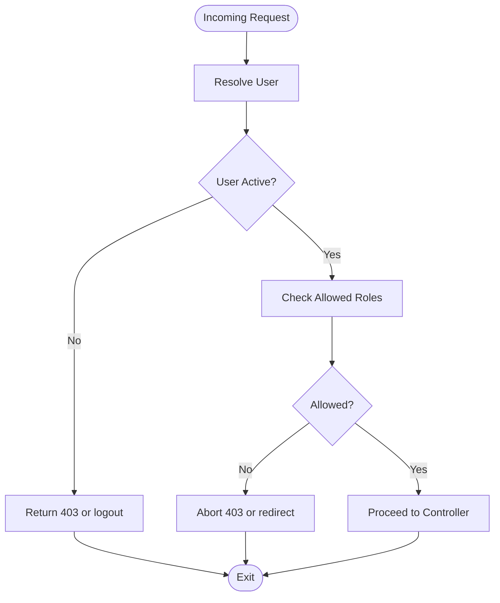
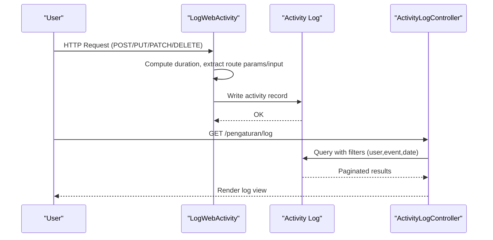
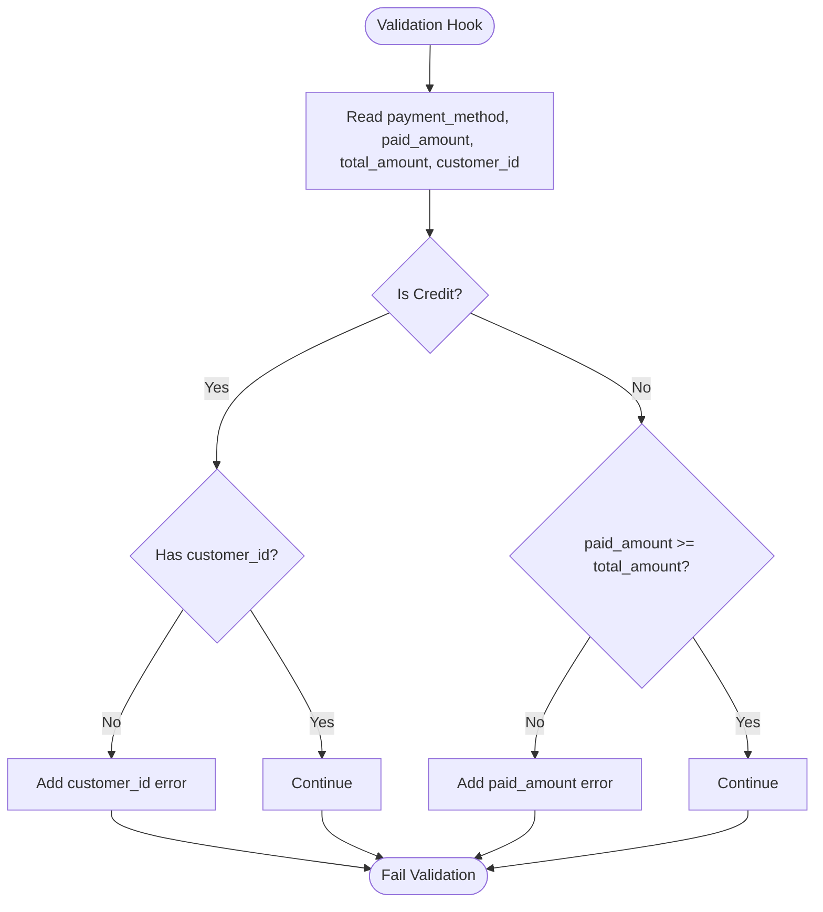
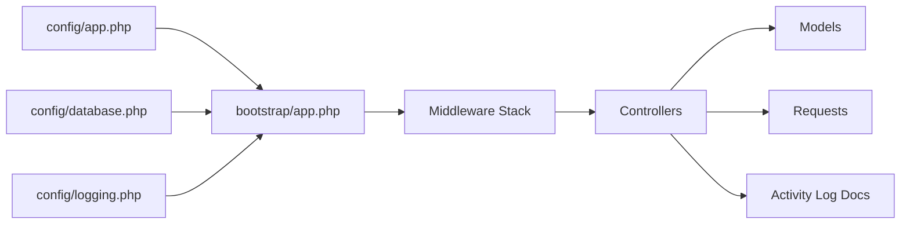

# Troubleshooting & FAQ

<cite>
**Referenced Files in This Document**
- [app.php](file://config/app.php)
- [database.php](file://config/database.php)
- [logging.php](file://config/logging.php)
- [app.php](file://bootstrap/app.php)
- [web.php](file://routes/web.php)
- [CheckRole.php](file://app/Http/Middleware/CheckRole.php)
- [EnsureUserIsActive.php](file://app/Http/Middleware/EnsureUserIsActive.php)
- [LogWebActivity.php](file://app/Http/Middleware/LogWebActivity.php)
- [AuthenticatedSessionController.php](file://app/Http/Controllers/Auth/AuthenticatedSessionController.php)
- [ActivityLogController.php](file://app/Http/Controllers/ActivityLogController.php)
- [User.php](file://app/Models/User.php)
- [0001_01_01_000000_create_users_table.php](file://database/migrations/0001_01_01_000000_create_users_table.php)
- [RoleAbilities.php](file://app/Support/RoleAbilities.php)
- [StoreTransactionRequest.php](file://app/Http/Requests/StoreTransactionRequest.php)
- [activity-log-integration-audit-2026-03-14.md](file://docs/activity-log-integration-audit-2026-03-14.md)
</cite>

## Table of Contents
1. [Introduction](#introduction)
2. [Project Structure](#project-structure)
3. [Core Components](#core-components)
4. [Architecture Overview](#architecture-overview)
5. [Detailed Component Analysis](#detailed-component-analysis)
6. [Dependency Analysis](#dependency-analysis)
7. [Performance Considerations](#performance-considerations)
8. [Troubleshooting Guide](#troubleshooting-guide)
9. [Conclusion](#conclusion)
10. [Appendices](#appendices)

## Introduction
This document provides a comprehensive troubleshooting and FAQ guide for DODPOS. It focuses on diagnosing and resolving common issues such as installation problems, database connectivity, performance bottlenecks, and user access control failures. It also documents debugging tools, diagnostic commands, monitoring approaches, and escalation procedures, along with preventive measures and knowledge base maintenance practices.

## Project Structure
DODPOS is a Laravel application with modular routing, middleware-driven access control, and activity logging. Key areas relevant to troubleshooting include:
- Configuration: application, database, logging, and service settings
- Routing: role-based access and capability checks
- Middleware: authentication, authorization, and activity logging
- Controllers: authentication and activity log management
- Models: user roles and abilities
- Requests: transaction validation rules
- Docs: audit and integration notes for activity logging

**Diagram sources**
- [app.php:1-127](file://config/app.php#L1-L127)
- [database.php:1-184](file://config/database.php#L1-L184)
- [logging.php:1-133](file://config/logging.php#L1-L133)
- [app.php:1-57](file://bootstrap/app.php#L1-L57)
- [web.php:1-1108](file://routes/web.php#L1-L1108)
- [CheckRole.php:1-75](file://app/Http/Middleware/CheckRole.php#L1-L75)
- [EnsureUserIsActive.php:1-47](file://app/Http/Middleware/EnsureUserIsActive.php#L1-L47)
- [LogWebActivity.php:1-194](file://app/Http/Middleware/LogWebActivity.php#L1-L194)
- [AuthenticatedSessionController.php:1-54](file://app/Http/Controllers/Auth/AuthenticatedSessionController.php#L1-L54)
- [ActivityLogController.php:1-80](file://app/Http/Controllers/ActivityLogController.php#L1-L80)
- [User.php:1-135](file://app/Models/User.php#L1-L135)
- [StoreTransactionRequest.php:52-80](file://app/Http/Requests/StoreTransactionRequest.php#L52-L80)

**Section sources**
- [app.php:1-127](file://config/app.php#L1-L127)
- [database.php:1-184](file://config/database.php#L1-L184)
- [logging.php:1-133](file://config/logging.php#L1-L133)
- [app.php:1-57](file://bootstrap/app.php#L1-L57)
- [web.php:1-1108](file://routes/web.php#L1-L1108)

## Core Components
- Application configuration: environment, debug mode, maintenance driver, encryption key
- Database configuration: default connection, drivers, credentials, charset, SSL options
- Logging configuration: default channel, daily rotation, Slack/Papertrail stderr/syslog
- Bootstrap: middleware aliases, groups, throttling, exception reporting
- Routes: role-based access control, capability checks, and module-specific permissions
- Middleware: role enforcement, user active status, web activity logging
- Controllers: authentication flow and activity log listing/pruning
- Models: user roles, abilities, and activity logging options
- Requests: transaction validation rules and custom validator hooks
- Docs: activity log integration audit and recommendations

**Section sources**
- [app.php:1-127](file://config/app.php#L1-L127)
- [database.php:1-184](file://config/database.php#L1-L184)
- [logging.php:1-133](file://config/logging.php#L1-L133)
- [app.php:1-57](file://bootstrap/app.php#L1-L57)
- [web.php:1-1108](file://routes/web.php#L1-L1108)
- [CheckRole.php:1-75](file://app/Http/Middleware/CheckRole.php#L1-L75)
- [EnsureUserIsActive.php:1-47](file://app/Http/Middleware/EnsureUserIsActive.php#L1-L47)
- [LogWebActivity.php:1-194](file://app/Http/Middleware/LogWebActivity.php#L1-L194)
- [AuthenticatedSessionController.php:1-54](file://app/Http/Controllers/Auth/AuthenticatedSessionController.php#L1-L54)
- [ActivityLogController.php:1-80](file://app/Http/Controllers/ActivityLogController.php#L1-L80)
- [User.php:1-135](file://app/Models/User.php#L1-L135)
- [StoreTransactionRequest.php:52-80](file://app/Http/Requests/StoreTransactionRequest.php#L52-L80)
- [activity-log-integration-audit-2026-03-14.md:63-93](file://docs/activity-log-integration-audit-2026-03-14.md#L63-L93)

## Architecture Overview
The system integrates configuration-driven routing, middleware-based authorization, and activity logging to support robust diagnostics and auditing.

**Diagram sources**
- [web.php:1-1108](file://routes/web.php#L1-L1108)
- [EnsureUserIsActive.php:1-47](file://app/Http/Middleware/EnsureUserIsActive.php#L1-L47)
- [CheckRole.php:1-75](file://app/Http/Middleware/CheckRole.php#L1-L75)
- [AuthenticatedSessionController.php:1-54](file://app/Http/Controllers/Auth/AuthenticatedSessionController.php#L1-L54)
- [ActivityLogController.php:1-80](file://app/Http/Controllers/ActivityLogController.php#L1-L80)
- [User.php:1-135](file://app/Models/User.php#L1-L135)
- [database.php:1-184](file://config/database.php#L1-L184)
- [logging.php:1-133](file://config/logging.php#L1-L133)

## Detailed Component Analysis

### Authentication and Session Flow
- Login view rendering and session regeneration
- Role-based redirection after login
- Logout and session invalidation

**Diagram sources**
- [AuthenticatedSessionController.php:25-38](file://app/Http/Controllers/Auth/AuthenticatedSessionController.php#L25-L38)
- [web.php:25-27](file://routes/web.php#L25-L27)

**Section sources**
- [AuthenticatedSessionController.php:1-54](file://app/Http/Controllers/Auth/AuthenticatedSessionController.php#L1-L54)
- [web.php:25-27](file://routes/web.php#L25-L27)

### Authorization and Access Control
- Role middleware validates user roles and active status
- Route-level capabilities enforced via ability checks
- Exception reporting for inventory visibility authorization denials

**Diagram sources**
- [CheckRole.php:17-73](file://app/Http/Middleware/CheckRole.php#L17-L73)
- [EnsureUserIsActive.php:12-45](file://app/Http/Middleware/EnsureUserIsActive.php#L12-L45)
- [web.php:29-121](file://routes/web.php#L29-L121)
- [app.php:29-55](file://bootstrap/app.php#L29-L55)

**Section sources**
- [CheckRole.php:1-75](file://app/Http/Middleware/CheckRole.php#L1-L75)
- [EnsureUserIsActive.php:1-47](file://app/Http/Middleware/EnsureUserIsActive.php#L1-L47)
- [web.php:29-121](file://routes/web.php#L29-L121)
- [app.php:29-55](file://bootstrap/app.php#L29-L55)

### Activity Logging and Auditing
- Web activity logging middleware captures requests/responses and outcomes
- Activity log listing and pruning by filters
- Audit guidance for reducing noise and increasing detail

**Diagram sources**
- [LogWebActivity.php:14-94](file://app/Http/Middleware/LogWebActivity.php#L14-L94)
- [ActivityLogController.php:14-41](file://app/Http/Controllers/ActivityLogController.php#L14-L41)
- [activity-log-integration-audit-2026-03-14.md:63-93](file://docs/activity-log-integration-audit-2026-03-14.md#L63-L93)

**Section sources**
- [LogWebActivity.php:1-194](file://app/Http/Middleware/LogWebActivity.php#L1-L194)
- [ActivityLogController.php:1-80](file://app/Http/Controllers/ActivityLogController.php#L1-L80)
- [activity-log-integration-audit-2026-03-14.md:63-93](file://docs/activity-log-integration-audit-2026-03-14.md#L63-L93)

### Transaction Validation Rules
- Paid amount must meet total amount for non-credit payments
- Customer required for credit payments

**Diagram sources**
- [StoreTransactionRequest.php:55-79](file://app/Http/Requests/StoreTransactionRequest.php#L55-L79)

**Section sources**
- [StoreTransactionRequest.php:52-80](file://app/Http/Requests/StoreTransactionRequest.php#L52-L80)

## Dependency Analysis
- Configuration dependencies: app, database, logging
- Runtime dependencies: middleware, controllers, models, requests
- Audit dependencies: activity log integration documentation

**Diagram sources**
- [app.php:1-127](file://config/app.php#L1-L127)
- [database.php:1-184](file://config/database.php#L1-L184)
- [logging.php:1-133](file://config/logging.php#L1-L133)
- [app.php:1-57](file://bootstrap/app.php#L1-L57)
- [LogWebActivity.php:1-194](file://app/Http/Middleware/LogWebActivity.php#L1-L194)
- [ActivityLogController.php:1-80](file://app/Http/Controllers/ActivityLogController.php#L1-L80)
- [activity-log-integration-audit-2026-03-14.md:63-93](file://docs/activity-log-integration-audit-2026-03-14.md#L63-L93)

**Section sources**
- [app.php:1-127](file://config/app.php#L1-L127)
- [database.php:1-184](file://config/database.php#L1-L184)
- [logging.php:1-133](file://config/logging.php#L1-L133)
- [app.php:1-57](file://bootstrap/app.php#L1-L57)

## Performance Considerations
- Enable appropriate log levels and rotation to avoid excessive disk usage
- Use daily log rotation and retention policies
- Monitor middleware overhead for long-running requests
- Optimize database queries and indexes as needed
- Reduce activity log noise by filtering routes or outcomes where appropriate

[No sources needed since this section provides general guidance]

## Troubleshooting Guide

### Installation Problems
Common symptoms
- Application fails to start or shows generic errors
- Missing environment variables or incorrect APP_KEY
- Composer dependencies missing or outdated

Diagnostic steps
- Verify environment variables in the environment configuration
- Confirm APP_KEY is set and matches the application key
- Run dependency installation and caching commands
- Check file permissions for storage and bootstrap/cache

Resolution
- Set required environment variables
- Generate or replace APP_KEY if needed
- Install/update dependencies and rebuild caches
- Ensure writable permissions for storage and cache directories

Preventive measures
- Keep environment files under version control with placeholders
- Automate key generation during deployment
- Pin dependency versions and run regular updates

**Section sources**
- [app.php:16-100](file://config/app.php#L16-L100)

### Database Connectivity
Common symptoms
- Database connection errors on startup or during requests
- Incorrect host/port/credentials
- SSL/TLS handshake failures

Diagnostic steps
- Verify DB_CONNECTION and related variables
- Test connection with the configured driver
- Review charset, collation, and SSL options
- Check firewall and network access

Resolution
- Correct host, port, username, and password
- Adjust charset/collation to match database expectations
- Configure SSL options appropriately
- Ensure network connectivity and firewall rules

Preventive measures
- Use environment-specific configurations
- Validate connection settings in staging before production
- Monitor connection pool and timeouts

**Section sources**
- [database.php:19-114](file://config/database.php#L19-L114)

### Performance Issues
Common symptoms
- Slow page loads or timeouts
- High CPU or memory usage
- Excessive logging or database queries

Diagnostic steps
- Enable profiling and review middleware durations
- Inspect activity log volume and frequency
- Analyze database query patterns and indexes
- Review log level and rotation settings

Resolution
- Tune logging levels and retention
- Optimize slow queries and add indexes
- Reduce unnecessary activity logging for bulk operations
- Scale infrastructure or optimize caching

Preventive measures
- Establish baseline metrics and alerts
- Regularly review and prune logs
- Monitor query performance and slow logs

**Section sources**
- [logging.php:61-74](file://config/logging.php#L61-L74)
- [LogWebActivity.php:42-58](file://app/Http/Middleware/LogWebActivity.php#L42-L58)

### User Access Problems
Common symptoms
- Unauthorized access attempts blocked
- Role-based redirects unexpected
- Account disabled errors

Diagnostic steps
- Check user active status and role
- Verify middleware chain for the route
- Review capability checks and role abilities
- Inspect authorization exceptions and logs

Resolution
- Activate user accounts and update roles
- Adjust route middleware and capabilities
- Fix role definitions and abilities
- Investigate authorization denials and inventory visibility logs

Preventive measures
- Define clear role and capability matrices
- Regular audits of user roles and permissions
- Educate users on role limitations

**Section sources**
- [CheckRole.php:17-73](file://app/Http/Middleware/CheckRole.php#L17-L73)
- [EnsureUserIsActive.php:12-45](file://app/Http/Middleware/EnsureUserIsActive.php#L12-L45)
- [web.php:29-121](file://routes/web.php#L29-L121)
- [RoleAbilities.php:7-171](file://app/Support/RoleAbilities.php#L7-L171)
- [User.php:76-135](file://app/Models/User.php#L76-L135)
- [app.php:29-55](file://bootstrap/app.php#L29-L55)

### Transaction Validation Failures
Common symptoms
- Payment amount errors on POS transactions
- Missing customer for credit sales

Diagnostic steps
- Inspect validation messages for payment method and amounts
- Verify customer selection for credit transactions
- Review request payload and validation rules

Resolution
- Ensure paid amount meets total for non-credit
- Select a customer for credit transactions
- Correct input values and retry submission

Preventive measures
- Validate inputs early in the client-side flow
- Provide clear error messaging to users

**Section sources**
- [StoreTransactionRequest.php:55-79](file://app/Http/Requests/StoreTransactionRequest.php#L55-L79)

### Activity Logging and Auditing
Common symptoms
- Missing or noisy activity logs
- Difficulty filtering logs by user or event

Diagnostic steps
- Confirm activity logging is enabled
- Use filters for user, event type, and date range
- Prune old logs to maintain manageable volumes

Resolution
- Enable/disable activity logging as needed
- Apply filters to narrow down relevant entries
- Prune logs older than retention period

Preventive measures
- Establish log retention policies
- Reduce noise by filtering routes or outcomes
- Increase detail for critical modules via model-level logging

**Section sources**
- [LogWebActivity.php:21-94](file://app/Http/Middleware/LogWebActivity.php#L21-L94)
- [ActivityLogController.php:14-78](file://app/Http/Controllers/ActivityLogController.php#L14-L78)
- [activity-log-integration-audit-2026-03-14.md:63-93](file://docs/activity-log-integration-audit-2026-03-14.md#L63-L93)

### Logging and Monitoring
Diagnostic commands
- Tail application logs for recent errors
- Rotate and prune logs based on retention policy
- Monitor system logs and database logs

Resolution
- Adjust log levels for environments
- Use daily rotation and appropriate retention
- Integrate external logging (Slack, Papertrail) as needed

Preventive measures
- Set up automated log rotation and cleanup
- Centralize logs for easier analysis
- Alert on critical log events

**Section sources**
- [logging.php:53-130](file://config/logging.php#L53-L130)

### Integration with Support Systems and Escalation
Escalation procedures
- Capture environment details and logs
- Document reproduction steps and validation outcomes
- Use activity logs to trace user actions and outcomes

Resolution
- Provide filtered activity logs for the affected period
- Include request/response metadata and durations
- Coordinate with developers for deeper investigation

Preventive measures
- Maintain a knowledge base of common issues and resolutions
- Standardize incident documentation templates
- Train support staff on diagnostic tools and log analysis

**Section sources**
- [ActivityLogController.php:14-78](file://app/Http/Controllers/ActivityLogController.php#L14-L78)
- [LogWebActivity.php:60-91](file://app/Http/Middleware/LogWebActivity.php#L60-L91)

## Conclusion
This guide consolidates the most frequent DODPOS issues and their solutions, focusing on installation, database connectivity, performance, and access control. By leveraging configuration, middleware, controllers, models, and requests, teams can quickly diagnose and resolve problems. Adopting preventive measures and maintaining a robust knowledge base ensures ongoing system health and efficient support operations.

[No sources needed since this section summarizes without analyzing specific files]

## Appendices

### Quick Reference: Common Commands and Checks
- Verify environment variables and keys
- Check database connectivity and credentials
- Review log levels and rotation settings
- Validate user roles and capabilities
- Inspect transaction validation rules
- Audit activity logs and prune as needed

[No sources needed since this section provides general guidance]