# Authentication System

<cite>
**Referenced Files in This Document**
- [AuthenticatedSessionController.php](file://app/Http/Controllers/Auth/AuthenticatedSessionController.php)
- [PasswordResetOtpRequestController.php](file://app/Http/Controllers/Auth/PasswordResetOtpRequestController.php)
- [PasswordResetOtpController.php](file://app/Http/Controllers/Auth/PasswordResetOtpController.php)
- [PasswordResetLinkController.php](file://app/Http/Controllers/Auth/PasswordResetLinkController.php)
- [NewPasswordController.php](file://app/Http/Controllers/Auth/NewPasswordController.php)
- [VerifyEmailController.php](file://app/Http/Controllers/Auth/VerifyEmailController.php)
- [ConfirmablePasswordController.php](file://app/Http/Controllers/Auth/ConfirmablePasswordController.php)
- [RegisteredUserController.php](file://app/Http/Controllers/Auth/RegisteredUserController.php)
- [sanctum.php](file://config/sanctum.php)
- [auth.php](file://config/auth.php)
- [auth.php](file://routes/auth.php)
- [EnsureUserIsActive.php](file://app/Http/Middleware/EnsureUserIsActive.php)
- [User.php](file://app/Models/User.php)
- [login.blade.php](file://resources/views/auth/login.blade.php)
- [reset-password-otp.blade.php](file://resources/views/auth/reset-password-otp.blade.php)
- [forgot-password.blade.php](file://resources/views/auth/forgot-password.blade.php)
- [reset-password.blade.php](file://resources/views/auth/reset-password.blade.php)
- [verify-email.blade.php](file://resources/views/auth/verify-email.blade.php)
- [confirm-password.blade.php](file://resources/views/auth/confirm-password.blade.php)
- [register.blade.php](file://resources/views/auth/register.blade.php)
- [PasswordResetOtpMail.php](file://app/Mail/PasswordResetOtpMail.php)
- [RegistrationPendingMail.php](file://app/Mail/RegistrationPendingMail.php)
- [2026_02_27_121154_add_role_and_active_to_users_table.php](file://database/migrations/2026_02_27_121154_add_role_and_active_to_users_table.php)
- [2026_03_08_022151_create_attendances_table.php](file://database/migrations/2026_03_08_022151_create_attendances_table.php)
- [2026_03_08_023248_add_fingerprint_ip_to_store_settings_table.php](file://database/migrations/2026_03_08_023248_add_fingerprint_ip_to_store_settings_table.php)
- [2026_03_12_130000_add_registration_approval_fields_to_users_table.php](file://database/migrations/2026_03_12_130000_add_registration_approval_fields_to_users_table.php)
- [2026_03_13_120000_add_nik_and_profile_photo_to_users_table.php](file://database/migrations/2026_03_13_120000_add_nik_and_profile_photo_to_users_table.php)
- [2026_03_13_130000_add_selfie_paths_to_attendances_table.php](file://database/migrations/2026_03_13_130000_add_selfie_paths_to_attendances_table.php)
- [2026_03_13_140000_add_sdm_work_end_time_to_store_settings_table.php](file://database/migrations/2026_03_13_140000_add_sdm_work_end_time_to_store_settings_table.php)
- [2026_03_13_160000_add_override_fields_to_sdm_payrolls_table.php](file://database/migrations/2026_03_13_160000_add_override_fields_to_sdm_payrolls_table.php)
- [2026_03_14_105302_create_product_requests_table.php](file://database/migrations/2026_03_14_105302_create_product_requests_table.php)
- [2026_03_14_115609_add_status_to_stock_movements_table.php](file://database/migrations/2026_03_14_115609_add_status_to_stock_movements_table.php)
- [2026_03_14_160000_add_warehouse_fields_to_product_requests_table.php](file://database/migrations/2026_03_14_160000_add_warehouse_fields_to_product_requests_table.php)
- [2026_03_14_170000_create_stock_opname_sessions_table.php](file://database/migrations/2026_03_14_170000_create_stock_opname_sessions_table.php)
- [2026_03_14_170100_create_stock_opname_items_table.php](file://database/migrations/2026_03_14_170100_create_stock_opname_items_table.php)
- [2026_03_14_180000_create_transfer_receipts_table.php](file://database/migrations/2026_03_14_180000_create_transfer_receipts_table.php)
- [2026_03_14_180100_create_transfer_receipt_items_table.php](file://database/migrations/2026_03_14_180100_create_transfer_receipt_items_table.php)
- [2026_03_14_190000_create_purchase_order_receipts_table.php](file://database/migrations/2026_03_14_190000_create_purchase_order_receipts_table.php)
- [2026_03_14_190100_create_purchase_order_receipt_items_table.php](file://database/migrations/2026_03_14_190100_create_purchase_order_receipt_items_table.php)
- [2026_03_14_200000_add_followup_fields_to_purchase_order_receipts_table.php](file://database/migrations/2026_03_14_200000_add_followup_fields_to_purchase_order_receipts_table.php)
- [2026_03_14_201000_add_purchase_return_id_to_purchase_order_receipts_table.php](file://database/migrations/2026_03_14_201000_add_purchase_return_id_to_purchase_order_receipts_table.php)
- [2026_03_14_202000_add_reorder_purchase_order_id_to_purchase_order_receipts_table.php](file://database/migrations/2026_03_14_202000_add_reorder_purchase_order_id_to_purchase_order_receipts_table.php)
- [2026_03_14_210000_add_indexes_for_hr_payroll_performance.php](file://database/migrations/2026_03_14_210000_add_indexes_for_hr_payroll_performance.php)
</cite>

## Table of Contents
1. [Introduction](#introduction)
2. [Project Structure](#project-structure)
3. [Core Components](#core-components)
4. [Architecture Overview](#architecture-overview)
5. [Detailed Component Analysis](#detailed-component-analysis)
6. [Dependency Analysis](#dependency-analysis)
7. [Performance Considerations](#performance-considerations)
8. [Troubleshooting Guide](#troubleshooting-guide)
9. [Conclusion](#conclusion)
10. [Appendices](#appendices)

## Introduction
This document describes the authentication system for DODPOS built on Laravel Sanctum. It covers login/logout flows, session management, API token handling, OTP-based password reset, email verification, password confirmation, and registration approval. It also outlines security measures such as rate limiting and brute-force protections, and provides practical examples of token generation and refresh. Finally, it documents biometric fingerprint integration for attendance tracking and registration approval workflows.

## Project Structure
The authentication system spans controllers, routes, middleware, models, configuration, and views. Key areas:
- Controllers under app/Http/Controllers/Auth implement login, logout, password reset (OTP and token-based), email verification, password confirmation, and registration.
- Routes in routes/auth.php define guest-only and authenticated-only endpoints with throttling.
- Middleware app/Http/Middleware/EnsureUserIsActive enforces active user checks and revokes tokens for inactive users.
- Configuration in config/sanctum.php defines stateful domains, guards, expiration, and middleware stack.
- Model app/Models/User integrates Sanctum tokens and role/active flags.
- Views under resources/views/auth provide templates for login, OTP reset, email verification, and registration.

```mermaid
graph TB
subgraph "HTTP Layer"
R["routes/auth.php"]
C1["AuthenticatedSessionController"]
C2["PasswordResetOtpRequestController"]
C3["PasswordResetOtpController"]
C4["PasswordResetLinkController"]
C5["NewPasswordController"]
C6["VerifyEmailController"]
C7["ConfirmablePasswordController"]
C8["RegisteredUserController"]
end
subgraph "Middleware"
M1["EnsureUserIsActive"]
end
subgraph "Config"
CFG["config/sanctum.php"]
CFG2["config/auth.php"]
end
subgraph "Model"
U["User (HasApiTokens)"]
end
subgraph "Views"
V1["login.blade.php"]
V2["reset-password-otp.blade.php"]
V3["forgot-password.blade.php"]
V4["reset-password.blade.php"]
V5["verify-email.blade.php"]
V6["confirm-password.blade.php"]
V7["register.blade.php"]
end
R --> C1
R --> C2
R --> C3
R --> C4
R --> C5
R --> C6
R --> C7
R --> C8
C1 --> M1
C2 --> CFG
C3 --> CFG
C4 --> CFG
C5 --> CFG
C6 --> CFG
C7 --> CFG
C8 --> CFG
C1 --> U
C2 --> U
C3 --> U
C4 --> U
C5 --> U
C6 --> U
C7 --> U
C8 --> U
V1 --> C1
V2 --> C3
V3 --> C2
V4 --> C5
V5 --> C6
V6 --> C7
V7 --> C8
```

**Diagram sources**
- [auth.php:1-60](file://routes/auth.php#L1-L60)
- [AuthenticatedSessionController.php:1-54](file://app/Http/Controllers/Auth/AuthenticatedSessionController.php#L1-L54)
- [PasswordResetOtpRequestController.php:1-51](file://app/Http/Controllers/Auth/PasswordResetOtpRequestController.php#L1-L51)
- [PasswordResetOtpController.php:1-71](file://app/Http/Controllers/Auth/PasswordResetOtpController.php#L1-L71)
- [PasswordResetLinkController.php:1-51](file://app/Http/Controllers/Auth/PasswordResetLinkController.php#L1-L51)
- [NewPasswordController.php:1-63](file://app/Http/Controllers/Auth/NewPasswordController.php#L1-L63)
- [VerifyEmailController.php:1-28](file://app/Http/Controllers/Auth/VerifyEmailController.php#L1-L28)
- [ConfirmablePasswordController.php:1-41](file://app/Http/Controllers/Auth/ConfirmablePasswordController.php#L1-L41)
- [RegisteredUserController.php:1-88](file://app/Http/Controllers/Auth/RegisteredUserController.php#L1-L88)
- [sanctum.php:1-85](file://config/sanctum.php#L1-L85)
- [auth.php:1-200](file://config/auth.php#L1-L200)
- [User.php:1-135](file://app/Models/User.php#L1-L135)
- [login.blade.php](file://resources/views/auth/login.blade.php)
- [reset-password-otp.blade.php](file://resources/views/auth/reset-password-otp.blade.php)
- [forgot-password.blade.php](file://resources/views/auth/forgot-password.blade.php)
- [reset-password.blade.php](file://resources/views/auth/reset-password.blade.php)
- [verify-email.blade.php](file://resources/views/auth/verify-email.blade.php)
- [confirm-password.blade.php](file://resources/views/auth/confirm-password.blade.php)
- [register.blade.php](file://resources/views/auth/register.blade.php)

**Section sources**
- [auth.php:1-60](file://routes/auth.php#L1-L60)
- [sanctum.php:1-85](file://config/sanctum.php#L1-L85)
- [User.php:1-135](file://app/Models/User.php#L1-L135)

## Core Components
- Session-based login and logout: handled by AuthenticatedSessionController with CSRF/session regeneration and role-aware redirection.
- OTP-based password reset: two-step process—request OTP and submit OTP+new password; validated against a hashed token with expiry.
- Token-based password reset: traditional token-based reset via Password facade.
- Email verification: signed route with throttle and event emission upon verification.
- Password confirmation: re-authentication gate for sensitive actions.
- Registration: creates pending users and notifies supervisors for approval.
- Sanctum configuration: stateful domains, guard, expiration, and middleware stack.
- Active user enforcement: middleware checks active flag and revokes tokens for inactive users.

**Section sources**
- [AuthenticatedSessionController.php:1-54](file://app/Http/Controllers/Auth/AuthenticatedSessionController.php#L1-L54)
- [PasswordResetOtpRequestController.php:1-51](file://app/Http/Controllers/Auth/PasswordResetOtpRequestController.php#L1-L51)
- [PasswordResetOtpController.php:1-71](file://app/Http/Controllers/Auth/PasswordResetOtpController.php#L1-L71)
- [PasswordResetLinkController.php:1-51](file://app/Http/Controllers/Auth/PasswordResetLinkController.php#L1-L51)
- [NewPasswordController.php:1-63](file://app/Http/Controllers/Auth/NewPasswordController.php#L1-L63)
- [VerifyEmailController.php:1-28](file://app/Http/Controllers/Auth/VerifyEmailController.php#L1-L28)
- [ConfirmablePasswordController.php:1-41](file://app/Http/Controllers/Auth/ConfirmablePasswordController.php#L1-L41)
- [RegisteredUserController.php:1-88](file://app/Http/Controllers/Auth/RegisteredUserController.php#L1-L88)
- [sanctum.php:1-85](file://config/sanctum.php#L1-L85)
- [EnsureUserIsActive.php:1-47](file://app/Http/Middleware/EnsureUserIsActive.php#L1-L47)
- [User.php:1-135](file://app/Models/User.php#L1-L135)

## Architecture Overview
The authentication architecture combines Laravel’s web session authentication with Laravel Sanctum for API tokens. Routes are grouped by guest/authenticated state, with throttling applied to prevent abuse. Middleware ensures active users only, and controllers coordinate validation, persistence, and notifications.

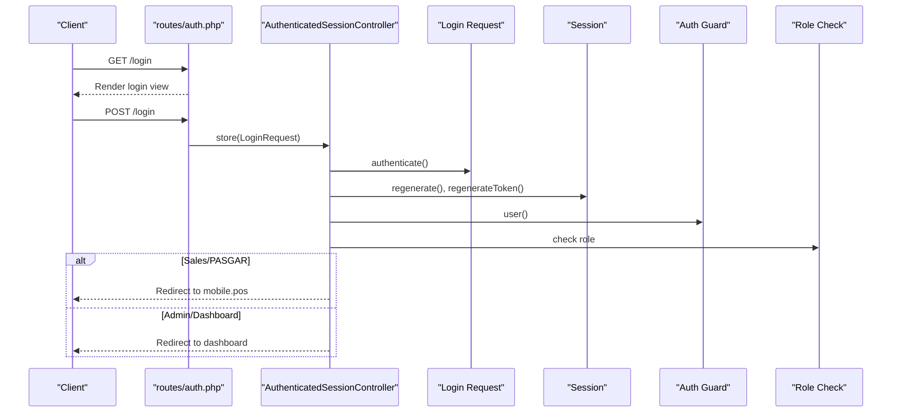

**Diagram sources**
- [auth.php:14-36](file://routes/auth.php#L14-L36)
- [AuthenticatedSessionController.php:25-38](file://app/Http/Controllers/Auth/AuthenticatedSessionController.php#L25-L38)

**Section sources**
- [auth.php:14-36](file://routes/auth.php#L14-L36)
- [AuthenticatedSessionController.php:17-38](file://app/Http/Controllers/Auth/AuthenticatedSessionController.php#L17-L38)

## Detailed Component Analysis

### Session Login and Logout
- Login view rendering and submission handled by AuthenticatedSessionController.
- On successful authentication, session is regenerated and CSRF token is refreshed.
- Role-aware redirection: sales/pasgar roles go to mobile POS; others to dashboard.
- Logout invalidates session, regenerates CSRF token, and clears guard state.

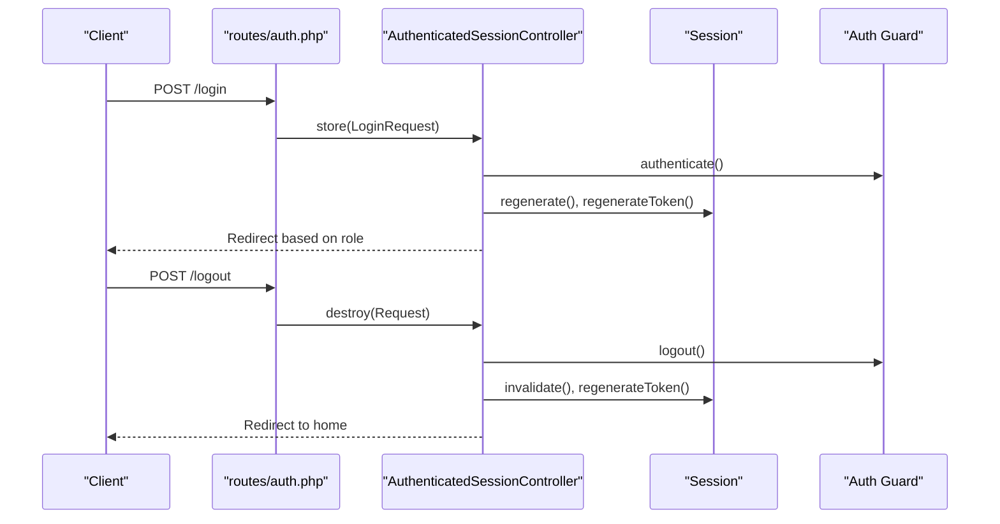

**Diagram sources**
- [auth.php:18-21](file://routes/auth.php#L18-L21)
- [auth.php:57-58](file://routes/auth.php#L57-L58)
- [AuthenticatedSessionController.php:25-52](file://app/Http/Controllers/Auth/AuthenticatedSessionController.php#L25-L52)

**Section sources**
- [AuthenticatedSessionController.php:17-52](file://app/Http/Controllers/Auth/AuthenticatedSessionController.php#L17-L52)
- [auth.php:18-21](file://routes/auth.php#L18-L21)
- [auth.php:57-58](file://routes/auth.php#L57-L58)

### OTP-Based Password Reset
- Request OTP: validates email, generates a 6-digit code, stores a hashed token with creation timestamp, and emails the OTP.
- Submit OTP: validates email, OTP length, and password policy; verifies token hash and expiry; updates user password and clears token.
- Throttling: requests throttled to 6/minute; OTP submissions throttled to 10/minute.

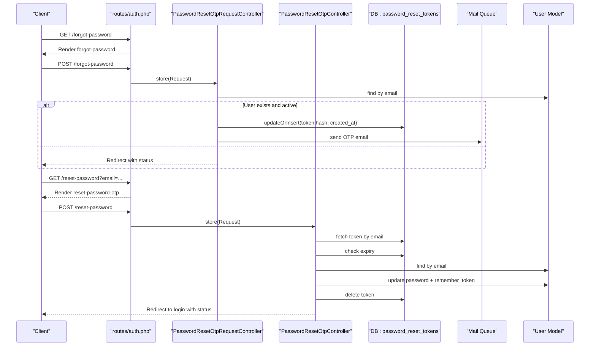

**Diagram sources**
- [auth.php:23-35](file://routes/auth.php#L23-L35)
- [PasswordResetOtpRequestController.php:22-49](file://app/Http/Controllers/Auth/PasswordResetOtpRequestController.php#L22-L49)
- [PasswordResetOtpController.php:27-69](file://app/Http/Controllers/Auth/PasswordResetOtpController.php#L27-L69)

**Section sources**
- [PasswordResetOtpRequestController.php:17-49](file://app/Http/Controllers/Auth/PasswordResetOtpRequestController.php#L17-L49)
- [PasswordResetOtpController.php:20-69](file://app/Http/Controllers/Auth/PasswordResetOtpController.php#L20-L69)
- [auth.php:27-35](file://routes/auth.php#L27-L35)

### Token-Based Password Reset (Traditional)
- Renders reset view with token from email.
- Validates token, email, and password policy.
- Uses Password facade to reset; emits PasswordReset event; redirects on success.

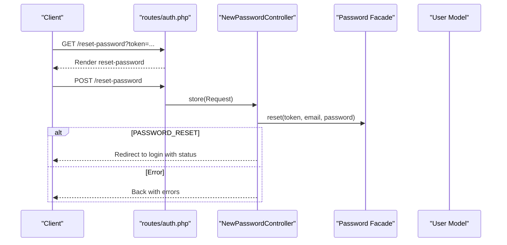

**Diagram sources**
- [auth.php:30-35](file://routes/auth.php#L30-L35)
- [NewPasswordController.php:31-61](file://app/Http/Controllers/Auth/NewPasswordController.php#L31-L61)

**Section sources**
- [NewPasswordController.php:21-61](file://app/Http/Controllers/Auth/NewPasswordController.php#L21-L61)
- [auth.php:30-35](file://routes/auth.php#L30-L35)

### Email Verification
- Verification prompt and resend notification routes.
- Signed verification route with throttle; marks email as verified and fires Verified event.

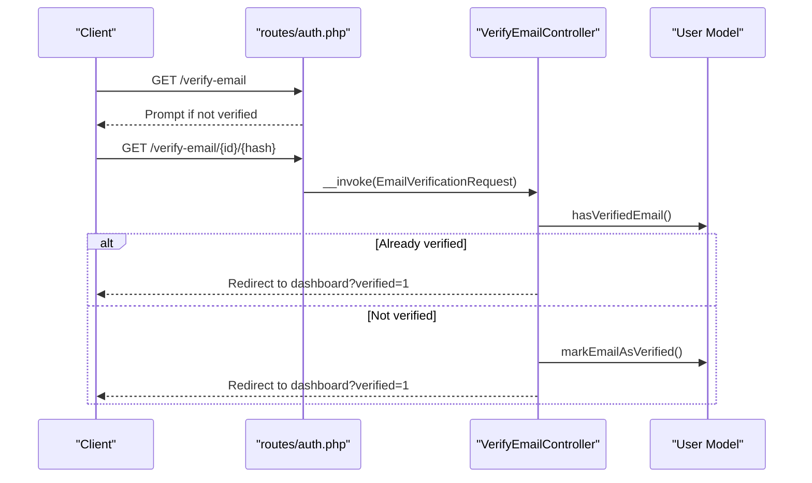

**Diagram sources**
- [auth.php:39-48](file://routes/auth.php#L39-L48)
- [VerifyEmailController.php:15-26](file://app/Http/Controllers/Auth/VerifyEmailController.php#L15-L26)

**Section sources**
- [VerifyEmailController.php:10-27](file://app/Http/Controllers/Auth/VerifyEmailController.php#L10-L27)
- [auth.php:39-48](file://routes/auth.php#L39-L48)

### Password Confirmation
- Re-confirms user password via web guard validation.
- Stores confirmation timestamp in session for subsequent sensitive operations.

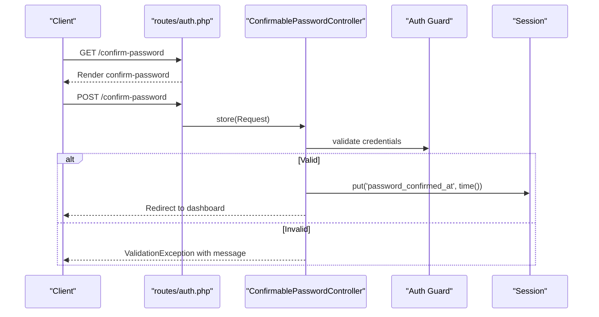

**Diagram sources**
- [auth.php:50-53](file://routes/auth.php#L50-L53)
- [ConfirmablePasswordController.php:25-39](file://app/Http/Controllers/Auth/ConfirmablePasswordController.php#L25-L39)

**Section sources**
- [ConfirmablePasswordController.php:17-39](file://app/Http/Controllers/Auth/ConfirmablePasswordController.php#L17-L39)
- [auth.php:50-53](file://routes/auth.php#L50-L53)

### Registration and Approval Workflow
- Registration form renders selectable roles (excluding supervisor/pending).
- Creates user with role=pending, active=false, and sends approval emails to supervisors.
- Subsequent approval flow is outside the scope of this document but supported by user fields for approvals.

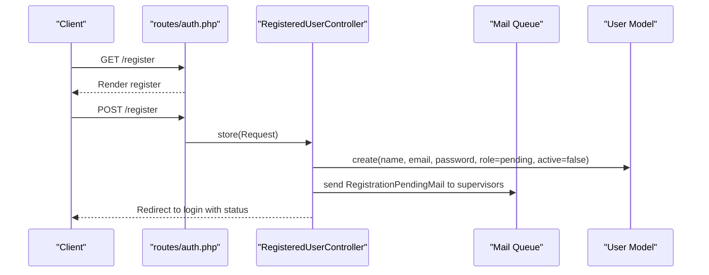

**Diagram sources**
- [auth.php:14-16](file://routes/auth.php#L14-L16)
- [RegisteredUserController.php:47-86](file://app/Http/Controllers/Auth/RegisteredUserController.php#L47-L86)

**Section sources**
- [RegisteredUserController.php:22-86](file://app/Http/Controllers/Auth/RegisteredUserController.php#L22-L86)
- [auth.php:14-16](file://routes/auth.php#L14-L16)

### Sanctum Configuration and API Token Handling
- Sanctum configuration defines stateful domains, guard, expiration, token prefix, and middleware stack.
- The User model uses HasApiTokens, enabling personal access tokens and session authentication.

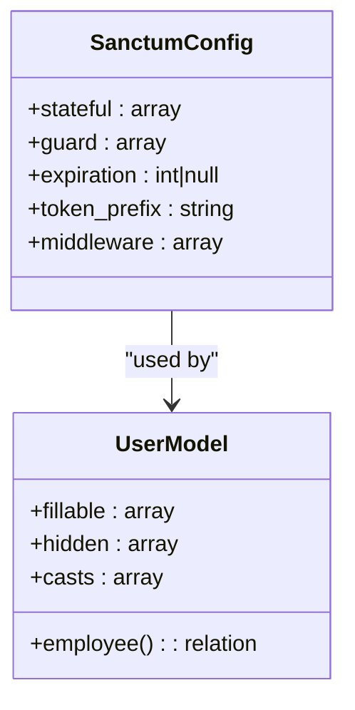

**Diagram sources**
- [sanctum.php:18-82](file://config/sanctum.php#L18-L82)
- [User.php:14-135](file://app/Models/User.php#L14-L135)

**Section sources**
- [sanctum.php:1-85](file://config/sanctum.php#L1-L85)
- [User.php:14-135](file://app/Models/User.php#L14-L135)

### Security Measures: Rate Limiting and Brute Force Protection
- Throttling applied to:
  - Forgot-password requests: 6 per minute.
  - Reset-password OTP submissions: 10 per minute.
  - Email verification links: signed with throttle window.
- EnsureUserIsActive middleware rejects inactive users and revokes tokens for JSON requests.

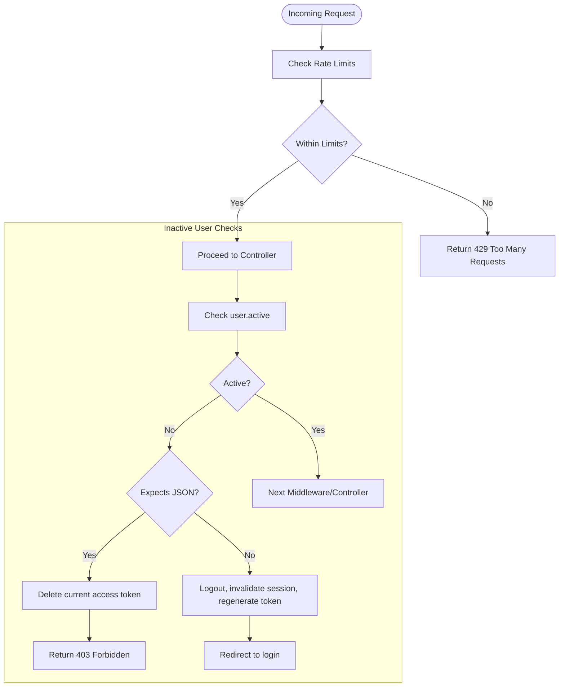

**Diagram sources**
- [auth.php:27-35](file://routes/auth.php#L27-L35)
- [auth.php:43-44](file://routes/auth.php#L43-L44)
- [EnsureUserIsActive.php:12-45](file://app/Http/Middleware/EnsureUserIsActive.php#L12-L45)

**Section sources**
- [auth.php:27-35](file://routes/auth.php#L27-L35)
- [auth.php:43-44](file://routes/auth.php#L43-L44)
- [EnsureUserIsActive.php:12-45](file://app/Http/Middleware/EnsureUserIsActive.php#L12-L45)

### Practical Examples

#### Login Flow
- Navigate to login page, submit credentials, regenerate session, redirect based on role.

**Section sources**
- [AuthenticatedSessionController.php:25-38](file://app/Http/Controllers/Auth/AuthenticatedSessionController.php#L25-L38)
- [login.blade.php](file://resources/views/auth/login.blade.php)

#### Logout Flow
- POST to logout endpoint, invalidate session, regenerate CSRF token, redirect home.

**Section sources**
- [AuthenticatedSessionController.php:43-52](file://app/Http/Controllers/Auth/AuthenticatedSessionController.php#L43-L52)
- [auth.php:57-58](file://routes/auth.php#L57-L58)

#### OTP Password Reset
- Request OTP, receive email, submit OTP+new password, redirect to login.

**Section sources**
- [PasswordResetOtpRequestController.php:22-49](file://app/Http/Controllers/Auth/PasswordResetOtpRequestController.php#L22-L49)
- [PasswordResetOtpController.php:27-69](file://app/Http/Controllers/Auth/PasswordResetOtpController.php#L27-L69)
- [reset-password-otp.blade.php](file://resources/views/auth/reset-password-otp.blade.php)
- [forgot-password.blade.php](file://resources/views/auth/forgot-password.blade.php)

#### Token-Based Password Reset
- Open reset link from email, enter new password, submit, redirect to login.

**Section sources**
- [NewPasswordController.php:31-61](file://app/Http/Controllers/Auth/NewPasswordController.php#L31-L61)
- [reset-password.blade.php](file://resources/views/auth/reset-password.blade.php)

#### Email Verification
- Click verification link, mark as verified, redirect to dashboard.

**Section sources**
- [VerifyEmailController.php:15-26](file://app/Http/Controllers/Auth/VerifyEmailController.php#L15-L26)
- [verify-email.blade.php](file://resources/views/auth/verify-email.blade.php)

#### Password Confirmation
- Re-enter password to confirm, store timestamp in session.

**Section sources**
- [ConfirmablePasswordController.php:25-39](file://app/Http/Controllers/Auth/ConfirmablePasswordController.php#L25-L39)
- [confirm-password.blade.php](file://resources/views/auth/confirm-password.blade.php)

#### Registration and Approval
- Register with role selection, pending approval, supervisor notification.

**Section sources**
- [RegisteredUserController.php:47-86](file://app/Http/Controllers/Auth/RegisteredUserController.php#L47-L86)
- [register.blade.php](file://resources/views/auth/register.blade.php)

### Biometric Fingerprint Integration for Attendance and Registration Approval
- User model includes fingerprint_id field.
- Attendance table tracks fingerprints, selfie paths, and optional minutes fields.
- Store settings include fingerprint IP and SDM work end time.
- Registration approval fields exist on users for supervisor review.

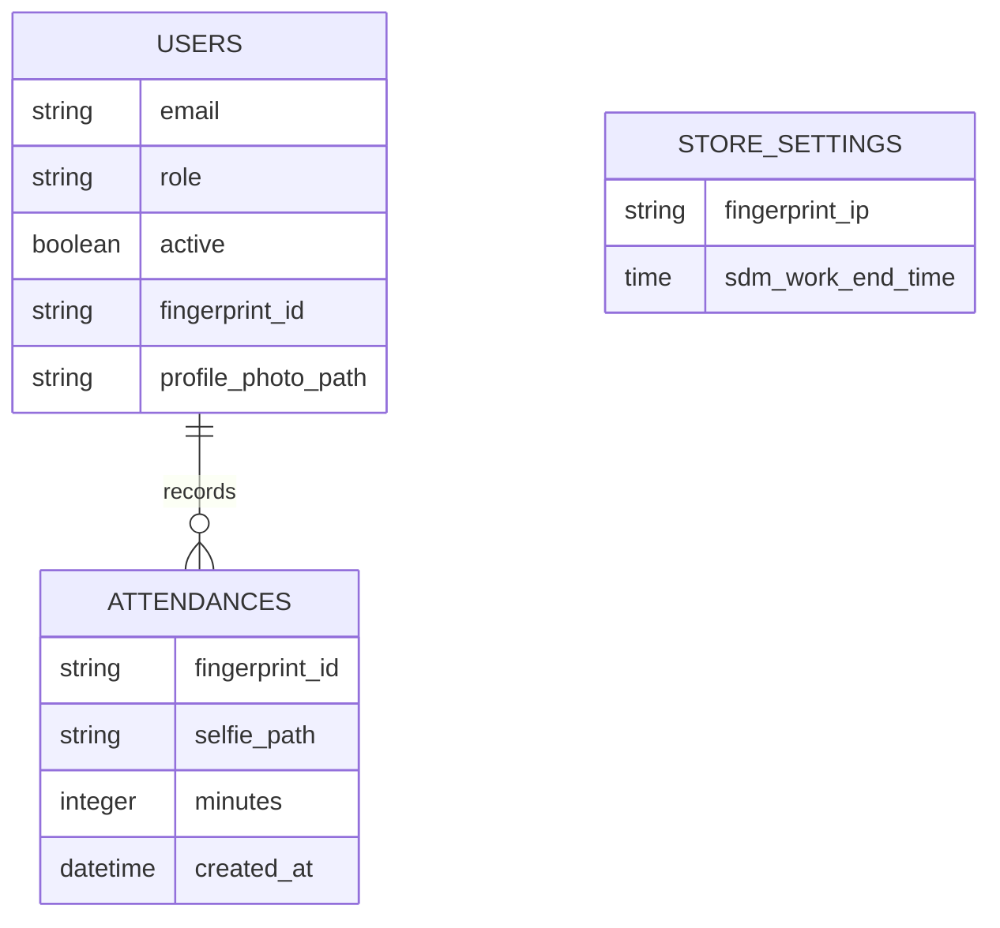

**Diagram sources**
- [User.php:33-48](file://app/Models/User.php#L33-L48)
- [2026_03_08_022151_create_attendances_table.php](file://database/migrations/2026_03_08_022151_create_attendances_table.php)
- [2026_03_08_023248_add_fingerprint_ip_to_store_settings_table.php](file://database/migrations/2026_03_08_023248_add_fingerprint_ip_to_store_settings_table.php)
- [2026_03_12_130000_add_registration_approval_fields_to_users_table.php](file://database/migrations/2026_03_12_130000_add_registration_approval_fields_to_users_table.php)
- [2026_03_13_120000_add_nik_and_profile_photo_to_users_table.php](file://database/migrations/2026_03_13_120000_add_nik_and_profile_photo_to_users_table.php)
- [2026_03_13_130000_add_selfie_paths_to_attendances_table.php](file://database/migrations/2026_03_13_130000_add_selfie_paths_to_attendances_table.php)
- [2026_03_13_140000_add_sdm_work_end_time_to_store_settings_table.php](file://database/migrations/2026_03_13_140000_add_sdm_work_end_time_to_store_settings_table.php)

**Section sources**
- [User.php:46-47](file://app/Models/User.php#L46-L47)
- [2026_03_08_022151_create_attendances_table.php](file://database/migrations/2026_03_08_022151_create_attendances_table.php)
- [2026_03_08_023248_add_fingerprint_ip_to_store_settings_table.php](file://database/migrations/2026_03_08_023248_add_fingerprint_ip_to_store_settings_table.php)
- [2026_03_12_130000_add_registration_approval_fields_to_users_table.php](file://database/migrations/2026_03_12_130000_add_registration_approval_fields_to_users_table.php)
- [2026_03_13_120000_add_nik_and_profile_photo_to_users_table.php](file://database/migrations/2026_03_13_120000_add_nik_and_profile_photo_to_users_table.php)
- [2026_03_13_130000_add_selfie_paths_to_attendances_table.php](file://database/migrations/2026_03_13_130000_add_selfie_paths_to_attendances_table.php)
- [2026_03_13_140000_add_sdm_work_end_time_to_store_settings_table.php](file://database/migrations/2026_03_13_140000_add_sdm_work_end_time_to_store_settings_table.php)

## Dependency Analysis
- Controllers depend on:
  - Illuminate\Http\Request and RedirectResponse for request handling.
  - Illuminate\Support\Facades\Auth, Password, Hash, Str, Mail for authentication, password resets, hashing, tokens, and email.
  - App\Models\User for user operations.
  - Database tables for OTP tokens and attendance.
- Routes depend on middleware groups and throttle definitions.
- Middleware depends on request user and access tokens.

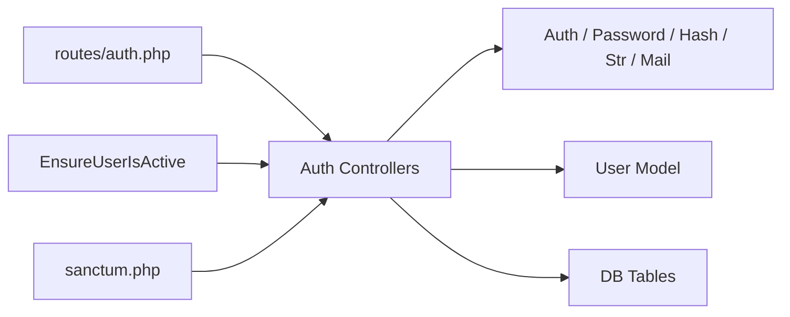

**Diagram sources**
- [auth.php:1-60](file://routes/auth.php#L1-L60)
- [AuthenticatedSessionController.php:1-54](file://app/Http/Controllers/Auth/AuthenticatedSessionController.php#L1-L54)
- [PasswordResetOtpRequestController.php:1-51](file://app/Http/Controllers/Auth/PasswordResetOtpRequestController.php#L1-L51)
- [PasswordResetOtpController.php:1-71](file://app/Http/Controllers/Auth/PasswordResetOtpController.php#L1-L71)
- [NewPasswordController.php:1-63](file://app/Http/Controllers/Auth/NewPasswordController.php#L1-L63)
- [VerifyEmailController.php:1-28](file://app/Http/Controllers/Auth/VerifyEmailController.php#L1-L28)
- [ConfirmablePasswordController.php:1-41](file://app/Http/Controllers/Auth/ConfirmablePasswordController.php#L1-L41)
- [RegisteredUserController.php:1-88](file://app/Http/Controllers/Auth/RegisteredUserController.php#L1-L88)
- [EnsureUserIsActive.php:1-47](file://app/Http/Middleware/EnsureUserIsActive.php#L1-L47)
- [sanctum.php:1-85](file://config/sanctum.php#L1-L85)

**Section sources**
- [auth.php:1-60](file://routes/auth.php#L1-L60)
- [sanctum.php:1-85](file://config/sanctum.php#L1-L85)

## Performance Considerations
- Prefer hashed OTP tokens and short expiry windows to reduce database load.
- Use signed email verification URLs with throttle to minimize replay attempts.
- Sanctum expiration set to null implies long-lived tokens; consider setting a finite expiration for stricter security.
- Keep stateful domains minimal to reduce cookie overhead.
- Ensure database indexes exist on frequently queried columns (e.g., users.email, password_reset_tokens.email) to optimize lookups.

## Troubleshooting Guide
- OTP not working:
  - Verify token exists and is unexpired.
  - Ensure OTP matches hashed token.
  - Confirm user exists and is active.
- Password reset link not received:
  - Check mail configuration and queue worker.
  - Ensure user is active (inactive users are blocked).
- Verification link invalid:
  - Confirm signed URL and throttle window.
  - Ensure email is not already verified.
- Account disabled:
  - Inactive users receive 403 for JSON or are logged out for web.
  - Tokens are revoked for JSON requests.

**Section sources**
- [PasswordResetOtpController.php:38-59](file://app/Http/Controllers/Auth/PasswordResetOtpController.php#L38-L59)
- [PasswordResetLinkController.php:32-36](file://app/Http/Controllers/Auth/PasswordResetLinkController.php#L32-L36)
- [VerifyEmailController.php:17-25](file://app/Http/Controllers/Auth/VerifyEmailController.php#L17-L25)
- [EnsureUserIsActive.php:27-42](file://app/Http/Middleware/EnsureUserIsActive.php#L27-L42)

## Conclusion
DODPOS employs a robust, layered authentication system combining session-based login, Sanctum API tokens, OTP-based password resets, email verification, and password confirmation. Built-in throttling and active-user enforcement mitigate brute-force risks. The system supports biometric fingerprint integration for attendance and registration approval workflows, aligning with HR and operational needs.

## Appendices
- Additional migrations related to HR/payroll and stock operations are present and do not alter authentication core but support broader business workflows.