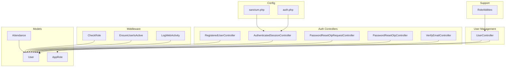
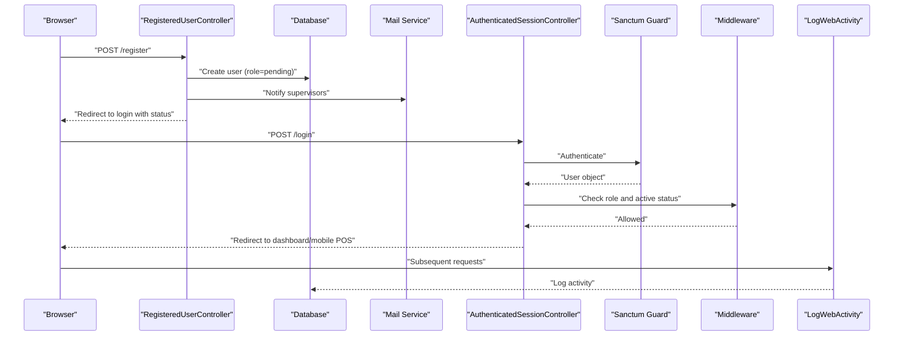
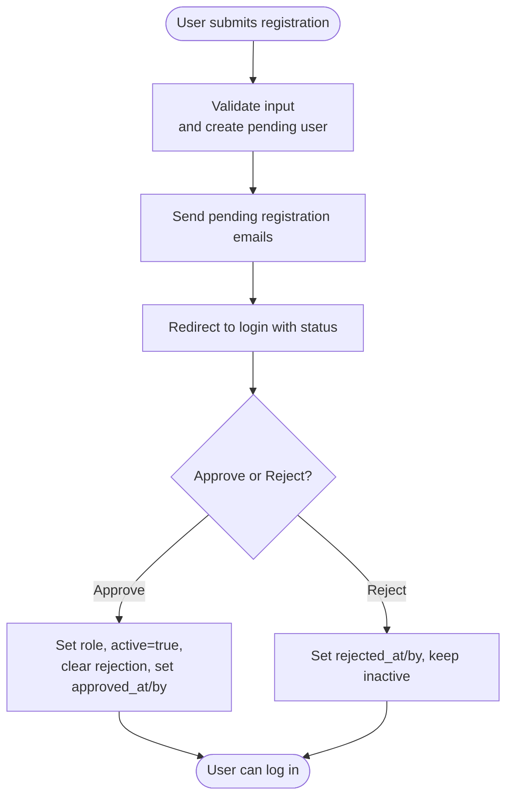
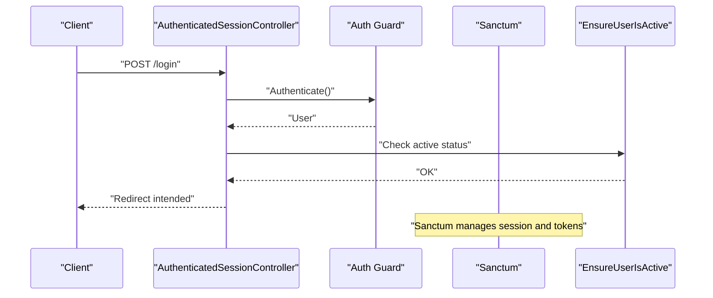
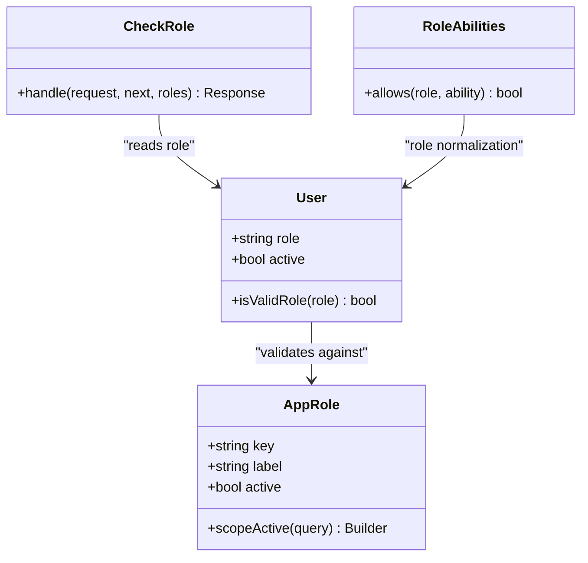
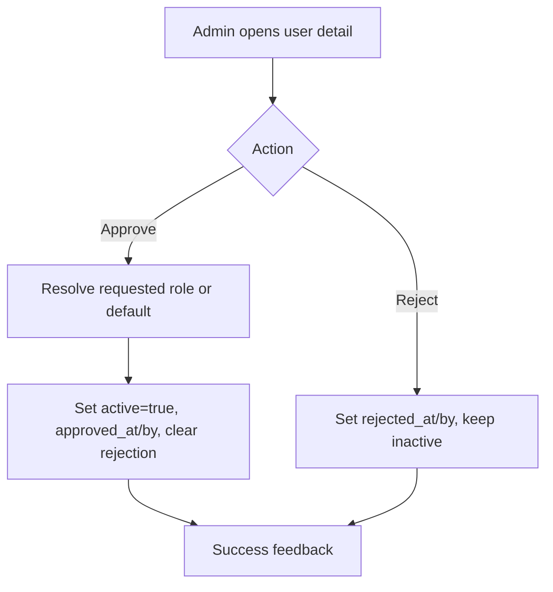
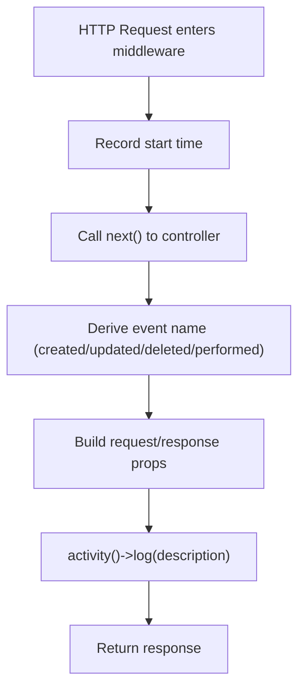
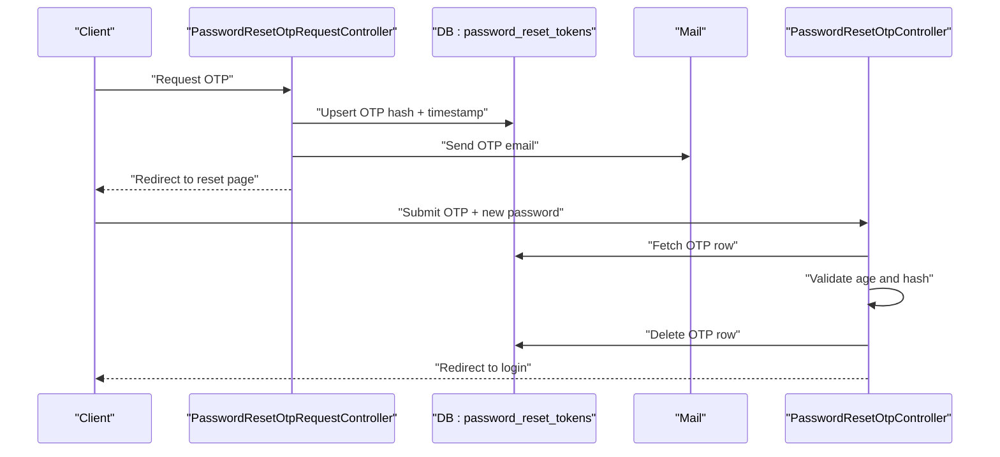
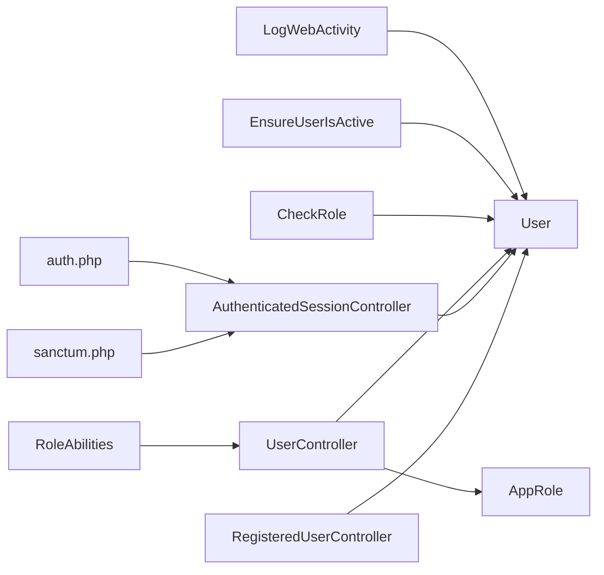

# User Management & Authentication

<cite>
**Referenced Files in This Document**
- [AppRole.php](file://app/Models/AppRole.php)
- [User.php](file://app/Models/User.php)
- [RegisteredUserController.php](file://app/Http/Controllers/Auth/RegisteredUserController.php)
- [AuthenticatedSessionController.php](file://app/Http/Controllers/Auth/AuthenticatedSessionController.php)
- [PasswordResetOtpRequestController.php](file://app/Http/Controllers/Auth/PasswordResetOtpRequestController.php)
- [PasswordResetOtpController.php](file://app/Http/Controllers/Auth/PasswordResetOtpController.php)
- [VerifyEmailController.php](file://app/Http/Controllers/Auth/VerifyEmailController.php)
- [UserController.php](file://app/Http/Controllers/UserController.php)
- [CheckRole.php](file://app/Http/Middleware/CheckRole.php)
- [EnsureUserIsActive.php](file://app/Http/Middleware/EnsureUserIsActive.php)
- [LogWebActivity.php](file://app/Http/Middleware/LogWebActivity.php)
- [RoleAbilities.php](file://app/Support/RoleAbilities.php)
- [sanctum.php](file://config/sanctum.php)
- [auth.php](file://config/auth.php)
- [Attendance.php](file://app/Models/Attendance.php)
</cite>

## Table of Contents
1. [Introduction](#introduction)
2. [Project Structure](#project-structure)
3. [Core Components](#core-components)
4. [Architecture Overview](#architecture-overview)
5. [Detailed Component Analysis](#detailed-component-analysis)
6. [Dependency Analysis](#dependency-analysis)
7. [Performance Considerations](#performance-considerations)
8. [Troubleshooting Guide](#troubleshooting-guide)
9. [Conclusion](#conclusion)
10. [Appendices](#appendices)

## Introduction
This document explains DODPOS’s user management and authentication system with a focus on role-based access control (RBAC). It covers:
- User registration workflow and approval gating
- Authentication using Laravel Sanctum for API and session-based flows
- A 15+ role system with dynamic permissions and ability checks
- User activation and registration approval
- Activity logging for all user actions
- Middleware integration for access control
- Practical examples for role assignments, permission configurations, and user management operations
- Security considerations, password reset via OTP, email verification, and biometric fingerprint integration for attendance tracking

## Project Structure
Key areas involved in user management and authentication:
- Models: User, AppRole, Attendance
- Controllers: Auth controllers for registration, login, password reset, email verification; UserController for admin-managed user lifecycle
- Middleware: Role checking, activity logging, and active-user enforcement
- Support: RoleAbilities for ability-based authorization
- Configurations: Sanctum and auth guards

**Diagram sources**
- [RegisteredUserController.php:1-88](file://app/Http/Controllers/Auth/RegisteredUserController.php#L1-L88)
- [AuthenticatedSessionController.php:1-54](file://app/Http/Controllers/Auth/AuthenticatedSessionController.php#L1-L54)
- [PasswordResetOtpRequestController.php:1-51](file://app/Http/Controllers/Auth/PasswordResetOtpRequestController.php#L1-L51)
- [PasswordResetOtpController.php:1-71](file://app/Http/Controllers/Auth/PasswordResetOtpController.php#L1-L71)
- [VerifyEmailController.php:1-28](file://app/Http/Controllers/Auth/VerifyEmailController.php#L1-L28)
- [UserController.php:1-248](file://app/Http/Controllers/UserController.php#L1-L248)
- [CheckRole.php:1-75](file://app/Http/Middleware/CheckRole.php#L1-L75)
- [EnsureUserIsActive.php:1-47](file://app/Http/Middleware/EnsureUserIsActive.php#L1-L47)
- [LogWebActivity.php:1-194](file://app/Http/Middleware/LogWebActivity.php#L1-L194)
- [User.php:1-135](file://app/Models/User.php#L1-L135)
- [AppRole.php:1-31](file://app/Models/AppRole.php#L1-L31)
- [Attendance.php:1-20](file://app/Models/Attendance.php#L1-L20)
- [RoleAbilities.php:1-173](file://app/Support/RoleAbilities.php#L1-L173)
- [sanctum.php:1-85](file://config/sanctum.php#L1-L85)
- [auth.php:1-116](file://config/auth.php#L1-L116)

**Section sources**
- [User.php:1-135](file://app/Models/User.php#L1-L135)
- [AppRole.php:1-31](file://app/Models/AppRole.php#L1-L31)
- [RegisteredUserController.php:1-88](file://app/Http/Controllers/Auth/RegisteredUserController.php#L1-L88)
- [AuthenticatedSessionController.php:1-54](file://app/Http/Controllers/Auth/AuthenticatedSessionController.php#L1-L54)
- [UserController.php:1-248](file://app/Http/Controllers/UserController.php#L1-L248)
- [CheckRole.php:1-75](file://app/Http/Middleware/CheckRole.php#L1-L75)
- [EnsureUserIsActive.php:1-47](file://app/Http/Middleware/EnsureUserIsActive.php#L1-L47)
- [LogWebActivity.php:1-194](file://app/Http/Middleware/LogWebActivity.php#L1-L194)
- [RoleAbilities.php:1-173](file://app/Support/RoleAbilities.php#L1-L173)
- [sanctum.php:1-85](file://config/sanctum.php#L1-L85)
- [auth.php:1-116](file://config/auth.php#L1-L116)
- [Attendance.php:1-20](file://app/Models/Attendance.php#L1-L20)

## Core Components
- User model with role validation, activity logging, and employee relationship
- AppRole model for dynamic role definitions and active filtering
- Auth controllers for registration, login, password reset (OTP), and email verification
- UserController for admin-managed user CRUD, approvals, and activations
- Middleware for role checks, active-user enforcement, and web activity logging
- RoleAbilities for ability-based authorization decisions
- Sanctum configuration for API/session authentication

**Section sources**
- [User.php:76-134](file://app/Models/User.php#L76-L134)
- [AppRole.php:10-30](file://app/Models/AppRole.php#L10-L30)
- [RegisteredUserController.php:47-86](file://app/Http/Controllers/Auth/RegisteredUserController.php#L47-L86)
- [AuthenticatedSessionController.php:25-38](file://app/Http/Controllers/Auth/AuthenticatedSessionController.php#L25-L38)
- [PasswordResetOtpRequestController.php:22-49](file://app/Http/Controllers/Auth/PasswordResetOtpRequestController.php#L22-L49)
- [PasswordResetOtpController.php:27-69](file://app/Http/Controllers/Auth/PasswordResetOtpController.php#L27-L69)
- [VerifyEmailController.php:15-26](file://app/Http/Controllers/Auth/VerifyEmailController.php#L15-L26)
- [UserController.php:196-246](file://app/Http/Controllers/UserController.php#L196-L246)
- [CheckRole.php:17-73](file://app/Http/Middleware/CheckRole.php#L17-L73)
- [EnsureUserIsActive.php:12-45](file://app/Http/Middleware/EnsureUserIsActive.php#L12-L45)
- [LogWebActivity.php:14-94](file://app/Http/Middleware/LogWebActivity.php#L14-L94)
- [RoleAbilities.php:7-171](file://app/Support/RoleAbilities.php#L7-L171)
- [sanctum.php:18-82](file://config/sanctum.php#L18-L82)
- [auth.php:38-113](file://config/auth.php#L38-L113)

## Architecture Overview
End-to-end authentication and RBAC architecture:
- Registration creates a pending user and notifies supervisors
- Login validates credentials and redirects based on role
- Sanctum manages session and token-based authentication
- Middleware enforces active status and role-based access
- Activity logging captures significant web actions
- Ability checks delegate to RoleAbilities for granular permissions
- Attendance integrates fingerprint IDs for time and presence tracking

**Diagram sources**
- [RegisteredUserController.php:47-86](file://app/Http/Controllers/Auth/RegisteredUserController.php#L47-L86)
- [AuthenticatedSessionController.php:25-38](file://app/Http/Controllers/Auth/AuthenticatedSessionController.php#L25-L38)
- [CheckRole.php:17-73](file://app/Http/Middleware/CheckRole.php#L17-L73)
- [EnsureUserIsActive.php:12-45](file://app/Http/Middleware/EnsureUserIsActive.php#L12-L45)
- [LogWebActivity.php:14-94](file://app/Http/Middleware/LogWebActivity.php#L14-L94)
- [sanctum.php:37-37](file://config/sanctum.php#L37-L37)

## Detailed Component Analysis

### User Registration Workflow and Approval
- Registration form posts to RegisteredUserController, validating name, email uniqueness, and password strength. The new user is saved with role set to pending and active disabled.
- Supervisor emails are fetched from environment and notified via RegistrationPendingMail.
- Approval flow is handled by UserController’s approve/reject actions, which set approved_at/approved_by or rejected_at/rejected_by and activate the user accordingly.

**Diagram sources**
- [RegisteredUserController.php:47-86](file://app/Http/Controllers/Auth/RegisteredUserController.php#L47-L86)
- [UserController.php:196-246](file://app/Http/Controllers/UserController.php#L196-L246)

**Section sources**
- [RegisteredUserController.php:47-86](file://app/Http/Controllers/Auth/RegisteredUserController.php#L47-L86)
- [UserController.php:196-246](file://app/Http/Controllers/UserController.php#L196-L246)

### Authentication Mechanisms Using Laravel Sanctum
- Authentication defaults to the session-based web guard.
- Sanctum configuration defines stateful domains, token expiration, and middleware stack for session authentication.
- AuthenticatedSessionController handles login, session regeneration, CSRF token regeneration, and role-aware redirection to either the dashboard or mobile POS.

**Diagram sources**
- [AuthenticatedSessionController.php:25-38](file://app/Http/Controllers/Auth/AuthenticatedSessionController.php#L25-L38)
- [EnsureUserIsActive.php:12-45](file://app/Http/Middleware/EnsureUserIsActive.php#L12-L45)
- [sanctum.php:18-82](file://config/sanctum.php#L18-L82)
- [auth.php:38-42](file://config/auth.php#L38-L42)

**Section sources**
- [AuthenticatedSessionController.php:25-38](file://app/Http/Controllers/Auth/AuthenticatedSessionController.php#L25-L38)
- [sanctum.php:18-82](file://config/sanctum.php#L18-L82)
- [auth.php:16-18](file://config/auth.php#L16-L18)

### Role-Based Access Control and Dynamic Permissions
- Roles are validated against AppRole (active roles) or a fallback list in User::ROLES.
- Ability-based authorization is centralized in RoleAbilities, which evaluates permissions per role and ability string.
- Middleware CheckRole enforces role constraints on routes, supporting comma or pipe-separated role lists and returning JSON for API or HTML for web.

**Diagram sources**
- [User.php:94-128](file://app/Models/User.php#L94-L128)
- [AppRole.php:12-29](file://app/Models/AppRole.php#L12-L29)
- [RoleAbilities.php:7-171](file://app/Support/RoleAbilities.php#L7-L171)
- [CheckRole.php:17-73](file://app/Http/Middleware/CheckRole.php#L17-L73)

**Section sources**
- [User.php:76-128](file://app/Models/User.php#L76-L128)
- [AppRole.php:12-29](file://app/Models/AppRole.php#L12-L29)
- [RoleAbilities.php:7-171](file://app/Support/RoleAbilities.php#L7-L171)
- [CheckRole.php:17-73](file://app/Http/Middleware/CheckRole.php#L17-L73)

### User Activation Workflows
- UserController supports approving or rejecting pending users. Approval resolves requested role if valid, otherwise assigns a default active role. Rejection sets rejection timestamps and keeps the user inactive.

**Diagram sources**
- [UserController.php:196-246](file://app/Http/Controllers/UserController.php#L196-L246)

**Section sources**
- [UserController.php:196-246](file://app/Http/Controllers/UserController.php#L196-L246)

### Activity Logging for All User Actions
- LogWebActivity middleware measures request duration and response outcomes, determines event names based on HTTP method or route hints, and logs structured properties while excluding sensitive fields.
- User model uses Spatie Activitylog to capture activity on fillable updates.

**Diagram sources**
- [LogWebActivity.php:14-133](file://app/Http/Middleware/LogWebActivity.php#L14-L133)
- [User.php:19-26](file://app/Models/User.php#L19-L26)

**Section sources**
- [LogWebActivity.php:14-194](file://app/Http/Middleware/LogWebActivity.php#L14-L194)
- [User.php:19-26](file://app/Models/User.php#L19-L26)

### Password Reset Processes (OTP)
- PasswordResetOtpRequestController validates email and stores a hashed OTP with creation timestamp, then emails the OTP.
- PasswordResetOtpController verifies OTP freshness and validity, resets the password, and clears the OTP record.

**Diagram sources**
- [PasswordResetOtpRequestController.php:22-49](file://app/Http/Controllers/Auth/PasswordResetOtpRequestController.php#L22-L49)
- [PasswordResetOtpController.php:27-69](file://app/Http/Controllers/Auth/PasswordResetOtpController.php#L27-L69)

**Section sources**
- [PasswordResetOtpRequestController.php:22-49](file://app/Http/Controllers/Auth/PasswordResetOtpRequestController.php#L22-L49)
- [PasswordResetOtpController.php:27-69](file://app/Http/Controllers/Auth/PasswordResetOtpController.php#L27-L69)

### Email Verification
- VerifyEmailController marks the authenticated user’s email as verified and emits a Verified event, then redirects to the dashboard with a verified flag.

**Section sources**
- [VerifyEmailController.php:15-26](file://app/Http/Controllers/Auth/VerifyEmailController.php#L15-L26)

### Biometric Fingerprint Integration for Attendance Tracking
- Users have a fingerprint_id field; Attendance model relates attendance records to users and can be extended to link to employees.
- Attendance selfies are stored under storage/app/public/attendance-selfies.

**Section sources**
- [User.php:46-46](file://app/Models/User.php#L46-L46)
- [Attendance.php:14-18](file://app/Models/Attendance.php#L14-L18)

### Middleware Integration for Access Control
- EnsureUserIsActive blocks inactive users and invalidates tokens for API requests.
- CheckRole enforces role constraints with support for multiple roles and pipe-separated lists.
- LogWebActivity logs significant web actions after the request completes.

**Section sources**
- [EnsureUserIsActive.php:12-45](file://app/Http/Middleware/EnsureUserIsActive.php#L12-L45)
- [CheckRole.php:17-73](file://app/Http/Middleware/CheckRole.php#L17-L73)
- [LogWebActivity.php:14-94](file://app/Http/Middleware/LogWebActivity.php#L14-L94)

### Practical Examples
- Role assignment during admin creation:
  - Use UserController@store to create a user with a selected role from active AppRole keys or the fallback list.
- Permission configuration:
  - Define abilities in RoleAbilities::allows and gate them via middleware or controller checks.
- User management operations:
  - Approve or reject pending users via UserController@approve/@reject.
  - Update user profiles, roles, and activation status via UserController@update.

**Section sources**
- [UserController.php:90-122](file://app/Http/Controllers/UserController.php#L90-L122)
- [UserController.php:144-183](file://app/Http/Controllers/UserController.php#L144-L183)
- [UserController.php:196-246](file://app/Http/Controllers/UserController.php#L196-L246)
- [RoleAbilities.php:7-171](file://app/Support/RoleAbilities.php#L7-L171)

## Dependency Analysis
- Controllers depend on models and support classes for validation, authorization, and persistence.
- Middleware depends on the current user and request context to enforce policies.
- Sanctum and auth configs define the underlying authentication mechanism.

**Diagram sources**
- [RegisteredUserController.php:1-88](file://app/Http/Controllers/Auth/RegisteredUserController.php#L1-L88)
- [AuthenticatedSessionController.php:1-54](file://app/Http/Controllers/Auth/AuthenticatedSessionController.php#L1-L54)
- [UserController.php:1-248](file://app/Http/Controllers/UserController.php#L1-L248)
- [CheckRole.php:1-75](file://app/Http/Middleware/CheckRole.php#L1-L75)
- [EnsureUserIsActive.php:1-47](file://app/Http/Middleware/EnsureUserIsActive.php#L1-L47)
- [LogWebActivity.php:1-194](file://app/Http/Middleware/LogWebActivity.php#L1-L194)
- [RoleAbilities.php:1-173](file://app/Support/RoleAbilities.php#L1-L173)
- [sanctum.php:1-85](file://config/sanctum.php#L1-L85)
- [auth.php:1-116](file://config/auth.php#L1-L116)

**Section sources**
- [User.php:1-135](file://app/Models/User.php#L1-L135)
- [AppRole.php:1-31](file://app/Models/AppRole.php#L1-L31)
- [RoleAbilities.php:1-173](file://app/Support/RoleAbilities.php#L1-L173)
- [CheckRole.php:1-75](file://app/Http/Middleware/CheckRole.php#L1-L75)
- [EnsureUserIsActive.php:1-47](file://app/Http/Middleware/EnsureUserIsActive.php#L1-L47)
- [LogWebActivity.php:1-194](file://app/Http/Middleware/LogWebActivity.php#L1-L194)
- [sanctum.php:1-85](file://config/sanctum.php#L1-L85)
- [auth.php:1-116](file://config/auth.php#L1-L116)

## Performance Considerations
- Prefer active role scoping in queries to reduce overhead.
- Limit activity log verbosity by disabling when not needed via configuration.
- Use pagination for user listings to avoid large result sets.
- Cache frequently accessed role metadata if the number of roles grows substantially.

## Troubleshooting Guide
- Login fails with unauthenticated or forbidden:
  - Ensure the user is active and not blocked by EnsureUserIsActive middleware.
  - Verify Sanctum guard and stateful domains configuration.
- Role check returns 403:
  - Confirm the user’s role matches the allowed roles list in CheckRole.
  - Check that roles are normalized (lowercase, trimmed).
- Activity logging not recorded:
  - Verify activitylog.enabled and that the request method is POST/PUT/PATCH/DELETE.
  - Ensure the subject exists in the route parameters for per-model logging.
- Password reset OTP invalid or expired:
  - Confirm OTP age and hash validation logic.
  - Ensure the OTP table is accessible and cleaned up after use.
- Email verification not working:
  - Confirm the email verification route is reachable and the user is authenticated.

**Section sources**
- [EnsureUserIsActive.php:12-45](file://app/Http/Middleware/EnsureUserIsActive.php#L12-L45)
- [CheckRole.php:17-73](file://app/Http/Middleware/CheckRole.php#L17-L73)
- [LogWebActivity.php:21-94](file://app/Http/Middleware/LogWebActivity.php#L21-L94)
- [PasswordResetOtpController.php:38-69](file://app/Http/Controllers/Auth/PasswordResetOtpController.php#L38-L69)
- [sanctum.php:18-82](file://config/sanctum.php#L18-L82)

## Conclusion
DODPOS implements a robust, extensible user management and authentication system centered on:
- A dynamic role system backed by AppRole and a fallback list in User
- Ability-based authorization via RoleAbilities
- Middleware-driven access control and activity logging
- Secure authentication using Laravel Sanctum
- Comprehensive user lifecycle management including registration, approval, activation, and password/email verification
- Biometric fingerprint integration for attendance tracking

This foundation supports secure, scalable access control across 15+ roles and enables administrators to manage users and permissions effectively.

## Appendices
- Security best practices:
  - Enforce HTTPS and secure cookie settings
  - Regularly review role and ability mappings
  - Monitor activity logs for suspicious patterns
  - Rotate secrets and review Sanctum token prefixes
- Extensibility tips:
  - Add new roles via AppRole or extend User::ROLES
  - Introduce new abilities in RoleAbilities and gate them consistently
  - Use middleware aliases for concise route protection