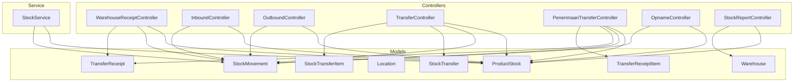
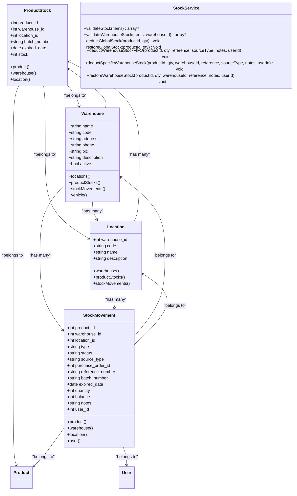
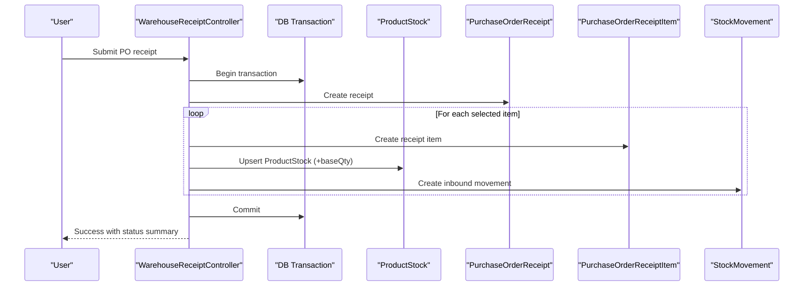
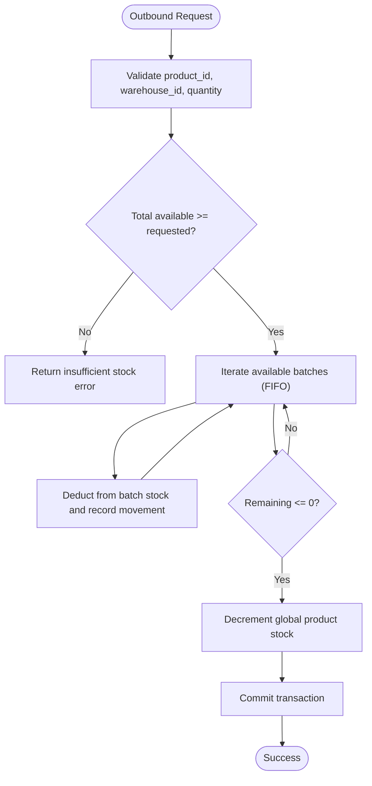
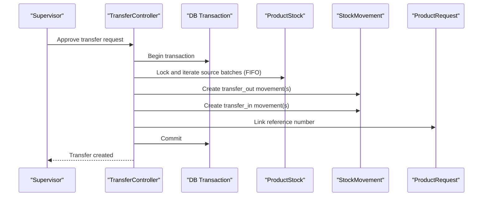
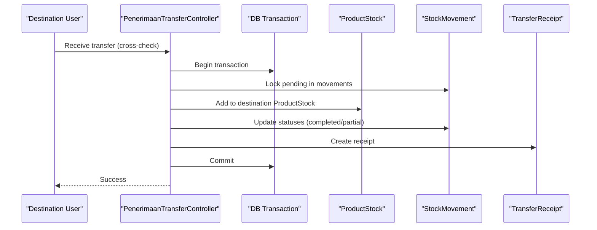
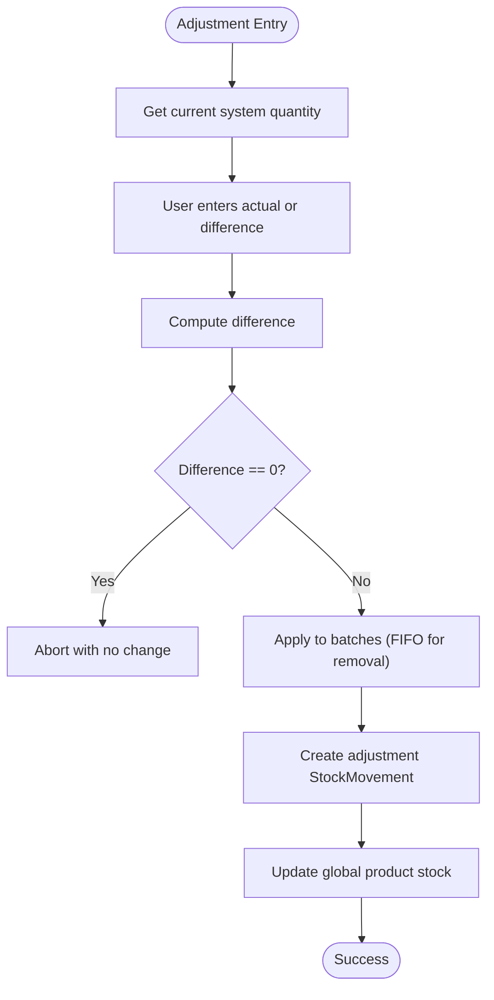
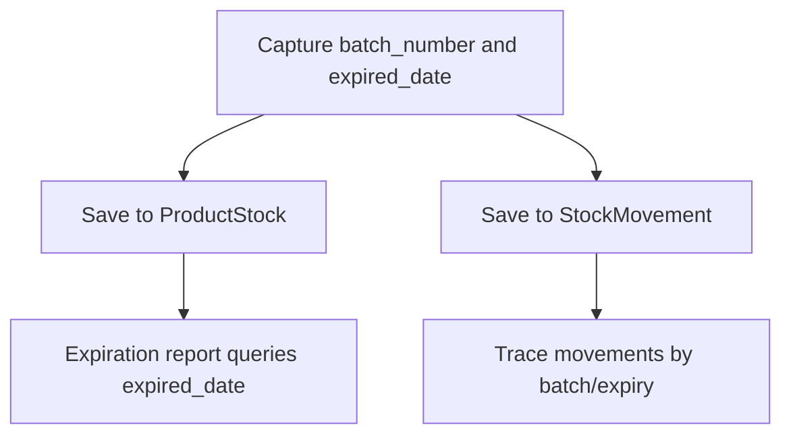
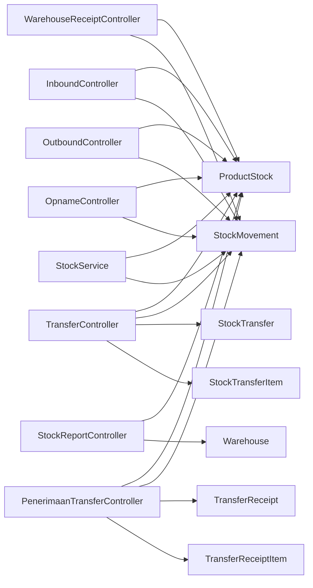
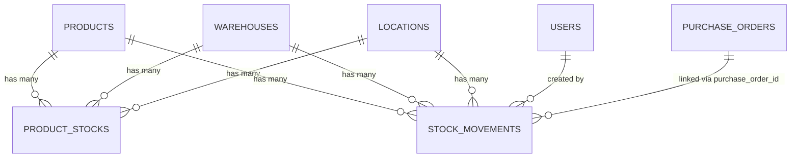

# Inventory Operations

<cite>
**Referenced Files in This Document**
- [ProductStock.php](file://app/Models/ProductStock.php)
- [StockMovement.php](file://app/Models/StockMovement.php)
- [Warehouse.php](file://app/Models/Warehouse.php)
- [Location.php](file://app/Models/Location.php)
- [StockService.php](file://app/Services/StockService.php)
- [WarehouseReceiptController.php](file://app/Http/Controllers/Gudang/WarehouseReceiptController.php)
- [InboundController.php](file://app/Http/Controllers/InboundController.php)
- [OutboundController.php](file://app/Http/Controllers/OutboundController.php)
- [TransferController.php](file://app/Http/Controllers/TransferController.php)
- [PenerimaanTransferController.php](file://app/Http/Controllers/Gudang/PenerimaanTransferController.php)
- [OpnameController.php](file://app/Http/Controllers/OpnameController.php)
- [StockReportController.php](file://app/Http/Controllers/StockReportController.php)
- [StockTransfer.php](file://app/Models/StockTransfer.php)
- [StockTransferItem.php](file://app/Models/StockTransferItem.php)
- [TransferReceipt.php](file://app/Models/TransferReceipt.php)
- [TransferReceiptItem.php](file://app/Models/TransferReceiptItem.php)
</cite>

## Table of Contents
1. [Introduction](#introduction)
2. [Project Structure](#project-structure)
3. [Core Components](#core-components)
4. [Architecture Overview](#architecture-overview)
5. [Detailed Component Analysis](#detailed-component-analysis)
6. [Dependency Analysis](#dependency-analysis)
7. [Performance Considerations](#performance-considerations)
8. [Troubleshooting Guide](#troubleshooting-guide)
9. [Conclusion](#conclusion)
10. [Appendices](#appendices)

## Introduction
This document describes the inventory operations subsystem of the POS system. It covers core inventory tracking mechanisms, stock movement processing, warehouse and location management, and real-time synchronization across inbound, outbound, transfer, and adjustment operations. It also documents integration points with procurement, sales, and manufacturing workflows, along with stock visibility, low-stock alerts, and automated reorder triggers.

## Project Structure
The inventory subsystem is implemented primarily through:
- Eloquent models representing inventory entities and their relationships
- Dedicated controllers orchestrating inbound, outbound, transfer, and stock adjustment workflows
- A centralized service for stock validation and FIFO-based deductions
- Reporting controllers for stock visibility, expirations, and low-stock alerts

**Diagram sources**
- [WarehouseReceiptController.php:1-326](file://app/Http/Controllers/Gudang/WarehouseReceiptController.php#L1-L326)
- [InboundController.php:1-174](file://app/Http/Controllers/InboundController.php#L1-L174)
- [OutboundController.php:1-208](file://app/Http/Controllers/OutboundController.php#L1-L208)
- [TransferController.php:1-406](file://app/Http/Controllers/TransferController.php#L1-L406)
- [PenerimaanTransferController.php:1-305](file://app/Http/Controllers/Gudang/PenerimaanTransferController.php#L1-L305)
- [OpnameController.php:1-317](file://app/Http/Controllers/OpnameController.php#L1-L317)
- [StockReportController.php:1-105](file://app/Http/Controllers/StockReportController.php#L1-L105)
- [StockService.php:1-251](file://app/Services/StockService.php#L1-L251)
- [ProductStock.php:1-46](file://app/Models/ProductStock.php#L1-L46)
- [StockMovement.php:1-59](file://app/Models/StockMovement.php#L1-L59)
- [Warehouse.php:1-35](file://app/Models/Warehouse.php#L1-L35)
- [Location.php:1-26](file://app/Models/Location.php#L1-L26)
- [StockTransfer.php:1-86](file://app/Models/StockTransfer.php#L1-L86)
- [StockTransferItem.php:1-29](file://app/Models/StockTransferItem.php#L1-L29)
- [TransferReceipt.php:1-32](file://app/Models/TransferReceipt.php#L1-L32)
- [TransferReceiptItem.php:1-38](file://app/Models/TransferReceiptItem.php#L1-L38)

**Section sources**
- [WarehouseReceiptController.php:1-326](file://app/Http/Controllers/Gudang/WarehouseReceiptController.php#L1-L326)
- [InboundController.php:1-174](file://app/Http/Controllers/InboundController.php#L1-L174)
- [OutboundController.php:1-208](file://app/Http/Controllers/OutboundController.php#L1-L208)
- [TransferController.php:1-406](file://app/Http/Controllers/TransferController.php#L1-L406)
- [PenerimaanTransferController.php:1-305](file://app/Http/Controllers/Gudang/PenerimaanTransferController.php#L1-L305)
- [OpnameController.php:1-317](file://app/Http/Controllers/OpnameController.php#L1-L317)
- [StockReportController.php:1-105](file://app/Http/Controllers/StockReportController.php#L1-L105)
- [StockService.php:1-251](file://app/Services/StockService.php#L1-L251)

## Core Components
- ProductStock: Tracks per-product, per-warehouse, per-location stock with batch and expiry metadata.
- StockMovement: Records all stock movements (inbound, outbound, adjustments, transfers) with source type and reference number.
- Warehouse and Location: Hierarchical organization of storage facilities and bins.
- StockService: Centralized logic for stock validation, FIFO deductions, and restoration for returns/voids.
- Controllers: Orchestrate end-to-end workflows for purchase order receipts, manual inbound, outbound, inter-warehouse transfers, and stock adjustments.
- Reporting: Visibility dashboards for stock by warehouse/rack, expiring items, and low-stock alerts.

**Section sources**
- [ProductStock.php:1-46](file://app/Models/ProductStock.php#L1-L46)
- [StockMovement.php:1-59](file://app/Models/StockMovement.php#L1-L59)
- [Warehouse.php:1-35](file://app/Models/Warehouse.php#L1-L35)
- [Location.php:1-26](file://app/Models/Location.php#L1-L26)
- [StockService.php:1-251](file://app/Services/StockService.php#L1-L251)

## Architecture Overview
The inventory subsystem follows a layered architecture:
- Presentation: Controllers expose endpoints for inbound, outbound, transfer, and adjustment operations.
- Application: Controllers coordinate validations, transformations (unit conversions), and persistence.
- Domain: StockService encapsulates business rules (validation, FIFO, balance updates).
- Persistence: Eloquent models map to normalized tables for product stocks, movements, and related entities.

**Diagram sources**
- [ProductStock.php:1-46](file://app/Models/ProductStock.php#L1-L46)
- [StockMovement.php:1-59](file://app/Models/StockMovement.php#L1-L59)
- [Warehouse.php:1-35](file://app/Models/Warehouse.php#L1-L35)
- [Location.php:1-26](file://app/Models/Location.php#L1-L26)
- [StockService.php:1-251](file://app/Services/StockService.php#L1-L251)

## Detailed Component Analysis

### Inbound Operations (Purchase Orders and Manual Receipts)
- Purchase Order Receipt: Validates PO eligibility, unit conversions, and quantity limits; creates receipt items; updates per-warehouse stock and global product stock; records inbound StockMovement entries; auto-creates supplier debt for credit terms; generates shortage reports when partial receipts occur.
- Manual Inbound: Supports non-PO receipts (returns, initial stock, corrections, transfers in, consignment) with batch and expiry tracking; updates ProductStock and StockMovement accordingly.

**Diagram sources**
- [WarehouseReceiptController.php:71-324](file://app/Http/Controllers/Gudang/WarehouseReceiptController.php#L71-L324)

**Section sources**
- [WarehouseReceiptController.php:26-324](file://app/Http/Controllers/Gudang/WarehouseReceiptController.php#L26-L324)
- [InboundController.php:57-173](file://app/Http/Controllers/InboundController.php#L57-L173)

### Outbound Operations (Customer Sales and Internal Issues)
- Outbound validates availability across warehouse batches (FIFO by expiry and creation date), locks rows to prevent race conditions, decrements per-batch stock, and records outbound StockMovement entries. Updates global product stock after successful processing.

**Diagram sources**
- [OutboundController.php:61-142](file://app/Http/Controllers/OutboundController.php#L61-L142)

**Section sources**
- [OutboundController.php:31-142](file://app/Http/Controllers/OutboundController.php#L31-L142)

### Inter-Warehouse Transfers
- Transfer Creation: From approved requests, system validates source warehouse availability (FIFO), creates paired out/in movements with a shared reference number, and marks them pending.
- Transfer Receipt (Cross-check): Destination receives and cross-checks quantities and quality; updates statuses, adds destination stock, and finalizes linked requests.

**Diagram sources**
- [TransferController.php:160-270](file://app/Http/Controllers/TransferController.php#L160-L270)

**Diagram sources**
- [PenerimaanTransferController.php:167-303](file://app/Http/Controllers/Gudang/PenerimaanTransferController.php#L167-L303)

**Section sources**
- [TransferController.php:31-109](file://app/Http/Controllers/TransferController.php#L31-L109)
- [PenerimaanTransferController.php:19-122](file://app/Http/Controllers/Gudang/PenerimaanTransferController.php#L19-L122)

### Stock Adjustments (Physical Count vs System)
- Adjustment entry supports either actual count or difference; system applies FIFO logic to increase or decrease stock across batches; records adjustment movement and updates global product stock.

**Diagram sources**
- [OpnameController.php:93-228](file://app/Http/Controllers/OpnameController.php#L93-L228)

**Section sources**
- [OpnameController.php:19-51](file://app/Http/Controllers/OpnameController.php#L19-L51)
- [OpnameController.php:93-228](file://app/Http/Controllers/OpnameController.php#L93-L228)

### Batch Tracking and Expiration Management
- Batch number and expiry date are captured during inbound and transfer receipt and stored with ProductStock and StockMovement records. Expiration reporting scans upcoming expirations and exposes masked visibility during opname sessions.

**Diagram sources**
- [WarehouseReceiptController.php:170-200](file://app/Http/Controllers/Gudang/WarehouseReceiptController.php#L170-L200)
- [PenerimaanTransferController.php:250-276](file://app/Http/Controllers/Gudang/PenerimaanTransferController.php#L250-L276)
- [StockReportController.php:73-89](file://app/Http/Controllers/StockReportController.php#L73-L89)

**Section sources**
- [WarehouseReceiptController.php:170-200](file://app/Http/Controllers/Gudang/WarehouseReceiptController.php#L170-L200)
- [PenerimaanTransferController.php:250-276](file://app/Http/Controllers/Gudang/PenerimaanTransferController.php#L250-L276)
- [StockReportController.php:73-89](file://app/Http/Controllers/StockReportController.php#L73-L89)

### Real-Time Inventory Synchronization
- All write operations (receipts, outbound, transfers, adjustments) update ProductStock and StockMovement atomically via transactions. Global product stock is kept in sync with per-warehouse stock changes.

**Section sources**
- [InboundController.php:77-113](file://app/Http/Controllers/InboundController.php#L77-L113)
- [OutboundController.php:101-132](file://app/Http/Controllers/OutboundController.php#L101-L132)
- [TransferController.php:218-250](file://app/Http/Controllers/TransferController.php#L218-L250)
- [OpnameController.php:194-216](file://app/Http/Controllers/OpnameController.php#L194-L216)

### Practical Workflows

#### Receiving Operations from Purchase Orders
- Steps: Select PO, choose warehouse, scan or select items, enter received quantities and QC flags, submit. System validates totals, converts units to base stock, updates ProductStock and global stock, records inbound movements, and optionally auto-creates supplier debt.

**Section sources**
- [WarehouseReceiptController.php:48-324](file://app/Http/Controllers/Gudang/WarehouseReceiptController.php#L48-L324)

#### Shipping Processes to Customers
- Steps: Select product and warehouse, enter quantity, optionally provide reference number, submit. System validates availability (FIFO), locks affected rows, decrements batches, updates global stock, and records outbound movements.

**Section sources**
- [OutboundController.php:61-142](file://app/Http/Controllers/OutboundController.php#L61-L142)

#### Internal Transfers Between Warehouses
- Steps: Supervisor approves transfer request, system creates paired out/in movements with shared reference, destination user cross-checks and accepts/rejects per item, system updates destination stock and statuses.

**Section sources**
- [TransferController.php:160-270](file://app/Http/Controllers/TransferController.php#L160-L270)
- [PenerimaanTransferController.php:167-303](file://app/Http/Controllers/Gudang/PenerimaanTransferController.php#L167-L303)

#### Stock Reconciliation Procedures
- Steps: Enter adjustment reference, select product and warehouse, input actual count or difference, system applies FIFO to adjust batches, records movement, and updates global stock.

**Section sources**
- [OpnameController.php:93-228](file://app/Http/Controllers/OpnameController.php#L93-L228)

### Integration with Procurement, Sales, and Manufacturing
- Procurement: Purchase order receipts update ProductStock and SupplierDebt for credit terms; unit conversions ensure base stock accuracy.
- Sales: Outbound decrements stock using FIFO and updates global stock; returns/voids can restore stock via centralized service.
- Manufacturing: While dedicated models exist for production variants, the core stock logic integrates with outbound and adjustments for raw material consumption and finished goods receipts.

**Section sources**
- [WarehouseReceiptController.php:282-304](file://app/Http/Controllers/Gudang/WarehouseReceiptController.php#L282-L304)
- [StockService.php:100-249](file://app/Services/StockService.php#L100-L249)

### Stock Visibility, Low-Stock Alerts, and Automated Reorders
- Stock Visibility: Stock report lists per-warehouse/rack stock with masking during opname sessions.
- Low-Stock Alerts: Products whose global stock falls at or below min_stock trigger alerts.
- Automated Reorder Triggers: Purchase order receipts can generate reorder POs and shortage reports; supplier debt auto-creation supports credit terms.

**Section sources**
- [StockReportController.php:44-103](file://app/Http/Controllers/StockReportController.php#L44-L103)
- [WarehouseReceiptController.php:253-280](file://app/Http/Controllers/Gudang/WarehouseReceiptController.php#L253-L280)
- [WarehouseReceiptController.php:282-304](file://app/Http/Controllers/Gudang/WarehouseReceiptController.php#L282-L304)

## Dependency Analysis
- Controllers depend on Eloquent models and the centralized StockService for validation and FIFO logic.
- ProductStock and StockMovement maintain referential integrity with Product, Warehouse, Location, and User.
- Transfer workflows rely on StockTransfer and TransferReceipt entities for auditability and cross-checking.

**Diagram sources**
- [WarehouseReceiptController.php:1-326](file://app/Http/Controllers/Gudang/WarehouseReceiptController.php#L1-L326)
- [InboundController.php:1-174](file://app/Http/Controllers/InboundController.php#L1-L174)
- [OutboundController.php:1-208](file://app/Http/Controllers/OutboundController.php#L1-L208)
- [TransferController.php:1-406](file://app/Http/Controllers/TransferController.php#L1-L406)
- [PenerimaanTransferController.php:1-305](file://app/Http/Controllers/Gudang/PenerimaanTransferController.php#L1-L305)
- [OpnameController.php:1-317](file://app/Http/Controllers/OpnameController.php#L1-L317)
- [StockReportController.php:1-105](file://app/Http/Controllers/StockReportController.php#L1-L105)
- [StockService.php:1-251](file://app/Services/StockService.php#L1-L251)
- [StockTransfer.php:1-86](file://app/Models/StockTransfer.php#L1-L86)
- [StockTransferItem.php:1-29](file://app/Models/StockTransferItem.php#L1-L29)
- [TransferReceipt.php:1-32](file://app/Models/TransferReceipt.php#L1-L32)
- [TransferReceiptItem.php:1-38](file://app/Models/TransferReceiptItem.php#L1-L38)

**Section sources**
- [WarehouseReceiptController.php:1-326](file://app/Http/Controllers/Gudang/WarehouseReceiptController.php#L1-L326)
- [InboundController.php:1-174](file://app/Http/Controllers/InboundController.php#L1-L174)
- [OutboundController.php:1-208](file://app/Http/Controllers/OutboundController.php#L1-L208)
- [TransferController.php:1-406](file://app/Http/Controllers/TransferController.php#L1-L406)
- [PenerimaanTransferController.php:1-305](file://app/Http/Controllers/Gudang/PenerimaanTransferController.php#L1-L305)
- [OpnameController.php:1-317](file://app/Http/Controllers/OpnameController.php#L1-L317)
- [StockReportController.php:1-105](file://app/Http/Controllers/StockReportController.php#L1-L105)
- [StockService.php:1-251](file://app/Services/StockService.php#L1-L251)

## Performance Considerations
- Row-level locking: Controllers use lockForUpdate during stock deductions to prevent race conditions.
- FIFO ordering: Queries sort by expiry date and created_at to ensure oldest stock is consumed first.
- Index-friendly queries: Controllers filter by product_id, warehouse_id, and status to minimize scans.
- Transactions: All inbound/outbound/transfer/adjustment operations wrap updates in transactions to maintain consistency.

[No sources needed since this section provides general guidance]

## Troubleshooting Guide
- Insufficient stock: Validation returns product name, available quantity, and requested amount to aid resolution.
- Partial receipts: Shortage reports capture missing items for follow-up POs.
- Transfer locked: Cannot delete transfers with associated receipts or processed in movements.
- Adjustment revert: Ensures global stock does not go negative and re-applies FIFO logic when reversing reductions.

**Section sources**
- [StockService.php:24-37](file://app/Services/StockService.php#L24-L37)
- [WarehouseReceiptController.php:139-143](file://app/Http/Controllers/Gudang/WarehouseReceiptController.php#L139-L143)
- [TransferController.php:333-348](file://app/Http/Controllers/TransferController.php#L333-L348)
- [OpnameController.php:286-301](file://app/Http/Controllers/OpnameController.php#L286-L301)

## Conclusion
The inventory subsystem provides robust, auditable, and real-time stock management across inbound, outbound, transfers, and adjustments. It enforces FIFO logic, tracks batch and expiry metadata, and integrates with procurement and sales workflows. Visibility, low-stock alerts, and automated reorder triggers support proactive inventory management.

[No sources needed since this section summarizes without analyzing specific files]

## Appendices

### Data Model Overview

**Diagram sources**
- [ProductStock.php:31-44](file://app/Models/ProductStock.php#L31-L44)
- [StockMovement.php:39-57](file://app/Models/StockMovement.php#L39-L57)
- [Warehouse.php:15-28](file://app/Models/Warehouse.php#L15-L28)
- [Location.php:16-24](file://app/Models/Location.php#L16-L24)