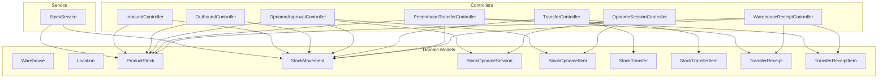
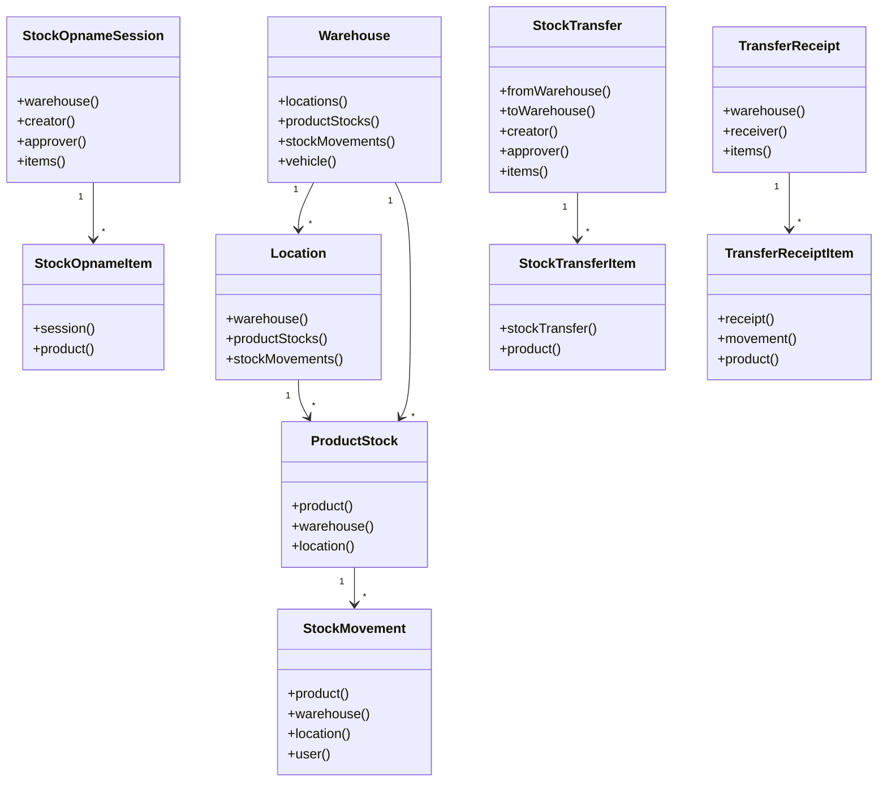
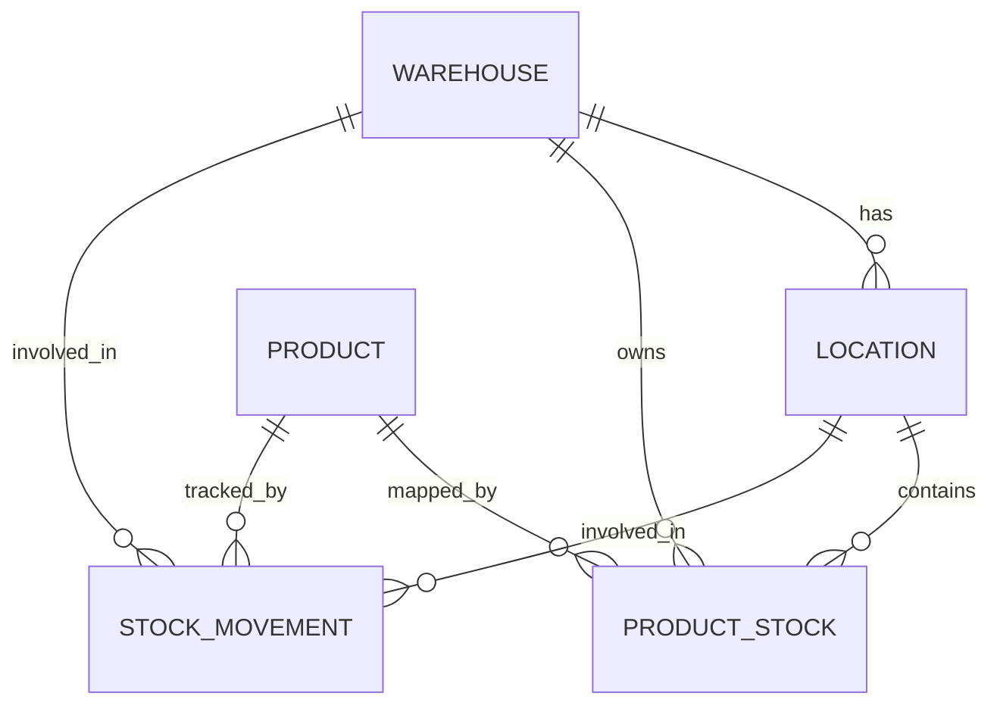
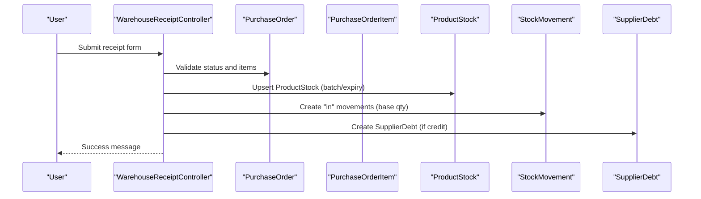
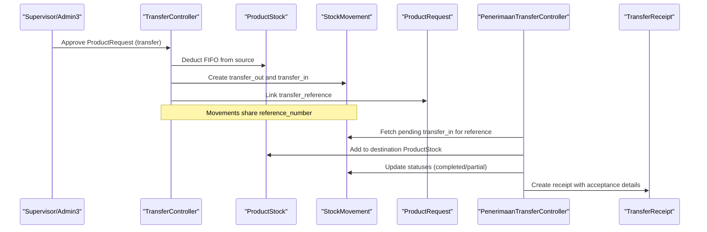
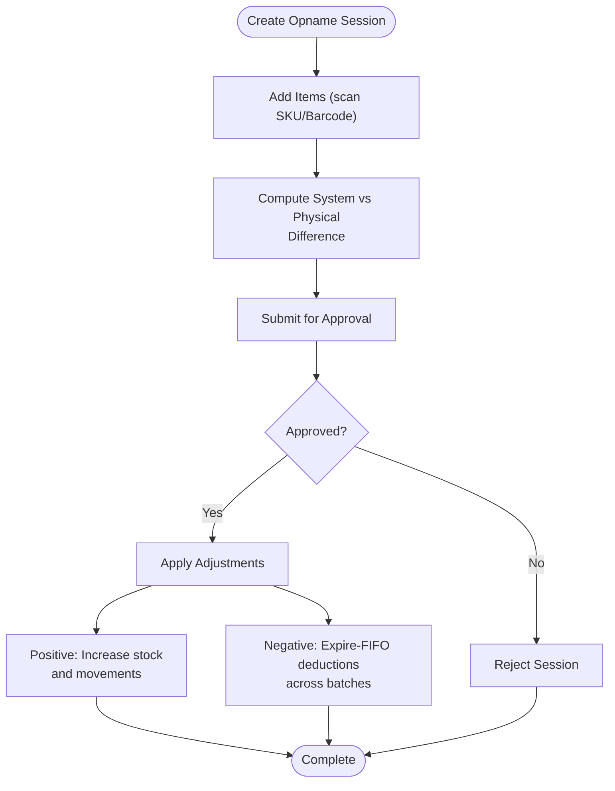
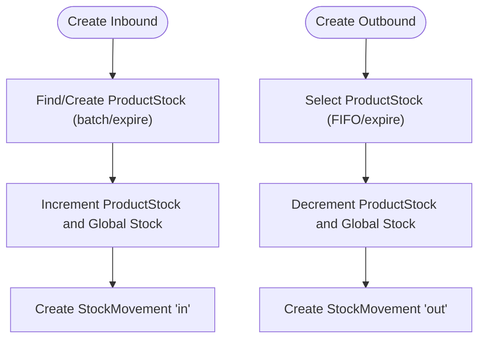
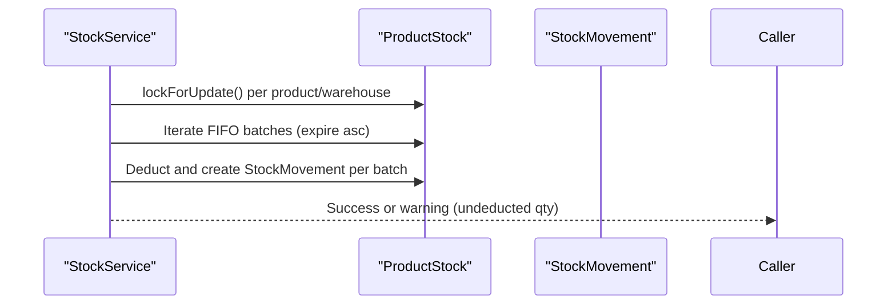
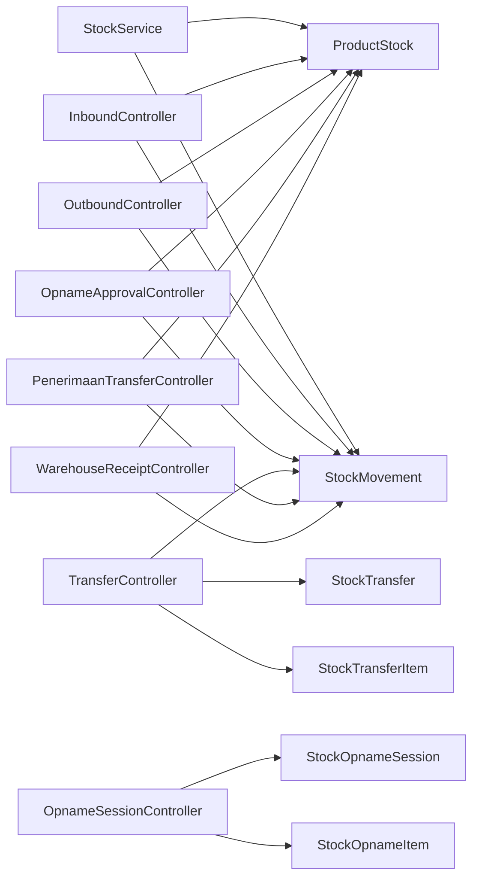

# Warehouse Management

<cite>
**Referenced Files in This Document**
- [Warehouse.php](file://app/Models/Warehouse.php)
- [Location.php](file://app/Models/Location.php)
- [ProductStock.php](file://app/Models/ProductStock.php)
- [StockMovement.php](file://app/Models/StockMovement.php)
- [StockOpnameSession.php](file://app/Models/StockOpnameSession.php)
- [StockOpnameItem.php](file://app/Models/StockOpnameItem.php)
- [StockTransfer.php](file://app/Models/StockTransfer.php)
- [StockTransferItem.php](file://app/Models/StockTransferItem.php)
- [TransferReceipt.php](file://app/Models/TransferReceipt.php)
- [TransferReceiptItem.php](file://app/Models/TransferReceiptItem.php)
- [WarehouseReceiptController.php](file://app/Http/Controllers/Gudang/WarehouseReceiptController.php)
- [PenerimaanTransferController.php](file://app/Http/Controllers/Gudang/PenerimaanTransferController.php)
- [OpnameSessionController.php](file://app/Http/Controllers/Gudang/OpnameSessionController.php)
- [OpnameApprovalController.php](file://app/Http/Controllers/Gudang/OpnameApprovalController.php)
- [TransferController.php](file://app/Http/Controllers/TransferController.php)
- [OutboundController.php](file://app/Http/Controllers/OutboundController.php)
- [InboundController.php](file://app/Http/Controllers/InboundController.php)
- [StockService.php](file://app/Services/StockService.php)
</cite>

## Table of Contents
1. [Introduction](#introduction)
2. [Project Structure](#project-structure)
3. [Core Components](#core-components)
4. [Architecture Overview](#architecture-overview)
5. [Detailed Component Analysis](#detailed-component-analysis)
6. [Dependency Analysis](#dependency-analysis)
7. [Performance Considerations](#performance-considerations)
8. [Troubleshooting Guide](#troubleshooting-guide)
9. [Conclusion](#conclusion)
10. [Appendices](#appendices)

## Introduction
This document explains the warehouse management system’s inventory operations and stock control capabilities. It covers multi-warehouse architecture, stock tracking across locations, automated PO receiving, stock transfers and cross-check, inventory adjustments, and the stock opname (inventory counting) system including sessions, discrepancy handling, and validation. It also documents integration touchpoints with procurement, sales, and manufacturing workflows, along with stock visibility, expiration tracking, and low-stock alert mechanisms.

## Project Structure
The system is organized around:
- Models representing domain entities (warehouses, locations, product stocks, stock movements, opname sessions/items, transfers, and receipts).
- Controllers implementing inbound/outbound, PO receiving, transfer processing, and opname workflows.
- A centralized service for stock validation and FIFO deductions to prevent race conditions and ensure consistency.

**Diagram sources**
- [Warehouse.php:15-33](file://app/Models/Warehouse.php#L15-L33)
- [Location.php:11-24](file://app/Models/Location.php#L11-L24)
- [ProductStock.php:31-44](file://app/Models/ProductStock.php#L31-L44)
- [StockMovement.php:39-57](file://app/Models/StockMovement.php#L39-L57)
- [StockOpnameSession.php:26-44](file://app/Models/StockOpnameSession.php#L26-L44)
- [StockOpnameItem.php:18-26](file://app/Models/StockOpnameItem.php#L18-L26)
- [StockTransfer.php:66-84](file://app/Models/StockTransfer.php#L66-L84)
- [StockTransferItem.php:19-27](file://app/Models/StockTransferItem.php#L19-L27)
- [TransferReceipt.php:22-30](file://app/Models/TransferReceipt.php#L22-L30)
- [TransferReceiptItem.php:23-35](file://app/Models/TransferReceiptItem.php#L23-L35)
- [WarehouseReceiptController.php:109-200](file://app/Http/Controllers/Gudang/WarehouseReceiptController.php#L109-L200)
- [PenerimaanTransferController.php:204-279](file://app/Http/Controllers/Gudang/PenerimaanTransferController.php#L204-L279)
- [OpnameSessionController.php:105-186](file://app/Http/Controllers/Gudang/OpnameSessionController.php#L105-L186)
- [OpnameApprovalController.php:72-187](file://app/Http/Controllers/Gudang/OpnameApprovalController.php#L72-L187)
- [TransferController.php:189-253](file://app/Http/Controllers/TransferController.php#L189-L253)
- [OutboundController.php:84-127](file://app/Http/Controllers/OutboundController.php#L84-L127)
- [InboundController.php:78-113](file://app/Http/Controllers/InboundController.php#L78-L113)
- [StockService.php:100-148](file://app/Services/StockService.php#L100-L148)

**Section sources**
- [Warehouse.php:1-35](file://app/Models/Warehouse.php#L1-L35)
- [Location.php:1-26](file://app/Models/Location.php#L1-L26)
- [ProductStock.php:1-46](file://app/Models/ProductStock.php#L1-L46)
- [StockMovement.php:1-59](file://app/Models/StockMovement.php#L1-L59)
- [StockOpnameSession.php:1-46](file://app/Models/StockOpnameSession.php#L1-L46)
- [StockOpnameItem.php:1-28](file://app/Models/StockOpnameItem.php#L1-L28)
- [StockTransfer.php:1-86](file://app/Models/StockTransfer.php#L1-L86)
- [StockTransferItem.php:1-29](file://app/Models/StockTransferItem.php#L1-L29)
- [TransferReceipt.php:1-32](file://app/Models/TransferReceipt.php#L1-L32)
- [TransferReceiptItem.php:1-38](file://app/Models/TransferReceiptItem.php#L1-L38)

## Core Components
- Multi-warehouse and location-aware stock: Warehouses own Locations; ProductStock records per-product, per-warehouse, per-location, with batch and expiry attributes.
- Stock movements: Standardized StockMovement entries for all transactions (inbound, outbound, transfer in/out, adjustments, opname).
- Procurement integration: Purchase Order Receipt controller handles PO acceptance, partial receipts, quality checks, and auto-creation of supplier debt for credit terms.
- Transfers: TransferController orchestrates transfer requests to formal transfer documents with FIFO stock deductions from source and pending transfer in destination; PenerimaanTransferController handles cross-check and acceptance at destination.
- Opname: OpnameSessionController creates and manages sessions; OpnameApprovalController validates discrepancies and applies adjustments with FIFO expiration-aware deductions for negative adjustments.
- Visibility and FIFO: StockService centralizes validation and FIFO deductions across POS, sales, and other channels; OutboundController and InboundController also enforce FIFO and batch tracking.

**Section sources**
- [Warehouse.php:15-33](file://app/Models/Warehouse.php#L15-L33)
- [Location.php:11-24](file://app/Models/Location.php#L11-L24)
- [ProductStock.php:22-44](file://app/Models/ProductStock.php#L22-L44)
- [StockMovement.php:22-57](file://app/Models/StockMovement.php#L22-L57)
- [WarehouseReceiptController.php:75-324](file://app/Http/Controllers/Gudang/WarehouseReceiptController.php#L75-L324)
- [TransferController.php:189-270](file://app/Http/Controllers/TransferController.php#L189-L270)
- [PenerimaanTransferController.php:167-303](file://app/Http/Controllers/Gudang/PenerimaanTransferController.php#L167-L303)
- [OpnameSessionController.php:117-248](file://app/Http/Controllers/Gudang/OpnameSessionController.php#L117-L248)
- [OpnameApprovalController.php:52-196](file://app/Http/Controllers/Gudang/OpnameApprovalController.php#L52-L196)
- [StockService.php:24-201](file://app/Services/StockService.php#L24-L201)
- [OutboundController.php:61-142](file://app/Http/Controllers/OutboundController.php#L61-L142)
- [InboundController.php:57-121](file://app/Http/Controllers/InboundController.php#L57-L121)

## Architecture Overview
The system follows a layered architecture:
- Presentation: Blade views under gudang/* and shared controllers.
- Application: Controllers coordinate workflows and orchestrate model updates.
- Domain: Models encapsulate business rules (e.g., FIFO, batch/expiration, warehouse/location scoping).
- Persistence: Eloquent models map to migrations for product stocks, movements, opname, transfers, and receipts.

**Diagram sources**
- [Warehouse.php:15-33](file://app/Models/Warehouse.php#L15-L33)
- [Location.php:11-24](file://app/Models/Location.php#L11-L24)
- [ProductStock.php:31-44](file://app/Models/ProductStock.php#L31-L44)
- [StockMovement.php:39-57](file://app/Models/StockMovement.php#L39-L57)
- [StockOpnameSession.php:26-44](file://app/Models/StockOpnameSession.php#L26-L44)
- [StockOpnameItem.php:18-26](file://app/Models/StockOpnameItem.php#L18-L26)
- [StockTransfer.php:66-84](file://app/Models/StockTransfer.php#L66-L84)
- [StockTransferItem.php:19-27](file://app/Models/StockTransferItem.php#L19-L27)
- [TransferReceipt.php:22-30](file://app/Models/TransferReceipt.php#L22-L30)
- [TransferReceiptItem.php:23-35](file://app/Models/TransferReceiptItem.php#L23-L35)

## Detailed Component Analysis

### Multi-Warehouse and Location-Aware Stock Tracking
- ProductStock scopes stock by product, warehouse, location, batch number, and expiry date. This enables precise tracking across multiple warehouses and locations.
- StockMovement records all stock changes with warehouse, location, batch, expiry, quantity, balance, and source type for auditability.

**Diagram sources**
- [Warehouse.php:15-33](file://app/Models/Warehouse.php#L15-L33)
- [Location.php:11-24](file://app/Models/Location.php#L11-L24)
- [ProductStock.php:22-44](file://app/Models/ProductStock.php#L22-L44)
- [StockMovement.php:22-57](file://app/Models/StockMovement.php#L22-L57)

**Section sources**
- [ProductStock.php:22-44](file://app/Models/ProductStock.php#L22-L44)
- [StockMovement.php:22-57](file://app/Models/StockMovement.php#L22-L57)

### Procurement Integration: Purchase Order Receipt
- Validates PO eligibility, enforces quantity limits, supports acceptance/rejection/partial results, and records QC checks.
- Converts PO units to base stock quantities via conversion factors and updates ProductStock and global Product stock.
- Creates StockMovement entries for each accepted item and generates a Purchase Order Shortage Report when applicable.
- Auto-creates Supplier Debt for credit POs upon first receipt.

**Diagram sources**
- [WarehouseReceiptController.php:75-324](file://app/Http/Controllers/Gudang/WarehouseReceiptController.php#L75-L324)

**Section sources**
- [WarehouseReceiptController.php:75-324](file://app/Http/Controllers/Gudang/WarehouseReceiptController.php#L75-L324)

### Stock Transfers: Creation, Movement, and Cross-Check
- TransferController converts approved ProductRequests into transfer documents, enforcing FIFO and generating paired transfer_out and transfer_in movements with the same reference number.
- PenerimaanTransferController at destination validates expected vs received quantities, performs cross-check, updates ProductStock, and marks movements/completion.
- TransferReceipt and TransferReceiptItem track acceptance details and statuses.

**Diagram sources**
- [TransferController.php:160-270](file://app/Http/Controllers/TransferController.php#L160-L270)
- [PenerimaanTransferController.php:167-303](file://app/Http/Controllers/Gudang/PenerimaanTransferController.php#L167-L303)
- [TransferReceipt.php:9-15](file://app/Models/TransferReceipt.php#L9-L15)
- [TransferReceiptItem.php:9-21](file://app/Models/TransferReceiptItem.php#L9-L21)

**Section sources**
- [TransferController.php:160-270](file://app/Http/Controllers/TransferController.php#L160-L270)
- [PenerimaanTransferController.php:167-303](file://app/Http/Controllers/Gudang/PenerimaanTransferController.php#L167-L303)
- [StockTransfer.php:23-84](file://app/Models/StockTransfer.php#L23-L84)
- [StockTransferItem.php:12-27](file://app/Models/StockTransferItem.php#L12-L27)
- [TransferReceipt.php:9-30](file://app/Models/TransferReceipt.php#L9-L30)
- [TransferReceiptItem.php:9-36](file://app/Models/TransferReceiptItem.php#L9-L36)

### Stock Opname: Sessions, Discrepancies, and Adjustments
- OpnameSessionController allows authorized users to create sessions, add items by scanning SKU/Barcode, compute differences, and submit for approval.
- OpnameApprovalController validates differences, applies positive adjustments by increasing stock, and applies negative adjustments by expiring-FIFO deductions across batches, ensuring global stock integrity.

**Diagram sources**
- [OpnameSessionController.php:117-248](file://app/Http/Controllers/Gudang/OpnameSessionController.php#L117-L248)
- [OpnameApprovalController.php:52-196](file://app/Http/Controllers/Gudang/OpnameApprovalController.php#L52-L196)

**Section sources**
- [OpnameSessionController.php:117-248](file://app/Http/Controllers/Gudang/OpnameSessionController.php#L117-L248)
- [OpnameApprovalController.php:52-196](file://app/Http/Controllers/Gudang/OpnameApprovalController.php#L52-L196)

### Inbound and Outbound Operations
- InboundController supports non-PO stock-ins (returns, initial stock, corrections, transfers in, consignment, others) with batch and expiry tracking and movement logging.
- OutboundController supports outbound issuance with FIFO and batch/expire prioritization, updating both per-warehouse and global stock.

**Diagram sources**
- [InboundController.php:57-121](file://app/Http/Controllers/InboundController.php#L57-L121)
- [OutboundController.php:61-142](file://app/Http/Controllers/OutboundController.php#L61-L142)

**Section sources**
- [InboundController.php:57-121](file://app/Http/Controllers/InboundController.php#L57-L121)
- [OutboundController.php:61-142](file://app/Http/Controllers/OutboundController.php#L61-L142)

### Stock Visibility, Expiration Tracking, and Low-Stock Alerts
- Visibility: StockService exposes centralized validation and FIFO deduction, enabling consistent stock checks across POS, sales, and other channels.
- Expiration tracking: ProductStock and StockMovement include batch_number and expired_date; FIFO logic prioritizes nearest expiry dates.
- Low-stock alerts: The system stores minimum stock thresholds on products and can be leveraged to trigger alerts in reporting dashboards.

**Diagram sources**
- [StockService.php:100-148](file://app/Services/StockService.php#L100-L148)

**Section sources**
- [StockService.php:24-201](file://app/Services/StockService.php#L24-L201)

## Dependency Analysis
- Controllers depend on models and the StockService for consistency.
- StockService depends on Product, ProductStock, and StockMovement to enforce FIFO and maintain balances.
- Transfer and opname workflows rely on StockMovement reference numbers to correlate out/in pairs and session items to adjustments.

**Diagram sources**
- [WarehouseReceiptController.php:109-200](file://app/Http/Controllers/Gudang/WarehouseReceiptController.php#L109-L200)
- [PenerimaanTransferController.php:204-279](file://app/Http/Controllers/Gudang/PenerimaanTransferController.php#L204-L279)
- [TransferController.php:189-253](file://app/Http/Controllers/TransferController.php#L189-L253)
- [OpnameSessionController.php:105-186](file://app/Http/Controllers/Gudang/OpnameSessionController.php#L105-L186)
- [OpnameApprovalController.php:72-187](file://app/Http/Controllers/Gudang/OpnameApprovalController.php#L72-L187)
- [OutboundController.php:84-127](file://app/Http/Controllers/OutboundController.php#L84-L127)
- [InboundController.php:78-113](file://app/Http/Controllers/InboundController.php#L78-L113)
- [StockService.php:100-148](file://app/Services/StockService.php#L100-L148)

**Section sources**
- [StockService.php:24-201](file://app/Services/StockService.php#L24-L201)

## Performance Considerations
- Use lockForUpdate consistently during stock deductions to prevent race conditions.
- Prefer batch-based queries (group by product_id or reference_number) to reduce round-trips.
- Indexes on frequently filtered columns (warehouse_id, product_id, expired_date, created_at) improve query performance.
- Limit pagination sizes and leverage server-side filtering for large lists (e.g., inbound/outbound history).

## Troubleshooting Guide
- PO Receipt errors: Validate item selection, quantity limits, and unit conversions; ensure PO status allows receiving.
- Transfer rejection: Verify expected vs received quantities and that no prior cross-check exists; check movement statuses at both origin and destination.
- Opname discrepancies: Ensure sufficient stock exists for negative adjustments; verify FIFO logic did not under-deduct.
- Inbound/Outbound failures: Confirm batch/expire match and that total available stock meets requested quantity.

**Section sources**
- [WarehouseReceiptController.php:139-143](file://app/Http/Controllers/Gudang/WarehouseReceiptController.php#L139-L143)
- [PenerimaanTransferController.php:219-223](file://app/Http/Controllers/Gudang/PenerimaanTransferController.php#L219-L223)
- [OpnameApprovalController.php:138-142](file://app/Http/Controllers/Gudang/OpnameApprovalController.php#L138-L142)
- [OutboundController.php:97-99](file://app/Http/Controllers/OutboundController.php#L97-L99)
- [InboundController.php:136-150](file://app/Http/Controllers/InboundController.php#L136-L150)

## Conclusion
The system provides robust multi-warehouse, location-aware stock control with FIFO and expiration tracking, integrated procurement receiving, transfer orchestration with cross-check, and a structured opname workflow. Centralized stock logic ensures consistency across inbound/outbound, transfers, and opname adjustments. The architecture supports scalability and auditability through standardized stock movements and explicit batch/expiration attributes.

## Appendices
- Practical examples:
  - Receiving operations: Use the PO receipt controller to accept items, apply QC checks, and auto-generate supplier debt for credit purchases.
  - Shipping processes: Use outbound issuance with FIFO and batch/expire prioritization; verify availability before dispatch.
  - Transfer approvals: Supervisor approves transfer requests; system generates transfer documents and FIFO deductions at origin.
  - Stock reconciliation: Run opname sessions, compute differences, and approve adjustments to reconcile system vs physical counts.
- Integration touchpoints:
  - Procurement: Purchase order receipts update ProductStock and SupplierDebt.
  - Sales/POS: StockService validates and deducts stock with FIFO and logs movements.
  - Manufacturing: StockService can be extended to support production consumption with batch/expire tracking.